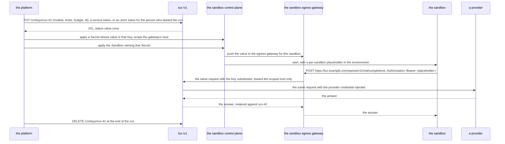

# Building a plane on Lux

For a team building a platform that sells or governs model access:
accounts, plans, a console, a catalogue, invoices. Lux is the gateway
underneath it. This page says how a platform composes it, where each of
its own concerns goes, how it gives a sandbox running untrusted code
model access without putting a credential in the sandbox, how it proves
its own front still serves the contract, and what the gateway promises
it and what it does not.

Nothing here is a special arrangement. Everything a platform needs is an
endpoint it writes, an object it applies, or a package it imports, and
this page exists so that claim is checkable rather than asserted.

## The two doors

There are two ways in, and a platform may take either or both in
sequence.

| Door | The platform runs | The platform writes | It gets |
|---|---|---|---|
| webhooks | `luxd` as a service | an authorizer, an event sink, and the OIDC issuer it already has | the whole gateway, upgraded by image tag; its own logic in its own service, in any language |
| packages | its own binary importing `manifest`, `gateway`, and `metering` | a server around them, its own identity, its own store | the contract and the data plane in-process, with no HTTP hop, behind its own API shape |

Both reach one `manifest.Resolve` and one `gateway.Handler`. A manifest
means the same thing on either, and a request is answered the same way,
because the packages are what `luxd` is made of. A platform that starts
with the webhooks and later splits into its own binary is not
rewriting: it keeps the same two calls and supplies the store and the
identity itself.

Which door to take:

- Take the **webhooks** unless something forces the other. The whole
  gateway is one image; the authorizer is a small HTTP endpoint in
  whatever language the platform's own services are written in; an
  upgrade is a tag. Everything in the table below has a webhook answer.
- Take the **packages** when the platform's API is the product and a
  second HTTP hop is not acceptable, when desired state must live in
  the platform's own database under its own transactions, or when
  identity is not OIDC at the edge. The cost is that the control plane
  surface, the routes, the preconditions, the pagination, the usage
  queries, is the platform's to write and to keep conformant.

`examples/plane/` is a small server of the second kind, assembled from
the three packages with a store and an identity of its own, and
`examples/authorizer/` is the endpoint of the first kind. Both are in
this repository and both are held to the contract by tests.

## Where each platform concern goes

Every row is an endpoint the platform writes or an object it applies.
There is no row that needs a fork, and a test reads this table against
the tree so it stays that way.

| Concern | Door: webhooks | Door: packages |
|---|---|---|
| accounts, organizations, teams | claims in the issuer's token, read by the authorizer; the gateway reads none of them | the platform's middleware before `Resolve` sets `Options.Actor` |
| roles and permissions | the authorizer's `allow` per action | the platform's own check before it calls `Resolve` |
| plans and quotas | the authorizer's `limits`, which cap what a Key may ask for, plus `Budget` objects the platform applies; a Key that names no limit under a cap is refused, so the platform's console or client fills the limits in | `Options.Limits` and the same Budgets |
| a shared catalogue | `Provider` and `Model` objects the platform declares as an administrator; callers see them through `provider.read` and `model.use` | the same objects through the store the platform constructs |
| per-tenant models | `model.use` per selector at a Key's resolve, plus label selectors on the Models; a tenant's Key names only what its authorizer allows. One name resolves to one Model for the installation, a tenant's own Provider's models carry that Provider's name as their first segment, and a platform that wants one bare name to mean a different Model per tenant answers that in its own front, never in the gateway | `Options.Lookup` answers `Models` for the tenant |
| funded credits | a `Budget` per grant, `hard` chosen by whether an overspend is refused or invoiced, plus the platform's own ledger fed by the event sink and `GET /v1/usage` | the same Budgets and `metering.Fold` over the records |
| a console | its backend holds the session and calls `/v1` with an actor token minted for the signed-in person, the audience `LUX_OIDC_AUDIENCE`, so the object's `owner` is the person; the gateway never sees a cookie | reads the platform's own API |
| unattended provisioning | a service token from the platform's own issuer client, whose `sub` is the service account and becomes the `owner`; the person, when there is one, goes in a label under the platform's own prefix | the platform's own service identity in `Options.Actor` |
| one developer credential | a Key created with `spec.value` set to the platform's own credential, under the Models and the Budget the platform attaches; the gateway matches it by hash and decodes nothing; revoking it is `DELETE /v1/keys/{id}` here beside whatever the platform's issuer does | the same Key through the store it constructs |
| billing | the request log archive for the line items and `GET /v1/usage` for the totals | the platform's own `Recorder` |
| audit | the signed event sink at `LUX_EVENTS_URL` | the platform's own sink |
| multi-region | one `luxd` per region behind the platform's router, each with its own store or a shared one | one `Handler` per region |
| a local runtime a user attaches | `provider.tunnel` allowed for that subject, and the user runs `lux serve` | the same |

## The minimal authorizer

The first thing a platform replaces is the permission model. `luxd`
decides nothing itself: on every control plane request it asks one
endpoint whether one subject may do one action to one resource, and an
answer it cannot read is a refusal and never an allow. With no endpoint
configured it applies a built-in owner policy, where every subject owns
what it applied and `LUX_ADMIN_SUBJECTS` declares the catalogue. That
policy is the shape a platform's first authorizer has, and the program
below is it, with a plan claim added.

The payload and the answer are the shared contract of
`latere.ai/x/pkg/authz`; a Go authorizer may decode the body into
`authz.Request` instead of the four fields below, and one in any
language reads the JSON names. The endpoint answers from its bearer and
its own state alone: it holds no session, and it calls neither the
gateway nor the issuer while deciding, because the gateway is waiting
inside the very request it is answering.

The policy is the twenty lines of `decide`; the rest of the file is one
`POST` handler and a listener. It is `examples/authorizer/main.go`, and
a test holds this block and that file equal, so what is printed here
compiles and runs:

```go
// Command authorizer is the minimal authorization endpoint of
// docs/plane.md: one POST, one decision, answered from the bearer and
// this process's own state alone. Run it beside the gateway,
//
//	go run ./examples/authorizer -addr 127.0.0.1:8081 -token "$LUX_AUTHORIZER_TOKEN"
//
// and point the gateway at it with LUX_AUTHORIZER_URL and
// LUX_AUTHORIZER_TOKEN. Everything a platform decides, who declares the
// catalogue, what a plan may put on one Key, and whose objects a list
// returns, is in decide below. docs/plane.md carries this file and
// TestPlaneDocAuthorizerConforms holds the two equal and runs the
// contract's own conformance suite against it.
package main

import (
	"context"
	"crypto/subtle"
	"encoding/json"
	"errors"
	"flag"
	"fmt"
	"io"
	"net"
	"net/http"
	"os"
	"os/signal"
	"strings"
	"syscall"
	"time"
)

// req is the envelope the gateway POSTs, of which this endpoint reads
// four fields. A Go authorizer may decode it into authz.Request from
// latere.ai/x/pkg/authz instead; one in any language reads the JSON
// names below.
type req struct {
	Subject  string         `json:"subject"`
	Claims   map[string]any `json:"claims"`
	Action   string         `json:"action"`
	Resource map[string]any `json:"resource"`
}

// resp is one decision: the verdict, the reason a deny carries into the
// gateway's developer detail, the ceilings a Key this subject applies is
// held to, and the filter a list and a usage query are narrowed by.
type resp struct {
	Allow  bool           `json:"allow"`
	Reason string         `json:"reason,omitempty"`
	Limits map[string]any `json:"limits,omitempty"`
	Filter map[string]any `json:"filter,omitempty"`
}

// probeID is authz.ProbeID: every authorizer denies it, so luxd check
// can tell an endpoint that reads the request from one that does not.
const probeID = "00000000-0000-0000-0000-000000000001"

// spendCap is the ceiling one Key may ask for, by the plan the
// platform's issuer stamps into the token. An administrator is under no
// ceiling: a ceiling refuses a Key that names no limit at all, and the
// catalogue and the installation's own Keys are declared without one.
var spendCap = map[string]string{"free": "5", "team": "50"}

// decide is the whole policy: the probe first, the catalogue declared by
// an administrator and readable by everyone, an object to its owner
// alone, and a ceiling and a filter on everything else.
func decide(r req) resp {
	plan, _ := r.Claims["plan"].(string)
	switch {
	case r.Resource["id"] == probeID:
		return resp{Allow: false, Reason: "the probe id is reserved"}
	case strings.HasPrefix(r.Action, "provider."), strings.HasPrefix(r.Action, "model."):
		switch {
		case r.Action == "model.use" || strings.HasSuffix(r.Action, ".read") || strings.HasSuffix(r.Action, ".list"):
			return resp{Allow: true} // the catalogue is the platform's and is offered to every user
		case plan == "admin":
			return resp{Allow: true}
		}
		return resp{Reason: "the catalogue is declared by the platform"}
	case r.Resource["owner"] != nil && r.Resource["owner"] != r.Subject:
		return resp{Allow: false, Reason: "not yours"}
	case plan == "admin":
		return resp{Allow: true, Filter: map[string]any{"owners": []string{r.Subject}}}
	default:
		return resp{Allow: true,
			Limits: map[string]any{"max_key_spend": spendCap[plan], "max_key_ttl": "720h", "max_keys": 100},
			Filter: map[string]any{"owners": []string{r.Subject}}}
	}
}

// handler answers one decision per POST. Everything it needs is the
// bearer and the body: it holds no session, and it calls neither the
// gateway nor the issuer while deciding, because the gateway is waiting
// inside the very request this answers.
func handler(token string) http.Handler {
	return http.HandlerFunc(func(w http.ResponseWriter, r *http.Request) {
		if r.Method != http.MethodPost {
			http.Error(w, "post one decision request", http.StatusMethodNotAllowed)
			return
		}
		bearer, _ := strings.CutPrefix(r.Header.Get("Authorization"), "Bearer ")
		if subtle.ConstantTimeCompare([]byte(bearer), []byte(token)) != 1 {
			http.Error(w, "the bearer is not this endpoint's", http.StatusUnauthorized)
			return
		}
		var in req
		if err := json.NewDecoder(http.MaxBytesReader(w, r.Body, 1<<20)).Decode(&in); err != nil {
			http.Error(w, "the body is no decision request", http.StatusBadRequest)
			return
		}
		w.Header().Set("Content-Type", "application/json")
		_ = json.NewEncoder(w).Encode(decide(in))
	})
}

func main() { os.Exit(run(context.Background(), os.Args[1:], os.Stderr)) }

// run serves until the context ends or the process is asked to stop, and
// returns the exit code: 0 on a clean stop, 1 when the address or the
// token is unusable, 2 on a usage error.
func run(ctx context.Context, args []string, stderr io.Writer) int {
	fs := flag.NewFlagSet("authorizer", flag.ContinueOnError)
	fs.SetOutput(stderr)
	addr := fs.String("addr", "127.0.0.1:8081", "the address to serve on")
	token := fs.String("token", os.Getenv("AUTHORIZER_TOKEN"), "the bearer the gateway sends, its LUX_AUTHORIZER_TOKEN")
	if err := fs.Parse(args); err != nil {
		return 2
	}
	if *token == "" {
		_, _ = fmt.Fprintln(stderr, "authorizer: -token or AUTHORIZER_TOKEN is the bearer the gateway sends, and there is no unauthenticated mode")
		return 2
	}
	ctx, stop := signal.NotifyContext(ctx, os.Interrupt, syscall.SIGTERM)
	defer stop()
	ln, err := net.Listen("tcp", *addr)
	if err != nil {
		_, _ = fmt.Fprintln(stderr, "authorizer:", err)
		return 1
	}
	_, _ = fmt.Fprintf(stderr, "authorizer: deciding at http://%s\n", ln.Addr())
	server := &http.Server{Handler: handler(*token), ReadHeaderTimeout: 5 * time.Second}
	done := make(chan struct{})
	go func() {
		defer close(done)
		<-ctx.Done()
		shutdown, cancel := context.WithTimeout(context.WithoutCancel(ctx), 5*time.Second)
		defer cancel()
		_ = server.Shutdown(shutdown)
	}()
	err = server.Serve(ln)
	<-done
	if err != nil && !errors.Is(err, http.ErrServerClosed) {
		_, _ = fmt.Fprintln(stderr, "authorizer:", err)
		return 1
	}
	return 0
}
```

Four properties to keep as it grows into the platform's real policy.

- **A refusal on a reference reads as `not_found`.** The gateway asks
  `model.use` for every selector a Key names, `budget.draw` for the
  Budget it draws from, and `provider.read` for every target of a Model,
  and a deny on one of those is answered to the caller as `not_found`
  and not as `forbidden`, with a detail that names the reference and not
  the reason. A manifest therefore cannot probe for objects another
  tenant owns.
- **No answer means no.** A connection refused, a TLS failure, a
  non-200, a body that does not parse, a body without `allow`, a body
  over 64 KiB, and a timeout are each `authorizer_unavailable`, 503, and
  never an allow. `LUX_AUTHORIZER_TIMEOUT`, five seconds by default,
  bounds one decision with its one retry included.
- **`limits` is a ceiling, not a grant.** Raising a plan raises what a
  Key may ask for and changes no existing object. The consequence to
  plan for: a ceiling refuses a Key that names no limit at all, because
  no limit exceeds every ceiling, so the console or the client that
  creates Keys fills the limits in, and the refusal's detail names the
  ceiling so it can retry with it.
- **The probe is denied before every other rule.** The reserved id
  `00000000-0000-0000-0000-000000000001` is denied for every subject and
  every action, the anonymous subject included, which is how `luxd
  check` tells an endpoint that reads the request from one that answers
  yes to everything.

One deployment note. A platform whose authorizer and whose `/v1` caller
are one process must keep the two paths off each other's locks: the
gateway waits on the authorizer inside the very request the platform is
waiting on, and a lock shared between them is a five second stall ending
in `authorizer_unavailable`.

An allow is cached per replica for the answer's `ttl`, sixty seconds
when it names none and at most six hundred, and a deny for five. A
revocation at the authorizer therefore takes effect on the control plane
within that time, and on the data plane not at all: the doors ask no
authorizer, so a platform that revokes a subject deletes or disables its
Keys.

## Giving a sandbox model access

A platform that runs untrusted code in a sandbox and wants that code to
call a model has a problem with one obvious wrong answer: put a
credential in the sandbox. Composing a sandbox control plane such as
[Cella](https://github.com/latere-ai/cella) with Lux avoids it, and
neither side learns anything about the other.



The sandbox holds a placeholder and never a credential. The egress
gateway substitutes the Key toward the host the Secret scopes and leaves
it verbatim and inert anywhere else. Lux injects the provider's
credential toward that Provider's `baseURL` and nowhere else. Two
gateways, two substitutions, and neither credential is ever inside the
sandbox: reading the sandbox's environment, its file system, and its
memory yields a placeholder and a string that is a placeholder somewhere
else.

What the platform spends at the end of the run is `DELETE
/v1/keys/run-42`, after which the value is refused within
`LUX_KEY_CACHE` on every replica, and the usage stays readable by the
Key's id through `GET /v1/usage`, which is the ledger line for that run.

The composition needs no token exchange, no delegation claim, and no
signing key shared between the two planes, because each hop carries one
credential kind that the next hop verifies on its own terms.

| Hop | Credential | Verified by |
|---|---|---|
| platform to Lux `/v1`, unattended | a service token from the platform's issuer, `client_credentials`, the audience `LUX_OIDC_AUDIENCE`; the Key's `owner` is the service account | Lux, against the issuers `LUX_OIDC_ISSUERS` lists |
| platform to Lux `/v1`, for a signed-in person | an actor token the platform's issuer mints for that person, the same audience; the Key's `owner` is the person | the same |
| platform to the sandbox control plane | that plane's own credential | that plane |
| sandbox to its egress gateway | a placeholder scoped to one sandbox | the egress gateway |
| egress gateway to a Lux door | the Key | Lux, by the hash of its value |
| Lux to a provider | the Provider's credential | the provider |

A platform that gives its developers one credential for everything, so
that the string in a developer's environment opens both the platform's
own API and a Lux door, adds two hops for the same string, and they do
not change the rule.

| Hop | Credential | Verified by |
|---|---|---|
| developer to the platform's own control plane | the platform's credential, a token its issuer signed | the platform, as a token, with its issuer's revocation list |
| developer to a Lux door | the same string, registered by the platform as a Key's `spec.value` | Lux, by the hash of its bytes; it decodes nothing, reads no expiry inside it, and fetches no revocation list |

The consequences of that convenience are the platform's to carry, and
they are three:

- The Key's `expiresAt` is the only expiry the door knows. A credential
  whose own `exp` has passed still opens a door until the Key expires,
  so the platform sets the Key's `ttl` to what it means.
- Revoking is two writes in two systems, the issuer's revocation and
  `DELETE /v1/keys/{id}` here, and the platform orders them: the Key
  first, because the door is where the string spends money, retried
  until it answers `204` or `not_found`. The door stops serving within
  `LUX_KEY_CACHE` of the delete and never before.
- The Key's handle is the supplied value's prefix rule, `sup_` and the
  first eight hex characters of the value's hash, and not the value's
  own first characters, because a token's first characters are the same
  for every token.

A design with token exchange would have to make one of these hops carry
a credential minted for another, which means one plane signing for the
other and a key both of them hold. Here no plane verifies a credential
it did not accept in the first place, the gateway included, which
accepted the supplied value as a Key through `/v1` before any door saw
it, so a compromise on one hop stops at the next.

## The conformance command

A platform that runs its own front is serving the contract or it is
not, and the answer is a command rather than a review:

```sh
LUX_TEST_URL=https://api.example.com LUX_TEST_TOKEN=$(platform-token) \
  go test latere.ai/x/lux/test/conformance -run TestContract -v
```

`TestContract` builds its configuration from the environment and runs
every case the configuration admits against whatever `LUX_TEST_URL`
names: `luxd` on loopback, a release image in a cluster, or a
platform's own binary built from the packages. `LUX_TEST_TOKEN` is a
token that server accepts on `/v1`; the suite mints no issuer token of
its own and holds no key. `LUX_TEST_STUBS_URL`, when a `lux-stubs`
instance the server can reach is running, adds the cases that assert
what the provider received; without it they skip and the suite prints
which. A platform that imports the package instead calls
`conformance.Run` with a `Config` whose `Token` mints through its own
issuer.

Every object the suite creates is named `conf-<run>-*` under the label
`conformance=<run>` and is deleted at teardown, so a run against a
serving installation touches nothing it did not create.

What a front has to pass, by group:

| Group | Required of any front | Why |
|---|---|---|
| `manifest`, `api` | yes | the contract is the schema and the grammar; a front that admits less admits a different contract |
| `doors` | yes, for each dialect its `/.well-known/lux` lists | a served door that answers differently is the one thing a caller cannot work around |
| `identity` | yes | the plane boundary is what keeps a Key off `/v1` and a token off a door |
| `usage` | yes | the same usage surface is what this page promises a platform's users |
| `keys` | only where the front serves limits | a front that declares no limits has nothing to refuse |
| `fixture` | no | it is this repository's release history and means nothing against another tree |

The suite proves what a server does with a decision. It does not prove
that a platform's authorizer decides correctly, and it cannot: that
endpoint is the platform's program. The test it passes is
`latere.ai/x/pkg/authz/conformance`, which the example above is held to.

## Promises and non-promises

To a platform, the gateway promises:

- the manifest contract's evolution rules, so a manifest a platform's
  users write today is accepted by every later `v1beta1` build and
  resolves to the same object;
- the compatibility of `manifest`, `gateway`, and `metering`: additive
  within a module major, with a break named in the changelog;
- that the conformance suite passes against `luxd` on every release, so
  the suite is a bar the reference implementation actually clears;
- that a platform passing the suite against its own front serves the
  same contract.

It promises nothing about anything under `internal/`, which is the
gateway's own and changes without notice; nor about the stub binary
`lux-stubs`, which exists for tests and for `make run` and is not a
runtime; nor about the deploy manifests beyond the archive a release
publishes.

Two more things the gateway will not do, so that a platform plans
around them rather than waiting: it issues no token for a person and
holds no session, and it reads no claim of its own accord, so an
organization, a role, and a plan mean whatever the platform's authorizer
says they mean and nothing to `luxd`.
