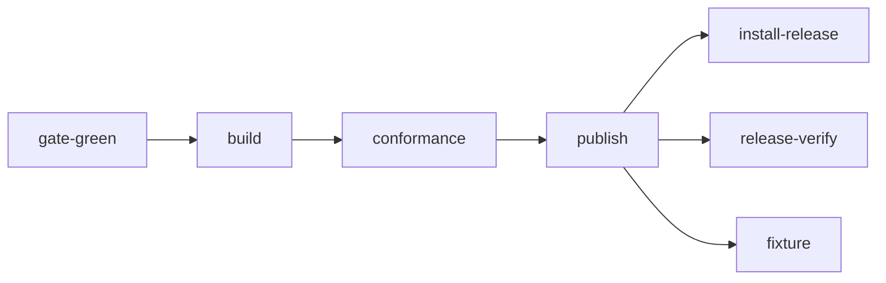

# Release and installation

## Overview

An operator outside Latere installs Lux from a release, not from a
checkout, and upgrades on its own schedule. A `v*` tag produces two
images, two binaries for four platforms, checksums, signatures, bills
of materials, provenance, and a deploy archive, and publishes a GitHub
release whose notes are the CHANGELOG section for that version.
Installation is one document CI walks against a real cluster on every
push, so it is never stale. `luxd check` tells an operator whether an
installation meets its requirements before the first manifest reaches
it, and before the first request does.

This spec owns the artifacts, the pipeline, the deploy manifests, the
`check` role, the install document, and what a version number promises.
Nothing in it names a Latere host or namespace: the image namespace is
the repository owner running the workflow, so a fork's tag publishes
under the fork's ([[001-architecture]], invariant 8).

## Current state

Complete. The published `v0.4.1` release passed every release job, including
candidate conformance, clean-runner signature/checksum/attestation verification,
and installation from published artifacts. Its source commit passed every
verification job, including the checkout installation and alert rules. Local
negative tests execute the workflow's exact commands against a failed verify
response and a deliberately invalid candidate; dependency checks ensure neither
failure can be ignored by publication. These tests do not create a failing tag.

The release fixtures through `v0.4.1` are retained in the conformance corpus.
The departures from the original design remain recorded below.

## Design

### Artifacts

| Artifact | Name | Notes |
|---|---|---|
| gateway image | `ghcr.io/<owner>/lux:<tag>` | `linux/amd64` and `linux/arm64` as one multi-arch image, built by `Dockerfile.release` from the binaries the pipeline already built |
| stub image | `ghcr.io/<owner>/lux-stubs:<tag>` | the stub providers, issuer, authorizer, and sink of [[015-test-stubs-and-tiers]] in one image, published beside the gateway image under the same tag, so the conformance job and an operator's first installation run a released, signed stub rather than a checkout |
| gateway binaries | `luxd_<tag>_<os>_<arch>.tar.gz` | `linux` and `darwin`, `amd64` and `arm64` |
| client binaries | `lux_<tag>_<os>_<arch>.tar.gz` | the same four pairs; the client runs where agents run rather than in a cluster, so it takes an archive and no image ([[014-agent-client]]) |
| checksums | `checksums.txt` | one SHA-256 line per `*.tar.gz` the release carries, the eight binary archives and the deploy and fixture archives; signed as a blob, below |
| bills of materials | `sbom-module.spdx.json`, `sbom-luxd.spdx.json`, `sbom-lux-stubs.spdx.json` | SPDX for the module graph and one per image |
| signatures | `cosign sign` keyless over both images by digest, and `cosign sign-blob` over `checksums.txt` producing the Sigstore bundle `checksums.txt.sigstore.json`, which carries the signature and the certificate | the workflow's OIDC identity; verified by `cosign verify` on the images and `cosign verify-blob` on the file, each with the certificate identity and the OIDC issuer given |
| attestations | an SBOM attestation and a build provenance attestation per image | this repository is public, so `gh attestation verify` answers for the image about to run |
| deploy archive | `deploy-<tag>.tar.gz` | `deploy/base`, `deploy/components`, `deploy/overlays`, `deploy/bootstrap`, and the example manifests of [[015-test-stubs-and-tiers]], with the `luxd` image reference pinned to the tag by digest |
| contract fixture | `fixture-<tag>.tar.gz` | the resolved manifests and archived records the conformance run produced, for the next release's fixture group, below |

There is no `windows` pair. `luxd` is a Linux container and `lux` is the
only candidate; the pairs above are the four this project builds and
tests on, and a fifth is a row in this table and a row in the matrix
whenever someone asks for it, not a promise made in advance to a
platform nobody here runs.

`<owner>` is `github.repository_owner` lowered, read at run time and
written nowhere in the tree. `TestReleasePublishesUnderTheOwnersNamespace`
refuses a literal namespace anywhere in the workflow, the deploy tree,
or the archive, which is [[001-architecture]]'s invariant 8 as a test.

### The release image

`Dockerfile` compiles inside the image so a `docker build .` from a
checkout works ([[002-repository-scaffold]]). `Dockerfile.release`
copies the binary the pipeline built, signed, and attested, so the
image carries the same bytes the archive does. The two share a runtime
stage byte for byte: everything between the `# >>> shared runtime base <<<`
and `# <<< shared runtime base >>>` markers is identical in both files,
and `TestRuntimeStagesMatch` compares them. The stage is
`gcr.io/distroless/static-debian12:nonroot` pinned by digest, carrying
the CA roots and nothing else, running as `nonroot:nonroot` with both
ports exposed and `luxd` as the entry point.

`Dockerfile.release` has no build stage at all. Its one instruction
before the runtime stage is a `COPY` of `dist/luxd_linux_${TARGETARCH}`,
the file `buildx` substitutes per architecture, so one `docker buildx
build --platform linux/amd64,linux/arm64` produces one multi-arch index
over the two binaries the release already checksummed rather than over
two fresh compilations nobody measured.

`Dockerfile.stubs` is the same file with `lux-stubs` in place of
`luxd`: the identical runtime stage between the same two markers, a
`COPY` of `dist/lux-stubs_linux_${TARGETARCH}`, and `lux-stubs` as the
entry point. `TestRuntimeStagesMatch` compares all three files, not
two, because a stub image on a different base would make a conformance
run against the published images prove less than a conformance run
against the checkout.

A developer's image and a released image therefore differ in where the
binary came from and in nothing else, which is what makes a bug
reproduced locally a bug reproduced against the release.

### The pipeline

`release.yml` on a `v*` tag. `verify.yml` skips tags, so the gate does
not run twice and the first job below is where the tag's evidence
starts.



1. `gate-green`: the `verify` workflow's run for the `push` event on
   the tag's own commit SHA must have concluded `success`. `lateregate
   release` pushes the branch and the tag in one push, so that run
   exists by the time the tag's workflow starts; a tag on a commit whose
   gate never ran, or ran red, fails here and publishes nothing. A
   release is therefore cut from a green tree by construction rather
   than by habit.
2. `build`: `go build` for the four `os/arch` pairs with the `-ldflags`
   of [[002-repository-scaffold]] setting `internal/version`; the
   archives and `checksums.txt`; `docker buildx` of `Dockerfile.release`
   and `Dockerfile.stubs` for both architectures, each pushed as one
   multi-arch index **by digest and under no tag**; `cosign sign` on
   both digests and `cosign sign-blob` on `checksums.txt`; the three
   SPDX documents, attached with `actions/attest-sbom`, and provenance
   with `actions/attest-build-provenance`; and the deploy archive with
   both images pinned by digest. The job outputs the two digests.
3. `conformance`: the e2e stack of [[015-test-stubs-and-tiers]] brought
   up from those two digests rather than from a checkout, then
   `TestContract` of [[018-conformance-suite]] against it, whose
   `fixture` group reads the directories the previous releases left in
   the tree. A failure here stops the release, and because nothing has
   been tagged in the registry yet, a failed run leaves two unreferenced
   digests and no `:<tag>` an operator could pull by accident.
4. `publish`: `crane tag` applies `:<tag>` to both digests, and then the
   GitHub release with every artifact and, as the body, the CHANGELOG
   section for the tag, read with `go tool lateregate release-notes
   <tag>`. A tag with no section fails the job, which is the same rule
   the pre-push hook enforces on a developer's machine.
5. `install-release`: the fenced blocks of `docs/install.md` run against
   a fresh kind cluster with `LUX_INSTALL_IMAGE` and
   `LUX_INSTALL_MANIFESTS` pointing at the published image and the
   unpacked deploy archive, ending in `luxd check` and one request
   through a door. Both are variables of this job and of the block
   runner, read by no server: they substitute an image reference and a
   directory into the document's commands, so `internal/config` gains
   nothing and [[002-repository-scaffold]]'s table does not grow. A
   failure fails the workflow after the release exists, which the
   release notes link.
6. `release-verify`: from a clean runner with no checkout on the path,
   `gh release download <tag>` of every asset, `cosign verify` on both
   images and `cosign verify-blob --bundle checksums.txt.sigstore.json`
   on the file, each with
   `--certificate-identity` naming this workflow and
   `--certificate-oidc-issuer` naming GitHub's, then `sha256sum -c
   checksums.txt` over everything downloaded, `gh attestation verify
   oci://... --repo <owner>/<repo>` on both images, and the release body
   compared with the CHANGELOG section. The download is one call for
   every asset rather than one per glob, so no pattern can quietly match
   nothing and leave a missing archive unchecked.
7. `fixture`: after the release exists, the next fixture directory,
   below.

Every third-party action is pinned by commit with its version in a
comment, as `verify.yml` pins them. `permissions` is declared per job
and nowhere globally: `gate-green` and `conformance` take `contents:
read` and `actions: read`; `build` takes `contents: read`, `packages:
write`, `id-token: write` for keyless signing, and `attestations:
write`; `publish` takes `contents: write` and `packages: write`;
`install-release` and `release-verify` take `contents: read`; `fixture`
takes `contents: write`. The default for the workflow is `contents:
read`, as `verify.yml` sets it.

A maintainer cuts a release with `go tool lateregate release vX.Y.Z`.
It runs the whole bar on the tree about to be tagged and stops the cut
if anything is red, then refuses a version that is not a release tag, a
dirty tree, an existing tag, and an empty `Unreleased` section; only
then does it write `## vX.Y.Z - <today>` under a fresh `Unreleased`,
commit `changelog: vX.Y.Z`, create the annotated tag, and push the
commit and the tag in one push, so `verify` runs on the branch and this
pipeline runs once on the tag.

`verify.yml` gains one job from this spec, `install`, which runs the
fenced blocks of `docs/install.md` against a kind cluster built from
the checkout on every push and pull request. It is the same script
`install-release` runs with different inputs, and the reason is below.

### Deploy manifests

`deploy/base`, kustomize, no namespace of its own so an operator names
one:

| Object | What it carries |
|---|---|
| `Deployment` | 2 replicas; the hardening fields of [[016-security-and-threat-model]]; `terminationGracePeriodSeconds: 90` for the drain of [[002-repository-scaffold]]; `strategy.rollingUpdate` with `maxSurge: 0` and `maxUnavailable: 1`; `livenessProbe` on `/livez` and `readinessProbe` on `/readyz`, both on the internal port; the configuration from a ConfigMap and the four secrets from a Secret |
| `Service` | the public port; the internal port is named and reachable inside the namespace for `/metrics` and for the tunnel forward route ([[013-tunnelled-runtimes]]) |
| `ServiceAccount` | no Role and no RoleBinding: `luxd` calls no Kubernetes API, and its token is not mounted |
| `NetworkPolicy` | egress to DNS, to the providers, the issuers, the authorizer, the sink, the archive, and the store, and to the other replicas on the internal port; ingress from the ingress controller on the public port and from the other replicas on the internal port |
| `PodDisruptionBudget` | `minAvailable: 1` |
| `PrometheusRule` | the rules of [[019-observability]], checked with `promtool check rules` in CI |
| `HorizontalPodAutoscaler` | in `deploy/components/hpa`, a kustomize component an operator adds; it is not in the base, because the connection ceiling below makes replica count a decision rather than a dial |

`maxSurge: 0` is not a preference. Each replica opens
`LUX_DB_MAX_CONNS` connections, default 8 ([[010-state]]), so two
replicas hold 16 and a rollout that surged would ask for 24 against a
managed cluster that often caps connections in the low tens. A rollout
that cannot open its pool fails after the release, which is the worst
moment to discover the ceiling. `luxd check`'s `db conns` row reports
the same arithmetic before a first install.

`deploy/overlays/kind` is an overlay for a laptop cluster: one replica,
the memory store, a `NodePort`, and a `Kustomization` an operator
applies in one command, against an issuer the operator names.
`deploy/overlays/generic` is the same shape with Postgres and two
replicas. Neither names a stub: `lux-stubs` is a test image and never
part of an installation ([[001-architecture]],
[[015-test-stubs-and-tiers]]). The `install-release` job needs an
issuer, and applies the published `lux-stubs` image as a Pod of its
own from the job rather than from the deploy tree, so nothing an
operator applies carries one.

`deploy/examples/` is the directory of example manifests
[[015-test-stubs-and-tiers]] owns and `make run` applies, one Provider
per dialect and the Model, Budget, and Key that name them. The deploy
archive carries it beside the overlays, because it is what an operator
edits first after the gateway is serving; the two directories are not
the same thing and the archive keeps them apart.

`deploy/bootstrap` holds the Secret templates an operator fills once
and applies by hand, because they are the four values no manifest in a
repository should carry:

| Key | Spec |
|---|---|
| `LUX_SECRETS_KEK` | [[005-providers]] |
| `LUX_AUTHORIZER_TOKEN` | [[006-identity]] |
| `LUX_EVENTS_SECRET` | [[012-request-log-and-events]] |
| `LUX_DB_URL` | [[010-state]] |

Every overlay renders in CI, and the rendered base is read by
`TestBaseIsConfined` for the hardening fields.

### `luxd check`

The second role of the server binary, `internal/check` with its own
dependency allow list ([[002-repository-scaffold]]). It reads the whole
configuration, prints one line per requirement, and exits 1 when any
line failed. A line is `ok`, `warn`, or `fail`, the requirement's name,
and one developer sentence; a `warn` never changes the exit code.

The rows this spec owns:

| Line | Passes when |
|---|---|
| `version` | the version, the commit, and the build date print, from `internal/version` ([[002-repository-scaffold]]); never fails, so a check run always says which build answered and a support conversation starts from one. There is no image digest row: a process cannot read the digest of the image it is running from without asking the Kubernetes API, and `luxd` calls none |
| `configuration` | `internal/config.Load` returns without a problem |
| `public url` | `LUX_PUBLIC_URL` is absolute, and no Provider's `baseURL` names its host, which would be a loop ([[003-manifest-contract]]) |
| `issuers` | every `LUX_OIDC_ISSUERS` entry answers `/.well-known/openid-configuration` and its `jwks_uri` with at least one `RS256` or `ES256` key |
| `local issuer` | printed only when `LUX_LOCAL_ISSUER_KEY` is set: `LUX_LOCAL_ISSUER_KEY` and every `LUX_LOCAL_ISSUER_KEYS` entry parse as a private key the local issuer signs with, and the line names the signing key's algorithm and key id, never the key. The line **fails** otherwise, whether or not the rest of the configuration loaded, and is never `warn`: a key that does not parse is a server that cannot mint beside an operator who thinks it can (added 2026-09-23, [[035-running-the-core-on-your-own]]) |
| `authorizer` | the endpoint answers a probe inside `LUX_AUTHORIZER_TIMEOUT` with a body that parses as a decision, and denies it. The probe is `latere.ai/x/pkg/authz.Probe("provider.read", "Provider")`, whose resource id is `authz.ProbeID`, the reserved id every authorizer denies for every subject and action; the row is `latere.ai/x/pkg/authz.Check`, and `authz.ErrProbeAllowed` is what an allow returns. The line **fails** on an allow: an authorizer that allows an action on an object that can exist nowhere is answering without reading the request, which makes every later allow unreadable too. The deny is cached for five seconds like any deny ([[006-identity]]), which changes nothing: no object shares the probe id, and `check` is its own process |
| `events` | with `LUX_EVENTS_URL` set, the sink answers 2xx to one signed ping whose body is a `check.ping` event and whose signature is computed exactly as [[012-request-log-and-events]] says. That type is [[012-request-log-and-events]]'s, in its table for this row's sake: it names no object, carries an empty `data`, has `reason: check`, and is never written to the journal, so a sink that keys on `type` has a row to ignore rather than an unknown body to refuse |
| `requestlog` | with the exporter `s3`, the bucket accepts and then deletes one empty object under `LUX_S3_PREFIX` |

The rows other specs own, printed in this order and cited rather than
restated: `store`, `migrations`, `manifest dir`, `db conns`
([[010-state]]); `bootstrap`, between `manifest dir` and `db conns`
and printed only when `LUX_BOOTSTRAP_DIR` is set, the dry run of the
start-up apply with its counts or the first file that does not resolve
(added 2026-09-23, [[035-running-the-core-on-your-own]]); `secrets
kek`, `credentials`, `providers`, `dialects` ([[005-providers]]);
`tunnels` ([[013-tunnelled-runtimes]]).

`luxd check` dials the operator's endpoints and the providers. It
changes no object, no counter, no journal row, and no cache entry; the
only two things it puts anywhere are the archive object it deletes
again and the `check.ping` the sink is told in its own type table to
ignore. It is safe to run against a serving installation, which is the
point: an operator runs it when something is wrong, not only before the
first install.

### `docs/install.md`

One document, in the user register, from nothing to a request through a
door: the prerequisites, the bootstrap secrets, `kubectl apply -k`, the
first `luxd check`, a first `Provider` and `Model` with `lux apply`, a
first `Key`, and one `curl` through a door. Every command is in a
fenced block with a language tag, and `tools/docs/run-blocks.sh` runs
the blocks in order against a kind cluster, so a command that stopped
working fails a build rather than an operator.

CI runs it twice with the same script and different inputs: the
`install` job of `verify.yml` on every push and pull request, against
the developer image and `deploy/` from the checkout, and the
`install-release` job of `release.yml` against the published image and
the unpacked archive. The first catches a prose defect the day it
lands; the second proves the artifacts an operator actually downloads.
An install document nobody runs drifts from the pipeline beside it,
which is the failure this job exists to make impossible.

The document's blocks read these inputs and nothing else about the
environment. They are variables of the two jobs and of the block
runner, read by no server: [[002-repository-scaffold]]'s table names
the family and this is its table.

| Variable | Default | Means |
|---|---|---|
| `LUX_INSTALL_IMAGE` | none, required | the gateway image the Deployment runs, `ghcr.io/<owner>/lux:<tag>` from a release, or a lab's own reference |
| `LUX_INSTALL_MANIFESTS` | `deploy` | where the deploy archive is unpacked, a path relative to the working directory, since kustomize refuses an absolute one |
| `LUX_INSTALL_ISSUER` | none, required | the OpenID Connect issuer whose tokens the gateway accepts; a plain `http://` one is listed as insecure too, which is a lab's |
| `LUX_INSTALL_TOKEN` | none, required | a token from that issuer with the audience `lux`, which the `lux` command speaks with |
| `LUX_INSTALL_ADMIN` | none, required | the subject the token renders to, `<issuer>\|<sub>`, which the owner policy lets declare Providers and Models |
| `LUX_INSTALL_UPSTREAM` | `https://api.openai.com/v1` | the first Provider's base URL |
| `LUX_INSTALL_UPSTREAM_KEY` | none, required | the first Provider's credential, sent once and sealed |
| `LUX_INSTALL_MODEL` | `gpt-4o-mini` | the upstream model the first Model routes to |

The two jobs create the cluster and the stubs before the walk with
`tools/docs/stubs-in-cluster.sh`, which writes the last six inputs from
the stub issuer and the stub provider; the document's own cluster step
finds the cluster and moves on. `tools/docs/run-blocks.sh` runs every
` ```sh ` block as one script and first writes every block fenced
` ```yaml file=NAME ` to that file, which is how the document hands the
runner its kind cluster configuration and shows the operator the same
bytes.

### What a version promises

Semantic versioning on the tag. Before `v1.0.0` a minor may break any
row below with a CHANGELOG entry naming the break; from `v1.0.0` the
table binds.

The table is a promise to an operator this project does not employ. A
seam between two components one team deploys together can change in one
coordinated batch with no window; the surfaces below cannot, because
strangers code against them on their own schedule, and a table that
bound both would be a table that promised a stranger what a colleague
gets.

| Surface | A patch may | A minor may | A major may |
|---|---|---|---|
| the manifest schema ([[003-manifest-contract]]) | fix a rule that was refusing a valid manifest | add an optional field with a behaviour-preserving default, or an enum value | change the API group to `lux.latere.ai/v2`, with a conversion in both directions and a period where both are served |
| `/v1` routes ([[011-api]]) | fix a status or a sentence that was wrong | add a route, a parameter, or a response field | remove or repurpose one |
| error codes ([[011-api]]) | nothing | add a code | remove a code or change what one means |
| `LUX_*` variables ([[002-repository-scaffold]]) | fix a default that was wrong | add a variable, or widen what one accepts | remove a variable or change its meaning; the major's first release reads a removed variable, ignores it, and logs one `WARN` naming the replacement, so an operator's existing manifest of environment does not silently change behaviour on upgrade |
| event types and payloads ([[012-request-log-and-events]]) | nothing | add a type or a `data` member | remove a type or a member |
| the usage record ([[009-usage-and-metering]]) | nothing | add a field | remove or repurpose a field |
| the exported packages ([[001-architecture]]) | nothing | add a function, a type, or a field | break a call site |
| the store schema ([[010-state]]) | nothing | add a migration that an older binary in the same major can still read | add one that it cannot |

A cost computed from one pricing is computed the same by every later
build, at every level, because a bill that changes under a patch is not
a bill ([[009-usage-and-metering]]).

### Upgrade and rollback

Any release upgrades from any earlier release in the same major with no
step: migrations are embedded and applied at start ([[010-state]]), and
the Deployment rolls one replica at a time with none surging. During a
roll the two versions serve together, which is why a minor's migrations
must be readable by the previous minor's binary: a rollback inside a
minor series is `kubectl rollout undo` and nothing else.

Across a major, `docs/upgrades/<major>.md` says what to verify, in what
order, and what cannot be undone. A binary that finds a schema of
another major refuses to start naming both ([[010-state]]); one that
finds a newer schema of its own major warns and serves, which is what
lets `kubectl rollout undo` work.

A KEK rotation is not an upgrade and has its own sequence: deploy with
`LUX_SECRETS_KEK=new,old`, run `luxd rewrap`, deploy with
`LUX_SECRETS_KEK=new` ([[005-providers]]).

### The previous-release fixture

[[018-conformance-suite]]'s `fixture` group reads
`test/conformance/testdata/previous/<version>/`: one resolved manifest
per kind and a bucket of archived records as NDJSON, one directory per
tagged release. This pipeline is what writes the next one. The `conformance` job reads
the resolved manifests back through `GET /v1/{kind}s/{name}` and drains
the archive the run wrote, and uploads them as a workflow artifact. The
`fixture` job, which runs after `publish` so the release it uploads to
exists, unpacks that artifact into
`test/conformance/testdata/previous/<tag>/`, attaches the same bytes to
the release as `fixture-<tag>.tar.gz` for anyone reading a release
rather than the tree, and pushes the branch `conformance/fixture-<tag>`
rather than pushing to `main`. A tag's workflow that could write to the
default branch could write anything to it, and the one thing this job
produces is a directory a reviewer can read in a minute. The job stops
at the push and opens no pull request; the maintainer merges the branch
by hand (the amendment of 2026-09-17).

The set therefore grows by one directory per release and old ones are
kept, which is what turns the schema evolution promise of
[[003-manifest-contract]] and the record additivity promise of
[[009-usage-and-metering]] into a test that runs on every push rather
than a rule in a document. Merging the branch triggers the ordinary
`verify` run on `main` and no second release, because the commit
carries no tag.

### What the build changed

Each row is a departure from the design above, with the reason, so the
Outcome at `complete` records nothing the tree does not.

| Where | The design said | The build does | Why |
|---|---|---|---|
| the release image | the shared stage carries the `COPY` and `luxd` as the entry point; `Dockerfile.release`'s one instruction before the runtime stage is a `COPY` | the markers fence the base pinned by digest, `EXPOSE`, and `USER`; each file's `ARG TARGETARCH`, `COPY`, and `ENTRYPOINT` follow the closing marker | a `COPY` cannot precede a `FROM`, and the stubs image copies another binary to another entry point, so the byte-identical stage is what the three files share |
| the developer image | its two bases by tag | both pinned by digest | the runtime stage must be byte-identical with the release files, which pin theirs |
| `build` | `checksums.txt` written and signed here | written and signed in `publish`, which takes `id-token: write` for it | the file lists the fixture archive, which exists only after the conformance run |
| `build` | the deploy archive with both images pinned | the `luxd` image alone, appended as an `images` entry to `deploy/base/kustomization.yaml` | no file under `deploy/` names the stub image |
| `gate-green` | the run must have concluded `success` | waits up to an hour for the run to conclude, fails on any other conclusion, and fails after five minutes with no run at all | the branch and the tag arrive in one push, so the run is usually still running when the tag's workflow starts |
| `conformance` | `contents: read` and `actions: read` | `packages: read` beside them | the unreferenced digests are pulled from the registry |
| `conformance` | the fixture's records drained from the archive | the job applies `deploy/examples` after the suite, reads them back, and drains `GET /v1/requests` | the job runs no bucket; the memory ring holds the same `metering.Record` |
| `conformance` | `lux-stubs` serves the stubs document | the job writes the JSON and serves it from a file on `127.0.0.1:9110` | the binary of [[015-test-stubs-and-tiers]] gives every stub a listener and serves no document; that spec owns the finding |
| `publish` | `crane tag` | `docker buildx imagetools create -t` | the runner has it without another action to pin |
| `release-verify`, `install-release` | `contents: read` | `packages: read` beside it; `fixture` takes `contents: write` alone | pulling the images needs `packages: read`, and `fixture` pushes a branch and opens no pull request (the amendment of 2026-09-17) |
| `install-release` | no checkout on the path | the checkout for the document and its runner, and the published artifacts for everything the document consumes | the document and the runner are in no archive; `release-verify` is the job with no checkout |
| `install`, `install-release` | the published stub image applied as a Pod from the job | `tools/docs/stubs.yaml` applied by `tools/docs/stubs-in-cluster.sh`, which also creates the cluster the document would and loads the images into it | a document that creates a cluster cannot have an image loaded into it first, so the jobs create it and the document's step skips an existing one |
| `docs/install.md` | two inputs | the eight of the table above, and the block runner writes a named `yaml` block to its file | an installation from nothing needs an issuer, a token, a subject, and an upstream, none of which a document can carry |
| `deploy/base` | the configuration from a ConfigMap | the base carries none; each overlay generates `luxd` from its `luxd.env`, and the document's own kustomization merges the operator's values over the kind overlay by relative path | a base ConfigMap would carry a placeholder issuer, and kustomize refuses an absolute path |
| `deploy/base` | `runAsNonRoot: true` and the image's `nonroot:nonroot` | the same, and `runAsUser: 65532` with `runAsGroup: 65532` on the pod | the local walk of `docs/install.md` left the pod in `CreateContainerConfigError`: a kubelet cannot verify `runAsNonRoot` against an image user given by name, so the pod names distroless's nonroot uid; the image stays as [[016-security-and-threat-model]]'s table says |
| `deploy/base`, `deploy/overlays/kind` | egress to the endpoints the configuration names | the base admits DNS, TLS on 443, Postgres on 5432, and the other replicas; the kind overlay replaces the egress with one rule admitting every destination | kind's network plugin enforces policies, and the local walk found the check process cut off from a plaintext issuer on its own port while the serving process had reached it in the seconds before enforcement caught up; a lab's endpoints listen anywhere, and a real installation's are named by port in the base |
| `deploy/overlays/kind` | the base's objects, one replica, the memory store, a NodePort | the same, and a `$patch: delete` of the `PrometheusRule` | the first local walk of `docs/install.md` against a kind cluster failed at the apply: the rule's kind is the Prometheus Operator's CRD, which a laptop cluster does not have; the generic overlay keeps the rule, and the install document says how a cluster without the operator drops it |
| `verify.yml` | one job, `install` | `install` and `rules`, the latter `promtool check rules` through the Prometheus image pinned by digest over the groups lifted out of the PrometheusRule | [[019-observability]] hands this spec the `promtool` step, and `promtool` reads rule files, not the CRD |
| `luxd check` | one line per requirement | a requirement an earlier failure kept from running prints `warn <row>: not checked; <why>`; `store` warns over the memory store; `providers` is one line naming every Provider's outcome; `dialects` warns for a gemini Provider; `db conns` prints the arithmetic and compares it with the cluster's `max_connections` and reserved slots; `store` and `migrations` read the database | a failure is attributed once, and the three database rows are [[010-state]]'s, proven against a cluster by that spec's `TestPostgresCheckRows` and the tier's `TestPostgresCheckReadsTheCluster` |
| `internal/check` | its own `depcheck` allow list | none, as `internal/rewrap` has none | `.lateregate.yaml` was not changed; the row is the maintainer's to add |
| `TestImagesCarryTheReleasedBinaries` | over the images | `tools/release images` over synthetic binaries and archives in the test, and over the binaries `docker cp` pulls out of the pushed digests in `build`; `release-verify` repeats the comparison in shell against the tagged images | the images exist at a tag and nowhere the test runs |
| `TestVersionPromise` | the five surfaces | the `LUX_*` names of [[002-repository-scaffold]]'s table, the codes of `internal/api/errors.go`, the types of `internal/events/event.go`, the JSON members of `metering/record.go`, the routes and schema properties of `api/openapi.yaml`, and the digest of every golden output; before `v1.0.0` a minor satisfies a major difference | the code's tables are the truth the specs describe; the pre-`v1.0.0` rule is the promise table's own |
| `docs/upgrades/` | `<major>.md` | `README.md` alone, saying what a major's document holds | no major has been cut |

## Not in this spec

The scaffold's developer image, its `gate`, `tidy`, and `image` jobs,
and the `LUX_*` variable table ([[002-repository-scaffold]]), which this
spec adds one job beside and no variable to; the stubs and the tiers the conformance
job runs ([[015-test-stubs-and-tiers]]); the suite itself and the
upgrade case ([[018-conformance-suite]]); the alert rules the
`PrometheusRule` carries ([[019-observability]]); the hardening fields'
reasons ([[016-security-and-threat-model]]); the `check` rows other
specs own.

## Acceptance criteria

| Criterion | Test that proves it | State |
|---|---|---|
| Every artifact in the table is attached to the release of a tag, and every signature, checksum, and attestation verifies from a clean runner with no checkout on the path | the `release-verify` job | passing in the v0.4.1 release workflow |
| Each image is a multi-arch index over `linux/amd64` and `linux/arm64` whose two layers carry the same binaries the archives do | `TestImagesCarryTheReleasedBinaries`, comparing the extracted layer's digest with the archive's | passing, `tools/release`, over synthetic binaries and archives; the `build` job runs the same command over the pushed digests and `release-verify` repeats it in shell, both passing in the v0.4.1 release workflow |
| No workflow, deploy manifest, or archived file names a fixed image namespace; the published references are the repository owner's | `TestReleasePublishesUnderTheOwnersNamespace` | passing, `internal/arch`, over the whole tree |
| `Dockerfile`, `Dockerfile.release`, and `Dockerfile.stubs` are byte-identical between the shared runtime markers | `TestRuntimeStagesMatch` | passing, `internal/arch`; both release images built and ran locally from the binaries `tools/release/build.sh` produced |
| A tag whose commit has no `verify` run for its own SHA concluded `success` publishes nothing and tags no image | `TestReleaseVerifyCommandRejectsRedCommit` executes the exact `gate-green` script with a failed verification response; `TestReleaseFailuresCannotBeIgnoredByPublish` checks the publication dependency gate | passing locally; no intentionally failing remote tag was created |
| A tag with no CHANGELOG section fails the release and the pre-push hook, with the same message from `go tool lateregate release-notes` | the gate's `release-notes` command, the `publish` job | passing for the rule; the `publish` job passed in the v0.4.1 release workflow |
| Every overlay in `deploy/` renders, the rendered base carries every hardening field, the `PrometheusRule` passes `promtool check rules`, and no file under `deploy/` names the stub image | `TestOverlaysRender`, `TestBaseIsConfined`, `TestDeployNamesNoStub`, the rules step | passing, `internal/arch`, the renders through `kubectl kustomize` where kubectl is on PATH and skipped by name where it is not; the `rules` job of `verify.yml` is built and its command passed locally through the Prometheus image, ten rules found |
| The Deployment's strategy surges no replica, so a rollout never opens more than `replicas × LUX_DB_MAX_CONNS` connections | `TestRolloutDoesNotSurgeThePool`, reading the rendered Deployment | passing, `internal/arch` |
| `luxd check` prints one line per requirement in the order above and exits 1 when any one of them fails, with each requirement removed one at a time | `TestCheckNamesEachFailure`, table-driven over every row | passing, `internal/check`, over two baselines and a removal per row that can fail, with `TestCheckCommand` in `cmd/luxd` at the process |
| The authorizer probe is `authz.Probe("provider.read", "Provider")`, carries `authz.ProbeID`, is cached as any deny is, and fails the row on an allow with `authz.ErrProbeAllowed`'s sentence as the developer detail | `TestCheckAuthorizerProbe`, against `latere.ai/x/pkg/authz/stub` for the deny and against a stub that allows everything for the allow | passing, `internal/check` |
| `luxd check` against a serving installation changes no object and leaves no archive object behind | `TestCheckIsReadOnly` | passing, `cmd/luxd`: the objects unchanged, one `check.ping` at the sink, the archive as it was, one probe at the authorizer |
| The blocks of `docs/install.md` run green against a kind cluster from the checkout on every push, and against the published artifacts with no checkout on the path after a tag | the `install` and `install-release` jobs | jobs built; the runner is proven by `TestRunBlocksRunsTheFencedBlocksInOrder` in `internal/arch`, and the document walked green end to end on the author's machine against a kind cluster with the checkout's image and the stubs Pod through the same runner, which found and fixed three defects of the manifests; both `install` and `install-release` passed for v0.4.1 |
| The conformance suite passes against the two image digests before either carries the `:<tag>` reference, so a failed run leaves no pullable tag and no release | the `conformance` job, [[018-conformance-suite]]'s `TestContract`, driven against a deliberately non-conformant candidate | passing against v0.4.1 candidate digests; `TestReleaseConformanceCommandRejectsNonconformantCandidate` runs the exact workflow command against an invalid discovery document and observes TestContract fail; `TestReleaseFailuresCannotBeIgnoredByPublish` checks publication dependencies |
| A tag attaches `fixture-<tag>.tar.gz` to the release and pushes one branch `conformance/fixture-<tag>` adding `test/conformance/testdata/previous/<tag>/` with one resolved manifest per kind and the run's archived records; no job in `release.yml` pushes to `main` and none opens a pull request (the amendment of 2026-09-17) | the `fixture` job, with [[018-conformance-suite]]'s `fixture` group reading it on the next release; `TestReleaseWorkflowNeverPushesToTheDefaultBranch` | `TestReleaseWorkflowNeverPushesToTheDefaultBranch` passing, `internal/arch`, over the branch push and the absence of `pull-requests: write`; the `fixture` job passed for v0.4.1; release fixtures through v0.4.1 are imported and checked against the reference server |
| Every row of the version promise table is checked against the tag being cut: `TestVersionPromise` diffs the committed `api/openapi.yaml`, the `LUX_*` table, the error code table, the event type table, and `manifest/testdata/v1`'s golden outputs against the previous tag's, classifies each difference as patch, minor, or major by the table, and fails when the tag's own bump is smaller than the largest class it found | `TestVersionPromise`, driven with a synthetic removal of a variable, a code, a record field, and a golden change | passing, `tools/release`; the `build` job runs `go run ./tools/release promise` against the previous tag at every release |

## Amendment, 2026-09-17: the fixture is a branch, not a pull request

The `fixture` job pushes `conformance/fixture-<tag>` and stops. It opens
no pull request.

The design above had the job push the branch and then run `gh pr create`
against it. The GitHub organisation this repository lives in forbids
Actions from creating pull requests, so that call was refused on every
release. The branch was already pushed by then, so each release ended
with the fixture directory on the remote and a red job beside a green
one. The maintainer merges the branch by hand and uses no pull requests,
which is what the pipeline now describes.

What the job carries changed with it: `pull-requests: write` is gone
from its permissions and `contents: write` is what remains, which is
what the branch push needs and nothing more.

Nothing else about the fixture changes. The same artifact is unpacked
into `test/conformance/testdata/previous/<tag>/`, the same bytes are
attached to the release as `fixture-<tag>.tar.gz`, the branch carries
the same commit message, no job of `release.yml` pushes to the default
branch, and merging the branch still triggers the ordinary `verify` run
on `main` and no second release.

`TestReleaseWorkflowNeverPushesToTheDefaultBranch` in `internal/arch`
carries the rule: the `fixture` job pushes `conformance/fixture-<tag>`,
runs no `gh pr create`, declares `contents: write` alone, and no job of
the file declares a `pull-requests` permission.

## Outcome

The release pipeline is verified through published v0.4.1 artifacts. Evidence:
[release run](https://github.com/latere-ai/lux/actions/runs/35446047542) and
[source verification](https://github.com/latere-ai/lux/actions/runs/35446048354).
All seven release jobs and all source verification jobs succeeded, including
signatures, checksums, attestations, candidate conformance and both installation
walks. The negative tests run the actual workflow commands locally and assert
failure; they replace the proposed experiment of publishing deliberately failing
tags. Workflow graph assertions preserve the successful-dependency requirement.

The v0.3.0, v0.4.0 and v0.4.1 fixture imports match their published archive
checksums and every byte on their release-generated fixture branches. Signature
verification is evidenced by the clean-runner release job; it was not repeated
locally. The reference server passes the complete corpus through v0.4.1.
`go test ./internal/arch ./test/conformance`, the restored-fixture reference-server
run, vet and lint pass. The design departures are recorded in “What the build
changed”; no release or hosted deployment is triggered by this completion.
