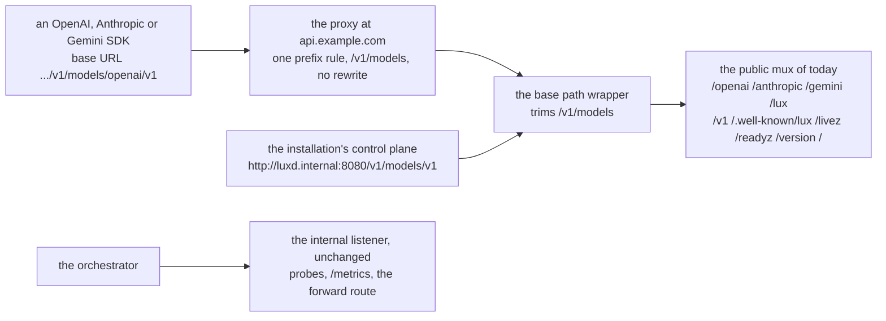

# Serving behind a shared origin

## Overview

### Scope

What this core needs in order to run behind an API origin it shares with
other services, rather than on a hostname of its own. Three variables and
one document.

| Variable | Default | Behind a shared origin |
|---|---|---|
| `LUX_OIDC_AUDIENCE` | `lux` | a list: this core's own name and the origin's, `lux,api.example.com` |
| `LUX_BASE_PATH` | empty, the root | the prefix the origin routes to this core, `/v1/models` |
| `LUX_TRUSTED_PROXIES` | unset | the address range of the proxy in front, so `request.ip` and the per-address limit see the caller |

The document is `GET /v1/openapi.json`, which has to describe the address
a client actually reaches a route at once a base path moves every route.

Every default is what an installation on its own hostname runs today, so
none of this reaches an operator who does not want it. It ends when a
door answers under a prefix at an origin, a token minted for that
origin's name verifies, the served document names the prefixed paths, and
the conformance suite is green against the prefixed installation with no
case file changed.

### Problem

An origin that fronts several services partitions its version namespace,
one prefix per service, so that adding a resource to one service is a
change inside that service and a collision between two of them is
impossible to write. This core's prefix in the installation that
dispatched this spec is `models`, so a door is
`https://api.example.com/v1/models/openai/v1/chat/completions` and an
SDK's base URL is `https://api.example.com/v1/models/openai/v1`. That
costs the core two things it does not have.

The first is the audience. `luxd` reads one value and refuses a comma
outright (`internal/config/identity.go:34-36`), and the verifier
documents its field as the one value a token's `aud` must contain
(`internal/auth/verifier.go:44`, `:226-227`). A credential issued for the
origin carries the origin's name in `aud`, because its holder addresses
the origin and not a service behind it, so every such credential is
refused while one minted for the core's own name is accepted. An
installation that runs several services behind one name therefore cannot
issue one credential its holder can use.

The second is the mount point. The public listener registers the four
doors, `/.well-known/lux`, `/v1`, the three probes and the build identity
at the root (`cmd/luxd/main.go:321-356`). Nothing in the core knows about
a prefix, so a request arriving as `/v1/models/openai/v1/chat/completions`
matches no door: `gateway/route.go:71-83` reads the door off the head of
the path.

Beside those, the README's project status still says there is no
published image or binary to pull while six tags stand, `v0.1.0` through
`v0.5.0`.

## Current state

| Fact | Where |
|---|---|
| The audience is one value, defaulted to `lux`, and a comma is a configuration error | `internal/config/identity.go:19`, `:34-36` |
| The shared validator's audience field is already a set, given one entry | `internal/auth/verifier.go:134` |
| `NewVerifier` refuses an empty audience | `internal/auth/verifier.go:113-115` |
| `/.well-known/lux` reports one audience member, the verifier's | `internal/api/self.go:88`, `:115` |
| `GET /v1/self` reports the subject, the claims, the policy, the limits and the filter, and no audience | `internal/api/self.go:23-31` |
| The public mux registers every route at the root | `cmd/luxd/main.go:321-356` |
| `LUX_PUBLIC_URL` already accepts a path and drops its trailing slash | `internal/config/api.go:54-72` |
| Every advertised URL is built from `LUX_PUBLIC_URL` | `internal/api/self.go:96-107` |
| The served document is built once at construction and written as stored bytes | `internal/api/handler.go:159`, `internal/api/openapi.go:142-148` |
| The committed document declares unprefixed paths and names no `servers` | `api/openapi.yaml:1-6` |
| `LUX_TRUSTED_PROXIES` already decides `request.ip` and the per-address bucket | `internal/config/api.go:47`, `internal/serve/address.go:26-34`, `internal/api/auth.go:27` |
| The base Deployment probes the internal port, not the public one | `deploy/base/deployment.yaml:68-77` |
| The conformance suite discovers the API base and the doors from `/.well-known/lux` | `test/conformance/run.go:232-259`, `test/conformance/client.go:327`, `:334` |

## Options

### Option 1: the shape of the audience variable

| | Shape | For | Against |
|---|---|---|---|
| A | `LUX_OIDC_AUDIENCE` becomes a comma list, first entry primary | One variable, one row in the configuration table, and the meaning of a single value is unchanged. A set is what the shared validator already takes (`internal/auth/verifier.go:134`), so the change is in the reading and not in the verifying | A singular name holds a set |
| B | A second variable, `LUX_OIDC_AUDIENCES` | Each variable means one thing | Two variables for one fact, two rows in the configuration reference, and an installation that sets both has written a contradiction the core has to resolve |
| C | The core accepts a second audience unconditionally | No configuration at all | The name of an origin is one installation's value. Invariant 8 of [[001-architecture]] keeps every such value out of this tree, and a core that trusted a name nobody configured would verify tokens addressed to a service it is not |

**Recommendation: A.** The primary is the distinction a bare set cannot
carry: it is the name an installation mints its own tokens for and the one
member `/.well-known/lux` reports, so a client that reads the document
knows which name to ask a token for.

### Option 2: how the core serves under a base path

`gateway/route.go:71-83` reads the door off the head of the request path,
and the doors are `/openai`, `/anthropic`, `/gemini` and `/lux`, outside
`/v1`. The public listener is therefore not one versioned surface but
four doors, a control plane, a discovery document and three probes.

| | Shape | For | Against |
|---|---|---|---|
| A | The public listener is wrapped: an outer mux registers the base path and its subtree, trims the base off the path, and serves the mux built today | Nothing inside the core learns a prefix. The doors, the control plane, the probes and the build identity move together with one wrapper. Handlers, the request log, the metric route labels and the authorizer's `request` keep seeing the path they see today, so no recorded value changes shape between a rooted installation and a prefixed one | The served document has to learn the base separately from the mux, so one value is read in two places. A test holds them equal |
| B | Each registration learns the base, swapping a declared prefix for the configured one | The mux patterns carry the base, so the document and the mux read one function | It works for a surface whose every route shares one declared prefix, and the doors share none. Every recorded route template, metric label and log field would carry the prefix, which makes a prefixed trace and a rooted trace incomparable |
| C | The proxy in front rewrites `/v1/models/(.*)` to `/$1` | No routing change in the core | The core still needs the base for `LUX_PUBLIC_URL` and for the served document, so C is B's configuration plus a rewrite rule. A rewrite is usually a property of a whole routing object, so a path that must not be rewritten needs a second object |

**Recommendation: A.** A prefix in front of every route is a property of
the listener, not of any route, so it belongs at the listener.

## Design

### The audience list

`LUX_OIDC_AUDIENCE` is a comma separated list of distinct names, default
`lux`. Each entry is trimmed. The rules at load, in
`internal/config/identity.go`:

| Rule | Reason |
|---|---|
| An empty entry is a problem naming the variable | `a,,b` and `lux,` are typing mistakes, and an empty audience would either verify nothing or verify everything depending on where it landed |
| A name listed twice is a problem | It permits nothing new and hides a typo, the rule `LUX_OIDC_ISSUERS` already runs (`internal/config/identity.go:92-95`) |
| An unset value is `lux` | An installation on its own hostname is unchanged |

The first entry is the primary. A token is accepted when its `aud`
contains any entry:

```
accept(t)  ⟺  aud(t) ∩ A ≠ ∅,   A = [a₀, a₁, …],  a₀ the primary
```

`VerifierOptions.Audience string` becomes `Audiences []string`, passed
whole to the shared validator, whose `Audiences` field is a set already
(`internal/auth/verifier.go:134`). `NewVerifier`'s refusal of an empty
audience (`:113-115`) becomes a refusal of an empty list.
`Verifier.Audience()` keeps returning the primary, and `Audiences()` is
added for the start-up line and for `luxd check`.

What reports it:

| Surface | Reports |
|---|---|
| `GET /.well-known/lux` | one audience member, the primary, unchanged in shape (`internal/api/self.go:88`, `:115`) |
| `GET /v1/self` | no audience today and none after this spec; it reports the caller, not the server (`internal/api/self.go:23-31`) |
| the start-up line | the whole list, so an operator reading a log knows which names this build accepts |
| `luxd check` | the whole list on the `issuers` row |

The document's audience member that became an array would break every
reader of a field the conformance suite already asserts, and the primary
is the one fact a client needs: it is the name a token it asks for should
be minted with. A caller that needs the whole set reads the start-up line
or `luxd check`, which are an operator's surfaces.

A token addressed to none of the listed names is `unauthenticated`, the
code the verifier returns for every refusal at the door
(`internal/auth/verifier.go:229-240`), with the audience named in the
developer detail. No new code and no new row of [[011-api]]'s error table.

#### The amendments [[002-repository-scaffold]] and [[006-identity]] need

Spec 002 is the configuration reference and its table carries every
`LUX_*` variable. It gains one row, `LUX_BASE_PATH`, with its default and
its owner, dated 2026-09-22. `LUX_OIDC_AUDIENCE` and
`LUX_TRUSTED_PROXIES` are already in it and keep their owners.

Spec 006 owns the audience variable. Two edits, dated 2026-09-22, land
with the implementation:

- The configuration table's row, which today reads "the one audience a
  caller token must contain; a value with a comma is a configuration
  error, because a list is not accepted", becomes the list rule above
  with `lux` as the default.
- The paragraph at `specs/006-identity.md:94-97`, which argues one
  audience suffices because a platform's own developer credential never
  reaches `/v1` as a token, is retired with its date. The installation
  that dispatched this spec decided otherwise: a script holding a
  credential calls the origin directly and the core asks the authorizer,
  the same path an interactive caller's token takes, so the boundary
  between two services behind one origin is the authorizer's answer and
  not the audience.

#### What the family gate reads

This repository's quality gate carries a rule that holds a hosted
deployment's audience to exactly two names, the core's own and the
origin's, and it reads the overlay a repository declares. The declaration
belongs with the overlay, and the overlay of an installation belongs with
that installation and not in this tree (see "What an installation adds"
below). This spec therefore adds no declaration and no criterion about
one: what it owes the rule is the variable shape, which is Option 1.

### The base path

`LUX_BASE_PATH`, default empty. Set, it is the prefix the whole public
listener answers under. Validated at load:

| Rule | Reason |
|---|---|
| Empty is the root and is the default | An installation on its own hostname mounts at the root and sets nothing |
| A set value begins with `/` and carries no trailing slash | One spelling of one prefix, so the routing rule in front, the mount and the document carry the same literal |
| A set value carries no query, fragment or escape sequence | It is a path prefix, not a URL |
| A set value equals the path of `LUX_PUBLIC_URL` | One fact, two spellings. An installation that serves under `/v1/models` and advertises `https://api.example.com` would publish links that 404 |

#### The mount



The wrapper is one handler in `cmd/luxd`. With `LUX_BASE_PATH` empty it is
not installed and the listener is byte for byte what it is today. Set, an
outer mux registers `base` and `base + "/"`, trims the base off
`URL.Path` and `URL.RawPath`, substitutes `/` when the trim leaves the
path empty so `GET /v1/models` answers the build identity that `GET /`
answers today, and serves the mux `main.go:346-356` builds. A path under
`/v1` but outside the base reaches no pattern and takes a bare 404 with no
envelope, which is correct: outside the surface there is no surface to
protect.

Everything the listener serves moves together:

| Route today | Under `/v1/models` |
|---|---|
| `/openai/v1/chat/completions` | `/v1/models/openai/v1/chat/completions` |
| `/anthropic/v1/messages` | `/v1/models/anthropic/v1/messages` |
| `/gemini/v1beta/models/{model}:generateContent` | `/v1/models/gemini/v1beta/models/{model}:generateContent` |
| `/lux/v1/models` | `/v1/models/lux/v1/models` |
| `/v1/keys`, and every control plane route | `/v1/models/v1/keys` |
| `/.well-known/lux` | `/v1/models/.well-known/lux` |
| `/livez`, `/readyz`, `/version`, `/` | `/v1/models/livez`, and the rest |

The probes moving costs an orchestrator nothing: the base Deployment
points liveness and readiness at the internal port
(`deploy/base/deployment.yaml:68-77`), and the internal listener is
outside the wrapper and unchanged.

`/v1/models/v1/keys` reads oddly and is correct. The outer `/v1` is the
origin's version, owned by the installation; the inner `/v1` is this
core's own API version, owned by [[011-api]]. Collapsing them would make
the core's version a function of where it is mounted.

#### The control plane under the prefix

A prefix rule that claims `/v1/models` claims everything under it, the
control plane included, so `api.example.com/v1/models/v1/keys` reaches
`/v1/keys`. That is the right shape, for three reasons.

1. Routing is not an access control. Every `/v1` route runs behind the
   verifier and then the authorizer ([[006-identity]]), so an
   unauthenticated call is `unauthenticated` and an authenticated one is
   the authorizer's decision to make. A path rule that hides a route
   moves that decision into the object least able to make it.
2. One rule cannot lose a route the core grows. A rule per door is a
   register of literals in another repository, and a route added here
   would need a change there or answer 404 at the origin while the core
   serves it.
3. An installation that wants the control plane unreachable at its origin
   has a routing answer of its own: claim the door prefixes rather than
   the whole base. That is a choice about one installation's exposure,
   which is why it is stated here and configured there.

#### The SDK base URLs

The doors are the reason the prefix exists, because a third-party SDK
builds its paths from a base URL it is given.

| Door | Base URL | First path the SDK appends |
|---|---|---|
| OpenAI | `https://api.example.com/v1/models/openai/v1` | `/chat/completions` |
| Anthropic | `https://api.example.com/v1/models/anthropic/v1` | `/messages` |
| Gemini | `https://api.example.com/v1/models/gemini/v1beta` | `/models/{model}:generateContent` |
| Lux | `https://api.example.com/v1/models/lux/v1` | `/models` |

The version segment in each is the dialect's own, which
`gateway/route.go:61-68` already strips before a passthrough path is
joined to a Provider's base URL. Nothing about the base path changes that
arithmetic.

#### The served document and the committed document

`api/openapi.yaml` is generated from the route table and the kinds' Go
types by `tools/apidoc`. It is the rooted shape: paths under `/v1/...`
and no `servers` member. It does not change, and `TestOpenAPIIsCurrent`
keeps holding it to the generator.

`GET /v1/openapi.json` is built once at construction
(`internal/api/handler.go:159`) and written as stored bytes
(`internal/api/openapi.go:142-148`). With a base path it is built with two
edits applied to the same document:

```
paths:    p            ↦  base + p
servers:  [ ]          ↦  [ { url: LUX_PUBLIC_URL } ]
```

so `servers[0].url + paths[i]` is the address a client reaches a route at,
and the document a client fetches through the origin describes the origin.
With no base path the rewrite is the identity and no `servers` member is
added, so the served bytes stay equal to the committed file, which is what
`TestOpenAPIIsCurrent` and [[018-conformance-suite]] already assume.

#### The conformance suite

No change. The suite fetches `GET {LUX_TEST_URL}/.well-known/lux` once
before the first case, takes the API base from the document's `api` member
and each door from `doors` (`test/conformance/run.go:232-259`), and every
request is built from those two (`test/conformance/client.go:327`,
`:334`). Both members are built from `LUX_PUBLIC_URL`
(`internal/api/self.go:96-107`), which carries the prefix, so setting
`LUX_TEST_URL` to the prefixed base drives the prefixed installation with
the same case files.

The one place that reads a path rather than a URL is the OpenAPI hold
(`test/conformance/client.go:269`), which compares the request's path
against the document it fetched from `c.api + "/openapi.json"`. Because
that document is the served one, its paths carry the base and the
comparison holds. That is the second reason the served document is
rewritten rather than left alone: a suite run against a prefixed
installation would otherwise report every route as undeclared.

### Trusted proxies

Behind a proxy the peer address is the proxy's, so `request.ip` in the
authorizer envelope and the per-address bucket of [[011-api]] would name
one address for every caller in the world. `LUX_TRUSTED_PROXIES` already
exists and already decides both (`internal/config/api.go:47`,
`internal/serve/address.go:26-34`, `internal/api/auth.go:27`). Nothing in
the core changes. It is named here because an installation behind a shared
origin that leaves it unset gets one rate bucket for every caller, which
is a defect rather than a configuration preference, and because the three
variables of this spec are set together or not at all.

### What an installation adds

The core ships `deploy/base`, the `hpa` component, and the `kind` and
`generic` overlays ([017-release-and-installation](017-release-and-installation.md)),
and it ships no overlay for any particular deployment. An installation
that fronts this core with a shared origin keeps its own overlay in its
own repository, beside the routing object that claims the prefix, because
that object and these variables are one fact and splitting them across two
repositories is how a claim and a mount drift apart.

What such an overlay sets, with example values:

| Setting | Example |
|---|---|
| the audience list | `LUX_OIDC_AUDIENCE: lux,api.example.com` |
| the base path | `LUX_BASE_PATH: /v1/models` |
| the advertised address | `LUX_PUBLIC_URL: https://api.example.com/v1/models` |
| the proxy in front | `LUX_TRUSTED_PROXIES`, the controller's address range |
| the issuers | `LUX_OIDC_ISSUERS: https://issuer.example.com` |
| the authorizer and the sink | `LUX_AUTHORIZER_URL` and `LUX_EVENTS_URL`, in-cluster addresses of the installation's own control plane |
| the secrets | `LUX_SECRETS_KEK`, `LUX_AUTHORIZER_TOKEN`, `LUX_EVENTS_SECRET`, `LUX_DB_URL` and `LUX_DB_POOL_URL`, each a `secretKeyRef` and never a literal |
| the image | pinned to a released digest, the base's placeholder `luxd` resolving nowhere so an unpinned target fails to pull rather than running an unknown build (`deploy/base/kustomization.yaml:7-12`) |

Two of these are held by tests in this tree whatever an installation does
with them: the base path must equal the path of `LUX_PUBLIC_URL`, and the
audience list must be distinct and non-empty. Both are load-time rules, so
an overlay that gets either wrong fails to start rather than serving the
wrong address.

### The README's project status

The section still says there is no published image or binary to pull and
that the first tagged release is what remains before `v1`
(`README.md:209-216`). Six tags stand, `v0.1.0` through `v0.5.0`, each
with images, four-platform binaries, checksums, signatures, bills of
materials and provenance. It should say: the current release and its
date; that images and binaries are published under the namespace of the
repository owner that ran the release workflow, signed and with
attestations, so a fork publishes under its own
([017-release-and-installation](017-release-and-installation.md));
that the manifest schema may still change before `v1.0.0` and a minor may
break a row of the version table with a CHANGELOG entry naming the break;
and that `docs/install.md` is walked by CI on every push.

## Not in this spec

- The shorter path for somebody running the core for themselves: the
  local issuer, the bootstrap directory and the example catalog are
  [035-running-the-core-on-your-own](035-running-the-core-on-your-own.md).
- Any overlay, routing object, certificate or namespace of a particular
  deployment. Those live with the deployment.
- Any rename of a route, a field, an error code or an action.
- A new error code. A token addressed to no listed name is
  `unauthenticated`, which [[011-api]]'s table already carries.

## Acceptance criteria

| # | Criterion | How it is checked |
|---|---|---|
| 1 | `LUX_OIDC_AUDIENCE` reads a comma list, the first entry is the primary, an empty entry and a repeated entry are configuration problems naming the variable, and an unset value is `lux` | `TestAudienceListIsParsed` in `internal/config`, table driven over `lux`, `lux,api.example.com`, `lux,`, `,lux`, `lux,lux` and the empty value; it fails on today's tree at `internal/config/identity.go:35-36` |
| 2 | A token whose `aud` meets any listed entry is accepted, one that meets none is `unauthenticated` with the audience named in the detail, and an empty list refuses start-up | `TestBearerAcceptance` in `internal/auth`, widened with a two-entry list, and `TestVerifierRefusesAnEmptyAudienceList` |
| 3 | `/.well-known/lux` reports the primary as its one audience member, and `GET /v1/self` reports none | `TestWellKnownReportsThePrimaryAudience` in `internal/api` |
| 4 | With `LUX_BASE_PATH` set, the four doors, the control plane, `/.well-known/lux`, the three probes and the build identity answer under it, and answer nothing at the root | `TestBasePathMovesThePublicListener` in `cmd/luxd`, table driven over every route the public mux registers, each asserted present under the base and absent at the root |
| 5 | With `LUX_BASE_PATH` empty the public listener is what it is today | `TestBasePathEmptyIsTheRoot` in `cmd/luxd`, the same table at the root with no wrapper installed |
| 6 | A `LUX_BASE_PATH` that does not begin with `/`, carries a trailing slash, or disagrees with the path of `LUX_PUBLIC_URL` is a configuration problem naming both variables | `TestBasePathRules` in `internal/config` |
| 7 | The served `GET /v1/openapi.json` carries every path under the base and one `servers` entry equal to `LUX_PUBLIC_URL`; with no base path it is byte for byte the committed document | `TestServedDocumentCarriesTheBasePath` and `TestOpenAPIIsCurrent` in `internal/api` |
| 8 | The conformance suite is green against an installation serving under a base path, with no case file changed | `TestContract` with `LUX_TEST_URL` carrying the prefix, run as a third run of the `conformance-twice` job of `.github/workflows/verify.yml` and as a `make` target beside the rooted run |
| 9 | The `generic` overlay renders with a base path, an audience list and a trusted proxy range set together, and `luxd check` is green against it | `TestGenericOverlayServesUnderAPrefix` in `cmd/luxd`, reading the rendered overlay |
| 10 | `luxd check` reports the whole audience list and the base path beside the address it read | `TestCheckCommand` in `cmd/luxd`, widened |
| 11 | `docs/configuration.md` and `.env.example` carry `LUX_BASE_PATH` with its default and the audience list rule, and [[002-repository-scaffold]]'s and [[006-identity]]'s tables carry the same rows | `TestConfigurationReferenceIsCurrent` in `internal/config`, which regenerates both documents from `internal/config/reference.go`, and the two specs read against this one |
| 12 | The README's project status names the current release, where images and binaries are published and under whose namespace, and what a version before `v1.0.0` promises | the file, read against this spec |

## Outcome

Implemented on 2026-09-23 for `v0.6.0`. Every criterion holds, two of
them by a route the text did not name.

- Criteria 1 to 3: `TestAudienceListIsParsed` in `internal/config`,
  `TestBearerAcceptsAnyListedAudience` and
  `TestVerifierRefusesAnEmptyAudienceList` in `internal/auth` (the
  second also refuses an empty name inside a list), and
  `TestWellKnownReportsThePrimaryAudience` in `internal/api`. A token
  addressed to no listed name names the whole list in its developer
  detail.
- Criteria 4 to 7: `TestBasePathMovesThePublicListener` and
  `TestBasePathEmptyIsTheRoot` in `cmd/luxd`, `TestBasePathRules` in
  `internal/config`, which also refuses a base that is not a clean path,
  since a request path is cleaned before it is routed, and
  `TestServedDocumentCarriesTheBasePath` beside the unchanged
  `TestOpenAPIServedMatchesCommitted`. The base is enforced at load
  after both loaders, because the identity loader runs before the one
  that reads `LUX_PUBLIC_URL`.
- Criterion 8 diverged in one respect. `TestE2EConformanceUnderBasePath`
  runs the suite under `/v1/models` with an audience list, as a third
  step of the `conformance-twice` job and inside `make test-e2e`, which
  runs every `TestE2E` test, so no new target was added. One case file
  changed: `case011OpenAPIValidatesEveryResponse` listed the rooted
  route names, and now reads them relative to the base the discovery
  document gives. The per-request hold needed no change.
- Criterion 9: `TestGenericOverlayServesUnderAPrefix` merges the three
  variables into the generic overlay's configuration, renders it with
  `kubectl kustomize`, and runs `luxd check` over the render with the
  overlay's own endpoints replaced by loopback doubles.
- Criteria 10 to 12: `TestCheckCommand` widened for the audience list
  and the mount, the configuration reference and specs 002 and 006
  amended, and the README's project status rewritten.

Found on the way and fixed: `TestVersionPromise` in `tools/release`
compared the working tree against its own `HEAD`, so any uncommitted
change that adds a variable failed the gate before it could be
committed. It now reads `HEAD` against itself, which still exercises
the tag reader.
