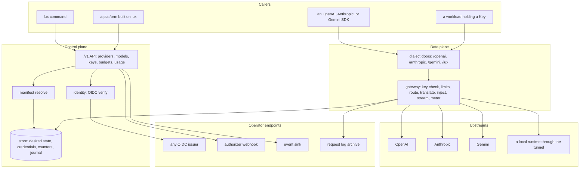

# Architecture

## Overview

Lux is an open source LLM gateway. One address serves every model
provider's API: a caller points an OpenAI, Anthropic, or Gemini SDK at
Lux, names a model, and the request reaches whichever provider serves
that model, translated between dialects when the caller's and the
provider's differ. Lux owns a declarative contract for model access, a
manifest in the shape of a Kubernetes object under the API group
`lux.latere.ai/v1beta1`, in four kinds: `Provider`, an upstream and the
credential Lux holds for it; `Model`, a routable name and where it goes;
`Key`, the credential a workload holds and what it may spend; `Budget`,
a spend window several keys draw from. A provider credential never
leaves the gateway. A caller holds a Key, and the gateway injects the
provider's credential toward that provider's base URL and no other host.
Every request produces one usage record with tokens and cost, and
never content.

The design follows the Kubernetes API server in one respect and Cella in
another. Like an API server, `luxd` owns the schema, the validation, the
defaulting, the desired state, and the reconciliation of desired into
observed, and pushes every question of who may do what to an endpoint an
operator writes. Like Cella, the whole component is public, a platform's
installation is one consumer among any, and nothing in the tree names an
installation except as a default, an example, or the API group. A
platform that composes Cella and Lux gives a sandbox model access with
no mechanism of its own: it applies a `Key`, stores the value as a Cella
`Secret` scoped to the Lux host, and the sandbox holds a placeholder
([[020-building-a-plane]]).

This spec fixes what every other spec assumes: the two planes, the
components, the kinds, the package boundary, the extension points, the
flows, and the invariants. Read it first.

## Current state

Nothing of the design is built. The repository holds the scaffold of
[[002-repository-scaffold]]: the binary serving its probes, typed
configuration, and the gate, on pkg v0.65.0.

## Design

### Two planes



The control plane is where objects are declared: a caller with a token
from a listed issuer applies a manifest, the API resolves it, asks the
authorizer, and writes desired state. The data plane is where requests
flow: a caller with a Key sends a request through a dialect door, and
the gateway decides from desired state alone, with no webhook and no
issuer on the path. The two planes share one process and one store by
default; the exported packages let a platform run the data plane inside
its own binary with its own control plane around it.

### Components

Two binaries ship to users. `luxd` is the server, one image, one role
per process selected by subcommand; `lux` is the client, small and
dependency-light because it runs where agents run. A third,
`lux-stubs`, ships only as the test image the release pipeline's
conformance job runs ([[017-release-and-installation]]).

| Binary and role | Runs where | Owns |
|---|---|---|
| `luxd serve` | the gateway | both planes: the `/v1` API, resolve, identity, the dialect doors, routing, translation, credential injection, metering, the store, the webhook clients, event delivery, the request log exporter |
| `luxd check` | wherever an installation is verified | one line per requirement, exit 1 on any failure |
| `luxd rewrap` | wherever the store is reachable, once per KEK rotation | re-wraps every stored credential's data key under the first key of `LUX_SECRETS_KEK` and exits ([[005-providers]]) |
| `lux` | a shell or an agent | the client of the `/v1` API and a local door for a runtime on the operator's machine ([[013-tunnelled-runtimes]]) |
| `lux-stubs` | tests, `make run`, and the release pipeline's conformance job; never an installation | the stub providers, one per dialect, the stub issuer, authorizer, and sink |

Each role is its own package under `internal/` (`internal/serve`,
`internal/check`, `internal/rewrap`), so the dependency gate holds one allow list per role
even though one binary carries them. Splitting a role into a binary of
its own later is a new `main` over an existing package.

### Packages

The module is `latere.ai/x/lux`. Three package trees at the root,
`manifest`, `gateway`, and `metering`, with their subpackages, are
imported by others; everything else is `internal/`. Dialect translation
is not a package of this module: `latere.ai/x/pkg/llmdialect` is the
open source core for it, with every dialect a frontend and a backend
around one intermediate representation, and `gateway` imports it. The
word for an upstream is `provider`, in every spec and every identifier;
`backend` and `vendor` are not used.

| Package | Owns | Promise to an importer | Spec |
|---|---|---|---|
| `manifest`, `manifest/v1` | the `lux.latere.ai/v1beta1` kinds, strict decoding, validation, defaulting, resolve | a manifest the schema accepts today is accepted by every later `v1` build; new fields are optional; Go API additive within a module major | [[003-manifest-contract]] |
| `gateway` | the data plane as a handler: key check, limits, model resolution, target selection, translation through `llmdialect`, credential injection, streaming, retries and fallback, usage extraction | drives any store that satisfies its interfaces; owns no HTTP server, no identity, no store implementation | [[004-request-path]], [[008-routing-and-models]] |
| `metering` | the usage record, cost from a Model's pricing, the window arithmetic of limits and budgets | the record's fields are additive; a cost computed today is computed the same by every later build for the same pricing | [[009-usage-and-metering]], [[007-keys-and-limits]] |
| `internal/api` | the `/v1` handlers, the OpenAPI document | none | [[011-api]] |
| `internal/auth` | the OIDC verifier over the issuers, the authorizer client, the owner policy | none | [[006-identity]] |
| `internal/store` | desired state, credential values, key hashes, counters, the journal; memory, Postgres, and the file mode | none | [[010-state]] |
| `internal/serve`, `internal/check`, `internal/rewrap` | the three roles of `luxd`, one package each with its own dependency allow list | none | [[002-repository-scaffold]], [[017-release-and-installation]], [[005-providers]] |
| `internal/events`, `internal/reqlog`, `internal/tunnel`, `internal/config`, `internal/version`, `internal/luxcli`, `internal/luxclient` | as their specs say | none | [[012-request-log-and-events]], [[013-tunnelled-runtimes]], [[002-repository-scaffold]], [[014-agent-client]] |

The rule for the root packages: they compute, validate, and drive.
`manifest` and `metering` import nothing under `internal/`, no HTTP
client, no database driver, and no identity library. `gateway` imports
neither of the last two and dials one thing, the providers' base URLs,
which are its substrate; it reaches the store, the credentials, and the
usage sink through interfaces the importer satisfies. None of them
dials an identity provider, a database, a billing system, or a webhook.
A platform imports them to get the contract and the data plane with
its own identity and policy around them, or runs `luxd` and gets the
same through the webhooks. Both paths reach one `Resolve` and one
gateway handler, so a manifest means the same thing on both and a
request is answered the same on both.

### Kinds

| Kind | Is | Spec |
|---|---|---|
| `Provider` | one upstream: the dialect it speaks, its base URL, the credential Lux holds for it encrypted and never returns, how its model list is discovered and its health probed | [[005-providers]] |
| `Model` | one routable name: the targets it reaches on which providers with which upstream names, weights and fallback order, pricing, modalities; declared by an operator, or discovered from a Provider and named `<provider>/<upstream name>` | [[008-routing-and-models]] |
| `Key` | the credential a workload holds: which Models it may name, its rate and spend limits, the Budget it draws from, when it expires; the value is minted by the server, or supplied once by a platform that registers its own credential as a Key, shown once, and stored as a hash | [[007-keys-and-limits]] |
| `Budget` | a spend window several Keys draw from, hard or soft, with what is spent and when it resets in `status` | [[007-keys-and-limits]] |

Every kind is one object under `apiVersion: lux.latere.ai/v1beta1`
with `metadata`, `spec`, and `status`, decoded and resolved by the same
package and served by the same API grammar. A discovered Model is an
object in every respect but that it was not applied: it has an id, an
owner (the Provider's), and a `status.source` of `discovered`; a
declared Model of the same name replaces it.

### The gateway and a platform

| The gateway owns | A platform supplies |
|---|---|
| the kinds and their evolution | accounts, organizations, teams |
| one resolve pipeline, the stages of [[003-manifest-contract]] | the permission model, as an authorizer |
| the request path: doors, routing, translation, injection, streaming | which SDKs and base URLs it hands its users |
| custody: provider credentials encrypted, never returned, injected toward one host | the credentials' provenance, and who may declare a Provider |
| limits and budgets: rate windows, spend windows, refusal at the gate | plans, quotas, funded grants, invoices, as authorizer limits and as Budgets it applies |
| metering: one record per request, cost from pricing, the usage API | billing, and what it does with the records |
| caller identity from listed issuers | the issuer |
| the events of every mutation, signed, to a sink; the request log to an archive | the sink, the archive, and what it does with them |
| the `lux` command, the tunnel, the stubs | a dashboard, a console, a model marketplace, fleet views |

A platform never needs a fork. Everything in the right column reaches
the gateway through an extension point or the exported packages.

### Extension points

| Point | Reached | Contract | Default when absent |
|---|---|---|---|
| OIDC issuers | on every control plane request | standard OpenID Connect; audience `lux` unless configured | none: `luxd` refuses to start without an issuer, except in file mode |
| Authorizer webhook | on every control plane request that names a subject and an action, and at Key resolve for every Model the Key names | [[006-identity]]; unavailability is a refusal | the built-in owner policy |
| Event sink | after every mutation, and on every limit or budget state change | [[012-request-log-and-events]]: signed `POST`, at-least-once, ordered per object | off |
| Request log archive | after every data plane request, batched | [[012-request-log-and-events]]: one record per request to an S3 compatible bucket | off |
| Providers | applied by an operator, or attached by a local runtime through the tunnel | [[005-providers]], [[013-tunnelled-runtimes]] | none: a gateway with no Provider answers every data plane request `model_not_found` |
| File mode | at start, from `LUX_MANIFEST_DIR` | [[010-state]]: desired state from disk, the kinds read-only through the API, credentials from the environment | off |
| Gateway interfaces | at import time, by a platform that constructs the handler itself | [[004-request-path]] | the store and clients `luxd serve` constructs |

### Flows

Apply a Key:

```mermaid
sequenceDiagram
  participant C as caller
  participant A as luxd /v1
  participant I as identity
  participant Z as authorizer
  participant M as resolve
  participant S as store
  participant E as sink
  C->>A: PUT /v1/keys/{name} (manifest)
  A->>I: verify bearer against issuers
  A->>Z: may subject create Key name?
  Z-->>A: allow (with limits) or deny
  A->>M: decode, default, validate
  M->>Z: may subject use Model m, for every selector match? draw Budget b?
  Z-->>M: allow or deny, per object; deny reads as not_found
  A->>S: mint value, store its hash and the resolved manifest
  A->>E: key.created
  A-->>C: 201, resolved manifest with status, the value once
```

A data plane request:

```mermaid
sequenceDiagram
  participant W as workload
  participant D as door /openai/v1/chat/completions
  participant G as gateway
  participant S as store
  participant P as provider
  participant R as metering
  W->>D: POST with Authorization: Bearer lux_...
  D->>G: request, dialect openai
  G->>S: key by hash (cached), its resolved manifest
  G->>G: expired? disabled? model allowed by the selectors?
  G->>G: Model by name, target by weight and health
  G->>S: rate window, spend window, budget (local delta over the store's last value; the spend estimate needs the Model's pricing)
  G->>G: translate if the target's dialect differs
  G->>P: request with the provider's credential, toward its base URL only
  P-->>G: response or stream
  G-->>W: response or stream in the door's dialect
  G->>R: one usage record: key, model, provider, tokens, cost, latency, status
  R->>S: debit the windows, flush per LUX_METERING_FLUSH
```

Every step before the provider is a decision from desired state and the
counters, so the hot path dials no webhook and no issuer. A refusal
happens before any bytes reach a provider and is a fixed error code
([[004-request-path]]). When the door's dialect and the target's are
the same, the body reaches the provider byte for byte, with only the
credential, the hop-by-hop headers, and on an `openai` chat completion
stream the `stream_options.include_usage` flag changed, so the usage
reaches the record; when they differ, the
translation is `llmdialect`'s, and every field the target dialect cannot
represent is reported, never silently dropped.

Composition with a sandbox: a platform applies a `Key` for a run, applies
a Cella `Secret` whose value is the Key and whose scope is the Lux host,
and names the secret in the sandbox's manifest. The sandbox sees a
placeholder; the egress gateway substitutes the Key toward Lux; Lux
injects the provider's credential toward the provider. Two gateways,
two substitutions, and neither credential is ever inside the sandbox
([[020-building-a-plane]]).

### State

Two states, two truths. Desired state is the resolved manifest, the
thing a caller applied, and the hash of every Key's value and the
ciphertext of every Provider's credential; it is the control plane's
and lives in the store. Observed state is what the data plane reports:
a Provider's health and discovered models, a Model's availability, a
Key's and a Budget's spend in the current window; it is the gateway's,
accumulated per replica and flushed to the store. With `LUX_DB_URL`
set, desired state and the counters survive a restart and are shared by
every replica. Without Postgres, desired state lives with the process
and every window starts empty at start, which the start-up log says.
In file mode, desired state is the directory and the API cannot change
it. Rate windows are per replica in every mode; spend windows are the
store's, with a bounded lag the metering spec states
([[009-usage-and-metering]]).

### Naming

`lux.latere.ai/v1beta1` is the API group and version. Kubernetes asks
only that a group be a DNS subdomain and validates nothing about who
owns it; every project outside the core groups uses its own domain, and
this is Latere's open source project. The group is therefore the one
place a Latere name appears in the public contract, and the invariant
below says so.

Every object has a stable id, a ULID with a kind prefix: `prv_` for a
provider, `mdl_` a model, `key_` a key, `bud_` a budget, `req_` a
request, `evt_` an event. The id is `status.id` and
is accepted beside the name on every item route, `PUT` addressing by
name alone ([[011-api]]); a name may be reused after delete, an id
never. A Key's value the server mints is `lux_` followed by 40
characters from a URL-safe alphabet; the first twelve are its
`status.prefix`, the only part ever shown again. A value a platform
supplies has no `lux_` prefix and its own prefix rule
([[007-keys-and-limits]]); the doors treat every presented value as
opaque bytes and look up its hash, so the prefix is a convention for
people and never a check.

The dialect doors are `/openai`, `/anthropic`, `/gemini`, and `/lux`,
each followed by the path shape of that dialect's own API, so an SDK's
base URL is the door. `llmdialect` carries no Gemini dialect, so the
`/gemini` door reaches a `gemini` Provider unchanged and is never
translated ([[004-request-path]]). The control plane is `/v1`. Labels and
annotations under `lux.latere.ai/` are the gateway's and a manifest
that sets one is refused; a platform picks its own prefix. Variables the
server reads are `LUX_*`.

### Dependencies

The build list of `./cmd/luxd` reaches the standard library,
`latere.ai/x/pkg`, the YAML decoder `manifest` uses
([[003-manifest-contract]]), the Postgres driver and the migration
library of the store ([[010-state]]), and the OpenTelemetry SDK, and
nothing else: no cloud SDK, no web framework, no ORM, no Redis client.
`./cmd/lux` reaches the standard library, the error envelope, and this
module's `manifest` and `manifest/v1` with the YAML decoder they use
([[014-agent-client]]). The `depcheck` gate holds each list, and a new entry is
a row with a reason. Multi-replica counters are the store's, not a
cache's, which is why there is no Redis: the lag that costs is stated
and bounded rather than bought with a dependency.

### Invariants

1. One schema, one resolver, one meaning. The manifest is the only way
   to declare an object; every surface, the API, the command, the file
   mode, and an importer, goes through one `Resolve`; two surfaces never
   accept different subsets of a kind; and the resolved manifest a
   caller reads back is what the gateway acts on, every default included
   and visible.
2. A provider credential never leaves the gateway. It is stored
   encrypted, returned by no endpoint, carried by no event or log, and
   injected only into a request whose destination is that Provider's
   base URL.
3. A caller holds a Key and nothing else. The data plane authenticates
   a Key and authorizes what the Key was resolved to; the hot path dials
   no webhook and no issuer.
4. `luxd` verifies identity and issues none for people. The values it
   mints are Keys, which identify workloads, and it stores only their
   hashes.
5. Permission is a decision from outside. An unavailable decision is a
   refusal. The built-in owner policy is a policy, not an allow-all.
6. Same dialect, same bytes. A request whose door and target speak one
   dialect reaches the provider unchanged but for the credential, the
   hop-by-hop headers, the model name when the Model's name differs
   from the target's upstream name, and `stream_options.include_usage`
   on an `openai` chat completion stream ([[004-request-path]]); a
   translated request reports every field the target cannot represent.
7. Every data plane request produces exactly one usage record, whether
   it was refused, failed, or succeeded; the record names the key, the
   model, the provider, the tokens, the cost, the latency, and the
   outcome, and never the content.
8. No Latere hostname, namespace, or value in a released artifact, a
   deploy manifest, a default that a fork would inherit, or the
   documentation, except as an example or the API group. A fork's tag
   publishes under the fork's namespace. The module path, its
   `latere.ai/x/*` dependencies, and the shared CI pipeline are the
   project's own coordinates and are not what this forbids.
9. `manifest`, `gateway`, and `metering` own no policy; `manifest` and
   `metering` dial nothing, and `gateway` dials only the providers.
10. Desired state is the control plane's; observed state, health,
    discovery, and the windows, is the data plane's report, and no
    observed state overwrites desired state.

## Not in this spec

The schema fields ([[003-manifest-contract]]), the door routes and the
error table of the data plane ([[004-request-path]]), the provider
rules and credential custody ([[005-providers]]), the webhook payloads
([[006-identity]], [[012-request-log-and-events]]), the limit
arithmetic ([[007-keys-and-limits]]), the target selection
([[008-routing-and-models]]), the usage record ([[009-usage-and-metering]]),
the store contract ([[010-state]]), the endpoint table ([[011-api]]),
the tunnel ([[013-tunnelled-runtimes]]), the threat model
([[016-security-and-threat-model]]), and how a platform composes the
packages and the webhooks ([[020-building-a-plane]]).

## Acceptance criteria

This spec owns three tests, each writable against the scaffold as the
first commit of phase 1, and is `complete` when they pass; the
invariants above that only a built component can prove are held by the
specs that build it and are indexed in the table that follows, which is
not this spec's acceptance. Without this split nothing is dispatchable:
every spec depends on this one, the dispatch gate waits for it to reach
`testing`, and its tests would have waited for theirs.

| Criterion | Test that proves it | State |
|---|---|---|
| Every package at the module root is `manifest`, `gateway`, or `metering` or under one of them; `manifest` and `metering` import nothing under `internal/`, no HTTP client, no database driver, and no identity library; `gateway` imports neither of the last two and reaches no package that dials anything but an upstream; a root package that does not exist yet is skipped by name, so the test passes on the scaffold and bites as each lands | `TestRootPackagesDialNothing` over `go list -deps`, one allow list per package | not built |
| Each role package's and each binary's build list matches its `depcheck` allow list | the `depcheck` gate | passing for the scaffold's list |
| No file under `deploy/`, `docs/`, or `.github/workflows/`, and no default in `internal/config`, names a Latere hostname or namespace outside an example or the API group; a directory that does not exist yet is skipped by name | `TestNoLatereCoordinatesInReleasedArtifacts` | not built |

### Held by other specs

Each row is an invariant of this spec proven by the test of the spec
that builds the component; the row is complete when that spec's is.

| Invariant | Held by | Test |
|---|---|---|
| 1, one resolver: a manifest applied through the API and one handed to `manifest.Resolve` by an importer with the same options produce byte-identical resolved manifests | [[011-api]], [[018-conformance-suite]] | `TestAPIAndImporterResolveAgree`, comparing the `PUT` response body with `Resolve`'s output; the suite's `manifest` group |
| 2, a provider credential never leaves the gateway: a canary credential appears in no response body, event, log line, or request log record across the e2e tier, and in the stub provider's received headers only for requests routed to that provider | [[005-providers]] | `TestProviderCredentialNeverLeavesTheGateway` |
| 3, the hot path dials no webhook and no issuer: during one thousand data plane requests the stub authorizer and the stub issuer receive zero calls | [[004-request-path]] | `TestHotPathDialsNoWebhook` |
| 6, same dialect, same bytes: a request through the `/openai` door to an `openai` target arrives at the stub provider byte-identical but for the credential and hop-by-hop headers; a request through the `/anthropic` door to an `openai` target arrives translated and a field the target cannot represent is named in the loss report | [[004-request-path]] | `TestSameDialectSameBytes`, `TestTranslationReportsLoss` |
| 4 and 5, identity verified and permission from outside: `luxd` refuses to start with no issuer configured and no manifest directory; with the authorizer URL set and the endpoint down every control plane request is `authorizer_unavailable` and every data plane request with a valid Key is served | [[006-identity]] | `TestServeRefusesToStartWithoutAnIssuer`; the conformance suite's `identity` group |
| 7, one usage record per request: every data plane request in the e2e tier, refused, failed, or successful, has exactly one usage record and the record carries no request or response content | [[009-usage-and-metering]] | `TestEveryRequestHasOneUsageRecord` |
| 7, money that cannot be counted is not spent: a Key under a hard Budget naming an unpriced Model is refused with `model_unpriced` before any bytes reach a provider | [[007-keys-and-limits]] | `TestUnpricedModelRefusedUnderABudget` |
| 8, a fork publishes under its own namespace | [[017-release-and-installation]] | `TestReleasePublishesUnderTheOwnersNamespace` |
| 10, desired state survives: after `luxd` restarts with Postgres, a Key's spend window carries what was spent before the restart within the flush lag | [[010-state]], [[015-test-stubs-and-tiers]] | the postgres tier's `TestPostgresTwoReplicas` |
