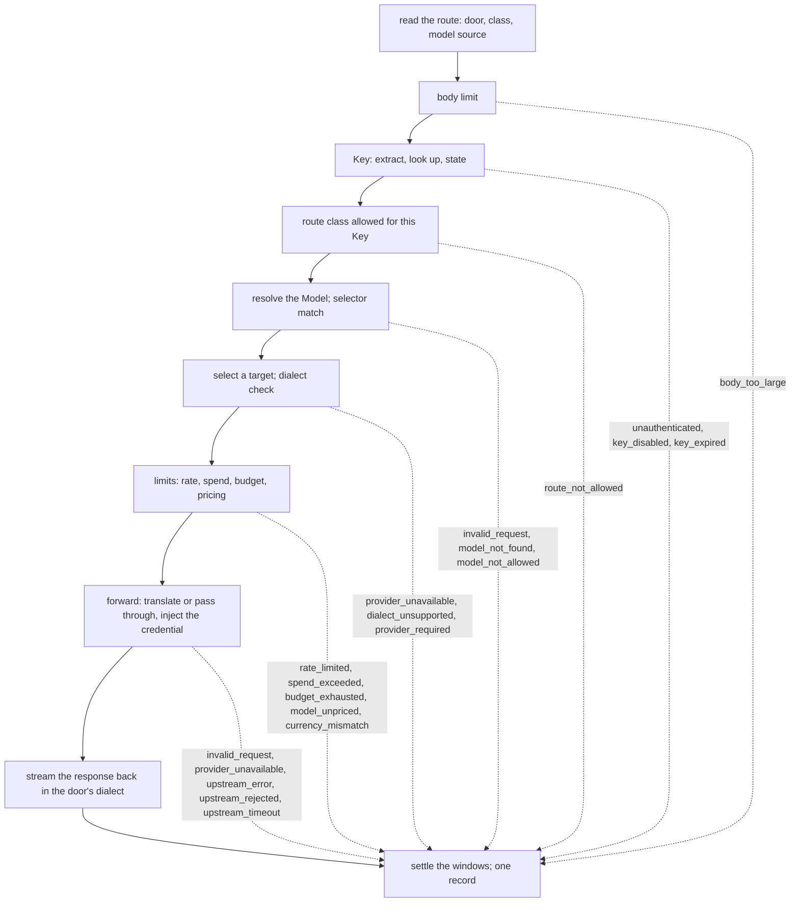

# Request path

## Overview

The data plane is four doors, one per dialect: `/openai`, `/anthropic`,
`/gemini`, `/lux`. A caller sets its SDK's base URL to a door and
presents a Key; the path under the door is the dialect's own API. The
gateway authenticates the Key, resolves the model the request names to
a Model and a target, checks the Key's limits, and forwards the request
to the target's provider with that provider's credential, translating
between dialects when the door's and the target's differ and passing
bytes through when they are the same. Every decision before the
provider is made from desired state and the counters; the hot path
dials no webhook and no issuer ([[001-architecture]], invariant 3).
Every request, refused, failed, or served, ends in one usage record
([[009-usage-and-metering]]).

This spec owns the doors and their route table, the pipeline and the
order of its refusals, the wire rules of forwarding, translation, and
streaming, the error envelope per dialect, and the `gateway` package's
interface to what surrounds it. Target selection is
[[008-routing-and-models]]'s, the limit arithmetic
[[007-keys-and-limits]]'s, the provider client [[005-providers]]'s.

## Current state

Built: the `gateway` package is the handler this spec describes, driven
in its tests through fakes for every interface of `Options` and
`httptest` servers as the providers, on pkg v0.66.0. It is not mounted
yet: `internal/serve` satisfies the interfaces from the store and the
clients and mounts the handler at the four doors under [[011-api]], the
upstream client and the credential source are [[005-providers]]'s, the
target order and the circuits [[008-routing-and-models]]'s, the windows
[[007-keys-and-limits]]'s, and the record's cost
[[009-usage-and-metering]]'s.

## Design

### Doors and routes

A door is a path prefix and a dialect. Under it, the route table names
what the gateway does with each path. Three route classes:

- A **translated** route is one `llmdialect` models: the body is decoded
  to the intermediate representation and encoded for the target, in
  both directions, event by event when streaming.
- A **model** route names a model but has no codec: the gateway resolves
  the Model and forwards the bytes to a target of the same dialect,
  reading usage from the response where the dialect reports it.
- An **opaque** route names no model: files, batches, audio, images,
  fine-tuning, and any path not in the table. The gateway forwards it
  to one provider of the door's dialect, chosen as below, only for a
  Key with `passthrough: true`, relays the provider's answer whole, its
  status and body included, because the caller chose the provider and
  speaks its API directly, and records a request it cannot price with
  the upstream status.

| Door | Route | Class | Model from |
|---|---|---|---|
| `/openai` | `POST /v1/chat/completions` | translated, `openaichat` | body `model` |
| `/openai` | `POST /v1/responses` | translated, `openairesp` | body `model` |
| `/openai` | `POST /v1/embeddings` | model | body `model` |
| `/openai` | `GET /v1/models`, `GET /v1/models/{model}` | served by the gateway: the Models the Key may use, in this dialect's list shape; never forwarded | path |
| `/openai` | any other path under `/v1/` | opaque | none |
| `/anthropic` | `POST /v1/messages` | translated, `anthropic` | body `model` |
| `/anthropic` | `POST /v1/messages/count_tokens` | model toward an `anthropic` target; toward any other dialect, served by the gateway from the estimate below | body `model` |
| `/anthropic` | `GET /v1/models`, `GET /v1/models/{model}` | served by the gateway | path |
| `/anthropic` | any other path under `/v1/` | opaque | none |
| `/gemini` | `POST /v1beta/models/{model}:generateContent`, `:streamGenerateContent`, `:countTokens`, `:embedContent` | model | path |
| `/gemini` | `GET /v1beta/models`, `GET /v1beta/models/{model}` | served by the gateway | path |
| `/gemini` | any other path under `/v1beta/` or `/v1/` | opaque | none |
| `/lux` | `POST /v1/generate` | translated, `lux` | body `model` |
| `/lux` | `POST /v1/count_tokens` | served by the gateway: the lux body is decoded and forwarded to an `anthropic` target's count route re-encoded, or answered from the estimate below | body `model` |
| `/lux` | `GET /v1/models`, `GET /v1/models/{model}` | served by the gateway | path |

A path under a door that is not under the dialect's version prefix, a
method the table does not list for a translated or model route, and
anything outside the four doors is `not_found`, 404, in the door's
envelope; a path under no door has no dialect and is answered in the
`/lux` door's shape. The record of a model list or read carries the
route class `served`, the fourth value beside the three above, because
the gateway answered it and no provider did. `GET /v1/models` on a door
lists the Models whose names match
one of the Key's selectors now and whose `status.available` is true,
so an SDK's model picker shows what the Key can call; a declared and a
discovered Model appear the same way. The list is in the dialect's own
shape, exactly:

| Door | List body |
|---|---|
| `/openai`, `/lux` | `{"object": "list", "data": [{"id": "<name>", "object": "model", "created": 0, "owned_by": "lux"}]}` |
| `/anthropic` | `{"data": [{"type": "model", "id": "<name>", "display_name": "<name>", "created_at": "1970-01-01T00:00:00Z"}], "has_more": false, "first_id": "<first>", "last_id": "<last>"}` |
| `/gemini` | `{"models": [{"name": "models/<name>", "displayName": "<name>", "supportedGenerationMethods": ["generateContent", "countTokens"]}]}` |

`GET .../models/{model}` is the one entry, or `model_not_found`;
`model_not_allowed` when the Key's selectors do not match, so the list
and the read agree on what the Key may name. The read answers a Model
whose `status.available` is false, which the list leaves out, because
the Model exists and the Key may name it. Names are sorted.

A token count that no upstream answers, the `/anthropic` count route
toward a non-`anthropic` target and the `/lux` count route toward one,
is `{"input_tokens": <n>}` with `n` from
`latere.ai/x/pkg/llmdialect/tokencount.Estimate` over the decoded
request and the response header `Lux-Estimated: true`, so a caller can
tell a heuristic from a tokenizer's answer. A count, the `/gemini`
door's `:countTokens` included, runs stages 1 to 7 of the pipeline with
a token reservation of zero, so it costs the Key one request from its
rate window and nothing from its spend, then answers from the estimate
or forwards as the table says; its record says `ok` with zero tokens
and `priced: false`. The `/lux` count re-encoded toward an `anthropic`
target carries neither `max_tokens` nor `stream`, which the Messages
count route does not take and the codec would otherwise write.

### The Key on a door

The credential is read from the first of these that is present, in
this order: `Authorization: Bearer <value>`, `x-api-key`,
`x-goog-api-key`, the query parameter `key`. Every door accepts every
form, because each SDK has its own habit and a caller should not have
to know which door likes which header. The query parameter and every
credential header the caller sent are removed before forwarding; the
provider sees only its own credential.

The Key is looked up by the SHA-256 of the value, whatever its shape,
through the cache of [[007-keys-and-limits]]; an unknown hash is
`unauthenticated`, 401. Nothing else is inspected: a minted value
begins with `lux_`, a supplied value ([[007-keys-and-limits]]) is
whatever string a platform registered, and the door cannot tell them
apart and does not try. A provider's own key pasted by mistake, or an
issuer token no platform registered as a Key, is an unknown hash and
falls through to nothing ([[006-identity]]); an issuer token a platform
did register opens the doors as that Key and as nothing more, which is
the composition [[001-architecture]] describes. Unknown values are
bounded per client address by `LUX_UNAUTHENTICATED_REQUESTS_PER_MINUTE`
([[011-api]]) before the store is asked. The gateway never compares
values, never stores one, and never logs one: the record and every log
line carry `status.prefix` only.

### The pipeline

Each stage is total before the next begins, and each refusal is a fixed
code raised before any byte reaches a provider, so a refused request
costs nothing upstream and the order below is the order a caller can
rely on.



1. Route: the door, the class, and where the model name comes from,
   from the table. An unknown route is `not_found`.
2. Body: a request body above `LUX_MAX_BODY_BYTES` (default `64Mi`) is
   `body_too_large`, 413. A translated or model route reads the whole
   body into memory before forwarding, because it decodes it or reads
   `model` from it and may replay it to a second target, so the
   variable also bounds what one such request holds; a body whose
   `Content-Length` is above the limit is refused before a byte is
   read, and one without a length is refused at the byte that crosses
   it. An opaque route streams the body through and refuses the same
   two ways, except that a chunked body crossing the limit after the
   upstream has begun answering aborts the upstream request and ends
   the response, because the refusal can no longer be written.
3. Key: extracted and looked up as above. `status.state` `Disabled` is
   `key_disabled`; `Expired` is `key_expired`; both 403. `Exhausted` is
   decided at stage 7 with the current window, not from the cached
   state, so a window that has reset serves again at once.
4. Class: an opaque route for a Key without `passthrough` is
   `route_not_allowed`, 403.
5. Model: the name is read from the path, or from the body by a JSON
   probe of its top-level `model` and `stream` members and the
   dialect's output-token member, `max_tokens`,
   `max_completion_tokens`, `max_output_tokens`, or
   `generationConfig.maxOutputTokens`, which is also what
   [[007-keys-and-limits]]'s reservation reads. A body that is not a
   JSON object or has no string `model` is `invalid_request`, 400. The
   name is resolved against the catalog by exact name; an unknown name
   is `model_not_found`, 404. A name that matches none of the Key's
   selectors under `manifest.Match` is `model_not_allowed`, 403. An
   opaque route skips this stage.
6. Target: [[008-routing-and-models]] selects a target, or answers
   `provider_unavailable`, 503, when none is reachable. The door's
   dialect against the target's decides the mode: equal is passthrough;
   a translated route with a codec on both sides is translation; a
   model route across dialects, or a `gemini` door to any other
   dialect, is `dialect_unsupported`, 400. An opaque route chooses its
   provider from the `Lux-Provider` header, by name, a Provider of the
   door's dialect that one of the Key's selectors reaches through some
   Model; without the header, the one such Provider when there is
   exactly one; otherwise `provider_required`, 400. This stage precedes
   the limits so that a refusal no retry can fix, and one that needs no
   counter, is answered without touching a window: the counters are
   debited only for a request that has somewhere to go.
7. Limits: [[007-keys-and-limits]] answers in this order: the Key's
   rate windows, `rate_limited`, 429 with `Retry-After`; the Model's
   pricing against the Key's `allowUnpriced` under a spend limit or a
   Budget, `model_unpriced`, 403, and the same for an opaque route,
   which is unpriced by construction; the Budget's currency against the
   Model's, `currency_mismatch`, 400; the Key's spend window,
   `spend_exceeded`, 429; the Budget's window, `budget_exhausted`, 429;
   each with `Retry-After` naming the window's reset. The spend
   estimate needs the Model's pricing, which is why this stage follows
   stage 5 and not the reverse order [[001-architecture]]'s sketch
   draws.
8. Forward: on translation the body is decoded with the door's
   `Frontend` and encoded with the target's `Backend`; a decode error
   is `invalid_request`, 400, with the codec's message as the developer
   detail, whatever its `RefusalScope`, because on this path the body
   is only ever sent translated. On passthrough the body the probe read
   is forwarded as below, undecoded, so a request the codec could not
   read reaches a same-dialect target untouched and the target answers
   for itself. The outbound request is sent through the provider's
   client ([[005-providers]]) within the Provider's `timeout`. A
   retryable failure before any response byte reached the caller hands
   the request to the next target ([[008-routing-and-models]]). The
   last attempt's failure is the answer: a transport failure is
   `provider_unavailable`, 503; an upstream status the retry table does
   not retry and that is a `4xx` is `upstream_rejected`, 400, except a
   `401` or a `403`, which is the Provider's credential refused and
   nothing the caller's request caused; that, any other upstream
   status, a `3xx`, or a retryable one on the last attempt, is
   `upstream_error`, 502; the Provider's `timeout` passing is
   `upstream_timeout`, 504. Each carries the upstream status and its
   body's first 1 KiB in the developer detail. A Key lookup, a catalog
   read, a target selection, or a reservation the store could not
   answer, at whichever stage asks it, is `store_unavailable`, 503,
   [[011-api]]'s code, never a refusal that blames the caller. A body
   the door's codec must decode is decoded once before stage 7, so the
   reservation's estimate is the estimator's over the decoded request;
   the codec's refusal is held to this stage, so a window refusal
   answers first as the order above says.
9. Respond: headers, then the body or the stream, in the door's
   dialect.
10. Settle: the windows are debited with the measured tokens and cost,
    and one record is written, whatever happened above
    ([[009-usage-and-metering]]).

### What is forwarded

The outbound request toward the target's `baseURL`:

- The path is the target dialect's for the operation: on passthrough
  the caller's path relative to the door with the dialect's own version
  prefix removed (`/v1` for `openai` and `anthropic`, `/v1beta` for
  `gemini`), joined to `baseURL`'s path, so `/openai/v1/chat/completions`
  against `https://api.openai.com/v1` reaches `/v1/chat/completions`
  once and not twice;
  on translation the target dialect's route for the same operation
  (`/v1/messages` becomes `/chat/completions` under an `openai` base
  URL). A `gemini` model route has the upstream model name substituted
  into the path.
- Every request header that begins with `Lux-` is removed before
  forwarding, `Lux-Labels` and `Lux-Provider` among them: they are the
  gateway's and mean nothing to a provider ([[007-keys-and-limits]]).
- The body's model name is rewritten to the target's upstream name;
  the response's model field carries the Model's name back, so a
  caller sees the name it asked for whatever served it.
- The credential is injected per the Provider's `credential.header`
  and `scheme`. The caller's `Authorization`, `x-api-key`,
  `x-goog-api-key`, `Proxy-Authorization`, and `Cookie` are removed,
  and the query parameter `key` is dropped.
- The Provider's `headers` are added; the credential header wins over a
  static header of the same name.
- Hop-by-hop headers are removed in both directions: `Connection`,
  `Keep-Alive`, `Proxy-Connection`, `Transfer-Encoding`, `TE`,
  `Trailer`, `Upgrade`, and every header `Connection` names. `Host` is
  the base URL's. `User-Agent` is `luxd/<version>`. Every `X-Forwarded-*`
  and `Forwarded` header from the caller is dropped; the gateway adds
  none, so a provider learns nothing about the caller's address.
- `Accept-Encoding` is removed on translated and model routes, so the
  upstream answers uncompressed and the gateway can decode usage and
  events; it is kept on opaque routes, which the gateway does not read.
- Dialect-specific request headers the caller sent, `anthropic-version`,
  `anthropic-beta`, `OpenAI-Beta`, `OpenAI-Organization`,
  `OpenAI-Project`, and `x-goog-api-client`, are forwarded on
  passthrough and dropped on translation with a loss entry naming the
  header. The Messages API requires `anthropic-version`, and the codec
  sets none, so a translated request toward an `anthropic` target
  carries `anthropic-version: 2023-06-01`, the constant
  `gateway.AnthropicVersion`, unless the Provider's `headers` names
  that header, which wins.
- `Lux-Request-Id` is set on the outbound request and on the response
  to the caller: `req_` and a ULID, the id of the record. A caller's
  `Lux-Request-Id` is ignored, never trusted as an identifier.
- Redirects are not followed ([[005-providers]]).
- Response headers are relayed to the caller except the hop-by-hop
  set, `Set-Cookie`, `Content-Length`, and `Content-Encoding`, which
  the gateway reframes, and any `Lux-*` header of the upstream's, which
  would pose as the gateway's own; on translation the upstream's own dialect
  headers, `anthropic-*`, `openai-*`, `x-ratelimit-*`, and
  `x-request-id`, are dropped too, because they describe a response
  the caller did not receive. A response whose upstream `Content-Type`
  is `text/html`, with any parameters, is relayed as
  `application/octet-stream`, and every door response carries
  `X-Content-Type-Options: nosniff`, so no door ever serves markup a
  browser would render ([[016-security-and-threat-model]]).

Translation is `latere.ai/x/pkg/llmdialect`'s: the door's dialect is
the `Frontend`, the target's the `Backend`, one pair per attempt. The
gateway drives the pair itself rather than through `Translator`, because
it writes between the two legs what the codecs cannot know:
`Frontend.DecodeRequest`, then the target's upstream name into
`ir.Request.Model`, then `Backend.EncodeRequest`; `Backend.DecodeResponse`,
then the Model's name into `ir.Response.Model`, then
`Frontend.EncodeResponse`; and for a stream the target's `EventDecoder`
into the door's `EventEncoder` event by event, the name written on
`message_start` and the usage read off every event that carries it.
Every field the target cannot
represent is in `ir.Request.Loss`, filled by both codecs; the gateway
returns `Loss.Strings()` as the `Lux-Loss` response header, a comma
separated list of field paths, and writes the same list to the record
([[009-usage-and-metering]]). The header is the only carrier, because
no dialect's body, the lux dialect's included, has a member for it, and
it is absent when nothing was lost. Nothing is dropped silently
([[001-architecture]], invariant 6). A `lux` door is translated toward
every target, because the lux dialect is the intermediate
representation on the wire; a `gemini` door is never translated,
because there is no codec, and the table above says so.

The codecs take options, and each is set from the manifest where it has
a member and from a constant otherwise: `anthropic.BackendOptions.
DefaultMaxTokens` is `Model.spec.maxOutputTokens` when set and the
codec's `4096` otherwise, because the Messages API requires
`max_tokens`; `anthropic.BackendOptions.DropSampling` is `false`, so a
sampling parameter reaches an upstream that rejects it and comes back
as `upstream_rejected`, since the gateway carries no table of which
models do; `openaichat.BackendOptions.UseMaxCompletionTokens` is
`gateway.OpenAIReasoningFamily(upstream name)`, the predicate of
[[008-routing-and-models]], because those models refuse `max_tokens`
and every other `openai` dialect upstream accepts it; `openairesp` and
`lux` take none.

Passthrough is byte for byte: the request body the caller sent, minus
nothing, plus nothing, with two exceptions, both JSON member edits on a
body the gateway has already read and both admitted by invariant 6 of
[[001-architecture]]. The model name is rewritten when the Model's
name and the target's upstream name differ. And on the `/openai` door's
`POST /v1/chat/completions` with `stream` true toward an `openai`
target, `stream_options.include_usage` is set to `true`, because the
Chat Completions stream carries no usage otherwise, and a request
whose tokens cannot be read is a request whose spend cannot be
counted ([[009-usage-and-metering]]); the upstream then ends the stream
with one chunk whose `choices` is empty and whose `usage` is set, which
every OpenAI client tolerates and which is relayed to the caller as
received. When neither edit applies the body is not touched at all.
`TestSameDialectSameBytes` holds a same-name, non-streaming passthrough
to identity.

### Streaming

A request whose dialect marks it streaming, the body member `stream`
set to `true` on the `openai`, `anthropic`, and `lux` doors and the
`:streamGenerateContent` path on the `gemini` door, is answered with
headers flushed as soon as the upstream's headers arrive and every
event flushed as it is received. On passthrough the upstream's
`Content-Type` is relayed as it is, `text/event-stream` for an SSE
stream and `application/json` for a `:streamGenerateContent` without
`alt=sse`, whose body is a JSON array, and the bytes are relayed as
read, in chunks of at most 64 KiB, without waiting for event
boundaries. On translation the response is `Content-Type:
text/event-stream` and the gateway's event loop decodes each upstream
event with the target dialect's `EventDecoder` and encodes it with the
door's `EventEncoder`, flushing per event; a target that answers a stream
request with one JSON body is decoded whole and re-emitted as the
door's event sequence, so the caller sees a stream either way. The
record's tokens come from the stream's usage members, the last value
of each member winning: Anthropic reports input on `message_start` and
output on `message_delta`, OpenAI on the final chunk or on
`response.completed`, Gemini on the last `usageMetadata` of the array
or the SSE stream, and `ir.Event.Usage` on translation carries the
same ([[009-usage-and-metering]]).

The caller disconnecting cancels the upstream request at once; the
record says `failed` with `error` `client_closed` and the tokens
counted up to that event. `client_closed` is a value of the record's
`error` and never an HTTP answer, because there is nobody left to
answer. An upstream failure after the first response byte is never
retried on another target, because the caller has already seen part
of one answer; the record says `failed` with `upstream_error`, and the
stream ends with one error frame in the door's dialect:

| Door | Error frame |
|---|---|
| `/openai` | `data: {"error": {"message": "<user sentence>", "type": "<lux code>", "code": "<lux code>", "param": null}}`, and no `data: [DONE]` |
| `/anthropic`, `/lux` | `event: error` then `data:` the door's error envelope below |
| `/gemini` | none: the relay ends where the upstream's bytes ended, because the door is passthrough only and the gateway writes nothing of its own into a stream it did not decode |

A non-streaming response is read whole, up to the Provider's
`timeout`, then written.

`Content-Length` is set when the gateway holds the whole body and
omitted, with chunked encoding, when it streams.

### The error envelope

A refusal or failure is answered in the door's own error shape, so an
SDK raises the exception its users know, with the gateway's code
carried where that shape has a code member and in the `Lux-Error`
response header always:

| Door | Body |
|---|---|
| `/openai` | `{"error": {"message": "<user sentence>", "type": "<lux code>", "code": "<lux code>", "param": null}}` |
| `/anthropic` | `{"type": "error", "error": {"type": "<lux code>", "message": "<user sentence>"}, "request_id": "<req_ id>"}` |
| `/gemini` | `{"error": {"code": <http status>, "message": "<user sentence>", "status": "<google.rpc.Code name>", "details": [{"@type": "type.googleapis.com/google.rpc.ErrorInfo", "reason": "<lux code>", "domain": "lux"}]}}` |
| `/lux` | the envelope of `latere.ai/x/pkg/httpjson`, as on `/v1` ([[011-api]]): `{"error": {"code": "<lux code>", "message": "<user sentence>", "details": {"request_id": "<req_ id>", "detail": "<developer detail>"}}}` |

The Gemini shape keeps Google's `status` vocabulary, because that
member is an enum a client may switch on, and carries the lux code in
`details[0].reason` as Google's own `ErrorInfo` does: `400` is
`INVALID_ARGUMENT`, `401` `UNAUTHENTICATED`, `403` `PERMISSION_DENIED`,
`404` `NOT_FOUND`, `413` `INVALID_ARGUMENT`, `429` `RESOURCE_EXHAUSTED`,
`502` and `503` `UNAVAILABLE`, `504` `DEADLINE_EXCEEDED`.

`message` is the fixed user sentence of the code, one per code, owned
with the HTTP status by [[011-api]]'s error table; the developer detail
(the upstream status and body excerpt, the window's reset time, the
selector that did not match) is in `Lux-Error-Detail` on every door and
in `details.detail` on the lux door, never in `message`. The header
value is one line of at most 1 KiB: bytes outside printable ASCII are
percent-encoded and anything past the limit is cut, so an upstream body
cannot break the response framing. An upstream's own error body on
`upstream_error` and `upstream_rejected` is not relayed as the caller's
body, because it names the provider and may name the upstream model; it
is the developer detail, truncated.

| Code | Status | When |
|---|---|---|
| `not_found` | 404 | a path or method not in the route table |
| `body_too_large` | 413 | the body exceeds `LUX_MAX_BODY_BYTES` |
| `unauthenticated` | 401 | no credential, or a credential whose hash names no Key |
| `key_disabled` | 403 | `spec.disabled` |
| `key_expired` | 403 | `status.expiresAt` has passed |
| `route_not_allowed` | 403 | an opaque route without `passthrough` |
| `invalid_request` | 400 | a body that is not a JSON object or names no `model`; on translation, a body the door's codec cannot decode |
| `model_not_found` | 404 | no Model of that name |
| `model_not_allowed` | 403 | no selector matches |
| `provider_unavailable` | 503 | no admitted target, or the last attempt failed at the transport before a response line |
| `dialect_unsupported` | 400 | the door and the target cannot be bridged |
| `provider_required` | 400 | an opaque route with no `Lux-Provider` and more than one candidate |
| `rate_limited` | 429 | a rate window is full; `Retry-After` |
| `model_unpriced` | 403 | an unpriced Model or an opaque route under a spend limit or a Budget without `allowUnpriced` |
| `currency_mismatch` | 400 | the Budget's currency is not the Model's pricing currency |
| `spend_exceeded` | 429 | the Key's spend window is full; `Retry-After` |
| `budget_exhausted` | 429 | a hard Budget's window is full; `Retry-After` |
| `upstream_rejected` | 400 | the last attempt was answered with a `4xx` the retry table of [[008-routing-and-models]] does not retry, other than a `401` or a `403`: the request as forwarded, or the Provider's upstream name, is what the upstream refused |
| `upstream_error` | 502 | the last attempt was answered with a `401` or a `403`, the Provider's credential refused, with any other error status, a `3xx`, or a retryable status; or a stream failed after its first byte |
| `upstream_timeout` | 504 | the Provider's `timeout` passed |
| `store_unavailable` | 503 | a Key lookup, a catalog read, a target selection, or a reservation the store could not answer; [[011-api]]'s code, rendered here in the door's shape |

One more string appears in a record's `error` and never in a response:
`client_closed`, above, and nothing else; [[011-api]]'s table carries
every code a caller can receive and [[009-usage-and-metering]] names
`client_closed` as the one record-only value.

### The gateway package

```go
// Handler is the data plane: one http.Handler mounted at the four
// doors. It computes and drives; it holds no store, no identity, and
// no HTTP server of its own.
type Handler struct{ /* unexported */ }

func New(o Options) *Handler
func (h *Handler) ServeHTTP(w http.ResponseWriter, r *http.Request)

type Options struct {
	Keys        KeyLookup        // the Key by the SHA-256 of its value, resolved, cached (007)
	Catalog     Catalog          // Models and Providers by name, without credential values
	Credentials CredentialSource // a Provider's credential value, decrypted for this request (005)
	Router      Router           // target selection and the per-target circuits (008)
	Limiter     Limiter          // the windows: reserve before, settle after (007)
	Recorder    Recorder         // one record per request (009)
	Clients     ClientSource     // the upstream client per Provider, built by NewClientSource (005)
	Health      HealthObserver   // outcomes per Provider for passive health (005)
	Metrics     *metrics.Registry // the three request metrics of 019; nil records none
	Version     string           // the User-Agent
	MaxBodyBytes int64
	Now         func() time.Time
	NewID       func() string    // req_ ids
}

// The interfaces, each a few methods, satisfied by internal/serve from
// the store and the clients, or by a platform from its own. Keys,
// Catalog, Credentials, Router, and Clients are required; the rest may
// be nil.
type KeyLookup interface {
	ByHash(ctx context.Context, hash string) (*v1.Key, error) // nil, nil for an unknown hash
}
type Catalog interface {
	Model(ctx context.Context, name string) (*v1.Model, error) // exact name; nil, nil for none
	Models(ctx context.Context) ([]*v1.Model, error)
	Provider(ctx context.Context, nameOrID string) (*v1.Provider, error)
}
type Target struct{ Provider *v1.Provider; Model string }
type Router interface {
	Targets(ctx context.Context, m *v1.Model) ([]Target, error) // the attempt order; empty is provider_unavailable
	Allow(t Target) bool                                       // the half-open probe slot, immediately before an attempt
	RecordSuccess(t Target)
	RecordFailure(t Target)
}
type Reservation struct {
	Key          *v1.Key
	Model        *v1.Model // nil on an opaque route
	Opaque       bool
	InputTokens  int64 // the estimate; 0 for a count and an opaque route
	OutputTokens int64 // the requested maximum, or 1024
}
type Limiter interface {
	Reserve(ctx context.Context, r Reservation) (Lease, error) // a *Refusal error carries the code and Retry-After
}
type Lease interface{ Settle(ctx context.Context, t Tokens) }
type Refusal struct{ Code Code; RetryAfter time.Duration; Detail string }
type Recorder interface{ Record(r Record) }
type ClientSource interface {
	Client(ctx context.Context, p *v1.Provider) (*http.Client, error)
}
type CredentialSource interface {
	Credential(ctx context.Context, providerID string) ([]byte, error)
}
type HealthObserver interface{ Observe(providerID string, failed bool) }
```

`Record` is this package's struct of what the pipeline knows when a
request is done: the id and the timestamps, the Key's id, prefix,
owner, and labels, the Model's name and id, the answering Provider's
name and id and the upstream name, the door and target dialects, the
route template and class, whether the request was translated and the
loss fields, one `Attempt` per target tried, the outcome and the code,
the upstream status, the latency and the time to first byte, the
`Tokens` with `Estimated`, whether a stream was asked, and the request
labels. [[009-usage-and-metering]]'s `metering.Record` is built from it
with the cost added; the gateway computes no price and imports no
`metering`. The package imports `latere.ai/x/pkg/llmdialect` and its
dialects, `httpjson` for the lux envelope, `metrics`, `manifest/v1`,
`manifest` for `Match`, and the standard library; nothing under
`internal/`, no database driver, no identity library. It dials only
through `ClientSource`, which the importer constructs toward the
providers ([[001-architecture]], invariant 9).

### Configuration

| Variable | Required | Default | Purpose |
|---|---|---|---|
| `LUX_UPSTREAM_TIMEOUT` | no | `10m` | the `Defaults.Timeout` a Provider without `spec.timeout` gets: one request including its stream |
| `LUX_MAX_BODY_BYTES` | no | `64Mi` | the largest data plane request body accepted, and the cap on an upstream body read whole ([[005-providers]]) |

## Not in this spec

Target selection, fallback, and circuits ([[008-routing-and-models]]);
the window arithmetic and the Key cache ([[007-keys-and-limits]]); the
upstream client, credential decryption, and health
([[005-providers]]); the record ([[009-usage-and-metering]]); the
control plane and the fixed sentences per code ([[011-api]]); the stub
providers a test runs against ([[015-test-stubs-and-tiers]]); the
tunnel that makes a local runtime a Provider ([[013-tunnelled-runtimes]]).

## Acceptance criteria

| Criterion | Test that proves it | State |
|---|---|---|
| Every row of the route table dispatches to its class and reads the model from where the table says; every path outside the table is `not_found` in the door's envelope | `TestRouteTable`, table-driven over every row and ten off-table paths | passing |
| A request through the `/openai` door to an `openai` target with equal names arrives at the stub provider byte-identical, with only the credential, `Host`, `User-Agent`, `Lux-Request-Id`, and the hop-by-hop and `Accept-Encoding` headers changed | `TestSameDialectSameBytes` | passing |
| A request through the `/anthropic` door to an `openai` target is translated, a field the target cannot represent appears in `Lux-Loss` and in the record, the header is absent when nothing was lost, and the outbound request carries `anthropic-version` when the target is `anthropic` | `TestTranslationReportsLoss`, `TestNoLossNoHeader`, `TestAnthropicVersionInjected` | passing |
| A `gemini` door to a non-gemini target and a model route across dialects are `dialect_unsupported`; a `lux` door reaches every dialect | `TestDialectBridging`, table-driven over the door and target matrix | passing |
| Each credential form is accepted on each door in the stated order; the query parameter and every caller credential header are absent from the outbound request; a provider key and an issuer token no Key was registered with are `unauthenticated`, and an issuer token registered as a supplied Key value is served as that Key | `TestKeyExtractionOrder`, `TestCallerCredentialsNeverForwarded`, `TestDoorsTakeKeysOnly`, `TestSuppliedValueOpensTheDoor` | passing |
| A body that is not a JSON object, one without `model`, and on translation one the codec refuses are each `invalid_request` with the codec's message in the detail; the same undecodable body on a same-dialect passthrough reaches the stub provider untouched | `TestInvalidRequestBodies`, `TestPassthroughForwardsWhatTheCodecCannotRead` | passing |
| The last attempt's `400`, `404`, and `422` are `upstream_rejected`; its `401`, `403`, `302`, and `529` are `upstream_error`; a refused connection is `provider_unavailable`; a timeout is `upstream_timeout`; each carries the upstream status and body excerpt in `Lux-Error-Detail` and never in the body | `TestUpstreamStatusMapping`, table-driven | passing |
| A count-tokens request toward an `anthropic` target is forwarded and its answer relayed; toward an `openai` target and on the `/lux` door it is answered from the estimate with `Lux-Estimated: true`, the stub provider sees nothing, and the record says `ok` with zero tokens | `TestCountTokensEmulation` | passing |
| `GET /v1/models` on each door renders the list shape in the table byte-exactly for a fixed catalog | `TestModelsListShapes`, golden files per door | passing |
| A streamed `/openai` chat completion toward an `openai` target carries `stream_options.include_usage: true` upstream and the usage chunk reaches the caller; a non-streamed one is byte-identical; the record's tokens are the chunk's | `TestIncludeUsageInjected` | passing |
| An upstream `text/html` response reaches the caller as `application/octet-stream`, and every door response carries `X-Content-Type-Options: nosniff` | `TestNoHTMLIsEverServed` | passing |
| Each stage's refusal fires with its code and status before the stub provider sees a request, and in the pipeline's order when two conditions hold at once | `TestRefusalOrder`, table-driven over every code | passing |
| An opaque route is `route_not_allowed` without `passthrough`, reaches the named `Lux-Provider` with it, picks the sole candidate without the header, and is `provider_required` with two candidates | `TestOpaqueRoutes` | passing |
| `GET /v1/models` on each door lists exactly the available Models the Key's selectors match, in that dialect's shape, and forwards nothing | `TestModelsListIsTheKeysView` | passing |
| The body's model name is rewritten to the upstream name on the way out and the Model's name comes back in the response, for each dialect | `TestModelNameRewrite` | passing |
| A streamed passthrough relays events as they arrive with headers flushed before the first event and the upstream's `Content-Type` kept, a `:streamGenerateContent` JSON array included; a streamed translation re-encodes each event and a JSON answer to a stream request is re-emitted as events; the record's tokens are the last value of each usage member across the stream | `TestStreamingPassthrough`, `TestStreamingTranslation`, `TestStreamUsageIsTheLastValue` | passing |
| A caller disconnect cancels the upstream request within 100 ms and the record says `client_closed`; an upstream failure after the first byte is not retried and ends the stream with the door's error frame from the table, and with nothing of the gateway's on the `/gemini` door | `TestClientDisconnectCancelsUpstream`, `TestNoRetryAfterFirstByte`, `TestStreamErrorFramePerDoor` | passing |
| Every code renders in each door's envelope with the fixed sentence, the code in the shape's code member and in `Lux-Error`, and the detail only in `Lux-Error-Detail`; an upstream error body never appears in a caller's body | `TestErrorEnvelopePerDialect`, `TestUpstreamBodyIsDetailOnly` | passing |
| A body one byte over the limit is `body_too_large` with nothing forwarded | `TestBodyLimit` | passing |
| Every response, refused or served, carries `Lux-Request-Id` matching its record's id | `TestRequestIDOnEveryResponse` | passing |
| During one thousand requests the stub authorizer and issuer receive zero calls; `gateway` imports nothing under `internal/` | [[001-architecture]]'s `TestHotPathDialsNoWebhook`, with `TestDataPlaneServesWhileAuthorizerIsDown` as the same proof from the other side, and `TestRootPackagesDialNothing` | passing |

## Outcome

Built on 2026-09-14 as the `gateway` package: `New(Options)` and
`Handler.ServeHTTP`, the four doors and their route table, the pipeline
in the order the Design numbers, passthrough and translation through
`latere.ai/x/pkg/llmdialect`, streaming in both modes, the error
envelope per door with the fixed sentences of [[011-api]]'s table, the
model list per dialect, the count emulation, one `Record` per request,
and the three request metrics of [[019-observability]]. Every row of
the acceptance table passes in `gateway`'s own tests, against fakes for
every interface and `httptest` stub providers, at 96% statement
coverage under the race detector, the hermetic and tempdir gates, and
the shared lint.

What the build settled, each written into the Design above in the same
commit:

- The upstream `401` and `403` are `upstream_error`, not
  `upstream_rejected`: the Design's stage 8 said every non-retried `4xx`
  was the caller's, the acceptance row said the credential's refusal was
  the provider's, and the row is right, because nothing in the caller's
  request causes a Provider's credential to be refused and the sentence
  of `upstream_rejected` would blame it.
- `store_unavailable`, [[011-api]]'s code, joins the door's table for a
  Key lookup, a catalog read, a target selection, or a reservation the
  store could not answer. The Design had no answer for a store that
  fails on the hot path, and every code it had would have blamed the
  caller or the provider for the gateway's own outage. [[011-api]]'s
  table must name this spec among the code's raisers, which is that
  spec's edit to make.
- `Options.Metrics *metrics.Registry` is added, nil by default, and the
  handler records `lux_requests_total`, `lux_request_duration_seconds`,
  and `lux_time_to_first_byte_seconds` with [[019-observability]]'s
  labels and buckets, because the three are this spec's to own and the
  handler is the one place that knows every label value.
- The interfaces the Design listed by name alone have their method sets
  in the package section, and `Record` is this package's struct rather
  than `metering.Record`, which does not exist yet:
  [[009-usage-and-metering]] builds its record from `gateway.Record`
  with the cost added, and `gateway` imports no `metering`.
- The codecs are driven as a pair rather than through `Translator`,
  because the upstream name has to be written into the decoded request
  before the encode and the Model's name into the decoded response
  before its encode, which [[008-routing-and-models]] requires and
  `Translator.Request` and `Translator.Response` give no seam for; the
  stream loop is the gateway's for the same reason and to read the usage
  off each event.
- The record's route class has a fourth value, `served`, for the model
  list and read the gateway answers itself; the three classes name what
  is done with a body toward a provider and these routes reach none.
- An opaque route relays the provider's answer whole, its error status
  and body included, and its record says `ok` with the upstream status:
  the caller chose the Provider by name and speaks its API directly, so
  the answer is the caller's to read, and hiding a files API's 404
  behind `upstream_rejected` would help nobody.
- The `/gemini` door's `:countTokens` reserves zero tokens like the
  other counts; the `/lux` count re-encoded toward `anthropic` drops the
  `max_tokens` and `stream` the codec writes, which the count route does
  not take; the body a translation must decode is decoded once before
  stage 7 for the reservation's estimate, and the codec's refusal is
  held to stage 8 so that a window refusal answers first, as the order
  says.
- A path under no door renders the `/lux` door's shape; the `/gemini`
  door strips `/v1` beside `/v1beta` on an opaque route; the model read
  answers a Model the list leaves out for being unavailable; an
  upstream's own `Lux-*` response headers are dropped; a caller that
  disconnects before the response line is `client_closed` with nothing
  written; a `408` or `429` is retried for the circuit and is a complete
  answer for health, as [[005-providers]] says.

What the neighbouring specs must provide, in the shapes above:
[[005-providers]] the `ClientSource`, `CredentialSource`, and
`HealthObserver`; [[007-keys-and-limits]] the `KeyLookup` and the
`Limiter` whose `Reserve` prices `InputTokens` and `OutputTokens` apart
and refuses with a `*Refusal`; [[008-routing-and-models]] the `Router`,
whose `Targets` carries each Provider without its credential value;
[[009-usage-and-metering]] the `Recorder` that turns a `gateway.Record`
into its own; [[011-api]] the mount at the four doors, the per-address
unauthenticated rate before the handler, the client address, and the
`store_unavailable` row's raisers.

Amended 2026-09-14, from the threat model's review: `relayHeaders`
removed the fixed hop-by-hop set from a response and not the headers the
upstream's own `Connection` named, so a provider could hand a caller a
header meant for one hop; both directions now read `Connection` the same
way, held by `TestHopByHopHeadersAreRemovedBothWays`.
