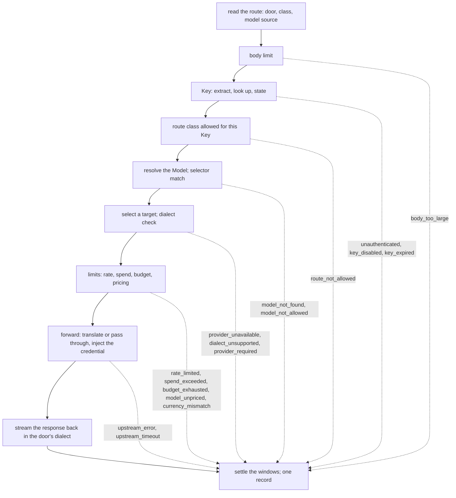

# Request path

## Overview

The data plane is four doors, one per dialect: `/openai`, `/anthropic`,
`/gemini`, `/lux`. A caller sets its SDK's base URL to a door and
presents a Key; the path under the door is the dialect's own API. The
gateway authenticates the Key, resolves the model the request names to
a Model and a target, checks the Key's limits, and forwards the request
to the target's provider with that provider's credential, translating
between dialects when the door's and the target's differ and passing
bytes through when they are the same. Every decision before the
provider is made from desired state and the counters; the hot path
dials no webhook and no issuer ([[001-architecture]], invariant 3).
Every request, refused, failed, or served, ends in one usage record
([[009-usage-and-metering]]).

This spec owns the doors and their route table, the pipeline and the
order of its refusals, the wire rules of forwarding, translation, and
streaming, the error envelope per dialect, and the `gateway` package's
interface to what surrounds it. Target selection is
[[008-routing-and-models]]'s, the limit arithmetic
[[007-keys-and-limits]]'s, the provider client [[005-providers]]'s.

## Current state

Nothing is built. The hosted gateway this design is extracted from has
a per-provider passthrough route where the path names the provider,
and a separate compatibility surface where the path names the dialect
and the body's model decides the provider, with two code paths, two
error shapes, and two ways of reading usage. This design has one path
and the door names the dialect only.

## Design

### Doors and routes

A door is a path prefix and a dialect. Under it, the route table names
what the gateway does with each path. Three route classes:

- A **translated** route is one `llmdialect` models: the body is decoded
  to the intermediate representation and encoded for the target, in
  both directions, event by event when streaming.
- A **model** route names a model but has no codec: the gateway resolves
  the Model and forwards the bytes to a target of the same dialect,
  reading usage from the response where the dialect reports it.
- An **opaque** route names no model: files, batches, audio, images,
  fine-tuning, and any path not in the table. The gateway forwards it
  to one provider of the door's dialect, chosen as below, only for a
  Key with `passthrough: true`, and records a request it cannot price.

| Door | Route | Class | Model from |
|---|---|---|---|
| `/openai` | `POST /v1/chat/completions` | translated, `openaichat` | body `model` |
| `/openai` | `POST /v1/responses` | translated, `openairesp` | body `model` |
| `/openai` | `POST /v1/embeddings` | model | body `model` |
| `/openai` | `GET /v1/models`, `GET /v1/models/{model}` | served by the gateway: the Models the Key may use, in this dialect's list shape; never forwarded | path |
| `/openai` | any other path under `/v1/` | opaque | none |
| `/anthropic` | `POST /v1/messages` | translated, `anthropic` | body `model` |
| `/anthropic` | `POST /v1/messages/count_tokens` | model | body `model` |
| `/anthropic` | `GET /v1/models`, `GET /v1/models/{model}` | served by the gateway | path |
| `/anthropic` | any other path under `/v1/` | opaque | none |
| `/gemini` | `POST /v1beta/models/{model}:generateContent`, `:streamGenerateContent`, `:countTokens`, `:embedContent` | model | path |
| `/gemini` | `GET /v1beta/models`, `GET /v1beta/models/{model}` | served by the gateway | path |
| `/gemini` | any other path under `/v1beta/` or `/v1/` | opaque | none |
| `/lux` | `POST /v1/generate` | translated, `lux` | body `model` |
| `/lux` | `GET /v1/models`, `GET /v1/models/{model}` | served by the gateway | path |

A path under a door that is not under the dialect's version prefix, a
method the table does not list for a translated or model route, and
anything outside the four doors is `not_found`, 404, in the door's
envelope. `GET /v1/models` on a door lists the Models whose names match
one of the Key's selectors now and whose `status.available` is true,
so an SDK's model picker shows what the Key can call; a declared and a
discovered Model appear the same way.

### The Key on a door

The credential is read from the first of these that is present, in
this order: `Authorization: Bearer <value>`, `x-api-key`,
`x-goog-api-key`, the query parameter `key`. Every door accepts every
form, because each SDK has its own habit and a caller should not have
to know which door likes which header. A value that does not begin
with `lux_` is `unauthenticated`, 401, whatever it is: a provider's own
key pasted by mistake, or an issuer token, never falls through to
anything ([[006-identity]]). The query parameter and every credential
header the caller sent are removed before forwarding; the provider sees
only its own credential.

The Key is looked up by the SHA-256 of its value, through the cache of
[[007-keys-and-limits]]; an unknown hash is `unauthenticated`. The
gateway never compares values, never stores one, and never logs one:
the record and every log line carry `status.prefix` only.

### The pipeline

Each stage is total before the next begins, and each refusal is a fixed
code raised before any byte reaches a provider, so a refused request
costs nothing upstream and the order below is the order a caller can
rely on.



1. Route: the door, the class, and where the model name comes from,
   from the table. An unknown route is `not_found`.
2. Body: a request body above `LUX_MAX_BODY_BYTES` (default `64Mi`) is
   `body_too_large`, 413, read no further. A translated or model route
   reads the whole body before forwarding, because it decodes it or
   reads `model` from it; an opaque route streams the body through.
3. Key: extracted and looked up as above. `status.state` `Disabled` is
   `key_disabled`; `Expired` is `key_expired`; both 403. `Exhausted` is
   decided at stage 6 with the current window, not from the cached
   state, so a window that has reset serves again at once.
4. Class: an opaque route for a Key without `passthrough` is
   `route_not_allowed`, 403.
5. Model: the name from the body or the path is resolved against the
   catalog by exact name; an unknown name is `model_not_found`, 404. A
   name that matches none of the Key's selectors under
   `manifest.Match` is `model_not_allowed`, 403. An opaque route skips
   this stage.
6. Target: [[008-routing-and-models]] selects a target, or answers
   `provider_unavailable`, 503, when none is reachable. The door's
   dialect against the target's decides the mode: equal is passthrough;
   a translated route with a codec on both sides is translation; a
   model route across dialects, or a `gemini` door to any other
   dialect, is `dialect_unsupported`, 400. An opaque route chooses its
   provider from the `Lux-Provider` header, by name, a Provider of the
   door's dialect that one of the Key's selectors reaches through some
   Model; without the header, the one such Provider when there is
   exactly one; otherwise `provider_required`, 400.
7. Limits: [[007-keys-and-limits]] answers in this order: the Key's
   rate windows, `rate_limited`, 429 with `Retry-After`; the Model's
   pricing against the Key's `allowUnpriced` under a spend limit or a
   Budget, `model_unpriced`, 403, and the same for an opaque route,
   which is unpriced by construction; the Budget's currency against the
   Model's, `currency_mismatch`, 400; the Key's spend window,
   `spend_exceeded`, 429; the Budget's window, `budget_exhausted`, 429;
   each with `Retry-After` naming the window's reset.
8. Forward: the outbound request is built as below and sent through the
   provider's client ([[005-providers]]) within the Provider's
   `timeout`. A retryable failure before any response byte reached the
   caller hands the request to the next target ([[008-routing-and-models]]).
   The last failure is `upstream_error`, 502, with the upstream status
   and its body's first 1 KiB in the developer detail, or
   `upstream_timeout`, 504.
9. Respond: headers, then the body or the stream, in the door's
   dialect.
10. Settle: the windows are debited with the measured tokens and cost,
    and one record is written, whatever happened above
    ([[009-usage-and-metering]]).

### What is forwarded

The outbound request toward the target's `baseURL`:

- The path is the target dialect's for the operation: on passthrough
  the caller's path relative to the door, joined to `baseURL`'s path;
  on translation the target dialect's route for the same operation
  (`/v1/messages` becomes `/chat/completions` under an `openai` base
  URL). A `gemini` model route has the upstream model name substituted
  into the path.
- The body's model name is rewritten to the target's upstream name;
  the response's model field carries the Model's name back, so a
  caller sees the name it asked for whatever served it.
- The credential is injected per the Provider's `credential.header`
  and `scheme`. The caller's `Authorization`, `x-api-key`,
  `x-goog-api-key`, `Proxy-Authorization`, and `Cookie` are removed,
  and the query parameter `key` is dropped.
- The Provider's `headers` are added; the credential header wins over a
  static header of the same name.
- Hop-by-hop headers are removed in both directions: `Connection`,
  `Keep-Alive`, `Proxy-Connection`, `Transfer-Encoding`, `TE`,
  `Trailer`, `Upgrade`, and every header `Connection` names. `Host` is
  the base URL's. `User-Agent` is `luxd/<version>`. Every `X-Forwarded-*`
  and `Forwarded` header from the caller is dropped; the gateway adds
  none, so a provider learns nothing about the caller's address.
- `Accept-Encoding` is removed on translated and model routes, so the
  upstream answers uncompressed and the gateway can decode usage and
  events; it is kept on opaque routes, which the gateway does not read.
- Dialect-specific request headers the caller sent, `anthropic-version`,
  `anthropic-beta`, `OpenAI-Beta`, `OpenAI-Organization`,
  `OpenAI-Project`, and `x-goog-api-client`, are forwarded on
  passthrough and dropped on translation with a loss entry naming the
  header; a translated request toward an `anthropic` target carries
  the `anthropic-version` the codec targets.
- `Lux-Request-Id` is set on the outbound request and on the response
  to the caller: `req_` and a ULID, the id of the record. A caller's
  `Lux-Request-Id` is ignored, never trusted as an identifier.
- Redirects are not followed ([[005-providers]]).

Translation is `latere.ai/x/pkg/llmdialect`'s: the door's dialect is
the `Frontend`, the target's the `Backend`, one `Translator` per
request. Every field the target cannot represent is in the request's
loss report; the gateway returns it as the `Lux-Loss` response header,
a comma separated list of field paths, and in the `lux` dialect's body
where that dialect has a member for it. Nothing is dropped silently
([[001-architecture]], invariant 6). A `lux` door is translated toward
every target, because the lux dialect is the intermediate
representation on the wire; a `gemini` door is never translated,
because there is no codec, and the table above says so.

Passthrough is byte for byte: the request body the caller sent, minus
nothing, plus nothing, except the model name rewrite when the Model's
name and the target's upstream name differ, which is a JSON field
replacement on a body the gateway has already read; when the two names
are equal the body is not touched at all. `TestSameDialectSameBytes`
holds a same-name passthrough to identity.

### Streaming

A request whose dialect marks it streaming (`stream: true`, the
`:streamGenerateContent` path, `Accept: text/event-stream` on the lux
door) is answered with `Content-Type: text/event-stream`, headers
flushed as soon as the upstream's headers arrive, and every event
flushed as it is received. On passthrough the bytes are relayed as
read, in chunks of at most 64 KiB, without waiting for event
boundaries. On translation each upstream event is decoded with the
target dialect's `EventDecoder` and encoded with the door's
`EventEncoder`; the final usage event of each dialect is what the
record's tokens come from ([[009-usage-and-metering]]).

The caller disconnecting cancels the upstream request at once; the
record says `failed` with `client_closed` and the tokens counted up to
that event. An upstream failure after the first response byte is never
retried on another target, because the caller has already seen part of
one answer; the stream ends with the dialect's error event and the
record says `failed` with `upstream_error`. A non-streaming response is
read whole, up to the Provider's `timeout`, then written.

`Content-Length` is set when the gateway holds the whole body and
omitted, with chunked encoding, when it streams.

### The error envelope

A refusal or failure is answered in the door's own error shape, so an
SDK raises the exception its users know, with the gateway's code
carried where that shape has a code member and in the `Lux-Error`
response header always:

| Door | Body |
|---|---|
| `/openai` | `{"error": {"message": "<user sentence>", "type": "<lux code>", "code": "<lux code>", "param": null}}` |
| `/anthropic` | `{"type": "error", "error": {"type": "<lux code>", "message": "<user sentence>"}}` |
| `/gemini` | `{"error": {"code": <http status>, "message": "<user sentence>", "status": "<lux code>"}}` |
| `/lux` | the envelope of `latere.ai/x/pkg/httpjson`: `{"code", "message", "details"}` |

`message` is the fixed user sentence of the code, one per code, owned
with the HTTP status by [[011-api]]'s error table; the developer detail
(the upstream status and body excerpt, the window's reset time, the
selector that did not match) is in `Lux-Error-Detail` on every door and
in `details` on the lux door, never in `message`. An upstream's own
error body on `upstream_error` is not relayed as the caller's body,
because it names the provider and may name the upstream model; it is
the developer detail, truncated.

| Code | Status | When |
|---|---|---|
| `not_found` | 404 | a path or method not in the route table |
| `body_too_large` | 413 | the body exceeds `LUX_MAX_BODY_BYTES` |
| `unauthenticated` | 401 | no credential, a credential not beginning with `lux_`, or an unknown hash |
| `key_disabled` | 403 | `spec.disabled` |
| `key_expired` | 403 | `status.expiresAt` has passed |
| `route_not_allowed` | 403 | an opaque route without `passthrough` |
| `model_not_found` | 404 | no Model of that name |
| `model_not_allowed` | 403 | no selector matches |
| `provider_unavailable` | 503 | no reachable target, or every target failed before a response byte |
| `dialect_unsupported` | 400 | the door and the target cannot be bridged |
| `provider_required` | 400 | an opaque route with no `Lux-Provider` and more than one candidate |
| `rate_limited` | 429 | a rate window is full; `Retry-After` |
| `model_unpriced` | 403 | an unpriced Model or an opaque route under a spend limit or a Budget without `allowUnpriced` |
| `currency_mismatch` | 400 | the Budget's currency is not the Model's pricing currency |
| `spend_exceeded` | 429 | the Key's spend window is full; `Retry-After` |
| `budget_exhausted` | 429 | a hard Budget's window is full; `Retry-After` |
| `upstream_error` | 502 | the last target answered an error, or a stream failed after its first byte |
| `upstream_timeout` | 504 | the Provider's `timeout` passed |

### The gateway package

```go
// Handler is the data plane: one http.Handler mounted at the four
// doors. It computes and drives; it holds no store, no identity, and
// no HTTP server of its own.
type Handler struct{ /* unexported */ }

func New(o Options) *Handler
func (h *Handler) ServeHTTP(w http.ResponseWriter, r *http.Request)

type Options struct {
	Keys        KeyLookup        // the Key by the SHA-256 of its value, resolved, cached (007)
	Catalog     Catalog          // Models and Providers by name, without credential values
	Credentials CredentialSource // a Provider's credential value, decrypted for this request (005)
	Router      Router           // target selection and the per-target circuits (008)
	Limiter     Limiter          // the windows: reserve before, settle after (007)
	Recorder    Recorder         // one record per request (009)
	Clients     ClientSource     // the upstream client per Provider (005)
	Health      HealthObserver   // outcomes per Provider for passive health (005)
	Version     string           // the User-Agent
	MaxBodyBytes int64
	Now         func() time.Time
	NewID       func() string    // req_ ids
}
```

Each interface is a few methods and is satisfied by `internal/serve`
from the store and the clients, or by a platform from its own. The
package imports `latere.ai/x/pkg/llmdialect` and its dialects,
`manifest/v1`, `manifest` for `Match`, `metering`, and the standard
library; nothing under `internal/`, no database driver, no identity
library. It dials only through `ClientSource`, which the importer
constructs toward the providers ([[001-architecture]], invariant 9).

### Configuration

| Variable | Required | Default | Purpose |
|---|---|---|---|
| `LUX_UPSTREAM_TIMEOUT` | no | `10m` | the `Defaults.Timeout` a Provider without `spec.timeout` gets: one request including its stream |
| `LUX_MAX_BODY_BYTES` | no | `64Mi` | the largest data plane request body accepted |

## Not in this spec

Target selection, fallback, and circuits ([[008-routing-and-models]]);
the window arithmetic and the Key cache ([[007-keys-and-limits]]); the
upstream client, credential decryption, and health
([[005-providers]]); the record ([[009-usage-and-metering]]); the
control plane and the fixed sentences per code ([[011-api]]); the stub
providers a test runs against ([[015-test-stubs-and-tiers]]); the
tunnel that makes a local runtime a Provider ([[013-tunnelled-runtimes]]).

## Acceptance criteria

| Criterion | Test that proves it | State |
|---|---|---|
| Every row of the route table dispatches to its class and reads the model from where the table says; every path outside the table is `not_found` in the door's envelope | `TestRouteTable`, table-driven over every row and ten off-table paths | not built |
| A request through the `/openai` door to an `openai` target with equal names arrives at the stub provider byte-identical, with only the credential, `Host`, `User-Agent`, `Lux-Request-Id`, and the hop-by-hop and `Accept-Encoding` headers changed | `TestSameDialectSameBytes` | not built |
| A request through the `/anthropic` door to an `openai` target is translated, and a field the target cannot represent appears in `Lux-Loss` and in the record | `TestTranslationReportsLoss` | not built |
| A `gemini` door to a non-gemini target and a model route across dialects are `dialect_unsupported`; a `lux` door reaches every dialect | `TestDialectBridging`, table-driven over the door and target matrix | not built |
| Each credential form is accepted on each door in the stated order; the query parameter and every caller credential header are absent from the outbound request; a non-`lux_` value and an issuer token are `unauthenticated` | `TestKeyExtractionOrder`, `TestCallerCredentialsNeverForwarded`, `TestDoorsTakeKeysOnly` | not built |
| Each stage's refusal fires with its code and status before the stub provider sees a request, and in the pipeline's order when two conditions hold at once | `TestRefusalOrder`, table-driven over every code | not built |
| An opaque route is `route_not_allowed` without `passthrough`, reaches the named `Lux-Provider` with it, picks the sole candidate without the header, and is `provider_required` with two candidates | `TestOpaqueRoutes` | not built |
| `GET /v1/models` on each door lists exactly the available Models the Key's selectors match, in that dialect's shape, and forwards nothing | `TestModelsListIsTheKeysView` | not built |
| The body's model name is rewritten to the upstream name on the way out and the Model's name comes back in the response, for each dialect | `TestModelNameRewrite` | not built |
| A streamed passthrough relays events as they arrive with headers flushed before the first event; a streamed translation re-encodes each event; the record's tokens come from the final usage event | `TestStreamingPassthrough`, `TestStreamingTranslation` | not built |
| A caller disconnect cancels the upstream request within 100 ms and the record says `client_closed`; an upstream failure after the first byte is not retried and ends the stream with the dialect's error event | `TestClientDisconnectCancelsUpstream`, `TestNoRetryAfterFirstByte` | not built |
| Every code renders in each door's envelope with the fixed sentence, the code in the shape's code member and in `Lux-Error`, and the detail only in `Lux-Error-Detail`; an upstream error body never appears in a caller's body | `TestErrorEnvelopePerDialect`, `TestUpstreamBodyIsDetailOnly` | not built |
| A body one byte over the limit is `body_too_large` with nothing forwarded | `TestBodyLimit` | not built |
| Every response, refused or served, carries `Lux-Request-Id` matching its record's id | `TestRequestIDOnEveryResponse` | not built |
| During one thousand requests the stub authorizer and issuer receive zero calls; `gateway` imports nothing under `internal/` | [[001-architecture]]'s `TestHotPathDialsNoWebhook`, `TestRootPackagesDialNothing` | not built |
