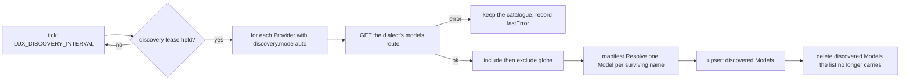
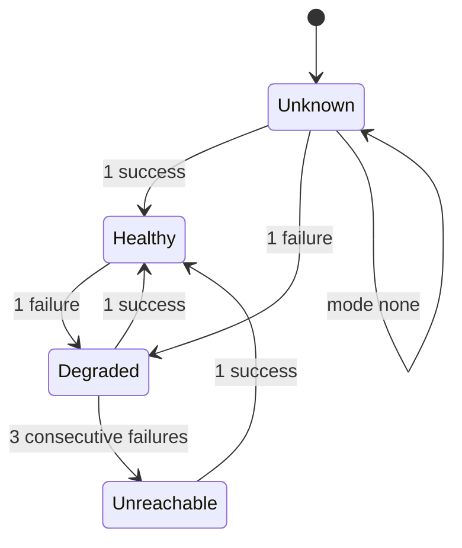

# Providers

## Overview

A `Provider` is one upstream: a dialect, a base URL, the credential Lux
holds for it, and two background jobs that keep the gateway's picture of
it current. This spec owns four things. The routes each dialect serves,
so a contributor knows which paths a door offers and which of them
`latere.ai/x/pkg/llmdialect` models. Credential custody: how a value is
sealed, where the ciphertext lives, when it is opened, and how a key is
rotated. Discovery: how a Provider's own model list becomes `Model`
objects through the same `manifest.Resolve` every other surface uses.
Health: how a Provider is probed or observed, the states it moves
through, and what that signal means to target selection. And the HTTP
client the gateway dials an upstream with, which is the one place
[[001-architecture]]'s invariant 2 is enforced in code.

What happens to a request once a target is chosen is
[[008-routing-and-models]]'s; the door handler and its error table are
[[004-request-path]]'s. This spec ends at the edge of the socket.

## Current state

Nothing is built. The hosted gateway this design is extracted from has
one Go type per upstream with its own HTTP client, its own model list
parser, and its own credential lookup, so a timeout fix lands three
times and a credential reaches the outbound request through three code
paths. Credentials sit in a column encrypted under one process-wide key
with no rotation path. Health is inferred from a counter that no
request path reads.

## Design

### Dialects and the routes they serve

A dialect names the wire API an upstream speaks and the door a caller
uses ([[003-manifest-contract]]). [[004-request-path]] owns the door
table and the three route classes; this table is the upstream side of
the same operations: the path under a Provider's `baseURL` and the
codec, if any, that `latere.ai/x/pkg/llmdialect` carries for it.

| Dialect | Operation | Upstream path under `baseURL` | Class | Codec |
|---|---|---|---|---|
| `openai` | chat completions | `/chat/completions` | translated | `llmdialect/openaichat` |
| `openai` | responses | `/responses` | translated | `llmdialect/openairesp` |
| `openai` | embeddings | `/embeddings` | model | none |
| `openai` | model list | `/models` | jobs only | none |
| `anthropic` | messages | `/messages` | translated | `llmdialect/anthropic` |
| `anthropic` | count tokens | `/messages/count_tokens` | model | none |
| `anthropic` | model list | `/models` | jobs only | none |
| `gemini` | generate, stream, count, embed | `/models/{model}:generateContent`, `:streamGenerateContent`, `:countTokens`, `:embedContent` | model | none |
| `gemini` | model list | `/models` | jobs only | none |
| `lux` | generate | `/generate` | translated | `llmdialect/lux` |
| `lux` | model list | `/models` | jobs only | none |

A translated route can be bridged between any two dialects that both
carry a codec for it. A model route resolves a Model and reaches a
target of the door's own dialect only. Every other path is an opaque
route, which no dialect table can enumerate and which
[[004-request-path]] forwards to one Provider of the door's dialect for
a Key with `passthrough: true`.

A model list route is reached by the discovery and health jobs of this
spec and by nothing else. A caller's `GET /v1/models` on a door is
answered by the gateway from the Models the Key may use, so it never
becomes an upstream call ([[004-request-path]]).

`llmdialect` carries four wire dialects: `anthropic-messages`,
`openai-chat`, `openai-responses`, and `lux`. The `openai` manifest
dialect therefore covers two of them, one per route, and the `gemini`
manifest dialect covers none, which is why every `gemini` row has no
codec.

### Credential custody

A `Provider.spec.credential.value` is sealed the moment `Resolve`
returns and is never written anywhere in the clear.

| Element | Size | Algorithm |
|---|---|---|
| data key | 32 bytes, random per credential and per write | none: it is key material |
| value ciphertext | the value plus 16 bytes | AES-256-GCM under the data key, 12-byte random nonce |
| wrapped data key | 32 plus 16 bytes | AES-256-GCM under the KEK, 12-byte random nonce |
| additional data on both | | `provider id` and the credential version, so a row copied onto another Provider fails to open |

`internal/secrets` holds the key encryption keys and owns `Seal` and
`Open`; `internal/store` holds the four byte columns and returns them
as ciphertext ([[010-state]]); `gateway` receives a plaintext only from
the `Credentials` interface its importer satisfies, only for the
Provider a chosen target names, and only for the life of one outbound
request ([[001-architecture]]). The value is redacted by type, not by
discipline: it is decoded into a field the JSON and YAML encoders skip
([[003-manifest-contract]]), so no object that carries it can be
serialized into a response, an event, a log line, or a request log
record.

In file mode a Provider names `credential.valueFrom.env` instead, and
the value is read from the process environment at start and held in
memory for the life of the process. Nothing is sealed and nothing is
stored, because there is nowhere to store it ([[010-state]]).

### Configuration

| Variable | Default | Rule |
|---|---|---|
| `LUX_SECRETS_KEK` | none | one or more 32-byte keys, base64, comma separated; the first wraps every new data key, every key is tried to open one |
| `LUX_UPSTREAM_ALLOW_PRIVATE` | `false` | sets `Options.AllowPrivateUpstreams` and admits a private destination at dial |
| `LUX_DISCOVERY_INTERVAL` | `1h` | at least `1m` |
| `LUX_HEALTH_INTERVAL` | `30s` | at least `5s` |

The list shape of `LUX_SECRETS_KEK` is what rotation needs: a re-wrap
reads under the old key and writes under the new one, so both are live
in one process for the length of the rotation. A single-key variable
would make rotation impossible without a second variable naming the
same thing.

`luxd serve` refuses to start without `LUX_SECRETS_KEK` in every mode
but file mode, and reports which of the listed keys failed to decode to
32 bytes. It then opens the wrapped data key, not the value, of every
stored credential and refuses to start naming the Providers whose data
key no key in the list opens, so a deployment carrying the wrong key
fails at start rather than on the first request through a door.

### Rotation

`luxd rewrap` is the third role of the server binary, its own package
under `internal/rewrap` with its own dependency allow list. It reads
`LUX_SECRETS_KEK` and `LUX_DB_URL`, and for every credential row opens
the wrapped data key under whichever listed key opens it and re-wraps
it under the first. The value ciphertext is never touched, never
decrypted, and never re-encrypted, which is why the two are separate
columns. The run is idempotent and resumable: a row already wrapped
under the first key is skipped, so an interrupted run is repeated
rather than repaired. The operator's sequence is deploy with
`LUX_SECRETS_KEK=new,old`, run `luxd rewrap`, deploy with
`LUX_SECRETS_KEK=new`.

A role rather than a route because a re-wrap touches every credential
row, needs no caller's identity, and has no decision an authorizer
could make about it.

### Discovery

The job runs on one replica at a time, under the store lease named
`discovery` ([[010-state]]), because a list that two replicas resolve
concurrently would race on the same object versions to write the same
result. The tick is `LUX_DISCOVERY_INTERVAL` with up to ten percent
jitter, and a Provider is also discovered once immediately after it is
created or its `baseURL` or credential changes.

| Dialect | Models route | Names read from |
|---|---|---|
| `openai` | `GET {baseURL}/models` | `data[].id` |
| `anthropic` | `GET {baseURL}/models` | `data[].id` |
| `gemini` | `GET {baseURL}/models` | `models[].name`, with the leading `models/` removed |
| `lux` | `GET {baseURL}/models` | `data[].id` |

Each surviving upstream name becomes a Model named
`<provider name>/<upstream name>`, resolved by `manifest.Resolve` under
`Options{Actor: {Subject: provider.status.owner}}` with the one target,
`weight` 100, `priority` 0, `fallback` `never`, no pricing, and
`status.source` `discovered`, exactly as [[003-manifest-contract]]
states. Discovery calls the same function the API calls, so a name the
schema refuses is refused here too and is recorded in
`Provider.status.warnings` rather than stored.

The rules that make the catalogue safe to recompute:

- A successful list is authoritative for that Provider's discovered
  Models and for nothing else. Discovered Models of the Provider whose
  upstream name the list no longer carries are deleted.
- A failed or empty list changes no object. The previous catalogue
  stands, `status.discovered.at` is unchanged, and the failure is
  `status.health.lastError`. An upstream that answers 500 must not
  empty a caller's model list.
- A Model whose `status.source` is `declared` is never written and
  never deleted by discovery, whatever its name. A declared Model
  shadows the discovered one of the same name; deleting the declared
  one lets the next run restore it.
- `discovery.mode: none` lists nothing and deletes nothing, so turning
  discovery off leaves the Models it already created until an operator
  deletes them.

### Health

`health.mode` selects the source of the state published to
`Provider.status.health`. Every replica additionally keeps its own view
and takes the worse of the two, over the order `Healthy`, `Degraded`,
`Unreachable`, with `Unknown` meaning no information yet. A replica
that is failing against a Provider acts on that immediately; a replica
that is not never overrides the published state upward.

| Mode | Published by | Failure is | Success is |
|---|---|---|---|
| `probe` | the replica holding the `health` lease, every `LUX_HEALTH_INTERVAL`, calling the dialect's models route with a 5 second budget | a transport error, a timeout, or a 5xx | any other complete response, including a 4xx: the upstream answered |
| `passive` | the replica holding the `health` lease, from its own data plane outcomes | a transport error, a timeout, or a 5xx from the upstream | any other complete response |
| any mode, `tunnel: true` | the tunnel registry ([[013-tunnelled-runtimes]]): a Provider with no live session is `Unreachable` whatever the mode says, and the mode's own signal applies while one is open | a missing or expired registry row | a live row |
| `none` | nobody; the state is `Unknown` forever | nothing | nothing |

The thresholds are exact: one failure moves `Healthy` to `Degraded`,
the third consecutive failure moves `Degraded` to `Unreachable`, and
one success returns the state to `Healthy` and resets the counter.
`status.health.since` is stamped on every change of state and
`lastProbeAt` on every probe.

Under `probe` the counter is fed by probes and by traffic both, so a
Provider that fails ten requests inside one probe interval is
`Unreachable` before the next probe. Under `passive` there is no probe
to recover with; a Provider marked `Unreachable` is left out of
selection and is re-admitted by the per-target circuit's half-open
attempt succeeding ([[008-routing-and-models]]), which is the only
traffic it can get.

What the signal means:

- A Provider that is `Unreachable` takes every target on it out of
  selection. `Degraded` and `Unknown` take nothing out.
- `Model.status.available` is true when at least one of the Model's
  targets names a Provider that is not `Unreachable`, and
  `Model.status.targets[].health` is that Provider's published state.
  Both are written by the replica holding the `health` lease.
- `health.mode: none` never makes a target unavailable, which is what
  an upstream with no model list and no error convention needs.

### The upstream client

One `*http.Client` per Provider, built when the Provider is loaded and
rebuilt when `baseURL`, `timeout`, or `concurrency` changes.

| Property | Value | Reason |
|---|---|---|
| `Proxy` | nil | a proxy variable in the environment would move a credential-bearing request to a host no manifest names, and terminate its TLS; an operator that needs an egress proxy declares it as the `baseURL` |
| `CheckRedirect` | `http.ErrUseLastResponse` | a 3xx is an upstream asking for the credential at another location; the response is returned to the caller as `upstream_error` instead |
| `TLSClientConfig` | minimum TLS 1.2, verification on, no field turns it off | a Provider is a public host by the upstream host rule; a local runtime with its own certificate is [[013-tunnelled-runtimes]]'s case |
| `DialContext` | refuses a resolved loopback, link-local, unique-local, or private address unless `LUX_UPSTREAM_ALLOW_PRIVATE` | the parse-time rule of [[003-manifest-contract]] is on the name; this is on the address, which is what closes a public name that resolves inward |
| `MaxIdleConnsPerHost` | 32, `IdleConnTimeout` 90s, HTTP/2 attempted | one pool per Provider, so a slow upstream cannot starve another's connections |
| deadline | `Provider.spec.timeout`, defaulted from `LUX_UPSTREAM_TIMEOUT`, over the whole request including its stream | a stream that stalls is cut rather than held |
| concurrency | a semaphore of `spec.concurrency` per Provider per replica, `0` is no limit | a wait that outlives the request's own deadline is `provider_unavailable` |

The outbound header set is [[004-request-path]]'s, which owns what is
forwarded and what is removed. Two of its rules are this spec's,
because they are custody rather than transport: the credential header
is written last from the opened value under `credential.scheme`, so it
wins over both the caller's headers and the Provider's static
`headers`; and no `X-Forwarded-*` or `Forwarded` header is ever added,
because the caller's network location is not the provider's business
and a gateway that forwards it makes itself a tracking relay.

Bodies stream in both directions and are never buffered whole. A
translated request is encoded from the intermediate representation, so
its length is known; an unmodelled route's body is forwarded with the
caller's `Content-Length` when it had one and chunked otherwise.

### Provider status

| Field | Written by | When |
|---|---|---|
| `status.id`, `status.owner`, `status.createdAt` | the API | at create |
| `status.updatedAt`, `status.warnings` | the API | at every apply |
| `status.credential` | the API | at create and at every apply that carries a value; `version` counts values, not wraps, so a re-wrap leaves it alone |
| `status.health` | the `health` lease holder | at every change of state, and `lastProbeAt` at every probe |
| `status.discovered` | the `discovery` lease holder | at every successful list |

Deleting a Provider that a declared Model still targets is refused with
`provider_in_use`, 409 ([[011-api]]), so a Model never points at
nothing; the operator edits the Model's targets first. A delete removes
the Provider's discovered Models in the same transaction, revokes its
client, and drops its credential ciphertext; a request in flight toward
it finishes or fails on its own timeout.

### `luxd check`

| Line | Passes when |
|---|---|
| `secrets kek` | `LUX_SECRETS_KEK` is set and every listed key decodes to 32 bytes |
| `credentials` | every stored credential's wrapped data key opens under one of the listed keys; the line names the count and the version, never a value |
| `providers` | every Provider's `baseURL` resolves, its address is admitted by the private-address rule, and its models route answers inside the health budget; one row per Provider with its state |
| `dialects` | every Provider's dialect has the codec its Models' routes need, or every Model on it is reachable only through an unmodelled route |

## Not in this spec

The door handlers, the request path, and the data plane error table
([[004-request-path]]); which target a request goes to and what happens
when one fails ([[008-routing-and-models]]); the schema of `Provider`
([[003-manifest-contract]]); the rows, the leases, and the file mode
([[010-state]]); pricing and the usage record
([[009-usage-and-metering]]); a runtime that attaches itself as a
Provider ([[013-tunnelled-runtimes]]).

## Acceptance criteria

| Criterion | Test that proves it | State |
|---|---|---|
| A canary credential appears in no response body, event, log line, or request log record, and reaches the stub provider's headers only on requests routed to that Provider | `TestProviderCredentialNeverLeavesTheGateway` | not built |
| A stored credential row holds no plaintext under any key; the value ciphertext and the wrapped data key are separate columns; the additional data binds both to the provider id | `TestCredentialRowsAreSealed` | not built |
| `luxd rewrap` under `new,old` re-wraps every data key, leaves every value ciphertext byte unchanged, opens under `new` alone afterwards, and is a no-op on a second run | `TestRewrapUnderANewKEK` | not built |
| `luxd serve` refuses to start with `LUX_SECRETS_KEK` absent, with a key that is not 32 bytes, and with a key that opens no stored credential, naming the failing Providers | `TestStartupRequiresAWorkingKEK` | not built |
| A successful list adds new discovered Models, removes those the upstream dropped, and applies `include` before `exclude` | `TestDiscoveryAddsAndRemoves` | not built |
| A failed, empty, or unparseable list changes no object and records `lastError` | `TestDiscoveryFailureKeepsTheCatalogue` | not built |
| Discovery never writes or deletes a Model whose source is `declared`; a declared Model shadows the discovered one and deleting it lets the next run restore it | `TestDeclaredModelSurvivesDiscovery` | not built |
| Two replicas with the lease contended run one list per interval between them | `TestDiscoveryRunsOnOneReplica` | not built |
| Every transition in the state diagram fires at its threshold in both modes, and a 4xx is a success while a 5xx is a failure | `TestHealthTransitions`, table-driven | not built |
| A replica's own failures downgrade its view below the published state and never raise it above | `TestLocalHealthOnlyDowngrades` | not built |
| An `Unreachable` Provider's targets leave selection, `Degraded` and `Unknown` do not, and `health.mode: none` never makes a target unavailable | `TestUnreachableLeavesSelection` | not built |
| A caller-sent copy of the credential header and a Provider static header of the same name are both beaten by the injected credential; no `X-Forwarded-*` or `Forwarded` header reaches the upstream | `TestCredentialHeaderWins`, `TestNoForwardedHeaders` | not built |
| With `HTTPS_PROXY` set in the environment the request still reaches the Provider's host directly | `TestNoProxyEnvironmentHonoured` | not built |
| A 302 from the stub provider is not followed and reaches the caller as `upstream_error` | `TestRedirectNotFollowed` | not built |
| A public name resolving to a private address is refused at dial without `LUX_UPSTREAM_ALLOW_PRIVATE` and admitted with it | `TestPrivateAddressRefusedAtDial` | not built |
| `concurrency: 2` holds a third request until one finishes, and a wait past the request deadline is `provider_unavailable` | `TestConcurrencyLimitsInFlight` | not built |
| Every operation in the dialect table reaches the upstream path the table names, and a model list route is reached by the jobs alone | `TestUpstreamPaths`, table-driven | not built |
