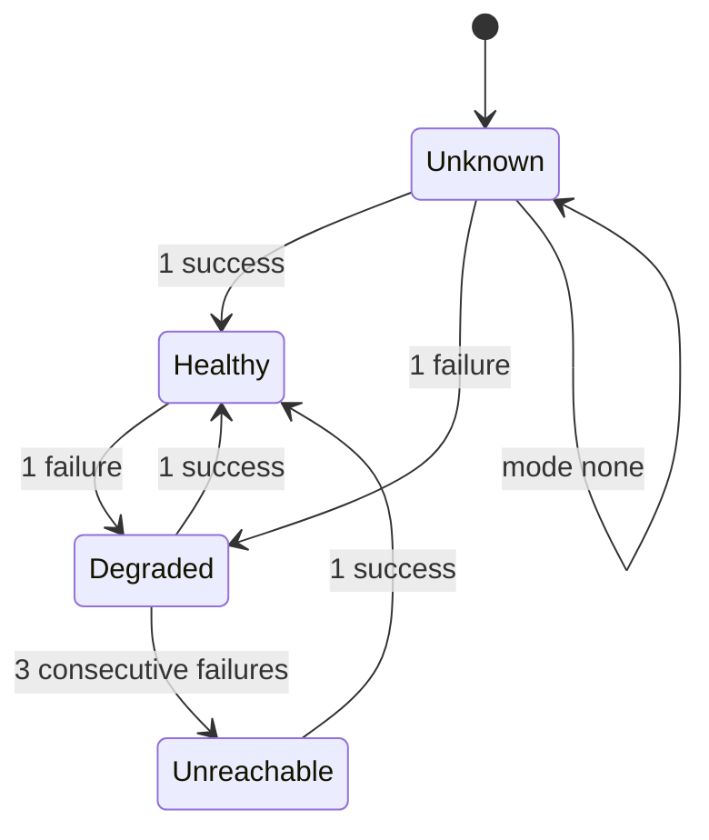

# Providers

## Overview

A `Provider` is one upstream: a dialect, a base URL, the credential Lux
holds for it, and two background jobs that keep the gateway's picture of
it current. This spec owns four things. The routes each dialect serves,
so a contributor knows which paths a door offers and which of them
`latere.ai/x/pkg/llmdialect` models. Credential custody: how a value is
sealed, where the ciphertext lives, when it is opened, and how a key is
rotated. Discovery: how a Provider's own model list becomes `Model`
objects through the same `manifest.Resolve` every other surface uses.
Health: how a Provider is probed or observed, the states it moves
through, and what that signal means to target selection. And the HTTP
client the gateway dials an upstream with, which is the one place
[[001-architecture]]'s invariant 2 is enforced in code.

What happens to a request once a target is chosen is
[[008-routing-and-models]]'s; the door handler and its error table are
[[004-request-path]]'s. This spec ends at the edge of the socket.

## Current state

Nothing is built. The hosted gateway this design is extracted from has
one Go type per upstream with its own HTTP client, its own model list
parser, and its own credential lookup, so a timeout fix lands three
times and a credential reaches the outbound request through three code
paths. Credentials sit in a column encrypted under one process-wide key
with no rotation path. Health is inferred from a counter that no
request path reads.

## Design

### Dialects and the routes they serve

A dialect names the wire API an upstream speaks and the door a caller
uses ([[003-manifest-contract]]). [[004-request-path]] owns the door
table and the three route classes; this table is the upstream side of
the same operations: the path under a Provider's `baseURL` and the
codec, if any, that `latere.ai/x/pkg/llmdialect` carries for it.

| Dialect | Operation | Upstream path under `baseURL` | Class | Codec |
|---|---|---|---|---|
| `openai` | chat completions | `/chat/completions` | translated | `llmdialect/openaichat` |
| `openai` | responses | `/responses` | translated | `llmdialect/openairesp` |
| `openai` | embeddings | `/embeddings` | model | none |
| `openai` | model list | `/models` | jobs only | none |
| `anthropic` | messages | `/messages` | translated | `llmdialect/anthropic` |
| `anthropic` | count tokens | `/messages/count_tokens` | model | none |
| `anthropic` | model list | `/models` | jobs only | none |
| `gemini` | generate, stream, count, embed | `/models/{model}:generateContent`, `:streamGenerateContent`, `:countTokens`, `:embedContent` | model | none |
| `gemini` | model list | `/models` | jobs only | none |
| `lux` | generate | `/generate` | translated | `llmdialect/lux` |
| `lux` | model list | `/models` | jobs only | none |

A translated route can be bridged between any two dialects that both
carry a codec for it. A model route resolves a Model and reaches a
target of the door's own dialect only. Every other path is an opaque
route, which no dialect table can enumerate and which
[[004-request-path]] forwards to one Provider of the door's dialect for
a Key with `passthrough: true`.

A model list route is reached by the discovery and health jobs of this
spec and by nothing else. A caller's `GET /v1/models` on a door is
answered by the gateway from the Models the Key may use, so it never
becomes an upstream call ([[004-request-path]]).

`llmdialect` carries four wire dialects: `anthropic-messages`,
`openai-chat`, `openai-responses`, and `lux`. The `openai` manifest
dialect therefore covers two of them, one per route, and the `gemini`
manifest dialect covers none, which is why every `gemini` row has no
codec.

### What a credential is

A credential is one static string written into one request header:
`credential.header` and `credential.scheme` of
[[003-manifest-contract]], `Authorization: Bearer <value>` for
`openai` and `lux`, `x-api-key: <value>` for `anthropic`,
`x-goog-api-key: <value>` for `gemini`, or any header an operator
names with `raw`, which is how an OpenAI-compatible upstream that wants
`api-key: <value>` is declared. That is the whole of what the core can
inject. An upstream that signs requests (AWS SigV4 for Bedrock), that
wants a short-lived token exchanged from a service account (OAuth for
Vertex AI), or that needs the model in the path with a deployment name
and an `api-version` query (Azure OpenAI) is not a `Provider` of this
spec: its request shape is not one of the dialect table's, and a
credential that has to be refreshed or derived per request is not a
value the store can hold sealed. An operator reaches such an upstream
through a translating proxy of its own declared as the `baseURL`, and
a dialect for one of them is a new row in the dialect table with its
own spec, not a new `scheme`. The core's `scheme` set is therefore
`bearer` and `raw` and nothing else, on purpose.

### Credential custody

A `Provider.spec.credential.value` is sealed the moment `Resolve`
returns and is never written anywhere in the clear. The scheme is
envelope encryption with one fixed suite; there is no in-band format
version, because a second suite would be a new column by migration and
not a byte a reader has to switch on.

| Element | Size | Algorithm |
|---|---|---|
| data key | 32 bytes from `crypto/rand`, fresh per credential and per write of a value | none: it is key material, zeroed after use |
| value ciphertext | the value plus 16 bytes | AES-256-GCM under the data key; `nonce` is 12 bytes from `crypto/rand`, fresh per seal, stored beside it |
| wrapped data key | 48 bytes | AES-256-GCM under one KEK of `LUX_SECRETS_KEK`; `wrapped_nonce` is 12 bytes from `crypto/rand`, fresh per wrap, stored beside it |
| additional data, on both AEADs | | the UTF-8 bytes of `<provider id>:<credential version>`, the id with its `prv_` prefix and the version in decimal, `prv_01J9ZK2P7Q8R9S0T1U2V3W4X5Y:2`; a row copied onto another Provider or onto another version fails to open |

The four byte strings and the version are the `Sealed` row of
[[010-state]]. `internal/secrets` holds the key encryption keys and
owns `Seal(providerID string, version int, value []byte) (store.Sealed,
error)`, `Open(providerID string, s store.Sealed) ([]byte, error)`, and
`Rewrap(providerID string, s store.Sealed) (store.Sealed, bool, error)`,
which returns the row with a new wrapped key under the first KEK and
`false` when it was already under it. `internal/store` holds the row
and returns it as ciphertext, and imports nothing of `internal/secrets`
([[010-state]]). `gateway` receives a plaintext only through the
`CredentialSource` interface of [[004-request-path]], which
`internal/serve` satisfies from `store.Credentials()` and
`secrets.Open`, only for the Provider a chosen target names, and only
for the life of one outbound request ([[001-architecture]]); the
discovery and health jobs open the same way for the models route. The
value is redacted by type, not by discipline: it is decoded into a
field the JSON and YAML encoders skip ([[003-manifest-contract]]), so
no object that carries it can be serialized into a response, an event,
a log line, or a request log record.

`status.credential` is `{set, version, updatedAt}` and nothing else:
`set` is whether a value is stored, `version` counts the values ever
applied, `updatedAt` is when the current one was. No prefix, suffix,
length, or hash of the value is ever in `status`, because any of them
is part of the value ([[001-architecture]], invariant 2).

The memory store seals a value the same way and holds the `Sealed` row
in memory, so the only difference between the memory and the Postgres
custody is where the row lives. In file mode a Provider names
`credential.valueFrom.env` instead, and the value is read from the
process environment once at start and at each re-read, and held in
memory for the life of the process ([[010-state]]). Nothing is sealed
and nothing is stored, because there is nowhere to store it. The
variable is whichever name the manifest gives; the documentation's
examples use `LUX_PROVIDER_<NAME>_CREDENTIAL` so a deployment's
secrets read as what they are, and [[002-repository-scaffold]]'s table
lists the `valueFrom.env` variables as one row, named by the manifests,
owned here. A named variable that is unset or empty is a start-up
failure naming the Provider and the variable, never a value.

### Configuration

| Variable | Default | Rule |
|---|---|---|
| `LUX_SECRETS_KEK` | none | one or more 32-byte keys, each standard base64 with padding (RFC 4648 section 4, 44 characters), comma separated, at most 8; the first wraps every new data key, every key is tried to open one; required by `serve` and `rewrap` in every mode but file mode, where it is read and unused |
| `LUX_UPSTREAM_ALLOW_PRIVATE` | unset | `1` sets `Options.AllowPrivateUpstreams` ([[003-manifest-contract]]) and admits a private destination at dial, below |
| `LUX_DISCOVERY_INTERVAL` | `1h` | Go duration, at least `1m`, at most `24h` |
| `LUX_HEALTH_INTERVAL` | `30s` | Go duration, at least `5s`, at most `10m` |

The four are in [[002-repository-scaffold]]'s table with this spec as
their owner. The list shape of `LUX_SECRETS_KEK` is what rotation
needs: a re-wrap reads under the old key and writes under the new one,
so both are live in one process for the length of the rotation. A
single-key variable would make rotation impossible without a second
variable naming the same thing.

`luxd serve` refuses to start without `LUX_SECRETS_KEK` in every mode
but file mode, and reports which of the listed keys failed to decode to
32 bytes, by position and never by value. It then opens the wrapped
data key, not the value, of every stored credential and refuses to
start naming the Providers whose data key no key in the list opens, so
a deployment carrying the wrong key fails at start rather than on the
first request through a door. With the memory store there is nothing
stored at start and the variable is still required, because the first
`Provider` applied is sealed under it.

### Rotation

`luxd rewrap` is the third role of the server binary, its own package
under `internal/rewrap` with its own dependency allow list. It reads
`LUX_SECRETS_KEK` and `LUX_DB_URL` and nothing else of the table;
without `LUX_DB_URL` it exits 1 with a configuration error naming the
variable, because the memory store survives no process and the file
mode seals nothing, so there is nothing durable to re-wrap. It applies
no migration and refuses a schema that is not at the binary's version
([[010-state]]). For every row of `Credentials.List` it tries the
first key against the wrapped data key: a row that opens under it is
already current and is skipped; a row that opens under a later key is
re-wrapped under the first with a fresh `wrapped_nonce` and written
through `Credentials.Rewrap` with the version it read, so a value
applied through the API during the run is never overwritten by a stale
wrap; a row no listed key opens is reported by provider id and the run
continues. The value ciphertext is never touched, never decrypted, and
never re-encrypted, which is why the two are separate columns. The run
is idempotent and resumable: an interrupted run is repeated rather
than repaired. It prints one line, `rewrap: <n> re-wrapped, <m> already
current, <k> unopenable`, and exits 0 when `k` is zero and 1 otherwise.
The operator's sequence is deploy with `LUX_SECRETS_KEK=new,old`, run
`luxd rewrap`, deploy with `LUX_SECRETS_KEK=new`.

A role rather than a route because a re-wrap touches every credential
row, needs no caller's identity, and has no decision an authorizer
could make about it.

### Discovery

The job is `internal/serve`'s, over the store interfaces of
[[010-state]] and the client below, and runs on one replica at a time,
under the store lease named `discovery`, because a list that two
replicas resolve concurrently would race on the same object versions to
write the same result. The tick is `LUX_DISCOVERY_INTERVAL` with up to
ten percent jitter. The lease holder also tails the journal
([[010-state]], `Since`) and lists a Provider at once when it reads a
`provider.created`, or a `provider.updated` whose changed paths include
`spec.baseURL` or `spec.credential`, so a new Provider's Models appear
within seconds rather than at the next tick. The list request is sent
through the Provider's upstream client with its credential injected, as
any request is.

| Dialect | Models route | Names read from | Pagination |
|---|---|---|---|
| `openai` | `GET {baseURL}/models` | `data[].id` | none |
| `anthropic` | `GET {baseURL}/models?limit=1000` | `data[].id` | while `has_more` is true, repeat with `after_id` set to `last_id` |
| `gemini` | `GET {baseURL}/models?pageSize=1000` | `models[].name`, with the leading `models/` removed | while `nextPageToken` is present, repeat with `pageToken` |
| `lux` | `GET {baseURL}/models` | `data[].id` | none |

A list follows at most 20 pages; a longer one is a failed list. Every
name the list carries is a candidate, whatever the upstream says the
model can do: a `gemini` list carries embedding models beside
generating ones, and the operator's `include` and `exclude` are the
filter, not a capability heuristic.

Each surviving upstream name becomes a Model named
`<provider name>/<upstream name>`, resolved by `manifest.Resolve` under
`Options{Actor: {Subject: provider.status.owner}}` with the one target,
`weight` 100, `priority` 0, `fallback` `never`, no `pricing`, the
default `modalities`, no `contextWindow` and no `maxOutputTokens`, and
`status.source` `discovered`, exactly as [[003-manifest-contract]]
states. Discovery reads names and nothing else from the list: the
context window, output limit, and capability members some dialects
carry are not imported, because the three dialects disagree on their
presence and shape and a field an operator can declare is better
absent than wrong. A discovered Model is unpriced and carries no
limits until an operator declares it. Discovery calls the same
function the API calls, so a name the schema refuses is refused here
too and is recorded in `Provider.status.warnings` rather than stored,
one warning per refused name naming the upstream name and the rule.

The rules that make the catalogue safe to recompute:

- A successful list is authoritative for that Provider's discovered
  Models and for nothing else. Discovered Models of the Provider whose
  upstream name the list no longer carries are deleted.
- A failed or empty list changes no object. The previous catalogue
  stands, `status.discovered.at` is unchanged, and the failure is
  `status.health.lastError`. An upstream that answers 500 must not
  empty a caller's model list.
- A Model whose `status.source` is `declared` is never written and
  never deleted by discovery, whatever its name. A declared Model
  shadows the discovered one of the same name; deleting the declared
  one lets the next run restore it.
- `discovery.mode: none` lists nothing and deletes nothing, so turning
  discovery off leaves the Models it already created until an operator
  deletes them.

### Health

`health.mode` selects the source of the state published to
`Provider.status.health`. Every replica additionally keeps its own view
and takes the worse of the two, over the order `Healthy`, `Degraded`,
`Unreachable`, with `Unknown` meaning no information yet. A replica
that is failing against a Provider acts on that immediately; a replica
that is not never overrides the published state upward.

| Mode | Published by | Failure is | Success is |
|---|---|---|---|
| `probe` | the replica holding the `health` lease, every `LUX_HEALTH_INTERVAL`, calling the dialect's models route, first page only, through the Provider's client with a 5 second budget in place of the Provider's `timeout` | a transport error, a timeout, or a 5xx | any other complete response, including a 4xx: the upstream answered. A 401 or 403 is a success for health, which measures reachability, and is written to `status.health.lastError` as `credential refused: <status>`, so a revoked credential is visible without a request through a door |
| `passive` | the replica holding the `health` lease, from its own data plane outcomes | a transport error, a timeout, or a 5xx from the upstream | any other complete response |
| any mode, `tunnel: true` | the tunnel registry ([[013-tunnelled-runtimes]]): a Provider with no live session is `Unreachable` whatever the mode says, and the mode's own signal applies while one is open | a missing or expired registry row | a live row |
| `none` | nobody; the state is `Unknown` forever | nothing | nothing |

The thresholds are exact: one failure moves `Healthy` to `Degraded`,
the third consecutive failure moves `Degraded` to `Unreachable`, and
one success returns the state to `Healthy` and resets the counter.
`status.health.since` is stamped on every change of state and
`lastProbeAt` on every probe.

Under `probe` the counter is fed by probes and by traffic both, so a
Provider that fails ten requests inside one probe interval is
`Unreachable` before the next probe. Under `passive` there is no probe
to recover with; a Provider marked `Unreachable` is left out of
selection and is re-admitted by the per-target circuit's half-open
attempt succeeding ([[008-routing-and-models]]), which is the only
traffic it can get.

What the signal means:

- A Provider that is `Unreachable` takes every target on it out of
  selection. `Degraded` and `Unknown` take nothing out.
- `Model.status.available` is true when at least one of the Model's
  targets names a Provider that is not `Unreachable`, and
  `Model.status.targets[].health` is that Provider's published state.
  Both are written by the replica holding the `health` lease.
- `health.mode: none` never makes a target unavailable, which is what
  an upstream with no model list and no error convention needs.

### The upstream client

One `*http.Client` per Provider, built when the Provider is loaded and
rebuilt when `baseURL`, `timeout`, or `concurrency` changes. The
builder is `gateway.NewClientSource(gateway.ClientOptions) ClientSource`,
exported from `gateway` so that `internal/serve` and a platform that
imports the handler construct the same client under the same rules,
and [[004-request-path]]'s `ClientSource` has one implementation in
the tree. A tunnelled Provider's client is the same shape over the
carrier transport of [[013-tunnelled-runtimes]].

| Property | Value | Reason |
|---|---|---|
| transport | `latere.ai/x/pkg/otel.Transport` over the `*http.Transport` the rows below configure | every outbound hop is a client span carrying the trace context; the shared bar's `otel-client` gate refuses an `&http.Client{}` literal without a `Transport` and any use of `http.DefaultClient`, and this tree waives nothing under `otel_client.skip` |
| `Proxy` | nil | a proxy variable in the environment would move a credential-bearing request to a host no manifest names, and terminate its TLS; an operator that needs an egress proxy declares it as the `baseURL` |
| `CheckRedirect` | `http.ErrUseLastResponse` | a 3xx is an upstream asking for the credential at another location; the response is returned to the caller as `upstream_error` instead |
| `TLSClientConfig` | minimum TLS 1.2, verification on, the system roots, no field turns it off; `TLSHandshakeTimeout` 10s | a Provider is a public host by the upstream host rule; a local runtime with its own certificate is [[013-tunnelled-runtimes]]'s case |
| `DialContext` | resolves the name, then refuses any loopback, link-local, unique-local, or private address among the answers unless `LUX_UPSTREAM_ALLOW_PRIVATE`; connects only to the admitted addresses; 10s connect timeout | the parse-time rule of [[003-manifest-contract]] is on the name; this is on the address, which is what closes a public name that resolves inward |
| host pin | the `RoundTripper` refuses, before dialling, a request whose URL scheme, host, or port differs from the Provider's `baseURL`, with an error the door reports as `upstream_error` | invariant 2 of [[001-architecture]] in code: a bug that builds a URL wrongly cannot carry the credential to another host |
| `ForceAttemptHTTP2` | true; `MaxIdleConnsPerHost` 32, `IdleConnTimeout` 90s | one pool per Provider, so a slow upstream cannot starve another's connections |
| `DisableCompression` | true | the transport adds no `Accept-Encoding` of its own and decodes nothing, so [[004-request-path]]'s rule that the header is removed on translated and model routes and kept on opaque ones holds byte for byte |
| deadline | `Provider.spec.timeout`, defaulted from `LUX_UPSTREAM_TIMEOUT`, over the whole request including its stream, as the request context's deadline; no `http.Client.Timeout` and no `ResponseHeaderTimeout` | a stream that stalls is cut rather than held; there is no idle timeout between events, because the one deadline is the one knob an operator sets |
| response cap | a response body the gateway reads whole, a non-streaming response on a translated or model route, is read through `io.LimitReader` at `LUX_MAX_BODY_BYTES` ([[004-request-path]]) and one byte more is `upstream_error` with the detail naming the cap; a stream is relayed and never buffered, so it has no cap | a provider cannot exhaust a replica's memory with one answer |
| concurrency | `latere.ai/x/pkg/semaphore` of `spec.concurrency` slots per Provider per replica, `0` is no limit; `Acquire` waits at most the request's remaining deadline | a wait that outlives the request's own deadline is `provider_unavailable` |

The outbound header set is [[004-request-path]]'s, which owns what is
forwarded and what is removed. Two of its rules are this spec's,
because they are custody rather than transport: the credential header
is written last from the opened value under `credential.scheme`, so it
wins over both the caller's headers and the Provider's static
`headers`; and no `X-Forwarded-*` or `Forwarded` header is ever added,
because the caller's network location is not the provider's business
and a gateway that forwards it makes itself a tracking relay.

Bodies are buffered where [[004-request-path]] says and nowhere else.
A request body on a translated or model route is read whole by the
door, within `LUX_MAX_BODY_BYTES`, because the door decodes it or reads
`model` from it, so the outbound request carries a `Content-Length`; an
opaque route's body streams through with the caller's `Content-Length`
when it had one and chunked otherwise. A response streams to the caller
as it arrives, except the non-streaming response the door reads whole
under the cap above.

### Provider status

| Field | Written by | When |
|---|---|---|
| `status.id`, `status.owner`, `status.createdAt` | the API, or the file mode at start | at create |
| `status.version` | the store ([[010-state]]) | at every write of the row |
| `status.updatedAt`, `status.warnings` | the API | at every apply; the `discovery` lease holder appends the refused-name warnings of a list |
| `status.credential` | the API | at create and at every apply that carries a value; `version` counts values, not wraps, so a re-wrap leaves it alone; the shape is `{set, version, updatedAt}` as the custody section says |
| `status.health` | the `health` lease holder | at every change of state, and `lastProbeAt` at every probe |
| `status.discovered` | the `discovery` lease holder | at every successful list |

Deleting a Provider that a declared Model still targets is refused with
`provider_in_use`, 409 ([[011-api]]), so a Model never points at
nothing; the operator edits the Model's targets first. A delete removes
the Provider's discovered Models in the same transaction, revokes its
client, and drops its credential ciphertext; a request in flight toward
it finishes or fails on its own timeout.

### `luxd check`

| Line | Passes when |
|---|---|
| `secrets kek` | `LUX_SECRETS_KEK` is set and every listed key decodes to 32 bytes |
| `credentials` | every stored credential's wrapped data key opens under one of the listed keys; the line names the count and the version, never a value |
| `providers` | every Provider's `baseURL` resolves, its address is admitted by the private-address rule, and its models route answers inside the health budget; one row per Provider with its state |
| `dialects` | every Provider's dialect has the codec its Models' routes need, or every Model on it is reachable only through an unmodelled route |

## Not in this spec

The door handlers, the request path, and the data plane error table
([[004-request-path]]); which target a request goes to and what happens
when one fails ([[008-routing-and-models]]); the schema of `Provider`
([[003-manifest-contract]]); the rows, the leases, and the file mode
([[010-state]]); pricing and the usage record
([[009-usage-and-metering]]); a runtime that attaches itself as a
Provider ([[013-tunnelled-runtimes]]).

## Acceptance criteria

| Criterion | Test that proves it | State |
|---|---|---|
| A canary credential appears in no response body, event, log line, or request log record, and reaches the stub provider's headers only on requests routed to that Provider | `TestProviderCredentialNeverLeavesTheGateway` | not built |
| A stored credential row holds no plaintext under any key; the value ciphertext and the wrapped data key are separate columns; both AEADs fail to open when the provider id or the version in the additional data is changed and open when neither is; `Seal` twice over one value yields two ciphertexts and two nonces | `TestCredentialRowsAreSealed`, `TestSealedAdditionalData`, `TestSealIsNeverDeterministic` | not built |
| `status.credential` carries `set`, `version`, and `updatedAt` and no substring of the value, for a canary value on create, read, list, and every event | `TestCredentialStatusCarriesNoValue` | not built |
| `luxd rewrap` under `new,old` re-wraps every data key, leaves every value ciphertext byte unchanged, opens under `new` alone afterwards, and is a no-op on a second run; a value applied through the API during the run keeps its newer wrap; a row no key opens is named and the exit code is 1 while the others are still re-wrapped; without `LUX_DB_URL` it exits 1 naming the variable | `TestRewrapUnderANewKEK`, `TestRewrapDoesNotOverwriteANewerValue`, `TestRewrapReportsUnopenableRows`, `TestRewrapNeedsTheStore` | not built |
| `luxd serve` refuses to start with `LUX_SECRETS_KEK` absent, with a key that is not 32 bytes, and with a key that opens no stored credential, naming the failing Providers and the failing key by position and never by value; with the memory store the variable is still required; in file mode it is not | `TestStartupRequiresAWorkingKEK` | not built |
| A Provider whose `valueFrom.env` variable is unset or empty is a start-up failure in file mode naming the Provider and the variable | [[010-state]]'s `TestFileModeValuesFromEnvironment` | not built |
| A successful list adds new discovered Models, removes those the upstream dropped, and applies `include` before `exclude`; a discovered Model has one target, `weight` 100, `priority` 0, `fallback` `never`, no pricing, default modalities, and no `contextWindow` or `maxOutputTokens` | `TestDiscoveryAddsAndRemoves`, `TestDiscoveredModelShape` | not built |
| An `anthropic` list of three pages by `has_more` and a `gemini` list of three pages by `nextPageToken` are read whole; a list past 20 pages is a failed list | `TestDiscoveryPaginates` | not built |
| The lease holder lists a Provider within one second of reading its `provider.created`, or a `provider.updated` naming `spec.baseURL` or `spec.credential`, from the journal | `TestDiscoveryFollowsProviderChanges` | not built |
| A failed, empty, or unparseable list changes no object and records `lastError` | `TestDiscoveryFailureKeepsTheCatalogue` | not built |
| Discovery never writes or deletes a Model whose source is `declared`; a declared Model shadows the discovered one and deleting it lets the next run restore it | `TestDeclaredModelSurvivesDiscovery` | not built |
| Two replicas with the lease contended run one list per interval between them | `TestDiscoveryRunsOnOneReplica` | not built |
| Every transition in the state diagram fires at its threshold in both modes, and a 4xx is a success while a 5xx is a failure; a 401 on the probe leaves the state `Healthy` and writes `credential refused: 401` to `lastError` | `TestHealthTransitions`, table-driven, `TestProbeReportsARefusedCredential` | not built |
| A replica's own failures downgrade its view below the published state and never raise it above | `TestLocalHealthOnlyDowngrades` | not built |
| An `Unreachable` Provider's targets leave selection, `Degraded` and `Unknown` do not, and `health.mode: none` never makes a target unavailable | `TestUnreachableLeavesSelection` | not built |
| A caller-sent copy of the credential header and a Provider static header of the same name are both beaten by the injected credential; no `X-Forwarded-*` or `Forwarded` header reaches the upstream | `TestCredentialHeaderWins`, `TestNoForwardedHeaders` | not built |
| With `HTTPS_PROXY` set in the environment the request still reaches the Provider's host directly | `TestNoProxyEnvironmentHonoured` | not built |
| A 302 from the stub provider is not followed and reaches the caller as `upstream_error` | `TestRedirectNotFollowed` | not built |
| A public name resolving to a private address is refused at dial without `LUX_UPSTREAM_ALLOW_PRIVATE` and admitted with it | `TestPrivateAddressRefusedAtDial` | not built |
| A request handed to a Provider's client toward another scheme, host, or port is refused before any dial and reaches the caller as `upstream_error` | `TestHostPin` | not built |
| Every client `gateway.NewClientSource` builds carries `otel.Transport`, the outbound request to the stub provider carries `traceparent`, and no `Accept-Encoding` the caller did not send reaches it | `TestUpstreamClientIsInstrumented`, `TestNoCompressionAdded`, the `otel-client` gate | not built |
| A non-streaming upstream response one byte over `LUX_MAX_BODY_BYTES` is `upstream_error` naming the cap; a stream of twice that size is relayed whole | `TestResponseBodyCap`, `TestStreamsAreNotCapped` | not built |
| `concurrency: 2` holds a third request until one finishes, and a wait past the request deadline is `provider_unavailable` | `TestConcurrencyLimitsInFlight` | not built |
| Every operation in the dialect table reaches the upstream path the table names, and a model list route is reached by the jobs alone | `TestUpstreamPaths`, table-driven | not built |
| A `Provider` with `credential.scheme` `raw` and `credential.header` `api-key` reaches the stub with that one header carrying the bare value; `bearer` on any header prefixes `Bearer ` | `TestCredentialSchemes`, table-driven over the dialect defaults and one custom header | not built |
