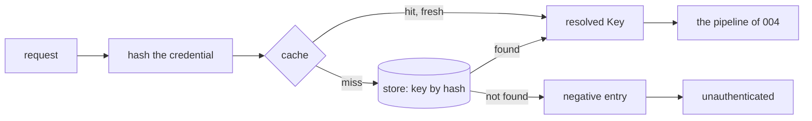
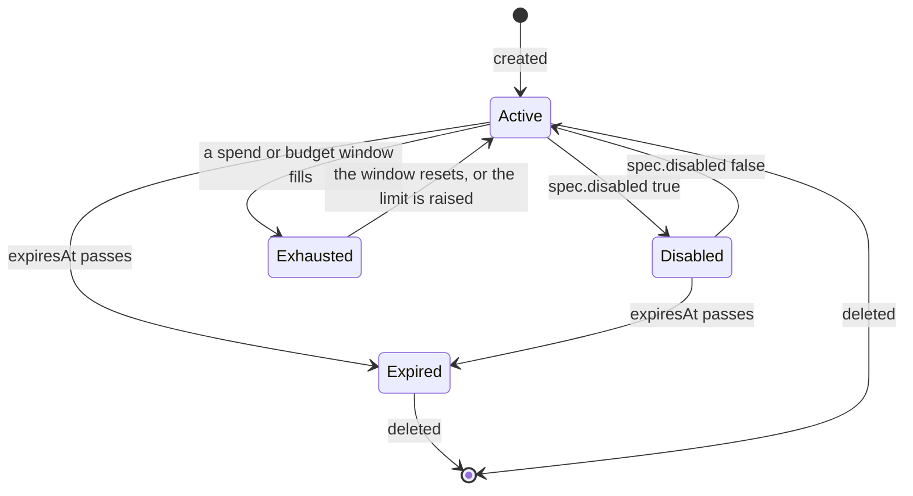

# Keys and limits

## Overview

A Key is the credential a workload holds: an opaque value minted by the
gateway or supplied by the caller that creates it, shown once at most,
stored as a hash, and resolved to a set of Models it may name, rate
limits, a spend limit, and a Budget it draws from. This spec owns the
value and its verification, the per-replica cache that keeps the hot
path off the store, the Key's states and the `status` fields that
report them, how a selector is matched at request time, the arithmetic
of the rate and spend windows, how a Budget is drawn, and the refusals
that arithmetic produces. The manifest fields are
[[003-manifest-contract]]'s; where in the pipeline the checks run is
[[004-request-path]]'s; the record they settle into is
[[009-usage-and-metering]]'s.

The design choice that shapes everything here: a rate window is a
replica's, a spend window is the store's. Requests per minute is a
protection against a runaway loop and needs no coordination to be
useful; money is a promise and needs one source of truth. So rate
buckets live in memory and overshoot by at most the replica count,
while spend counters live in the store and every replica flushes its
deltas on a short interval, with the overshoot bounded and stated
([[009-usage-and-metering]]).

## Current state

Nothing is built. The repository holds the scaffold of
[[002-repository-scaffold]]: the binary serving its probes, typed
configuration, and the gate, on pkg v0.65.0.

## Design

### The value

`lux_` followed by 40 characters drawn from `[A-Za-z0-9_-]` by a
cryptographically secure source: 240 bits, so the value is the secret
and nothing about the Key is derivable from it. The first twelve
characters, `lux_` and eight more, are `status.prefix`, shown in every
list, record, and log line as the Key's handle for a person; the
remaining 32 are never shown again. The value is returned once, in the
`status.value` of the response to the `PUT` that created the Key, and
by `POST /v1/keys/{id}/rotate` ([[011-api]]); every other read returns
the object without it.

The store keeps `SHA-256(value)`, hex, in the hash index of
[[010-state]], never the value. A lookup is by hash; the gateway
computes the hash of the presented credential and asks the store,
comparing nothing itself. The door hashes the exact bytes of the
credential it extracted, trims nothing, parses nothing, and checks no
prefix: a value is whatever string a Key was created with, minted or
supplied, and the doors treat every one as opaque bytes
([[001-architecture]], [[004-request-path]]). The bytes are not
retained past the hash, so no later stage, the pipeline, the record,
the log line, the event, holds anything but the hash and the prefix,
and a value is never logged by construction. The redacting log handler
of [[019-observability]], which truncates a minted value's pattern to
its prefix, is a second line for a value logged by a caller's mistake,
not the first. `TestKeyValueNeverAppearsInLogs` runs a minted and a
supplied canary through every path.

Rotation mints a new value, replaces the hash, keeps the id, the name,
the spec, the owner, and the windows, and invalidates the old hash at
once; a request with the old value is `unauthenticated` within
`LUX_KEY_CACHE` on every replica. There is no grace period: a caller
that needs one creates a second Key and deletes the first.

### A supplied value

A `PUT` that creates a Key may carry `spec.value`, a value the caller
chose instead of one the gateway mints. It exists for one composition:
a platform that gives a developer one credential registers that
credential here, so the same string the developer presents to every
control plane as a token opens the doors as a Key, under the models
and the budget the platform attached, and the hot path stays a hash
lookup ([[001-architecture]], invariant 3). The field is
[[003-manifest-contract]]'s: a string, write-once, decoded into a member
the JSON and YAML encoders skip exactly as
`Provider.spec.credential.value` is, so no object carrying it can be
serialized by accident.

The rules are the minted value's with these differences:

- Bounds. A supplied value is 32 to 4096 bytes of the exact string
  the body carried; shorter is `invalid_field` at `spec.value` because
  a shorter secret is guessable, longer is `invalid_field` because a
  header cannot carry it. Nothing is trimmed, decoded, or parsed: a
  value that happens to be a JWT is bytes to the gateway, which reads
  no header, claim, signature, or expiry from it and verifies nothing.
  The only expiry a Key has is its own `ttl` or `expiresAt`; a platform
  whose credential expires on its own schedule sets one or deletes the
  Key.
- Uniqueness. The hash index of [[010-state]] is unique. A supplied
  value whose hash is already registered, to any Key, live or disabled,
  is `invalid_field` at `spec.value` with the developer detail `a Key
  with this value already exists`, naming no Key: the caller holds the
  value already and learns only that it is taken. The store reports
  the collision as `ErrHashTaken` from `Keys.Put` inside the create's
  transaction, so two concurrent creates of one value produce one Key.
- Write-once. `spec.value` present on an update is `immutable_field` at
  `spec.value`, whether or not it equals the stored one, because the
  stored one is a hash and cannot be compared ([[003-manifest-contract]],
  stage 5). `spec.value` with `spec.valueFrom` is `exclusive_fields`;
  `spec.value` in file mode is `invalid_field`, because a directory a
  deployment copies is not a place for a credential ([[010-state]]).
- Never returned. The create response carries no `status.value`, and
  no read, list, event, record, or log line carries the value, so the
  resolved manifest a caller reads back has the field absent and
  re-applies unchanged.
- The prefix. `status.prefix` is `sup_` and the first eight lower-case
  hex characters of the hash, twelve characters like a minted prefix,
  because a supplied value has no prefix of its own to show and its
  first twelve bytes may be the same for every value of its kind. The
  prefix is derived from the hash, so it names one Key and discloses
  nothing of the value ([[001-architecture]] states the rule for a
  minted value and defers to this one for a supplied one).
- Rotation. `POST /v1/keys/{id}/rotate` mints a `lux_` value and
  replaces the hash, so a supplied value stops working at rotate; a
  platform that wants the same string again recreates the Key.
- Revocation. A platform revokes the credential by deleting or
  disabling the Key, and the doors refuse the value within
  `LUX_KEY_CACHE` on every replica, exactly as for a minted value;
  whatever the platform's issuer does with the same string is its own.

The plane boundary holds by verification, not by shape. On a door,
every credential is a hash lookup and a value no Key was created with
is `unauthenticated`, whatever it looks like; a token is a Key only
where an operator registered that exact string as one, which is a
control plane act ([[004-request-path]], [[006-identity]]). On `/v1`,
the same string is a bearer like any other and is accepted only when it
independently verifies under [[006-identity]], a listed issuer and the
gateway's own audience; a platform's developer credential carries the
platform's audience and so never reaches desired state, and a minted
value is not a JWS and never does. Neither plane consults the other's
table.

### Verification and the cache



Each replica caches the store's answer per hash for `LUX_KEY_CACHE`
(default `10s`): the resolved Key with its owner, selectors, limits,
Budget reference, and expiry, or the absence of one. A positive entry
is also dropped when the journal reports a change to that Key: every
replica tails `Journal.Since` ([[010-state]]) and evicts the entry of
any Key a `key.updated`, `key.rotated`, or `key.deleted` row names
([[012-request-log-and-events]]), so a delete, a disable, or a rotation
is seen at the next request on a replica that has consumed the row and
within the window on one that has not. The journal row is written for
every mutation whether or not a sink is configured, so the tail works
in every installation with a store; in file mode the `SIGHUP` snapshot
swap empties the cache ([[010-state]]). A negative entry protects the
store from a flood of unknown values; it is bounded to `LUX_KEY_CACHE`
and the cache holds at most 100 000 entries, evicting the least recent.
Unknown values are also subject to the door's unauthenticated rate
`LUX_UNAUTHENTICATED_REQUESTS_PER_MINUTE` per client address
([[011-api]]), so guessing costs the guesser first. Every lookup counts
once in `lux_key_cache_hits_total` with `result` `hit`, `miss`, or
`negative` ([[019-observability]]).

The cache is what makes invariant 3 of [[001-architecture]] cheap: a
hot path that touches the store once per Key per ten seconds, and a
counter per request, dials nothing else.

### States



`status.state` is what a reader sees; the gateway decides from the
underlying facts, not from the cached word. `Disabled` is
`spec.disabled`, refused `key_disabled`. `Expired` is `Now` past
`status.expiresAt`, refused `key_expired`, decided at the request from
the clock, so a Key expires on every replica at the same instant
without a write. `Exhausted` is the Key's spend window at or over its
amount, refused `spend_exceeded`, or the hard Budget it draws from at
or over its amount, refused `budget_exhausted`; it is decided at stage
7 of the pipeline from the current counters, so a window that has reset
serves at once. The codes and their statuses are
[[004-request-path]]'s table. An `Expired` Key is kept until deleted,
so its usage stays readable; an operator's sweep of expired Keys is a
platform's job or a `lux keys prune` later.

The `status` fields that report the facts are rendered at read time,
not stored, so no flush writes a row per Key per interval and every
replica renders the same answer from the store:

| Field | Rendered from |
|---|---|
| `status.state` | the rules above, from `spec.disabled`, `status.expiresAt`, and the counters of the current window |
| `status.usage.window` | `{requests, tokens, spend, resetsAt}` of the current spend window, from the three counters [[009-usage-and-metering]] keeps under `limits.spend.window`; absent when the Key has no spend limit |
| `status.usage.total` | `{requests, tokens, spend}` over the Key's lifetime, from the same three counters under window `none` |
| `status.lastUsedAt` | the one field written: by the flush, through `PutStatus` ([[010-state]]), at most once per minute per Key that was used, rounded down to the minute, so a busy Key costs one status write a minute and not one a request |

`spend` in `status.usage` renders the counter's micro-units as a money
string of [[003-manifest-contract]], the form a person reads; the
record and the usage API carry the same number as an integer
([[009-usage-and-metering]]).

### Selectors

`spec.models` is a list of selectors under the glob rule of
[[003-manifest-contract]]: `*` matches any run of characters including
`/`, every other character matches itself, and a selector without `*`
is an exact name. What a selector matches is a Model's `metadata.name`,
declared or discovered alike, so `anthropic/*` matches every Model
discovered from the Provider named `anthropic` and `gpt-5` matches the
one Model of that name. At resolve, each selector is one `model.use`
decision through `Lookup.Models` ([[006-identity]]), which binds the
selector and records what it matched then in `status.selectors[]`; a
selector that matched nothing is a warning, not a refusal.

At request time the gateway matches again, against the catalog as it
is now, with `manifest.Match(selector, name)`, the same function that
validated the selector: the resolved Model's name is held to each
selector in order and the first match admits it. A Model that appears
after the Key was resolved, a discovered one or a newly declared one,
is admitted by a selector that matches it without a re-resolve; a
Model that was deleted stops matching because its name is no longer in
the catalog. The refusal is `model_not_allowed`, 403, at stage 5 of
[[004-request-path]], after `model_not_found`, so a caller learns
whether the name exists before whether this Key may use it. The same
match is what `GET /v1/models` on a door lists ([[004-request-path]])
and what admits an opaque route's Provider: one whose Models some
selector reaches ([[004-request-path]]). The selectors are the whole
of what a Key may name; there is no per-Key scope beyond them, and the
control plane is closed to a Key whatever its selectors say
([[006-identity]]).

### Rate windows

`requestsPerMinute` and `tokensPerMinute` are token buckets, one pair
per Key per replica, evicted when idle for ten minutes. A bucket's
capacity is the per-minute value and its refill is that value per
sixty seconds, so a Key may burst its full minute at once and then
proceeds at the rate; that is the shape SDK retry loops expect. Zero
is no bucket. The buckets are `latere.ai/x/pkg/ratelimit.Buckets`,
keyed by Key id, with a per-Key rate set through `SetRate`; that
package today admits one token per `Allow` and has no way to charge
several or to give any back, so this spec needs three additions to it,
named here as the pkg change it depends on:

```go
// AllowN consumes n tokens for key at once, or consumes nothing and
// reports the wait until n are available. n of 1 is Allow.
func (b *Buckets) AllowN(key string, n int) Allowance
// Adjust adds delta tokens to key's bucket: a negative delta debits
// past zero, so the next Allow waits; a positive one refunds up to the
// burst. It is how a reservation is settled.
func (b *Buckets) Adjust(key string, delta int)
// Config.PerMinute of zero with SetRate per key means no default
// bucket and per-key rates only, rather than a disabled limiter.
```

A request costs one from the request bucket at stage 7. The token
bucket is charged a reservation before the request and settled after:

```
reserve  = estimate(input tokens) + requested max output tokens, or 1024 when unrequested
settle   = measured input + measured output tokens
adjust   = reserve - settle        (a refund when positive, a further debit when negative)
```

`estimate` is `latere.ai/x/pkg/llmdialect/tokencount.Estimate` over
the decoded request on translated routes, and, on a passthrough model
route, the body's length in bytes divided by four, because no upstream
reports a count before it answers; an opaque route reserves one request
and no tokens. The settle uses the measured count either way. A bucket that cannot cover the
reservation refuses with `rate_limited` and `Retry-After` of the
seconds until it can, `Allowance.Retry` rounded up and at least `1`;
nothing is debited on a refusal, and a request refused at a later
stage or failed before it was sent is refunded whole. Because the
buckets are per replica, an installation with `n` replicas admits at
most `n` times the configured rate, which the documentation says in
those words. The bucket and the symmetric settle are deliberate, because
a fixed window admits two minutes' worth at a boundary and an unsettled
under-estimate lets a Key exceed its tokens per minute by the estimate's
error every minute.

### Spend windows

A Key that names no spend limit and draws from no Budget spends without
bound: the core has no default cap, because a default that is money
belongs to the operator's manifest or to the authorizer's `limits`.

A Key's `limits.spend` and a Budget are both a spend window: an
amount, a currency, and a window under the window rule of
[[003-manifest-contract]]. Their counters are the store's, in
micro-units of the currency, keyed by `(object id, window number)`
([[010-state]]); each replica keeps a delta per key per window and
flushes every `LUX_METERING_FLUSH` (default `1s`).

At stage 7, for each of the Key's spend window and the Budget's:

```
known     = the store's counter as of the last flush
pending   = this replica's unflushed delta
projected = known + pending + estimated cost of this request
refuse when projected > amount
```

The estimated cost is the reservation's tokens priced by the Model's
`pricing` through `metering.Cost` ([[009-usage-and-metering]]); after
the response the measured cost replaces it in the delta. The bound this
gives, stated once here and once in the metering spec in the same
symbols: with `R` replicas, a flush interval `F` in seconds, `T`
requests per second per replica against the counter, and `C` the
greatest cost of one request under the Key's Models,

```
overshoot <= (R - 1) × F × T × C + C
```

because the first term is what the other replicas spent inside one
flush interval that this one has not yet seen, and the last is this
replica's own request that crossed. With one replica the bound is one
request. An installation that needs a tighter bound lowers the flush
interval.

The order of refusals is the pipeline's: `rate_limited` before any
money question, then `model_unpriced`, `currency_mismatch`,
`spend_exceeded`, `budget_exhausted`. `Retry-After` on the last two is
the seconds until the window resets, or absent for a `none` window,
which never does.

Exhaustion is announced once per window. The first replica to observe
a window at or over its amount, at the gate for a hard limit and at a
flush for a soft Budget, adds `1` to the marker counter
`key:<id>:exhausted:<start>` or `budget:<id>:exhausted:<start>`
([[009-usage-and-metering]]); the one replica whose add returns `1`
emits `key.exhausted` or `budget.exhausted`
([[012-request-log-and-events]]), and every other replica's returns
more and emits nothing. No lease is needed, because the store's add is
atomic, and the marker resets with the window because it is keyed by
the window's start.

Pricing rules at this stage:

- A Model with no `pricing`, and every opaque route, is unpriced. A Key
  with a spend limit or a Budget, hard or soft, refuses an unpriced
  request with `model_unpriced` unless `allowUnpriced` is true; a Key
  with neither serves it and the record says `priced: false`. This is
  the rule that keeps a budget meaning what it says: money that cannot
  be counted is not spent under one by default.
- The currency of the Key's spend limit, the Budget, and the Model's
  pricing must agree; the first disagreement is `currency_mismatch`.
  Nothing converts currencies.
- A soft Budget (`hard: false`) never refuses for its amount. When its
  window first reaches `amount`, the flush that observes it emits one
  `budget.exhausted` event as above, `status.state` renders `Exhausted`
  until the reset, and requests continue. A soft Budget's Keys are
  never `Exhausted` by it; `model_unpriced` and `currency_mismatch` are
  the Key's refusals and hold under a soft Budget as under a hard one.

### Budgets

A Budget is drawn by every Key that names it. `budget.draw` is decided
once, at the Key's resolve ([[006-identity]]); after that the draw is
arithmetic. Its `status` is rendered at read time like a Key's:
`status.keys` counts the live Keys naming it now; `status.spent` is the
current window's counter as a money string, `status.remaining` is
`amount` less that, floored at zero, and `status.resetsAt` is the
window's reset, or absent for `none`; `status.state` is `Exhausted`
while `spent` is at or over `amount` and `Open` otherwise. Deleting a
Budget that Keys still name is refused with `budget_in_use`, 409
([[011-api]]), so a Key never points at nothing; an operator disables
the Keys or moves them first. Raising `amount` on an `Exhausted` Budget
returns it to `Open` at the next request. Changing `window` or
`currency` is immutable by [[003-manifest-contract]], because a counter
keyed by window number under one rule cannot be reinterpreted under
another.

### Attribution

Every record carries the Key's id and prefix and the Key's `owner`,
the subject that applied it, and the Key's labels; a platform that
wants to charge a team puts the team in a label or gives the team a
Budget, and reads `GET /v1/usage` by either
([[009-usage-and-metering]]). A caller may add request labels through
the `Lux-Labels` header: comma separated `k=v` pairs, at most eight,
each key 1 to 64 characters of `[A-Za-z0-9._-]` and each value 1 to
128 characters of `[A-Za-z0-9._:/-]`, no duplicate keys. They are
recorded apart from the Key's labels as the record's `requestLabels`,
the request's own, readable through `GET /v1/requests` and the
archive, never an aggregate dimension, and never trusted for anything
but reporting. A pair that fails the rule, a duplicate, and every pair
past the eighth are dropped and the rest kept; the header is never
forwarded to a provider ([[004-request-path]] strips every `Lux-*`
request header). Dropping a bad pair rather than refusing the request is
deliberate: a data plane refusal is a code in the error table, and
attribution is not worth one.

### Configuration

| Variable | Required | Default | Purpose |
|---|---|---|---|
| `LUX_KEY_CACHE` | no | `10s` | how long a Key lookup, positive or negative, is cached per replica; at least `1s`, at most `10m` |
| `LUX_DEFAULT_REQUESTS_PER_MINUTE`, `LUX_DEFAULT_TOKENS_PER_MINUTE` | no | `0`, `0` | the `Defaults` a Key without `limits` gets; `0` is none |

[[002-repository-scaffold]] lists both in the one table every `LUX_*`
variable is in, with this spec as the owner.

## Not in this spec

The record, cost arithmetic, the counters, and the flush
([[009-usage-and-metering]]); the counter and hash storage
([[010-state]]); the `spec.value` field's row in the schema and the
glob rule ([[003-manifest-contract]]); the routes that create, rotate,
disable, and delete a Key and their status codes ([[011-api]]); where
the checks sit in the pipeline and the codes' HTTP statuses
([[004-request-path]]); who may create a Key and how a selector's
`model.use` is decided ([[006-identity]]); the events' delivery
([[012-request-log-and-events]]).

## Acceptance criteria

| Criterion | Test that proves it | State |
|---|---|---|
| A minted value matches `^lux_[A-Za-z0-9_-]{40}$`, ten thousand mints are distinct, and `status.prefix` is its first twelve characters | `TestKeyValueShape`, `TestKeyValuesAreDistinct` | not built |
| A minted value and a supplied value each appear in the create response (the minted one only) and the rotate response and in no other read, list, event, record, or log line, with a canary of each run through every path | `TestKeyValueShownOnce`, `TestKeyValueNeverAppearsInLogs` | not built |
| A rotated Key keeps its id, name, spec, owner, and windows; the old value is `unauthenticated` on a second replica within `LUX_KEY_CACHE` | `TestRotateReplacesTheValue` | not built |
| A Key created with a 32-byte `spec.value` authenticates by that exact value on every door and credential form, the create response carries no `status.value`, `status.prefix` is `sup_` and the first eight hex characters of the value's SHA-256, and the supplied value is refused at rotate while the minted one is accepted | `TestSuppliedKeyValue` | not built |
| A supplied value of 31 bytes and one of 4097 bytes are each `invalid_field` at `spec.value`; one with leading whitespace authenticates only with that whitespace; a value that is a well-formed JWT with a past `exp` and a bad signature authenticates, because the gateway parses nothing | `TestSuppliedValueBounds`, `TestSuppliedValueIsOpaqueBytes` | not built |
| A second create with a value already registered, to a live or a disabled Key, is `invalid_field` at `spec.value` whose detail names no Key; two concurrent creates of one value yield one 201 and one `invalid_field` | `TestSuppliedValueMustBeUnique` | not built |
| An update carrying `spec.value`, equal to the stored one or not, is `immutable_field` at `spec.value`; `spec.value` with `spec.valueFrom` is `exclusive_fields`; `spec.value` in file mode is `invalid_field` | `TestSuppliedValueIsWriteOnce` with [[003-manifest-contract]]'s `TestImmutableFields` | not built |
| A supplied value that is a token for a listed issuer with another audience is a Key on a door and `unauthenticated` on `/v1`; a minted value is `unauthenticated` on `/v1`; an issuer token no Key was created with is `unauthenticated` on a door | `TestPlaneBoundaryHoldsByVerification` with [[006-identity]]'s `TestPlanesRefuseEachOthersCredential` and [[004-request-path]]'s `TestDoorsTakeKeysOnly` | not built |
| A Key looked up once is served from the cache for the window with one store call; a negative entry holds an unknown value to one store call per window; the cache evicts at 100 000 entries; every lookup increments `lux_key_cache_hits_total` with the matching `result` | `TestKeyCache`, `TestNegativeCache`, `TestCacheBound` | not built |
| A deleted, disabled, or rotated Key is refused at the next request on a replica that has consumed the journal row and within the window on one that has not; a `SIGHUP` in file mode empties the cache | `TestRevocationPropagates`, `TestFileModeReloadEmptiesTheCache` | not built |
| Each state is decided from the facts: `Disabled` from the spec, `Expired` from the clock on every replica at once, `Exhausted` from the current window and cleared by its reset without a write; each refuses with its code | `TestKeyStates`, table-driven with a fake clock | not built |
| `status.usage.window` and `.total` render the counters' requests, tokens, and spend with `spend` as a money string, `window` is absent for a Key without a spend limit, and `status.lastUsedAt` is written at most once per minute per used Key | `TestKeyStatusRendersFromCounters`, `TestLastUsedIsCoalesced` | not built |
| A request naming a Model whose name matches no selector is `model_not_allowed` after `model_not_found`; a Model declared or discovered after the Key was resolved is admitted when a selector matches its name; a glob matches across `/`; the match is `manifest.Match` | `TestSelectorsMatchAtRequestTime`, table-driven | not built |
| `ratelimit.Buckets` offers `AllowN`, `Adjust`, and per-key rates without a default bucket, and the gateway's buckets use them | `TestRateLimitPackageShape`, compile-time against `latere.ai/x/pkg/ratelimit` | not built, pkg change |
| A Key with `requestsPerMinute` 60 admits 60 at once, refuses the 61st with `Retry-After` 1, and admits one more after a second; zero is no limit | `TestRequestBucket` | not built |
| The token bucket is charged the reservation before the request and settled to the measured count after, refunding an over-estimate and debiting an under-estimate; a refusal at this stage debits nothing, and a refusal at a later stage refunds the whole reservation | `TestTokenReservationSettles`, `TestRefusalDebitsNothing` | not built |
| Two replicas each admit the configured rate, so the installation admits twice it and no more | `TestRateIsPerReplica` | not built |
| A spend window refuses when `known + pending + estimate` exceeds the amount, serves after the window number changes, and `Retry-After` names the reset; a `none` window carries no `Retry-After` | `TestSpendWindow`, `TestWindowReset` | not built |
| With three replicas, a flush interval of one second, ten requests a second per replica, and a one-cent request, the overshoot of a hard limit never exceeds `(R − 1) × F × T × C + C`, twenty-one cents, over a hundred runs, and one replica never overshoots by more than one request | `TestOvershootBound` | not built |
| Six replicas driving one Key's spend window and one Budget's window past their amounts emit exactly one `key.exhausted` and one `budget.exhausted` per window, through the marker counter, for a hard limit at the first refusal and for a soft Budget at the first flush that observes it | `TestExhaustionIsAnnouncedOnce`, with [[012-request-log-and-events]]'s `TestStateChangeEventIsRaisedOnce` | not built |
| An unpriced Model and an opaque route are `model_unpriced` under a spend limit or a Budget, hard or soft, without `allowUnpriced`, served with it, and served with `priced: false` under neither | `TestUnpricedRule`, [[001-architecture]]'s `TestUnpricedModelRefusedUnderABudget` | not built |
| A Budget in another currency than the Model's pricing is `currency_mismatch`; the refusal order across all five money and rate codes is the pipeline's | `TestCurrencyMismatch`, `TestRefusalOrderAmongLimits` | not built |
| A soft Budget never refuses for its amount, emits `budget.exhausted` exactly once per window when reached, and renders `Exhausted` until the reset | `TestSoftBudget` | not built |
| Deleting a Budget a Key names is `budget_in_use`; raising an exhausted Budget's amount serves at the next request; `status.keys`, `spent`, `remaining`, `resetsAt`, and `state` render from the live Keys and the current window's counter | `TestBudgetLifecycle` | not built |
| Every record carries the Key's id, prefix, owner, and labels, and the valid `Lux-Labels` pairs as `requestLabels`; a ninth pair, a duplicate key, and a pair outside the syntax are dropped while the rest are kept; the header reaches no provider | `TestAttribution`, `TestRequestLabelsSyntax` | not built |
