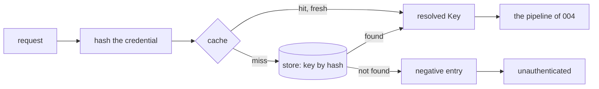
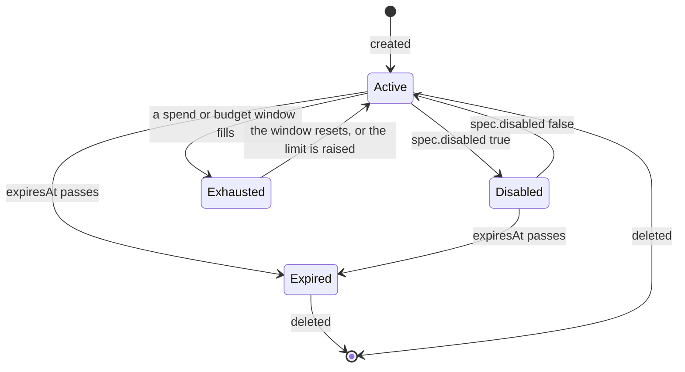

# Keys and limits

## Overview

A Key is the credential a workload holds: an opaque value minted by the
gateway, shown once, stored as a hash, and resolved to a set of Models
it may name, rate limits, a spend limit, and a Budget it draws from.
This spec owns the value and its verification, the per-replica cache
that keeps the hot path off the store, the Key's states, the arithmetic
of the rate and spend windows, how a Budget is drawn, and the refusals
that arithmetic produces. The manifest fields are
[[003-manifest-contract]]'s; where in the pipeline the checks run is
[[004-request-path]]'s; the record they settle into is
[[009-usage-and-metering]]'s.

The design choice that shapes everything here: a rate window is a
replica's, a spend window is the store's. Requests per minute is a
protection against a runaway loop and needs no coordination to be
useful; money is a promise and needs one source of truth. So rate
buckets live in memory and overshoot by at most the replica count,
while spend counters live in the store and every replica flushes its
deltas on a short interval, with the overshoot bounded and stated
([[009-usage-and-metering]]).

## Current state

Nothing is built. The hosted gateway this design is extracted from has
virtual keys with SHA-256 hashes, per-key model allow lists, and a
per-principal monthly spend cap enforced through Redis counters; rate
limits are per key and per replica. There is no shared budget across
keys and no notion of a window other than the calendar month.

## Design

### The value

`lux_` followed by 40 characters drawn from `[A-Za-z0-9_-]` by a
cryptographically secure source: 240 bits, so the value is the secret
and nothing about the Key is derivable from it. The first twelve
characters, `lux_` and eight more, are `status.prefix`, shown in every
list, record, and log line as the Key's handle for a person; the
remaining 32 are never shown again. The value is returned once, in the
`status.value` of the response to the `PUT` that created the Key, and
by `POST /v1/keys/{id}/rotate` ([[011-api]]); every other read returns
the object without it.

The store keeps `SHA-256(value)`, hex, in the hash index of
[[010-state]], never the value. A lookup is by hash; the gateway
computes the hash of the presented credential and asks the store,
comparing nothing itself. A value is never logged: the gateway's and
the API's logging redact any string beginning with `lux_` to its first
twelve characters, and `TestKeyValueNeverAppearsInLogs` runs a canary
through every path.

Rotation mints a new value, replaces the hash, keeps the id, the name,
the spec, the owner, and the windows, and invalidates the old hash at
once; a request with the old value is `unauthenticated` within
`LUX_KEY_CACHE` on every replica. There is no grace period: a caller
that needs one creates a second Key and deletes the first.

### Verification and the cache



Each replica caches the store's answer per hash for `LUX_KEY_CACHE`
(default `10s`): the resolved Key with its owner, selectors, limits,
Budget reference, and expiry, or the absence of one. A positive entry
is also refreshed when the store reports a change through the journal
([[010-state]]), so a delete, a disable, or a rotation is seen at the
next request on a replica that consumes the journal and within the
window on one that does not. A negative entry protects the store from
a flood of unknown values; it is bounded to `LUX_KEY_CACHE` and the
cache holds at most 100 000 entries, evicting the least recent.
Unknown values are also subject to the door's unauthenticated rate
`LUX_UNAUTHENTICATED_REQUESTS_PER_MINUTE` per client address
([[011-api]]), so guessing costs the guesser first.

The cache is what makes invariant 3 of [[001-architecture]] cheap: a
hot path that touches the store once per Key per ten seconds, and a
counter per request, dials nothing else.

### States



`status.state` is what a reader sees; the gateway decides from the
underlying facts, not from the cached word. `Disabled` is
`spec.disabled`. `Expired` is `Now` past `status.expiresAt`, decided at
the request from the clock, so a Key expires on every replica at the
same instant without a write. `Exhausted` is a spend window or a hard
Budget window at or over its limit, decided at stage 7 of the pipeline
from the current counters, so a window that has reset serves at once
and the state written by the next flush follows. An `Expired` Key is
kept until deleted, so its usage stays readable; an operator's sweep
of expired Keys is a platform's job or a `lux keys prune` later.

### Rate windows

`requestsPerMinute` and `tokensPerMinute` are token buckets from
`latere.ai/x/pkg/ratelimit`, keyed by Key id, one pair per replica,
evicted when idle for ten minutes. A bucket's capacity is the
per-minute value and its refill is that value per sixty seconds, so a
Key may burst its full minute at once and then proceeds at the rate;
that is the shape SDK retry loops expect. Zero is no bucket.

A request costs one from the request bucket at stage 7. The token
bucket is charged a reservation before the request and settled after:

```
reserve  = estimate(input tokens) + requested max output tokens, or 1024 when unrequested
settle   = measured input + measured output tokens
adjust   = settle - reserve        (a refund when negative, a further debit when positive)
```

`estimate` is `latere.ai/x/pkg/llmdialect/tokencount` over the decoded
request on translated routes, and the upstream's own count when a
model route reports one before the response; an opaque route reserves
one request and no tokens. A bucket that cannot cover the reservation
refuses with `rate_limited` and `Retry-After` of the seconds until it
can; nothing is debited on a refusal. Because the buckets are per
replica, an installation with `n` replicas admits at most `n` times the
configured rate, which the documentation says in those words.

### Spend windows

A Key's `limits.spend` and a Budget are both a spend window: an
amount, a currency, and a window under the window rule of
[[003-manifest-contract]]. Their counters are the store's, in
micro-units of the currency, keyed by `(object id, window number)`
([[010-state]]); each replica keeps a delta per key per window and
flushes every `LUX_METERING_FLUSH` (default `1s`).

At stage 7, for each of the Key's spend window and the Budget's:

```
known     = the store's counter as of the last flush
pending   = this replica's unflushed delta
projected = known + pending + estimated cost of this request
refuse when projected > amount
```

The estimated cost is the reservation's tokens priced by the Model's
`pricing` in `metering` ([[009-usage-and-metering]]); after the
response the measured cost replaces it in the delta. The bound this
gives, stated once here and once in the metering spec: a hard limit
can be exceeded by at most `replicas × LUX_METERING_FLUSH ×
per-replica throughput × the largest single-request cost`, because
that is how much another replica can have spent that this one has not
yet seen. With one replica the bound is one request. An installation
that needs a tighter bound lowers the flush interval.

The order of refusals is the pipeline's: `rate_limited` before any
money question, then `model_unpriced`, `currency_mismatch`,
`spend_exceeded`, `budget_exhausted`. `Retry-After` on the last two is
the seconds until the window resets, or absent for a `none` window,
which never does.

Pricing rules at this stage:

- A Model with no `pricing`, and every opaque route, is unpriced. A Key
  with a spend limit or a Budget refuses an unpriced request with
  `model_unpriced` unless `allowUnpriced` is true; a Key with neither
  serves it and the record says `priced: false`. This is the rule that
  keeps a budget meaning what it says: money that cannot be counted is
  not spent under one by default.
- The currency of the Key's spend limit, the Budget, and the Model's
  pricing must agree; the first disagreement is `currency_mismatch`.
  Nothing converts currencies.
- A soft Budget (`hard: false`) never refuses. When its window first
  exceeds `amount`, the flush that observes it emits one
  `budget.exhausted` event ([[012-request-log-and-events]]) and sets
  `status.state` `Exhausted` until the reset, and requests continue.
  A soft Budget's Keys are never `Exhausted` by it.

### Budgets

A Budget is drawn by every Key that names it. `budget.draw` is decided
once, at the Key's resolve ([[006-identity]]); after that the draw is
arithmetic. `status.keys` counts the Keys naming it now; `status.spent`,
`status.remaining`, and `status.resetsAt` follow the current window
and are written by the flush. Deleting a Budget that Keys still name is
refused with `budget_in_use`, 409 ([[011-api]]), so a Key never points
at nothing; an operator disables the Keys or moves them first. Raising
`amount` on an `Exhausted` Budget returns it to `Open` at the next
request. Changing `window` or `currency` is immutable by
[[003-manifest-contract]], because a counter keyed by window number
under one rule cannot be reinterpreted under another.

### Attribution

Every record carries the Key's id and prefix and the Key's `owner`,
the subject that applied it, and the Key's labels; a platform that
wants to charge a team puts the team in a label or gives the team a
Budget, and reads `GET /v1/usage` by either
([[009-usage-and-metering]]). A caller may add request labels through
the `Lux-Labels` header, at most eight `k=v` pairs, recorded apart from
the Key's labels as the request's own and never trusted for anything
but reporting.

### Configuration

| Variable | Required | Default | Purpose |
|---|---|---|---|
| `LUX_KEY_CACHE` | no | `10s` | how long a Key lookup, positive or negative, is cached per replica |
| `LUX_DEFAULT_REQUESTS_PER_MINUTE`, `LUX_DEFAULT_TOKENS_PER_MINUTE` | no | `0`, `0` | the `Defaults` a Key without `limits` gets; `0` is none |

## Not in this spec

The record, cost arithmetic, and the flush ([[009-usage-and-metering]]);
the counter and hash storage ([[010-state]]); the routes that create,
rotate, disable, and delete a Key and their status codes ([[011-api]]);
where the checks sit in the pipeline ([[004-request-path]]); who may
create a Key ([[006-identity]]).

## Acceptance criteria

| Criterion | Test that proves it | State |
|---|---|---|
| A minted value matches `^lux_[A-Za-z0-9_-]{40}$`, ten thousand mints are distinct, and `status.prefix` is its first twelve characters | `TestKeyValueShape`, `TestKeyValuesAreDistinct` | not built |
| The value appears in the create response and the rotate response and in no other read, list, event, record, or log line, with a canary run through every path | `TestKeyValueShownOnce`, `TestKeyValueNeverAppearsInLogs` | not built |
| A rotated Key keeps its id, name, spec, owner, and windows; the old value is `unauthenticated` on a second replica within `LUX_KEY_CACHE` | `TestRotateReplacesTheValue` | not built |
| A Key looked up once is served from the cache for the window with one store call; a negative entry holds an unknown value to one store call per window; the cache evicts at 100 000 entries | `TestKeyCache`, `TestNegativeCache`, `TestCacheBound` | not built |
| A deleted or disabled Key is refused at the next request on a replica consuming the journal and within the window on one that is not | `TestRevocationPropagates` | not built |
| Each state is decided from the facts: `Disabled` from the spec, `Expired` from the clock on every replica at once, `Exhausted` from the current window and cleared by its reset without a write | `TestKeyStates`, table-driven with a fake clock | not built |
| A Key with `requestsPerMinute` 60 admits 60 at once, refuses the 61st with `Retry-After` 1, and admits one more after a second; zero is no limit | `TestRequestBucket` | not built |
| The token bucket is charged the reservation before the request and settled to the measured count after, refunding an over-estimate and debiting an under-estimate; a refusal debits nothing | `TestTokenReservationSettles`, `TestRefusalDebitsNothing` | not built |
| Two replicas each admit the configured rate, so the installation admits twice it and no more | `TestRateIsPerReplica` | not built |
| A spend window refuses when `known + pending + estimate` exceeds the amount, serves after the window number changes, and `Retry-After` names the reset; a `none` window carries no `Retry-After` | `TestSpendWindow`, `TestWindowReset` | not built |
| With two replicas, a flush interval of one second, and a stream of requests of known cost, the overshoot of a hard limit never exceeds the stated bound and the bound is reached | `TestOvershootBound` | not built |
| An unpriced Model and an opaque route are `model_unpriced` under a spend limit or a Budget without `allowUnpriced`, served with it, and served with `priced: false` under neither | `TestUnpricedRule`, [[001-architecture]]'s `TestUnpricedModelRefusedUnderABudget` | not built |
| A Budget in another currency than the Model's pricing is `currency_mismatch`; the refusal order across all five money and rate codes is the pipeline's | `TestCurrencyMismatch`, `TestRefusalOrderAmongLimits` | not built |
| A soft Budget never refuses, emits `budget.exhausted` exactly once per window when exceeded, and shows `Exhausted` until the reset | `TestSoftBudget` | not built |
| Deleting a Budget a Key names is `budget_in_use`; raising an exhausted Budget's amount serves at the next request; `status.keys`, `spent`, `remaining`, and `resetsAt` follow the window | `TestBudgetLifecycle` | not built |
| Every record carries the Key's id, prefix, owner, and labels, and up to eight `Lux-Labels` pairs apart from them; a ninth pair is ignored | `TestAttribution` | not built |
