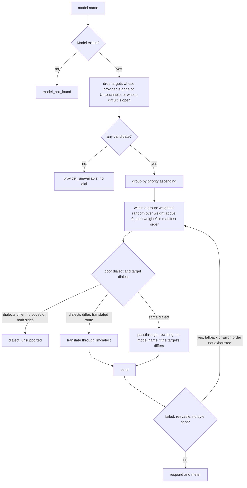

# Routing and models

## Overview

A caller names a model. This spec is everything between that name and a
socket: which `Model` the name resolves to, which of its targets the
request goes to, what happens when that target fails, when the door's
dialect and the target's force a translation and when they make the
request impossible, and which name the outbound body and the response
carry. The decisions are made in `gateway` from desired state and two
per-replica signals, a Provider's health ([[005-providers]]) and a
per-target circuit, so the path dials nothing but the upstream.

Selection is a function of the resolved `Model`, not of the caller: a
Key decides which Models may be named ([[007-keys-and-limits]]), never
which target a Model reaches.

## Current state

Built: `gateway/router.go` is the `Router` of [[004-request-path]]'s
handler, `gateway.TargetRouter`, with the attempt order, one circuit
per target, and the `lux_circuit_open` gauge;
`internal/serve/catalog.go` is the handler's `Catalog` over the store
of [[010-state]], resolving a Model by exact name and a Provider by
name or id; the observed state of a Model is written by the health job
of [[005-providers]]. The handler drives both, and [[011-api]] mounts
it.

## Design

### Model resolution

The model name comes from the door's own carrier: the `model` member of
the body on the `openai`, `anthropic`, and `lux` doors, and the
`{model}` path segment on the `gemini` door.

| Name | Resolves to |
|---|---|
| an exact `Model` name, declared or discovered | that Model |
| `<provider>/<upstream>` | the discovered Model of that name, looked up exactly and never split; the upstream name may itself contain `/` ([[003-manifest-contract]]) |
| anything else | `model_not_found` |

There is no prefix stripping, no alias table, and no nearest match: a
name either is a Model's name or is not. Resolution is by name only; a
`mdl_` id in a request body is `model_not_found`, because a body is the
caller's dialect's and its `model` member is a name in every dialect.
`model_not_allowed` follows when the Key's selectors do not match the
resolved name ([[007-keys-and-limits]]).

The resolution is `serve.Catalog.Model`, over `Objects.ByName` of
[[010-state]]: a name that begins with any kind's id prefix, which no
name may ([[003-manifest-contract]]), is answered nothing without a
read, and a store that cannot answer is `store_unavailable` at the door
rather than `model_not_found`.

### Target selection

The targets of a Model are put in one attempt order, computed per
request. Every decision below is this ordering; nothing else selects.

1. A target is a candidate unless its Provider is gone from the
   catalog, is `Unreachable` on this replica, read through
   `serve.Health.View` ([[005-providers]]) handed to the router as a
   `gateway.HealthView`, or has a circuit that does not admit work, read
   with the breaker's side-effect-free `Admits()`, so ordering takes no
   probe slot for a target that may never be tried. A target with no
   `weight` weighs the default `100` here as in
   [[003-manifest-contract]].
2. Candidates are grouped by `priority`, ascending, and the groups are
   concatenated in that order.
3. Inside a group, the targets with `weight` above `0` come first, in
   weighted random order: one is drawn with probability proportional to
   its weight, removed, and the draw repeats over the rest.
4. Inside a group, the targets with `weight` `0` come last, in manifest
   order, so a weight-`0` target is reached only after every lower
   priority and every weighted peer at its own priority is exhausted.

The first entry of the order is the target the request is sent to; the
rest are the fallback order of the next section.

An open circuit admits one half-open attempt after its open duration,
so a target is retried by traffic rather than by a timer. Immediately
before an attempt the breaker's `Allow()` is called; it answers false
when another request took the probe slot in the meantime, and the
target is then skipped for the next in the order as if it had not been
a candidate. A circuit whose probe is in flight admits nothing until
the probe reports, so a request that orders its targets in that window
finds the target out of the order rather than refused at `Allow()`; the
two refusals are one `provider_unavailable`. When step 1 leaves no
candidate and no open circuit admits a probe, the request is refused
`provider_unavailable` without a dial,
which is the cheapest correct answer and the one that does not add
load to an upstream that is already failing.

### Fallback and retries

`Model.spec.fallback` decides whether the order past its first entry is
used at all: `onError` walks it, `never` fails on the first attempt.

| Failure | Retryable | Reason |
|---|---|---|
| connection refused, reset, DNS failure, TLS handshake failure | yes | nothing of the request was served |
| a timeout before response headers | yes | as above |
| upstream `408`, `429`, or any `5xx`, Anthropic's `529` among them | yes | the upstream declined this attempt, not the request |
| upstream `3xx` | no | a redirect is not followed ([[005-providers]]) and another target would answer the same |
| any other upstream `4xx` | no | the request is wrong, or the Provider's credential or upstream name is; every target of this Provider would say so, and another Provider's answer would not make this one right |
| a body the target dialect refuses to encode | no | the same encode fails on every target of that dialect |
| the caller's context cancelled | no | there is nobody to answer |
| anything at all after the first response byte reached the caller | no | below |

The rules around the order:

- At most one attempt per target, and at most one pass over the order.
  There is no backoff and no sleep between attempts: the caller is
  waiting, another target is available, and a delay would turn one
  upstream's slowness into every caller's. `latere.ai/x/pkg/retry` is
  therefore not on this path, and a `Retry-After` header from an
  upstream is neither honored nor relayed; the only `Retry-After` a
  caller sees is the gateway's own on a rate, spend, or budget refusal
  ([[007-keys-and-limits]]).
- An attempt's deadline is its target's Provider `timeout`
  ([[005-providers]]), and the caller's own context bounds the order as
  a whole. A walk over several targets that each hang until their
  timeout therefore waits the sum, which is why an operator whose
  upstream fails by hanging sets a short `timeout` on that Provider
  rather than relying on the walk.
- The last attempt's failure is the response, in the codes of
  [[004-request-path]]: an upstream status is `upstream_error`, or
  `upstream_rejected` when that status was a `4xx` the table above does
  not retry, both carrying the upstream status in the developer detail;
  a deadline reached against an upstream is `upstream_timeout`; a
  transport failure, or an order with no candidate at all, is
  `provider_unavailable`.

A streaming response that fails mid-stream is not retried. Once the
gateway has written the response status line, the caller's SDK has
begun assembling a message and the bytes cannot be unsent; a second
attempt would deliver a second prefix of a second completion into the
same stream and would bill the caller for tokens twice. The stream is
ended, the usage record's status is `failed`, and the tokens counted up
to the cut are recorded ([[009-usage-and-metering]]). The commit point
is exact: the first byte written to the caller's connection, which for
a streaming request is the response header and for a unary request is
the body.

### The circuit per target

One `latere.ai/x/pkg/circuitbreaker.Breaker` per target, keyed by
`(provider id, upstream model)` rather than by the Model, so two Models
naming one upstream model share the circuit that failure belongs to.
The breaker is constructed with `circuitbreaker.New(5, 30*time.Second)`
and driven with `Admits`, `Allow`, `RecordSuccess`, and
`RecordFailure`; the two numbers are the constants
`gateway.CircuitThreshold` and `gateway.CircuitOpen` of this spec, not
configuration, because a value an operator would tune per upstream
belongs on the Provider and no field for it exists yet.

The breaker's state is the `lux_circuit_open` gauge
([[019-observability]]), `gateway.MetricCircuitOpen`, registered on
`RouterOptions.Metrics` when one is given: one series per target this
replica has routed to, labeled `provider`, the Provider's name, and
`model`, the target's upstream name, which are the two halves of the
key, so one breaker is one series; `1` while the breaker is not closed,
a half-open probe in flight included, and `0` once traffic closed it,
so an open circuit is visible without a request and stays visible until
one closes it. The opaque route of [[004-request-path]] reports its
Provider with no upstream model; a Provider alone is no target and has
no circuit.

| Parameter | Value |
|---|---|
| threshold | 5 consecutive retryable failures |
| open duration | 30s |
| half-open | one attempt admitted after the open duration; `RecordSuccess` closes, `RecordFailure` reopens for another 30s |
| `RecordFailure` | every retryable failure of the table above, and nothing else |
| `RecordSuccess` | every complete HTTP response the table does not retry, a `2xx`, a `3xx`, or a non-retryable `4xx` alike, because the target answered |
| neither | an encode refusal, which never reached the target, and a caller cancellation, which says nothing about it |

The circuit is per replica and is never written to an object's status:
it is one replica's opinion of one target, formed in milliseconds and
forgotten in seconds, and publishing it would make two replicas
disagree in an observable place. `Model.status.targets[].health` is the
Provider's published state ([[005-providers]]) and nothing else.

### Dialects: translate, forward, refuse

The door dialect is the caller's; the target dialect is the Provider's.
The route classes are [[004-request-path]]'s: a translated route has a
codec, a model route names a model and has none, an opaque route names
no model.

| Door | `openai` target | `anthropic` target | `gemini` target | `lux` target |
|---|---|---|---|---|
| `openai` | passthrough | translate | `dialect_unsupported` | translate |
| `anthropic` | translate | passthrough | `dialect_unsupported` | translate |
| `gemini` | `dialect_unsupported` | `dialect_unsupported` | passthrough | `dialect_unsupported` |
| `lux` | translate | translate | `dialect_unsupported` | passthrough |

The matrix holds for a translated route. A model route, an embedding or
a token count, has no codec on either side: equal dialects is
passthrough and every other cell is `dialect_unsupported`, whatever the
Key allows, because there is nothing to translate with. An opaque route
resolves no Model and reaches no target of this spec's choosing; its
provider is chosen by [[004-request-path]] from the door's dialect, for
a Key with `passthrough: true`, and a Key without one is
`route_not_allowed` rather than a routing decision at all.

Two consequences worth naming:

- The `gemini` row and column are refusals throughout because
  `llmdialect` has no Gemini codec. A `gemini` door reaches `gemini`
  targets and a `gemini` target is reached from the `gemini` door. A
  Model whose targets are all `gemini` is reachable from that door
  alone, and a Model named through another door with only `gemini`
  targets is `dialect_unsupported` rather than `model_not_found`, so
  the caller learns which of the two problems it has. An operator who
  wants Google's models behind every door declares a second Provider
  with `dialect: openai` at Google's OpenAI-compatible base URL
  (`https://generativelanguage.googleapis.com/v1beta/openai`, bearer
  credential); that Provider is an `openai` target like any other and
  the matrix needs no Gemini codec for it.
- A `lux` door is translated toward every other dialect, because the
  lux dialect is the intermediate representation itself and its
  frontend leg is lossless by construction. Every representational
  loss on a lux-fronted call is the target codec's, and is reported as
  `ir.Request.Loss` like any other ([[004-request-path]] owns how the
  report reaches the caller).

One rule applies only to a translated request, never to a passthrough.
An `openai` target serves two translated routes, so a request arriving
from another door has to be encoded toward one of them. It is
`/chat/completions`, which every `openai` dialect upstream serves,
except when the target's upstream name is in OpenAI's reasoning
family, `gateway.OpenAIReasoningFamily(name)`: the name begins with
`o1`, `o3`, or `o4`, or with `gpt-` followed by an integer of `5` or
more, compared case-insensitively on the part before any `/`. Those
models are served by OpenAI on `/responses`, which carries their
reasoning items across turns where Chat Completions drops them into the
loss report. [[004-request-path]] uses the same predicate to choose
`max_completion_tokens` over `max_tokens`. A request that arrived on an
`openai` door toward an `openai` target is a passthrough on the route
it arrived on, and this rule never touches it. A Model that always
needs one of the two routes has no way to say so today; a field on the
target for it is a later addition to [[003-manifest-contract]].

### The model name on the wire

The outbound body carries `targets[].model`, the upstream's own name
for the model, and never the Model's name. The response carries the
Model's name back, so a caller reads the name it wrote.

| Route | Request | Response |
|---|---|---|
| translated | the encode writes `targets[].model` | the encode writes `metadata.name` |
| passthrough, names equal | unchanged, byte for byte | unchanged, byte for byte |
| passthrough, names differ | only the `model` member is rewritten in place | only the `model` member of the body, or of each stream frame that has one, is rewritten in place |

A passthrough body with differing names is edited, not re-encoded: the
one JSON member is replaced and every other byte is the caller's or the
provider's. Re-encoding through the intermediate representation to
change a name would risk a loss the caller did not ask for. This is the
one change [[001-architecture]]'s invariant 6 admits beyond the
credential and the hop-by-hop headers, and it is why
`TestSameDialectSameBytes` holds a same-name passthrough to identity.

The `gemini` door is the exception: its request carries the model in
the path, which the gateway builds from `targets[].model`, and its
response has no `model` member to rewrite. A `gemini` response
therefore carries `modelVersion` as the provider sent it.

### Observed state

| Field | Value | Written by |
|---|---|---|
| `Model.status.targets[].health` | the target's Provider's published health | the `health` lease holder ([[005-providers]]) |
| `Model.status.available` | true when at least one target's Provider is not `Unreachable` | the same |
| `Model.status.source` | `declared` or `discovered` | the API or discovery |

The writer is [[005-providers]]'s `serve.Health`: on every change of a
Provider's state it rewrites the status of every Model with a target on
that Provider, and on every tick it fills the status of a Model that
has none yet; discovery writes a new Model's status in the list's
transaction. This spec adds no writer of its own, and
`TestModelStatusFollowsHealth` reads the result back through
`serve.Catalog`. A Model applied through the API therefore has no
`status.available` until the holder's next tick, and a door's model
list leaves it out until then; whether the apply writes the first
status is [[011-api]]'s to decide.

### What the usage record carries about routing

The record of [[009-usage-and-metering]] carries, per request: the
Provider and upstream model of the target that answered, the door and
target dialects, whether the request was translated, the loss fields,
and `attempts`, one entry per target tried with its outcome. A request
refused before any target was chosen has an empty `attempts` and no
provider. Pricing is the Model's, is read by metering, and is not a
routing input: a target is never chosen for being cheaper, because a
Model is one price and its targets are one model on several upstreams.

### The package

What this spec adds to `gateway`, beside [[004-request-path]]'s
handler, and to `internal/serve`, beside [[005-providers]]'s jobs:

| Name | What it is |
|---|---|
| `gateway.HealthView` | `func(providerID string) v1.HealthState`; `serve.Health.View` is one |
| `gateway.RouterOptions` | `Catalog`, required; `Health`, nil is `Unknown` for every Provider; `Metrics`, nil registers no gauge; `Now`; `Rand`, a draw in `[0, 1)` |
| `gateway.NewTargetRouter(RouterOptions) *TargetRouter` | the `Router` of the handler's `Options`; a nil `Catalog` is a panic |
| `gateway.CircuitThreshold`, `gateway.CircuitOpen` | `5` and `30s` |
| `gateway.MetricCircuitOpen` | `lux_circuit_open` |
| `gateway.OpenAIReasoningFamily(name string) bool` | the predicate of the dialects section, in `gateway/translate.go` since [[004-request-path]] |
| `serve.Catalog{Objects store.Objects}` | the handler's `Catalog`: `Model` by exact name, `Models`, `Provider` by name or `prv_` id |

`luxd serve` wires them when [[011-api]] mounts the doors:
`serve.Catalog{Objects: st.Objects()}` and
`gateway.NewTargetRouter(gateway.RouterOptions{Catalog: catalog,
Health: healthJob.View, Metrics: registry})`.

## Not in this spec

The door routes and the shape of a refusal ([[004-request-path]]); the
codecs, the client, and the health signal ([[005-providers]]); which
Models a Key may name ([[007-keys-and-limits]]); the record and the
cost ([[009-usage-and-metering]]); the target schema and its defaults
([[003-manifest-contract]]).

## Acceptance criteria

| Criterion | Test that proves it | State |
|---|---|---|
| An exact name, a discovered `<provider>/<upstream>` name, an unknown name, and a `mdl_` id resolve as the table says | `TestModelResolution`, table-driven | passing, `internal/serve` |
| The attempt order is priority ascending, then weighted entries, then weight-`0` entries in manifest order; the case of priority 0 with its only weighted target `Unreachable`, a weight-`0` target at priority 0, and a weighted target at priority 1 puts the weight-`0` target first | `TestAttemptOrder`, table-driven | passing |
| Over ten thousand requests the share each target of one priority receives is within two percent of its weight | `TestWeightedShareMatchesWeights` | passing |
| A target whose Provider is `Unreachable` and a target whose circuit is open are both out of the order; when neither is admitted the request is refused `provider_unavailable` with no dial; two concurrent requests against one half-open target make one attempt, and the other moves to the next target | `TestExcludedTargets`, `TestHalfOpenAdmitsOne` | passing, through the handler |
| `fallback: onError` tries each target at most once in order and stops at the first success; `fallback: never` fails on the first attempt | `TestFallbackWalksTheOrderOnce`, `TestFallbackNever` | passing, through the handler; [[004-request-path]]'s `TestFallbackWalksTheOrder` over its fake router beside them |
| Every retryable row of the failure table moves to the next target, `529` among them, and every non-retryable row does not; the last attempt's failure maps to `provider_unavailable`, `upstream_error`, `upstream_rejected`, or `upstream_timeout` as the rules say | `TestRetryableFailures`, `TestLastFailureCode`, table-driven | passing, through the handler |
| A stream that fails after its first byte is not retried, ends, and is recorded `failed` with the tokens counted to the cut | `TestMidStreamFailureIsNotRetried` | passing, through the handler |
| No attempt sleeps: an order of three failing targets completes within the transport failures' own duration | `TestNoBackoffBetweenAttempts` | passing |
| Five consecutive retryable failures open a target's circuit, one half-open attempt is admitted after the open duration, a success closes it, a `4xx` resets the failure count and never opens it, an encode refusal and a caller cancellation leave the count unchanged, and two Models on one target share it | `TestCircuitPerTarget`, through the handler; `TestCircuitStates` and `TestCircuitIsSharedAcrossModels` over the router alone | passing |
| The gauge reads `1` for a target whose circuit opened, through its half-open probe, and `0` once traffic closed it, one series per target labeled by the Provider's name and the upstream model | `TestCircuitOpenGauge` | passing |
| Every cell of the dialect matrix behaves as the table says on a translated route; a model route across dialects is `dialect_unsupported` whatever the Key allows | `TestDialectMatrix`, table-driven | passing, through the handler |
| A `gemini` door to a non-`gemini` target and another door to a `gemini`-only Model are both `dialect_unsupported`, not `model_not_found` | `TestGeminiIsDoorBound` | passing |
| A translated request toward an `openai` target named `gpt-5`, `o3-mini`, or `GPT-6-turbo` arrives on `/responses`, and one named `gpt-4.1`, `llama3.1`, or `o-ring` on `/chat/completions`; a passthrough arrives on the route it was sent to whatever the name | `TestOpenAITargetRoute`, `TestOpenAIReasoningFamily`, table-driven | passing; the route in [[004-request-path]]'s test, the predicate in this spec's |
| The outbound body carries the target's upstream name and the response carries the Model's name, on a translated route, a passthrough with equal names, and a passthrough with differing names | `TestModelNameOnTheWire` | passing |
| A passthrough request with equal names is byte-identical upstream | [[001-architecture]]'s `TestSameDialectSameBytes` | passing, in [[004-request-path]] |
| `status.available` and `status.targets[].health` follow the Providers' published health | `TestModelStatusFollowsHealth` | passing, `internal/serve`, read through `serve.Catalog` |
| The usage record of a fallback carries one `attempts` entry per target tried, in order, with the outcome of each | `TestUsageRecordsEveryAttempt` | passing |

## Outcome

Built on 2026-09-14 in seven commits on a branch merged to `main`, proven by
the whole gate, fifteen gates, and per-package coverage of 96.7% for
`gateway` and 96.0% for `internal/serve` under the race detector. What
was built: `gateway/router.go`, the `TargetRouter` with the attempt
order, one circuit per target, and the `lux_circuit_open` gauge, with
its tests in `gateway/router_test.go` over the router alone and in
`gateway/routing_test.go` through the handler of [[004-request-path]]
with the real router in place of that spec's fake;
`internal/serve/catalog.go`, the handler's `Catalog` over the store,
with its tests. What diverged from the text as dispatched, each fixed
in the Design above beside the rule it settles:

- The health signal reaches the router as a function value,
  `gateway.HealthView`, which `serve.Health.View` satisfies, because
  `gateway` imports nothing under `internal/` ([[001-architecture]]) and
  one method is all it needs.
- A target whose Provider is gone from the catalog is not a candidate.
  The Design listed two exclusions; a Provider deleted after the Model
  named it is a third, and skipping it is the one answer that dials
  nothing and blames nobody.
- The gauge's labels are named: `provider` is the Provider's name and
  `model` the target's upstream name, the two halves of the circuit's
  key, so one breaker is one series; the text said "provider and
  Model", which read as the Model object's name and would have shown one
  breaker twice for two Models on one target. The gauge reads `1` in
  half-open as well as open, because the circuit is not closed and an
  operator reading `0` would think it was.
- A Target naming a Provider with no upstream model, which the opaque
  route reports, has no circuit: the key has two halves and an opaque
  request has one.
- A circuit whose probe is in flight admits nothing, so the second of
  two requests in that window is refused by the order and not at
  `Allow()`; the Design described the `Allow()` race alone, which is the
  window between one request's `Targets` and its `Allow`.
- No observed-state writer was added: [[005-providers]]'s `serve.Health`
  already writes `status.available` and `status.targets[].health` on
  every state change and fills a Model that has none on every tick, and
  the Design's table said "the health lease holder" and nothing more.
  `TestModelStatusFollowsHealth` reads the result through
  `serve.Catalog`.
- `OpenAIReasoningFamily` and the `/responses` choice were built by
  [[004-request-path]] in `gateway/translate.go`; this spec adds the
  predicate's own table, `TestOpenAIReasoningFamily`, which holds
  `gpt-5.1` and `gpt-5/2026-01` in the family and `openai/gpt-5` out of
  it, because the part before the slash is compared and a vendor prefix
  is not a model.
- A name carrying any kind's id prefix is answered nothing without a
  store read, not `mdl_` alone: no name of any kind may begin with one
  ([[003-manifest-contract]]).
- The rows the handler owns, fallback, the failure table, the last
  failure's code, the mid-stream cut, the dialect matrix, the name on
  the wire, and the attempts, are asserted through `gateway.New` with
  the real router, beside 004's tests over its fake router, so the two
  halves are proven together once; a draw fixed at zero makes an order
  over equal weights the manifest's, which is what makes those
  assertions deterministic.
- `latere.ai/x/pkg/wait` joined the `gateway` row of the dependency rule
  in `internal/arch/deps_test.go`: `circuitbreaker` reaches it through
  `retry`, and it is a cancellable sleep over `context` and `time`.
- A gauge row joined the acceptance table, `TestCircuitOpenGauge`,
  because this spec owns the gauge's writer and
  [[019-observability]]'s `TestCircuitAndTunnelGauges` covers the tunnel
  half beside it.

What the neighboring specs must provide or change: [[011-api]] mounts
the doors with `serve.Catalog{Objects: st.Objects()}` and
`gateway.NewTargetRouter(gateway.RouterOptions{Catalog, Health:
healthJob.View, Metrics})`, names this spec's `Router.Targets` among
`store_unavailable`'s raisers, and decides whether an apply writes a
Model's first observed status so a door's list does not wait a tick;
[[019-observability]] reads `lux_circuit_open`'s `model` label as the
target's upstream name and its value as `1` while not closed;
[[009-usage-and-metering]] builds `attempts` from
`gateway.Record.Attempts`, `{Provider, ProviderID, UpstreamModel,
Status, HTTPStatus, Error, Duration}` per target tried, and the
answering provider from `Record.Provider`, `ProviderID`, and
`UpstreamModel`; [[005-providers]] changes nothing, and the other half
of its `TestUnreachableLeavesSelection` row is `TestExcludedTargets` and
`TestAttemptOrder` here.
