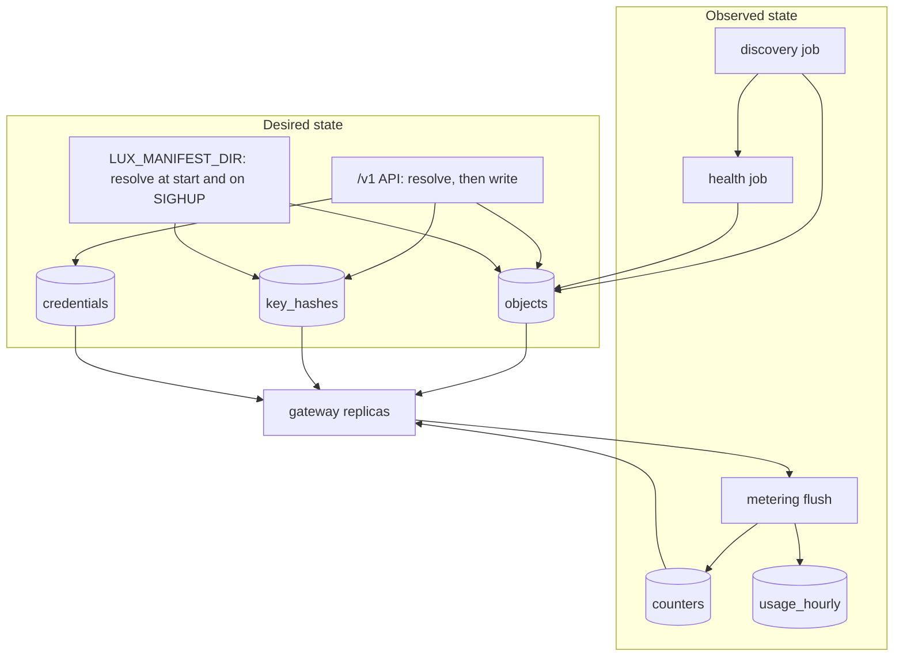

# State

## Overview

Two states, two owners. Desired state is what a caller applied,
resolved: the four kinds of [[003-manifest-contract]], the SHA-256
hash of every Key's value, and the sealed ciphertext of every
Provider's credential. It is the control plane's. Observed state is
what the data plane reports: a Provider's health, the Models discovery
found, the spend in every open window, and the aggregates of
[[009-usage-and-metering]]. It is the gateway's, accumulated per
replica and flushed. No observed state ever overwrites desired state
([[001-architecture]], invariant 10).

Three implementations behind one interface. Memory is the default and
lets one binary run with nothing beside it. Postgres, selected by
`LUX_DB_URL`, makes desired state and the spend windows survive a
restart and be shared by every replica. The file mode, selected by
`LUX_MANIFEST_DIR`, makes a directory of manifests the desired state
and the API read-only, which is how a gateway runs beside a workload
with no database, no issuer, and no way for a caller to change what it
serves.

This spec is `internal/store`'s implementation contract: the interface,
the rows, the indexes, the three modes, and the conformance suite that
holds them to one behaviour.

## Current state

Nothing is built. The hosted gateway keeps everything in one Postgres
schema, reads a key's spend from the same table it bills from on every
request, and has no mode that runs without a database. The split into
desired and observed, the counters as their own table, and the file
mode are what this spec adds.

## Design

### The two states



Discovery and health write into `objects`, which looks like observed
state overwriting desired state and is not: discovery writes whole
Models whose `status.source` is `discovered`, which no caller applied,
and health writes `status` alone through `PutStatus`, which no resolve
reads. A declared object's `spec` is written by the API and by nothing
else.

### The contract

```go
// Store is what internal/serve constructs and every consumer takes as
// an interface. The three implementations differ in durability and in
// how many replicas may share them, never in behaviour.
type Store interface {
	Objects() Objects
	Keys() Keys
	Credentials() Credentials
	Counters() Counters
	Leases() Leases
	Journal() Journal
	Tunnels() Tunnels // the tunnel registry: Register, Heartbeat, Get, Unregister (013)
	Usage() Usage
	Ready(ctx context.Context) error
	Close() error
}

// Objects holds desired state: the resolved manifest of every kind.
// Version is optimistic concurrency: a caller reads an object with its
// version, resolves, and writes with that version; a row that moved in
// between is ErrVersionConflict, which 011 returns as 409.
type Objects interface {
	Put(ctx context.Context, obj v1.Object, ifVersion int64) (version int64, err error) // 0 creates
	Get(ctx context.Context, kind, id string) (v1.Object, int64, error)
	ByName(ctx context.Context, kind, name string) (v1.Object, int64, error)
	List(ctx context.Context, kind string, f Filter, p Page) (objs []v1.Object, next string, err error)
	Delete(ctx context.Context, kind, id string) error // marks deleted; the row stays until the journal is drained
	PutStatus(ctx context.Context, kind, id string, status any) error
}

// Filter selects without reading every row. Labels is equality over
// every pair; Source and Provider are what the discovery job needs to
// find the Models of one Provider.
type Filter struct {
	Owner    string
	Labels   map[string]string
	Source   string // declared | discovered
	Provider string // a prv_ id named by a target
	IDs      []string
}

type Page struct {
	Limit  int
	Cursor string
}

// Keys is the door's lookup: one hash to one key id, and nothing else.
// The value itself is never stored in any form but this hash, the
// SHA-256 of the value in hex (007).
type Keys interface {
	Put(ctx context.Context, keyID, hash string) error
	ByHash(ctx context.Context, hash string) (keyID string, err error) // ErrNotFound
	Delete(ctx context.Context, keyID string) error
}

// Sealed is the row shape of a credential: four byte slices and a
// version, and nothing that could open them. It is declared here
// rather than in internal/secrets so the import points from the
// package that holds the key encryption keys toward the package that
// holds the rows, and never back (005).
type Sealed struct {
	Version      int
	WrappedKey   []byte
	WrappedNonce []byte
	Ciphertext   []byte
	Nonce        []byte
}

// Credentials is ciphertext in and ciphertext out. The store holds no
// key encryption key and has no method that returns a plaintext;
// internal/secrets seals and opens (005). There is exactly one way to
// write a credential.
type Credentials interface {
	Put(ctx context.Context, providerID string, s Sealed) error
	Get(ctx context.Context, providerID string) (Sealed, error)
	Delete(ctx context.Context, providerID string) error
	List(ctx context.Context) (providerIDs []string, err error)
}

// Counters is the spend arithmetic of 009: one key names one window of
// one object. Add is atomic and returns the new total, so a flush is
// one round trip that both writes a delta and refreshes the replica's
// view.
type Counters interface {
	Add(ctx context.Context, key string, delta int64, expiresAt time.Time) (total int64, err error)
	Read(ctx context.Context, keys []string) (map[string]int64, error)
	Prune(ctx context.Context, before time.Time) (n int, err error)
}

// Leases name the jobs that must run on one replica at a time.
type Leases interface {
	Acquire(ctx context.Context, name, holder string, ttl time.Duration) (held bool, err error)
	Release(ctx context.Context, name, holder string) error
}

// Journal is the durable side of the events of 012.
type Journal interface {
	Append(ctx context.Context, e Event) (seq int64, err error) // seq is per object, monotonic
	Pending(ctx context.Context, limit int) ([]Event, error)    // unacknowledged, due, at most one per object, oldest seq first
	Acknowledge(ctx context.Context, id string) error
	Defer(ctx context.Context, id string, attempts int, next time.Time) error
	Drop(ctx context.Context, id string) error
	ByObject(ctx context.Context, objectID string, p Page) ([]Event, string, error)
	// Since reads the journal in global order, which is what a replica
	// tails to invalidate its Key cache before the cache window lapses
	// (007). Event.GSeq is the store-wide sequence; Event.Seq is the
	// per-object one delivery orders by.
	Since(ctx context.Context, afterGSeq int64, limit int) ([]Event, error)
	Prune(ctx context.Context, before time.Time) (n int, err error)
}

// Usage is the aggregate side of 009. Records are not rows: the
// durable record set is the archive of 012, and AppendRecord feeds the
// bounded ring the memory mode serves GET /v1/requests from.
type Usage interface {
	AddRows(ctx context.Context, rows []metering.Row) error
	QueryRows(ctx context.Context, q metering.Query) ([]metering.Row, error)
	AppendRecord(ctx context.Context, r metering.Record) error
	Records(ctx context.Context, q metering.RecordQuery, p Page) ([]metering.Record, string, error)
}
```

Errors the interface names: `ErrNotFound`, `ErrVersionConflict`,
`ErrNameTaken`, `ErrReadOnly`. A name is unique per kind in one
installation among objects that are not deleted
([[003-manifest-contract]]), which is what backs `ErrNameTaken` and
what lets a name be reused after a delete. Lease names are `discovery`,
`health`, `journal`, and `usage`; every TTL is 15 seconds and a holder
renews at a third of it.

### Memory

The default, and what every unit test runs against. Maps under one
mutex per collection. `Ready` is always nil. Desired state, the
counters, the journal, and the aggregates live with the process and are
gone at its end, which the start-up log says in one line naming the
three consequences: no recovery, every window starts empty, and this
process is assumed to be the only replica, because two in-memory
replicas cannot detect each other. `AppendRecord` keeps
`metering.RecordsPerKey` records per key in a ring.

### Postgres

Selected by `LUX_DB_URL`, a `postgres://` URL. One `pgxpool` for the
process, sized by `LUX_DB_MAX_CONNS`, default 8: a managed cluster caps
its connections in the low tens and a replica set multiplies whatever
one process opens, so a pool sized for one process is an outage at
three. An installation that needs more raises the variable against a
cluster it has measured, rather than the default carrying the
assumption.

| Table | Columns | Holds |
|---|---|---|
| `objects` | `kind`, `id` pk, `name`, `owner`, `source`, `version` bigint, `spec` jsonb, `status` jsonb, `labels` jsonb, `created_at`, `updated_at`, `deleted_at` | desired state; `spec` is the resolved metadata and spec, `status` is written only by `PutStatus` |
| `key_hashes` | `hash` bytea pk, `key_id` text unique, `created_at` | the door's lookup |
| `credentials` | `provider_id` text pk, `version` int, `wrapped_key` bytea, `wrapped_nonce` bytea, `ciphertext` bytea, `nonce` bytea, `updated_at` | the sealed credential; the wrapped key and the ciphertext are separate columns so a re-wrap touches one |
| `counters` | `key` text pk, `value` bigint, `expires_at` | the spend windows |
| `leases` | `name` text pk, `holder`, `expires_at` | the jobs |
| `journal` | `id` text pk, `gseq` bigserial, `object_id`, `seq` bigint, `type`, `at`, `payload` jsonb, `attempts` int, `next_attempt_at`, `acked_at` | the events of 012 |
| `usage_hourly` | the dimensions and sums of [[009-usage-and-metering]] | the aggregates |

Indexes, one per query shape:

| Index | Serves |
|---|---|
| `objects (kind, name) unique where deleted_at is null` | `ByName`, `ErrNameTaken` |
| `objects (kind, owner) where deleted_at is null` | the owner-filtered list |
| `objects (kind, source) where deleted_at is null` | discovery's sweep over one Provider's Models |
| GIN on `objects (labels)` | the label selector |
| `key_hashes (hash)` | the primary key, which is the hot path's one lookup |
| `counters (expires_at)` | `Prune` |
| `journal (object_id, seq)` | `ByObject` |
| `journal (gseq)` | `Since`, the Key cache's tail |
| `journal (next_attempt_at) where acked_at is null` | `Pending` |
| `usage_hourly (bucket)` and the primary key over the dimensions | the range query and the upsert |

`Add` on `counters` is one `INSERT ... ON CONFLICT (key) DO UPDATE SET
value = counters.value + excluded.value RETURNING value`, so two
replicas adding at once produce one total and neither reads before it
writes. `Acquire` on `leases` is the same shape with a predicate on
`expires_at`.

Migrations are embedded under `migrations/` and applied at start by
`latere.ai/x/pkg/pgxmigrate.Up`, which takes the URL with its scheme
rewritten to `pgx5://`. Before applying, the store reads
`schema_migrations`: a version above the highest embedded migration is
a start-up failure naming both, since `Up` would report no change and
then run against a schema it does not know, and a dirty flag is a
start-up failure naming the version for an operator to repair. `Ready`
is `SELECT 1` with a one second budget and is the readiness check named
`store`. No package outside `internal/store` imports the driver or the
migrator.

### The file mode

`LUX_MANIFEST_DIR` names a directory. Every `*.yaml` and `*.json` file
under it and its subdirectories is read at start, sorted by path. One
spelling per format: a `.yml` file is not read, and a file that should
have been is a silent absence, so `luxd check` lists what was read.

Files are decoded, then resolved in kind order, Provider, Budget,
Model, Key, because a Model names a Provider and a Key names a Model
and a Budget. Within a kind, path order then document order. Every
object goes through the same `manifest.Resolve` every other surface
uses, with `Options.FileMode` set, so a manifest means the same thing
here as through the API ([[001-architecture]], invariant 1).

`FileMode` admits the two fields whose values cannot be minted or
sealed without a store:

| Field | Rule |
|---|---|
| `Provider.spec.credential.valueFrom.env` | a POSIX variable name read from the process environment at start; `exclusive_fields` with `value`; `invalid_field` in server mode ([[003-manifest-contract]]) |
| `Key.spec.valueFrom.env` | the same, and required in file mode: a Key the server did not mint has to get its value from somewhere, and an environment variable is the one place a manifest can name without putting a credential in a file that a deployment copies |

A file-mode Key's value must be `lux_` followed by 40 characters of the
URL-safe alphabet, the shape the server mints
([[001-architecture]]), so the door verifies one shape by one path in
every mode. The stored hash is SHA-256 of the value and
`status.prefix` is its first twelve characters, exactly as for a minted
Key. A value of another shape is a start-up failure naming the Key and
the variable, never the value.

The mode's other rules:

- The API serves the four kinds and the usage surfaces read-only, and
  only on the internal listener, which an operator and the cluster reach
  and a caller on the doors does not; with no issuer there is nothing to
  verify a public caller against, so the public listener's `/v1` answers
  `unauthenticated` ([[006-identity]]). Every `POST`, `PUT`, `PATCH`,
  and `DELETE` on a kind is refused `read_only`, which [[011-api]] maps
  to 405 with the sentence naming the directory; `PATCH` is not a route
  in any mode and is `not_found` first.
- `SIGHUP` re-reads the directory into a new snapshot and swaps it
  atomically. A failure leaves the running snapshot in place and logs
  the file and the JSON path; the process keeps serving what it had.
- A file that fails to decode or resolve at start is a start-up
  failure naming the file and the path inside it. There is no partial
  start: a directory that half applies is a gateway serving a policy
  nobody wrote.
- Counters are in memory, so spend limits and Budgets are per replica
  in this mode, with the per-replica multiplication of
  [[009-usage-and-metering]] applying to them as it does to rate
  limits. The start-up log says so.
- `LUX_MANIFEST_DIR` with `LUX_DB_URL` set is a configuration error
  naming both. The two answer the same question, where desired state
  comes from, and a precedence rule between them would be a silent
  decision about whose manifests win.
- No issuer is required ([[001-architecture]]), because nothing in the
  control plane can be changed by a caller.
- Discovery runs. Its Models are not in the directory and are not
  declared, so they live in the snapshot beside the file's objects, are
  visible read-only through the API, and are rebuilt after a re-read.

#### Configuration

| Variable | Default | Rule |
|---|---|---|
| `LUX_MANIFEST_DIR` | none | a readable directory; sets the file mode; a configuration error with `LUX_DB_URL` |
| `LUX_DB_URL` | none | a `postgres://` URL; absent is the memory store |
| `LUX_DB_MAX_CONNS` | `8` | at least 1, at most 100 |

### Replicas per mode

| Mode | Replicas | Desired state | Spend windows | Rate windows |
|---|---|---|---|---|
| memory | 1 | with the process | with the process, per replica | per replica |
| Postgres | many | shared and durable | shared, with the flush lag of [[009-usage-and-metering]] | per replica |
| file | many | the directory, identical on each | per replica | per replica |

A memory-mode process that finds itself behind a load balancer with
another has no way to say so; the start-up line is the only warning the
design can give, and `luxd check` repeats it.

### `luxd check`

| Line | Passes when |
|---|---|
| `store` | the mode is named; with Postgres the pool opens and `SELECT 1` answers inside the readiness budget |
| `migrations` | the embedded set and `schema_migrations` agree, and the schema is not dirty |
| `manifest dir` | in file mode, the directory is readable, the line names how many files were read per kind, and every one of them resolves |
| `db conns` | `LUX_DB_MAX_CONNS` times the replica count declared in the deployment is below the cluster's `max_connections` when the store can read it |

## Not in this spec

The schema and `Resolve` ([[003-manifest-contract]]); sealing, opening,
and rotating a credential ([[005-providers]]); how a Key's hash is
verified on the hot path ([[007-keys-and-limits]]); the record, the
cost, and the aggregate columns' meaning
([[009-usage-and-metering]]); the routes and the HTTP mapping of
`read_only` ([[011-api]]); the event payloads and the archive
([[012-request-log-and-events]]); backups and restores
([[017-release-and-installation]]).

## Acceptance criteria

| Criterion | Test that proves it | State |
|---|---|---|
| One suite covers every method of every interface and runs against memory and Postgres; the memory store is exempt only from durability across a restart and from the schema guards | `storetest.Run` driven by `TestStoreConformance` | not built |
| `Put` with a stale version is `ErrVersionConflict` and with the current version advances it; two concurrent writers at one version yield one success | `TestOptimisticConcurrency` | not built |
| A name is unique per kind among objects that are not deleted and is reusable after a delete | `TestNamesAreUniqueAmongLiveObjects` | not built |
| `PutStatus` never changes `spec` and a `Put` of a resolved object never changes `status` | `TestStatusAndSpecAreSeparate` | not built |
| `Add` under a thousand concurrent callers loses no delta and returns a total that equals their sum | `TestCountersAreAtomic` | not built |
| A lease is held by one holder; a second acquires only after the TTL lapses; a holder renews without losing it | `TestLeases` | not built |
| `Since` returns every event after a global sequence in order, across objects, and a tailing replica misses none | `TestJournalTail` | not built |
| After a restart with Postgres, every object, key hash, credential, and open spend window is what it was; with memory, the start-up log names the three consequences | `TestRestartKeepsState`, `TestMemoryStoreLogsItsAssumptions` | not built |
| `credentials` rows hold no plaintext under any key, the store has no method that returns one, and `internal/store` does not import `internal/secrets` | `TestStoreCannotDecrypt` | not built |
| A schema ahead of the binary and a dirty migration each refuse to start naming the version | `TestSchemaGuards` | not built |
| Every list, lookup, count, and upsert in the index table uses its index | `TestQueriesUseIndexes` with `EXPLAIN` | not built |
| No package outside `internal/store` imports the Postgres driver or the migrator | `TestDriverIsConfined` | not built |
| A directory of the four kinds in a deliberately wrong file order resolves in kind order and serves | `TestFileModeResolvesInKindOrder` | not built |
| A Provider credential and a Key value both come from the environment in file mode, and a Key value of the wrong shape is a start-up failure naming the Key and the variable and not the value | `TestFileModeValuesFromEnvironment` | not built |
| Every write to a kind is refused `read_only`; reads and the usage surfaces answer | `TestFileModeRefusesWrites` | not built |
| `SIGHUP` picks up an added, a changed, and a removed file; a directory that stops resolving leaves the previous snapshot serving and logs the file and path | `TestFileModeReReads` | not built |
| A file that fails to resolve at start is a start-up failure naming the file and the path, and nothing is served | `TestFileModeStartupNamesTheFailingFile` | not built |
| `LUX_MANIFEST_DIR` with `LUX_DB_URL` is a configuration error naming both | `TestFileModeAndDatabaseAreExclusive` | not built |
| Discovered Models appear in file mode, are read-only, and are rebuilt after a re-read | `TestFileModeDiscovery` | not built |
| `LUX_DB_MAX_CONNS` bounds the pool, and its default is 8 | `TestPoolIsBounded` | not built |
