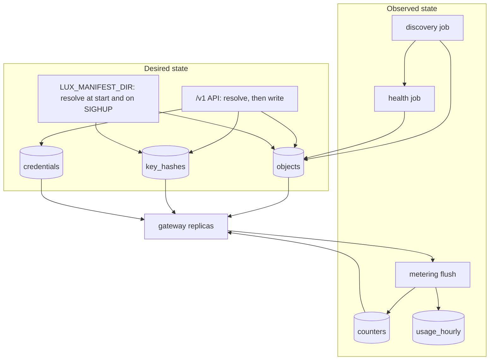

# State

## Overview

Two states, two owners. Desired state is what a caller applied,
resolved: the four kinds of [[003-manifest-contract]], the SHA-256
hash of every Key's value, and the sealed ciphertext of every
Provider's credential. It is the control plane's. Observed state is
what the data plane reports: a Provider's health, the Models discovery
found, the spend in every open window, and the aggregates of
[[009-usage-and-metering]]. It is the gateway's, accumulated per
replica and flushed. No observed state ever overwrites desired state
([[001-architecture]], invariant 10).

Three implementations behind one interface. Memory is the default and
lets one binary run with nothing beside it. Postgres, selected by
`LUX_DB_URL`, makes desired state and the spend windows survive a
restart and be shared by every replica. The file mode, selected by
`LUX_MANIFEST_DIR`, makes a directory of manifests the desired state
and the API read-only, which is how a gateway runs beside a workload
with no database, no issuer, and no way for a caller to change what it
serves.

This spec is `internal/store`'s implementation contract: the interface,
the rows, the indexes, the three modes, and the conformance suite that
holds them to one behaviour. The layout is `internal/store` for the
contract, its errors, and the memory store; `internal/store/postgres`
for the Postgres store with its embedded `migrations/`;
`internal/store/filemode` for the directory loader over the memory
store; and `internal/store/storetest` for the suite. Every consumer,
`internal/api`, `internal/serve`, `internal/rewrap`, `internal/check`,
imports `internal/store` and takes the `Store` interface; only
`internal/serve`, `internal/rewrap`, and `internal/check` construct an
implementation, by mode.

## Current state

Nothing is built. The repository holds the scaffold of
[[002-repository-scaffold]]: the binary serving its probes, typed
configuration, and the gate, on pkg v0.65.0.

## Design

### The two states



Discovery and health write into `objects`, which looks like observed
state overwriting desired state and is not: discovery writes whole
Models whose `status.source` is `discovered`, which no caller applied,
and health writes the observed members of `status` alone through
`PutStatus`, into a column of their own, which no resolve reads. A
declared object's `metadata`, `spec`, and the control plane's members
of `status` are written by the API through `Put` and by nothing else.
The two halves of `status` are merged on every read and are listed,
member by member, under the contract.

### The contract

```go
// Store is what internal/serve constructs and every consumer takes as
// an interface. The three implementations differ in durability and in
// how many replicas may share them, never in behaviour. The store
// mints no id: every id is the caller's, the prefixed ULID of 001
// (prv_, mdl_, key_, bud_, evt_), and is the primary key of its row.
type Store interface {
	Objects() Objects
	Keys() Keys
	Credentials() Credentials
	Counters() Counters
	Leases() Leases
	Journal() Journal
	Tunnels() Tunnels // the tunnel registry of 013: Register, Heartbeat, Get, Unregister
	// Usage, the aggregate side of 009, joins the interface with that
	// spec: its parameters are metering's types, which do not exist
	// before 009 lands, and a name is defined by one spec alone.
	// Transact runs fn against a Store whose writes commit together or
	// not at all. An apply is one Transact: the object, its journal
	// row, and a Key's hash or a Provider's credential (011, 012); a
	// Provider delete is the Provider, its discovered Models, its
	// credential, and the journal rows (005). The memory store holds
	// its write lock for the call; Postgres runs one transaction. A
	// Transact inside fn is ErrNested.
	Transact(ctx context.Context, fn func(tx Store) error) error
	Ready(ctx context.Context) error
	Close() error
}

// Objects holds desired state: the resolved manifest of every kind.
// Version is optimistic concurrency: a caller reads an object with its
// version, resolves, and writes with that version; a row that moved in
// between is ErrVersionConflict, which 011 returns as 409. The version
// starts at 1, advances by one on every Put, and is rendered as
// status.version and as the ETag (003, 011).
type Objects interface {
	// Put writes metadata, spec, and the control plane's status
	// members, in the table below; ifVersion 0 creates. The object
	// carries its id, owner, warnings, and the kind's control members;
	// Put writes back into it the row's id, version, createdAt, and
	// updatedAt, so the caller renders what was stored without a second
	// read. createdAt is the caller's on a create when set and the clock
	// otherwise, and the row's on an update; updatedAt is the caller's
	// when set and the clock otherwise; a Model with an empty source is
	// stored as declared. A create over a live row of the same kind and
	// name is ErrNameTaken, except a declared Model over a discovered
	// one, which is replaced in place: the id kept, source declared,
	// owner the actor's, version advanced, so a declared Model shadows a
	// discovered one without a delete (005). A create over an id already
	// used, live or deleted, is ErrVersionConflict; an update of an id
	// with no live row is ErrNotFound. Put never touches the observed
	// members.
	Put(ctx context.Context, obj v1.Object, ifVersion int64) (version int64, err error)
	// Get and ByName return the object with both halves of status
	// merged and its version; a deleted row is ErrNotFound.
	Get(ctx context.Context, kind, id string) (v1.Object, int64, error)
	ByName(ctx context.Context, kind, name string) (v1.Object, int64, error)
	// List returns live objects of one kind ordered by name ascending;
	// next is the cursor of the last row returned while rows remain, or
	// "" at the end; a Limit of 0 or less is every row.
	List(ctx context.Context, kind string, f Filter, p Page) (objs []v1.Object, next string, err error)
	// Delete marks the row deleted, so its name is free at once and its
	// id never is; the row is removed by Prune once its events are
	// acknowledged, so ByObject can still name it while they deliver. A
	// row that is not live is ErrNotFound, here and in Keys.Delete and
	// Credentials.Delete.
	Delete(ctx context.Context, kind, id string) error
	// PutStatus writes the observed members of status, in the table
	// below, and nothing else. observed is the kind's struct,
	// ProviderObserved, ModelObserved, KeyObserved, or BudgetObserved,
	// by value or pointer, each member a pointer, a string, or a time;
	// a zero member leaves the stored member as it was, so the health
	// and discovery jobs write their own members without reading each
	// other's, and a non-nil empty Targets clears the list. It takes no
	// version and never conflicts: every observed member has one writer,
	// the lease holder of its job, and Put never writes one.
	PutStatus(ctx context.Context, kind, id string, observed any) error
	// Prune removes deleted rows older than before whose journal rows
	// are all acknowledged or dropped.
	Prune(ctx context.Context, before time.Time) (n int, err error)
}

// Filter selects without reading every row. Labels is equality over
// every pair; Source and Provider are what the discovery job needs to
// find the Models of one Provider, and Provider is what provider_in_use
// and 011's ?provider= read.
type Filter struct {
	Owner    string
	Labels   map[string]string
	Source   string   // declared | discovered; selects Models alone
	Provider string   // a prv_ id: a target names it, or names by name the live Provider that has it
	IDs      []string
}

// Page is 011's limit and cursor, clamped by the API before it gets
// here. The cursor is opaque to a caller and is checked by the store:
// base64url of "<kind>|<8 hex of SHA-256 over the filter's canonical
// JSON>|<last name>"; a cursor whose kind or filter differs from the
// request's is ErrInvalidCursor. EncodeCursor and DecodeCursor in
// internal/store are the one encoding; Journal.ByObject uses it too,
// under the kind "journal", a Filter whose IDs name the object, and the
// last Seq as the last value.
type Page struct {
	Limit  int
	Cursor string
}

// Keys is the door's lookup: one hash to one key id, and nothing else.
// The value itself is never stored in any form but this hash, the
// SHA-256 of the value's exact bytes as 64 lower-case hex characters
// (007), whether the value was minted or supplied. Put on a key id
// that already has a hash replaces it, which is a rotation; a hash
// registered to another key id is ErrHashTaken, and the API calls Put
// inside the Transact that writes the Key, so a create is atomic (007).
// A hash of another shape than 64 lower-case hex characters is a plain
// error, a caller's mistake and never a row.
type Keys interface {
	Put(ctx context.Context, keyID, hash string) error
	ByHash(ctx context.Context, hash string) (keyID string, err error) // ErrNotFound
	Delete(ctx context.Context, keyID string) error
}

// Sealed is the row shape of a credential: four byte slices and a
// version, and nothing that could open them. It is declared here
// rather than in internal/secrets so the import points from the
// package that holds the key encryption keys toward the package that
// holds the rows, and never back (005).
type Sealed struct {
	Version      int    // status.credential.version: counts values, not wraps
	WrappedKey   []byte // 48 bytes
	WrappedNonce []byte // 12 bytes
	Ciphertext   []byte // the value plus 16 bytes
	Nonce        []byte // 12 bytes
}

// Credentials is ciphertext in and ciphertext out. The store holds no
// key encryption key and has no method that returns a plaintext;
// internal/secrets seals and opens (005). There is one way to write a
// value and one way to re-wrap its key, and they touch different
// columns.
type Credentials interface {
	Put(ctx context.Context, providerID string, s Sealed) error // a new value: every column
	// Rewrap writes the two wrap columns of the row at ifVersion and
	// nothing else; a row whose version moved is ErrVersionConflict,
	// so luxd rewrap never covers a value applied during its run.
	Rewrap(ctx context.Context, providerID string, ifVersion int, wrappedKey, wrappedNonce []byte) error
	Get(ctx context.Context, providerID string) (Sealed, error)
	Delete(ctx context.Context, providerID string) error
	List(ctx context.Context) (providerIDs []string, err error)
}

// Counters is the spend arithmetic of 009: one key names one window of
// one object. Add is atomic and returns the new total, so a flush is
// one round trip that both writes a delta and refreshes the replica's
// view. expiresAt is written by the Add that creates the key and left
// alone after, as ON CONFLICT DO UPDATE leaves it; a zero expiresAt is
// a window that never resets (window none) and is never pruned. Read
// answers the keys that have a row and leaves the others out.
type Counters interface {
	Add(ctx context.Context, key string, delta int64, expiresAt time.Time) (total int64, err error)
	Read(ctx context.Context, keys []string) (map[string]int64, error)
	Prune(ctx context.Context, before time.Time) (n int, err error)
}

// Leases name the jobs that must run on one replica at a time. Acquire
// by the holder that already holds the lease renews it and answers
// true; by another holder it answers true only once the row lapsed.
// Release by a holder that does not hold the lease changes nothing.
type Leases interface {
	Acquire(ctx context.Context, name, holder string, ttl time.Duration) (held bool, err error)
	Release(ctx context.Context, name, holder string) error
}

// Event is the journal row of one event of 012. Payload is the body
// exactly as it is delivered, so a retry and a replay send the same
// bytes and the same signature input.
type Event struct {
	ID            string    // evt_ and a ULID, the caller's
	GSeq          int64     // store-wide, monotonic, set by Append
	ObjectID      string
	Seq           int64     // per object, monotonic, set by Append
	Type          string
	At            time.Time
	Payload       []byte
	Attempts      int
	NextAttemptAt time.Time
	AckedAt       time.Time // zero while pending
}

// Journal is the durable side of the events of 012.
type Journal interface {
	// Append fills GSeq and Seq, At from the clock when zero, and
	// NextAttemptAt from At when zero; an event with no id or object id,
	// or an id already journalled, is a plain error.
	Append(ctx context.Context, e Event) (seq int64, err error) // seq is per object, monotonic
	// Pending is the unacknowledged rows that are due, at most one per
	// object, each the oldest of its object, oldest first; an object
	// whose oldest row is not yet due holds its later rows back.
	Pending(ctx context.Context, limit int) ([]Event, error)
	// Acknowledge, Defer, and Drop act on one row; a row not in the
	// journal is ErrNotFound. Drop removes the row, which is what lets
	// Prune count it as settled.
	Acknowledge(ctx context.Context, id string) error
	Defer(ctx context.Context, id string, attempts int, next time.Time) error
	Drop(ctx context.Context, id string) error
	ByObject(ctx context.Context, objectID string, p Page) ([]Event, string, error) // by Seq ascending
	// Since reads the journal in global order, which is what a replica
	// tails to invalidate its Key cache before the cache window lapses
	// (007) and what the discovery lease holder tails for a Provider
	// change (005). Event.GSeq is the store-wide sequence; Event.Seq is
	// the per-object one delivery orders by.
	Since(ctx context.Context, afterGSeq int64, limit int) ([]Event, error)
	Prune(ctx context.Context, before time.Time) (n int, err error) // acknowledged rows whose At is at or before before
}

// Tunnels is 013's registry, declared there and implemented here. Its
// rules as the store holds them: Register replaces whatever row the
// Provider had and fills ConnectedAt from the clock when zero;
// Heartbeat answers false for a row another session holds and for no
// row at all; Get is ErrNotFound for a row that lapsed; Unregister by
// a session that does not hold the row changes nothing.

// Usage is the aggregate side of 009, and joins the interface with
// it. Records are not rows in any mode: the durable record set is the
// archive of 012, and AppendRecord feeds the process's own bounded
// ring, metering.RecordsPerKey per key, which Records answers and GET
// /v1/requests serves with source memory when no archive is
// configured, on Postgres as on memory.
type Usage interface {
	AddRows(ctx context.Context, rows []metering.Row) error
	QueryRows(ctx context.Context, q metering.Query) ([]metering.Row, error)
	AppendRecord(ctx context.Context, r metering.Record) error
	Records(ctx context.Context, q metering.RecordQuery, p Page) ([]metering.Record, string, error)
}
```

The two halves of `status`, by kind. `Put` writes the left column and
`PutStatus` the right; a read merges them; neither method writes the
other's members.

| Kind | Written by `Put`, the control plane's | Written by `PutStatus`, the observed |
|---|---|---|
| every kind | `id`, `owner`, `createdAt`, `updatedAt`, `warnings`; `version` is the row's | |
| `Provider` | `credential` ([[005-providers]]) | `health`, `discovered`, `tunnel` ([[005-providers]], [[013-tunnelled-runtimes]]) |
| `Model` | `source` | `available`, `targets[].health` ([[008-routing-and-models]]) |
| `Key` | `prefix`, `expiresAt`, `budget`, `selectors` ([[003-manifest-contract]], [[007-keys-and-limits]]) | `state`, `usage`, `lastUsedAt` ([[007-keys-and-limits]]) |
| `Budget` | | `state`, `spent`, `remaining`, `resetsAt`, `keys` ([[007-keys-and-limits]]) |

Errors the interface names: `ErrNotFound`, `ErrVersionConflict`,
`ErrNameTaken`, `ErrHashTaken`, `ErrReadOnly`, `ErrInvalidCursor`,
`ErrNested`. The first five are the ones [[011-api]] maps to a code,
`ErrHashTaken` to `invalid_field` at `spec.value` with a detail that
names no Key ([[007-keys-and-limits]]); `ErrInvalidCursor`
is `invalid_field` at `cursor` there, and `ErrNested` is a programming
error a test catches. A name is unique per kind in an installation among
objects that are not deleted ([[003-manifest-contract]]), which is what
backs `ErrNameTaken` and what lets a name be reused after a delete.
Lease names are `discovery`, `health`, `journal`, and `usage`; every TTL
is 15 seconds and a holder renews at a third of it. Every method of
every collection, and `Transact` and `Ready`, counts one
`lux_store_operations_total` with `op` its name as
`Collection.Method`, `Objects.Put`, and `result` `ok`, `conflict`, or
`error` ([[019-observability]]), through `store.Instrument(Store,
*metrics.Registry) Store`, which `internal/serve` wraps around whichever
implementation it built, passing the one registry of
[[019-observability]] because `latere.ai/x/pkg/metrics` has no default
registry to reach for. `ok` is an answer, `ErrNotFound` included,
because a lookup that finds nothing is the store working; `conflict` is
a refusal the contract names, `ErrVersionConflict`, `ErrNameTaken`,
`ErrHashTaken`, `ErrReadOnly`, and `ErrInvalidCursor`; `error` is the
store failing, an ended context or `ErrNested` included, which is the
one value the `LuxStoreFailing` alert reads. The `Store` handed to a
`Transact`'s `fn` counts the same way.

What satisfies the interfaces `gateway` and `metering` take is
`internal/serve`, never the store itself, so neither root package
imports `internal/` ([[001-architecture]]):

| Interface | Owner | Satisfied from |
|---|---|---|
| `gateway.KeyLookup` | [[004-request-path]] | `Keys().ByHash`, `Objects().Get`, the cache and the journal tail of [[007-keys-and-limits]] |
| `gateway.Catalog` | [[004-request-path]] | `Objects()`, Models and Providers by name, credential values never loaded |
| `gateway.CredentialSource` | [[004-request-path]] | `Credentials().Get` and `internal/secrets.Open` ([[005-providers]]) |
| `metering.CounterStore` | [[009-usage-and-metering]] | `Counters()`: `AddCounter` is `Add`, `ReadCounters` is `Read` |
| `gateway.Recorder` | [[004-request-path]] | `metering.Counters`, `Usage().AppendRecord`, `Usage().AddRows` on the flush, and `internal/reqlog` ([[012-request-log-and-events]]) |
| `gateway.HealthObserver` | [[004-request-path]] | the health job of [[005-providers]], which writes through `Objects().PutStatus` |

### Memory

The default, and what every unit test runs against. Maps under one
mutex per collection and one write lock for `Transact`. `Ready` is
always nil. Desired state, the counters, the journal, and the
aggregates live with the process and are gone at its end, which the
start-up log says in one line naming the three consequences: no
recovery, every window starts empty, and this process is assumed to be
the only replica, because two in-memory replicas cannot detect each
other. `AppendRecord` keeps `metering.RecordsPerKey` records per key in
a ring. A credential is sealed exactly as on Postgres and held as a
`Sealed` row ([[005-providers]]). The file mode below is this store
loaded from a directory.

### Postgres

Selected by `LUX_DB_URL`, a `postgres://` URL. The driver is
`github.com/jackc/pgx/v5`, one `pgxpool.Pool` for the process with
`MaxConns` `LUX_DB_MAX_CONNS`, default 8, `MinConns` 1,
`MaxConnIdleTime` 60s, and `MaxConnLifetime` 30m: a managed cluster
caps its connections in the low tens and a replica set multiplies
whatever one process opens, so a pool sized for one process is an
outage at three. An installation that needs more raises the variable
against a cluster it has measured, rather than the default carrying the
assumption. The migrator is `github.com/golang-migrate/migrate/v4`
through `latere.ai/x/pkg/pgxmigrate.Up(dsn, fs, dir)`, with that
module's `database/pgx/v5` driver blank-imported and its `source/iofs`
reading the embedded files; `pgxmigrate` itself imports no driver and
asks the caller to. The two module paths are the two `depcheck` rows
this spec adds to `./cmd/luxd`, `internal/serve`, `internal/rewrap`,
and `internal/check` in `.lateregate.yaml`, each with this reason, and
[[001-architecture]]'s build list names them as "the Postgres driver
for the store". The migrator opens a `database/sql` pool of its own for
the length of `Up` and closes it, so a start briefly holds
`LUX_DB_MAX_CONNS` plus one connection.

| Table | Columns | Holds |
|---|---|---|
| `objects` | `kind` text, `id` text pk, `name` text, `owner` text, `source` text, `version` bigint, `spec` jsonb, `status` jsonb, `observed` jsonb, `labels` jsonb, `providers` text[], `created_at`, `updated_at`, `deleted_at` timestamptz | desired state; `spec` is the resolved `metadata` and `spec`, `status` the control plane's members, `observed` the members `PutStatus` writes, `providers` the `prv_` ids a Model's targets name and empty for the other kinds |
| `key_hashes` | `hash` text pk, 64 lower-case hex, `key_id` text unique, `created_at` | the door's lookup |
| `credentials` | `provider_id` text pk, `version` int, `wrapped_key` bytea, `wrapped_nonce` bytea, `ciphertext` bytea, `nonce` bytea, `updated_at` | the sealed credential; the wrapped key and the ciphertext are separate columns so a re-wrap touches one |
| `counters` | `key` text pk, `value` bigint, `expires_at` timestamptz null | the spend windows; null is a `none` window |
| `leases` | `name` text pk, `holder` text, `expires_at` timestamptz | the jobs |
| `journal` | `id` text pk, `gseq` bigserial, `object_id` text, `seq` bigint, `type` text, `at` timestamptz, `payload` jsonb, `attempts` int, `next_attempt_at` timestamptz, `acked_at` timestamptz null | the events of 012 |
| `tunnels` | `provider_id` text pk, `session` text, `replica` text, `subject` text, `agent` text, `connected_at`, `expires_at` timestamptz | the registry of [[013-tunnelled-runtimes]], one live row per tunnelled Provider |
| `usage_hourly` | the dimensions and sums of [[009-usage-and-metering]] | the aggregates |

Indexes, one per query shape:

| Index | Serves |
|---|---|
| `objects (kind, name) unique where deleted_at is null` | `ByName`, `ErrNameTaken`, and the ordered `List` with its keyset cursor |
| `objects (kind, owner) where deleted_at is null` | the owner-filtered list |
| GIN on `objects (providers) where deleted_at is null` | `Filter.Provider`: discovery's sweep over one Provider's Models, `provider_in_use`, and `?provider=` |
| `objects (kind, source) where deleted_at is null` | `?source=` |
| GIN on `objects (labels)` | the label selector |
| `objects (deleted_at) where deleted_at is not null` | `Prune` |
| `key_hashes (hash)` | the primary key, which is the hot path's one lookup |
| `counters (expires_at) where expires_at is not null` | `Prune` |
| `journal (object_id, seq)` | `ByObject`, and the per-object claim of `Pending` |
| `journal (gseq)` | `Since`, the Key cache's tail and the discovery tail |
| `journal (next_attempt_at) where acked_at is null` | `Pending` |
| `tunnels (provider_id)` | the primary key, read per request toward a tunnelled Provider |
| `usage_hourly (bucket)` and the primary key over the dimensions | the range query and the upsert |

`Add` on `counters` is one `INSERT ... ON CONFLICT (key) DO UPDATE SET
value = counters.value + excluded.value RETURNING value`, so two
replicas adding at once produce one total and neither reads before it
writes. `Acquire` on `leases` is the same shape with a predicate on
`expires_at` or `holder`. `Put` on `objects` is one `UPDATE ... WHERE
id = $1 AND version = $2` whose zero rows affected is
`ErrVersionConflict`, and `Rewrap` on `credentials` the same over
`version`.

#### Migrations

Migrations are embedded under `internal/store/postgres/migrations/` as
`<version>_<name>.up.sql`, with no `.down.sql`: the way back is the
previous binary, below. `<version>` is `M000nnn`, the schema major `M`
followed by a six-digit ordinal, so the first migration of `v1` is
`1000001_init.up.sql`, and the major is read back from the version by
integer division. They are applied at the start of `luxd serve` by
`pgxmigrate.Up` over the URL with its scheme rewritten to `pgx5://`,
which retries the open for ten seconds so a rolling deploy whose
outgoing replica still holds its pool does not fail the incoming one.
`luxd check` applies nothing and reports; `luxd rewrap` applies nothing
and refuses a schema not at its own highest version.

Before applying, the store reads golang-migrate's `schema_migrations`
(`version bigint, dirty boolean`) and holds the schema to three rules:

| The stored version | `luxd serve` does |
|---|---|
| dirty | refuses to start naming the version, for an operator to repair; `Up` is never retried over a dirty schema because it can only report the dirt |
| another major than the binary's | refuses to start naming both, because a schema of another major is one this binary cannot read, and `docs/upgrades/<major>.md` of [[017-release-and-installation]] is the way across |
| the binary's major, above its highest embedded | logs one `WARN` line naming both and serves, because the additive rule below guarantees it can read the schema; this is what makes `kubectl rollout undo` inside a major a rollback and not an outage |
| at or below the binary's highest | applies what is missing and serves |

The additive rule, which [[017-release-and-installation]]'s version
promise cites: within a major a migration only creates a table, adds a
nullable or defaulted column, or adds an index, and never drops,
renames, or retypes anything, so the previous minor's binary keeps
reading and writing every row during a roll and after an undo. A
change that needs a drop, a rename, or a retype is the first migration
of a new major, with the upgrade document. `TestMigrationsAreAdditive`
holds every `.up.sql` of the current major to that grammar.

`Ready` is `SELECT 1` with a one second budget and is the readiness
check named `store`, a `latere.ai/x/pkg/health.Check`, joined to the
scaffold's readiness ([[002-repository-scaffold]]). No package outside
`internal/store/postgres` imports the driver or the migrator.

### The file mode

`LUX_MANIFEST_DIR` names a directory. Every `*.yaml` and `*.json` file
under it and its subdirectories is read at start, sorted by path. One
spelling per format: a `.yml` file is not read, and a file that should
have been is a silent absence, so `luxd check` lists what was read.
One file is one object, decoded by `manifest.Decode` with an empty
hint: a file with a second YAML document is `multi_document` and a
start-up failure like any other refusal ([[003-manifest-contract]]).

Files are decoded, then resolved in kind order, Provider, Budget,
Model, Key, because a Model names a Provider and a Key names a Model
and a Budget. Within a kind, path order. Every object goes through the
same `manifest.Resolve` every other surface uses, with these `Options`,
so a manifest means the same thing here as through the API
([[001-architecture]], invariant 1):

| Option | Value in file mode |
|---|---|
| `Actor.Subject` | the rendered subject `file|manifest-dir`, the `owner` of every object the directory declares, since the mode has no issuer and no subject of its own |
| `Lookup` | the snapshot being built: a Provider or Budget by name or id among those already resolved, and `Models(selector)` over the declared Models of the snapshot; every reference is allowed, because there is no authorizer to ask, and a missing one is `not_found` at the field |
| `FileMode` | `true` |
| `TunnelEnabled` | `false`: a tunnel session needs a bearer on `/v1`, which the mode has no issuer to verify, so `tunnel: true` is `invalid_field` at `spec.tunnel` |
| `Defaults`, `AllowPrivateUpstreams`, `PublicURL` | from the configuration, as the API sets them ([[011-api]]) |
| `Existing` | nil at start; on a re-read, the snapshot's object of the same kind and name, so the immutable-field rule holds across re-reads |
| `Now`, `NewName` | the clock; `NewName` is never called, because a file without `metadata.name` is `missing_field` |

`FileMode` admits the two fields whose values cannot be minted or
sealed without a store, and only those; `Key.spec.value` is
`invalid_field` here as [[003-manifest-contract]] says:

| Field | Rule |
|---|---|
| `Provider.spec.credential.valueFrom.env` | a POSIX variable name read from the process environment at start and at each re-read; `exclusive_fields` with `value`; `invalid_field` in server mode ([[003-manifest-contract]]); unset or empty is a start-up failure naming the Provider and the variable ([[005-providers]]) |
| `Key.spec.valueFrom.env` | the same, and required in file mode: a Key the server did not mint has to get its value from somewhere, and an environment variable is the one place a manifest can name without putting a credential in a file that a deployment copies |

A file-mode Key's value must match `^lux_[A-Za-z0-9_-]{40}$`, the
shape the server mints ([[007-keys-and-limits]]), so a file-mode Key
is indistinguishable from a minted one everywhere it is shown; the door
itself checks no shape and looks up the hash of whatever it was handed
([[001-architecture]]). The stored hash is SHA-256 of the value and
`status.prefix` is its first twelve characters, exactly as for a minted
Key. A value of another shape is a start-up failure naming the Key and
the variable, never the value.

Ids in file mode are minted by the loader, a fresh ULID per object at
start, and preserved by kind and name across a re-read, so an id is
stable for the life of the process and differs between starts and
between replicas; a client of the mode addresses by name, and the
start-up log says so. A `Provider`'s `status.credential.version` is 1
and `status.owner` is the file subject above; `status.credential.set`
is false for a Provider that names no credential. An inline
`credential.value` in a file is admitted, because
[[003-manifest-contract]] resolves it in every mode and a manifest means
one thing on every surface, and is held in memory exactly as a
variable's value is. A Key that names no `valueFrom.env` is a start-up
failure naming the Key, and two files that declare one kind and name
are a start-up failure naming both files.

The package is `internal/store/filemode`: `Load(ctx, Options)` reads
the directory and returns the `Store` or the start-up failure, with
`Options` carrying the directory, `Getenv`, the clock, and the three
resolver options above; `Reload(ctx)` is the `SIGHUP` re-read;
`Summary()` is what the last read produced, files and objects per
kind, which the start-up line and `luxd check`'s `manifest dir` row
print; `Notice()` is that line's substance; `CredentialValue(providerID)`
is the value a Provider's credential names, held for the life of the
process, which is the seam `internal/serve` gives the gateway's
`CredentialSource` in this mode, since `Credentials` refuses every call.
A re-read is one `Transact` of the memory store beneath: declared
objects the directory no longer holds are deleted with their hash and,
for a Provider, its discovered Models; a Provider whose `dialect` or
`baseURL` changed loses its discovered Models; a changed object is
written at its row's version, a new one created, and an unchanged one,
same `metadata` and `spec` in JSON, is left at its version, so an ETag
moves only when the file did; every Key's hash is put, because the
variable may have been rotated under an unchanged file; and the deleted
rows are pruned. A discovered Model written in this mode is owned by
the file subject whatever its writer set, which is what makes the
discovery row below true by construction.

The mode's other rules:

- The store is the memory store loaded from the directory, with the
  control plane's writes refused: `Objects.Put` and `Objects.Delete`
  of a `declared` object, `Keys.Put` and `Keys.Delete`, and every
  `Credentials` method are `ErrReadOnly`, with the developer detail
  naming the directory and the refused call; a `Delete` of a row that
  is not live is `ErrNotFound` first, as in every mode. Everything the
  jobs and the data plane write, discovered Models, `PutStatus`,
  counters, leases, the journal, the tunnel registry, and the
  aggregates, is admitted, because the mode is read-only for callers,
  not for the gateway. The rules hold on the `Store` a `Transact` hands
  out as on the outer one.
- The API serves the four kinds and the usage surfaces read-only, and
  only on the internal listener, which an operator and the cluster reach
  and a caller on the doors does not; with no issuer there is nothing to
  verify a public caller against, so the public listener has no `/v1`
  ([[006-identity]], [[011-api]]). Every `POST`, `PUT`, and `DELETE`
  on a kind is refused `read_only`, which [[011-api]] maps to 405 with
  the fixed sentence and the developer detail naming the directory;
  `PATCH` is not a route in any mode and is `not_found` first.
- `SIGHUP` re-reads the directory into a new snapshot and swaps it
  atomically, and the swap empties the replica's Key cache of
  [[007-keys-and-limits]], so a Key removed from the directory is
  refused at the next request. A failure leaves the running snapshot in
  place and logs the file and the JSON path; the process keeps serving
  what it had. Discovered Models of a Provider whose `dialect` and
  `baseURL` are unchanged are carried into the new snapshot, so a
  re-read costs no `model_not_found` until the next list; those of a
  Provider that changed or went are dropped with it.
- A file that fails to decode or resolve at start is a start-up
  failure naming the file and the path inside it. There is no partial
  start: a directory that half applies is a gateway serving a policy
  nobody wrote.
- Counters are in memory, so spend limits and Budgets are per replica
  in this mode, with the per-replica multiplication of
  [[009-usage-and-metering]] applying to them as it does to rate
  limits. The start-up log says so.
- Leases are per replica too, so every replica runs its own discovery
  and health jobs over its own snapshot, and a state change raises its
  event on every replica: an installation of `n` file-mode replicas
  with a sink configured delivers `n` `provider.unreachable` events for
  one outage, each with its own `evt_` id, where the store-backed modes
  deliver one ([[012-request-log-and-events]]). The start-up log says
  so when `LUX_EVENTS_URL` is set.
- `LUX_MANIFEST_DIR` with `LUX_DB_URL` set is a configuration error
  naming both. The two answer the same question, where desired state
  comes from, and a precedence rule between them would be a silent
  decision about whose manifests win. `LUX_SECRETS_KEK` is read and
  unused, because nothing is sealed ([[005-providers]]).
- No issuer is required ([[001-architecture]]), because nothing in the
  control plane can be changed by a caller.
- Discovery runs. Its Models are not in the directory and are not
  declared, so they live in the snapshot beside the file's objects and
  are visible read-only through the API.

#### Configuration

| Variable | Default | Rule |
|---|---|---|
| `LUX_MANIFEST_DIR` | none | a readable directory; sets the file mode; a configuration error with `LUX_DB_URL` |
| `LUX_DB_URL` | none | a `postgres://` URL, its `sslmode` included, which the driver honours as written and the gateway neither adds to nor relaxes; absent is the memory store |
| `LUX_DB_MAX_CONNS` | `8` | an integer, at least 1, at most 100; read only with `LUX_DB_URL` |

The three are in [[002-repository-scaffold]]'s table with this spec as
their owner, and this spec introduces no other variable. The
`valueFrom.env` variables a file-mode manifest names are that table's
one row owned by [[005-providers]], named by the manifests rather than
by a spec.

### Replicas per mode

| Mode | Replicas | Desired state | Spend windows | Rate windows | Leases and events |
|---|---|---|---|---|---|
| memory | 1 | with the process | with the process, per replica | per replica | the one process holds every lease |
| Postgres | many | shared and durable | shared, with the flush lag of [[009-usage-and-metering]] | per replica | one holder per job across the installation; one event per state change |
| file | many | the directory, identical on each | per replica | per replica | per replica; one event per state change per replica |

A memory-mode process that finds itself behind a load balancer with
another has no way to say so; the start-up line is the only warning the
design can give, and `luxd check` repeats it.

### `luxd check`

| Line | Passes when |
|---|---|
| `store` | the mode is named; with Postgres the pool opens and `SELECT 1` answers inside the readiness budget |
| `migrations` | the schema is not dirty and is of the binary's major; the line names the stored and the embedded highest version, `ok` when they agree or the stored one is behind, `warn` when it is ahead within the major, `fail` when dirty or of another major |
| `manifest dir` | in file mode, the directory is readable, the line names how many files were read per kind, and every one of them resolves |
| `db conns` | with Postgres, the line reads `max_connections` and `superuser_reserved_connections` from the cluster and prints them beside `LUX_DB_MAX_CONNS` plus one; it warns when two replicas' worth, the base Deployment's count of [[017-release-and-installation]], exceeds `max_connections` minus the reserved slots, and fails when one replica's does |

## Not in this spec

The schema and `Resolve` ([[003-manifest-contract]]); sealing, opening,
and rotating a credential ([[005-providers]]); how a Key's hash is
verified on the hot path ([[007-keys-and-limits]]); the record, the
cost, and the aggregate columns' meaning
([[009-usage-and-metering]]); the routes and the HTTP mapping of
`read_only` ([[011-api]]); the event payloads and the archive
([[012-request-log-and-events]]); backups and restores
([[017-release-and-installation]]).

## Acceptance criteria

| Criterion | Test that proves it | State |
|---|---|---|
| One suite, `storetest.Run(t, func(t *testing.T) store.Store)`, covers every method of every collection, `Transact`, and the tunnel registry of [[013-tunnelled-runtimes]], and runs against memory and Postgres; the memory store is exempt only from durability across a restart and from the schema guards | `storetest.Run` driven by `TestStoreConformance` and the postgres tier's `TestPostgresStoreConformance` ([[015-test-stubs-and-tiers]]) | not built |
| `Put` with a stale version is `ErrVersionConflict` and with the current version advances it by one from 1; two concurrent writers at one version yield one success | `TestOptimisticConcurrency` | not built |
| A name is unique per kind among objects that are not deleted and is reusable after a delete; a declared Model `Put` at version 0 over a discovered one of that name keeps the id, sets `source` `declared` and the actor's owner, and advances the version rather than `ErrNameTaken` | `TestNamesAreUniqueAmongLiveObjects`, `TestDeclaredReplacesDiscoveredInPlace` | not built |
| `PutStatus` changes no member of the control plane's column and `Put` changes no member of the observed column, for every member in the table by kind; a read merges both | `TestStatusHalvesAreSeparate`, table-driven over the members | not built |
| `Transact` commits an object, its journal row, and its hash or credential together, and a failure inside `fn` leaves none of them; a nested `Transact` is `ErrNested` | `TestTransactIsAtomic`, `TestTransactRefusesNesting` | not built |
| `List` returns a kind ordered by name; a cursor resumes after the last name, a cursor from another kind or filter is `ErrInvalidCursor`, and `Filter.Provider` returns exactly the Models with a target on that Provider | `TestListOrderAndCursor`, `TestFilterByProvider` | not built |
| `Add` under a thousand concurrent callers loses no delta and returns a total that equals their sum; a zero `expiresAt` is never pruned | `TestCountersAreAtomic`, `TestNoneWindowIsNeverPruned` | not built |
| A lease is held by one holder; a second acquires only after the TTL lapses; the holder's own `Acquire` renews without losing it | `TestLeases` | not built |
| `Since` returns every event after a global sequence in order, across objects, and a tailing replica misses none; `Pending` returns at most one event per object, the oldest `Seq` first | `TestJournalTail`, `TestPendingIsOnePerObject` | not built |
| `Keys.Put` on an existing key id replaces the hash and the old hash is `ErrNotFound` at once; `Credentials.Rewrap` at a stale version is `ErrVersionConflict` and at the current one changes the two wrap columns and no other | `TestKeyHashReplacesOnRotate`, `TestRewrapTouchesTheWrapColumnsOnly` | not built |
| After a restart with Postgres, every object, key hash, credential, open spend window, and pending event is what it was; with memory, the start-up log names the three consequences | `TestRestartKeepsState`, `TestMemoryStoreLogsItsAssumptions` | not built |
| `credentials` rows hold no plaintext under any key, the store has no method that returns one, and no package under `internal/store` imports `internal/secrets` | `TestStoreCannotDecrypt` | not built |
| A dirty schema and a schema of another major each refuse to start naming the version; a schema ahead within the binary's major starts with one `WARN` naming both and serves; a schema behind is migrated | `TestSchemaGuards`, table-driven over the four rows | not built |
| Every `.up.sql` of the current major only creates a table, adds a nullable or defaulted column, or adds an index, and no `.down.sql` exists | `TestMigrationsAreAdditive` | not built |
| Every list, lookup, count, and upsert in the index table uses its index | `TestQueriesUseIndexes` with `EXPLAIN` | not built |
| No package outside `internal/store/postgres` imports `github.com/jackc/pgx/v5` or `github.com/golang-migrate/migrate/v4`, and both are `depcheck` rows of `./cmd/luxd` and the three role packages | `TestDriverIsConfined`, the `depcheck` gate | not built |
| Every store method increments `lux_store_operations_total` once with its name and `ok`, `conflict`, or `error` | `TestStoreOperationsAreCounted` | not built |
| A directory of the four kinds in a deliberately wrong file order resolves in kind order and serves; a file with two documents is a start-up failure naming the file and `multi_document`; a `.yml` file is not read | `TestFileModeResolvesInKindOrder`, `TestFileModeIsOneObjectPerFile` | not built |
| A Provider credential and a Key value both come from the environment in file mode; a Key value of the wrong shape, and an unset or empty variable for either, is a start-up failure naming the object and the variable and not the value; `Key.spec.value` and `tunnel: true` are each `invalid_field` | `TestFileModeValuesFromEnvironment`, `TestFileModeRefusesServerOnlyFields` | not built |
| Every `POST`, `PUT`, and `DELETE` on a kind is refused `read_only` with the directory in the detail; reads and the usage surfaces answer; the jobs' writes into the snapshot succeed | `TestFileModeRefusesWrites`, `TestFileModeAdmitsTheJobs` | not built |
| `SIGHUP` picks up an added, a changed, and a removed file, keeps every unchanged object's id, and carries an unchanged Provider's discovered Models over; a directory that stops resolving leaves the previous snapshot serving and logs the file and path | `TestFileModeReReads`, `TestFileModeIdsSurviveReRead` | not built |
| A file that fails to resolve at start is a start-up failure naming the file and the path, and nothing is served | `TestFileModeStartupNamesTheFailingFile` | not built |
| `LUX_MANIFEST_DIR` with `LUX_DB_URL` is a configuration error naming both | `TestFileModeAndDatabaseAreExclusive` | not built |
| Discovered Models appear in file mode, are read-only, and are owned by `file|manifest-dir` | `TestFileModeDiscovery` | not built |
| Two file-mode replicas observing one outage each emit one `provider.unreachable`, and the start-up log says so when a sink is set | `TestFileModeEventsArePerReplica` | not built |
| `LUX_DB_MAX_CONNS` bounds the pool, its default is 8, and a start holds at most that many plus the migrator's one | `TestPoolIsBounded` | not built |
