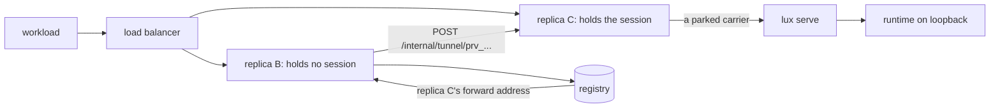

# Tunnelled runtimes

## Overview

A model server on an operator's or a developer's machine, Ollama, vLLM,
llama.cpp, LM Studio, MLX, or anything else speaking the `openai` or
`anthropic` dialect on loopback, becomes a `Provider` of the gateway
with no inbound port, no public name, no certificate, and no hole in a
firewall. The machine runs

```sh
lux serve --dialect openai --upstream http://127.0.0.1:11434/v1 --as my-laptop
```

which authenticates to the control plane with an issuer token, applies a
`Provider` named `my-laptop` with `spec.tunnel: true`, and then opens one
outbound HTTP/2 connection to the gateway. The gateway dials the runtime
through that connection as if it were a base URL: the same upstream
client, the same discovery and health jobs, the same routing, the same
metering. A `Model` on a tunnelled Provider is a Model like any other,
and a `Key` whose selectors match it reaches it through any door the
dialect matrix allows ([[008-routing-and-models]]).

This spec owns the manifest field that marks such a Provider, the wire
protocol of the tunnel, the registry that says which replica holds a
session, the forwarding hop that makes a multi-replica installation
work, the liveness rule that makes a dead tunnel `Unreachable`, and the
ownership question a Provider that an ordinary subject may create
raises. The `lux serve` command's flags and exit codes are
[[014-agent-client]]'s; the door, the pipeline, and the refusal codes
are [[004-request-path]]'s.

## Current state

Nothing is built. The repository holds the scaffold of
[[002-repository-scaffold]]: the binary serving its probes, typed
configuration, and the gate, on pkg v0.65.0.

## Design

### Manifest additions

This spec adds one field to `Provider.spec` and one option to
`manifest.Resolve`. [[003-manifest-contract]] owns the schema and its
tables; the rows below are what that spec must carry.

| Field | Type | Default | Mutable | Rule |
|---|---|---|---|---|
| `tunnel` | bool | `false` | no | `true` makes this Provider a tunnelled one: the upstream is whichever agent connects, not an address the gateway holds |

The rules the field carries:

- `baseURL` is required when `tunnel` is `false` and is
  `exclusive_fields` with `tunnel: true` when it is set, because a
  tunnelled Provider has no address the gateway could dial; the address
  is the agent's `--upstream` and stays on the agent's machine.
- `credential` in any form, `value` or `valueFrom`, is
  `exclusive_fields` with `tunnel: true`. The tunnel is the credential:
  the connection was opened by a subject the gateway authenticated, and
  a runtime on loopback has nothing to authenticate with. A runtime that
  wants its own key puts it behind its own listener; the gateway injects
  none.
- `tunnel` is immutable after create. Flipping it would change where
  both the address and the credential come from while Models keep
  naming the Provider.
- `tunnel: true` with `Options.TunnelEnabled` false, or in file mode where no session can be opened ([[010-state]]), is `invalid_field`
  at `spec.tunnel`, with `LUX_TUNNEL_ENABLED` in the developer detail.

`dialect`, `discovery`, `health`, `headers`, `timeout`, and
`concurrency` keep their meaning and their defaults. The upstream host
rule and `LUX_UPSTREAM_ALLOW_PRIVATE` do not apply, because there is no
host and no dial.

`Options.TunnelEnabled bool` joins `manifest.Options` beside
`AllowPrivateUpstreams`, so one `Resolve` refuses the field on an
installation that has the tunnel off, whichever surface applied it
([[001-architecture]], invariant 1).

The `status` block this spec adds:

```yaml
status:
  tunnel:
    state: Connected              # Connected | Disconnected
    session: tun_01J9ZK2P7Q8R9S0T1U2V3W4X64
    subject: https://login.example.com|alice
    agent: lux/0.1.0
    since: 2026-09-13T10:00:05Z
    lastHeartbeatAt: 2026-09-13T10:41:00Z
```

`status.tunnel` names no replica and no address. Which replica holds a
session is the registry's, which is internal state an operator reads
through `luxd check` and not through a kind every authenticated caller
may read.

### Why HTTP/2 and not yamux over a WebSocket

A tunnel of this shape can be multiplexed with
`github.com/hashicorp/yamux` over a WebSocket upgrade. This design uses
HTTP/2 streams and the standard library alone, for three reasons.

1. `./cmd/lux` reaches the standard library and
   `latere.ai/x/pkg/httpjson` and nothing else
   ([[001-architecture]]), and `lux serve` is a subcommand of that
   binary. A multiplexer and a WebSocket codec are two `depcheck` rows
   against the binary that is meant to be small because it runs where
   agents run. HTTP/2 is already in `net/http`.
2. HTTP/2 is a stream multiplexer with per-stream flow control. Running
   a second multiplexer inside one stream of the first gives two
   windows over one connection, and a stalled model response then
   backs up against whichever window is smaller rather than against the
   one an operator can reason about.
3. An ingress in front of the gateway either carries HTTP/2 to the
   origin or terminates TLS and re-originates it; either way the route
   below is an ordinary `POST`. A WebSocket upgrade is a second thing to
   configure on every hop, and a hop that does not carry it fails at
   connect rather than at deploy.

What HTTP/2 does not give is a server-initiated stream. The gateway
cannot open a stream toward the agent, so the agent parks streams at the
gateway and the gateway hands work to a parked one. That is the one
piece yamux would have given for free, and the carrier pool below is
what replaces it.

The tunnel route requires HTTP/2. A connect that negotiated HTTP/1.1 is
refused at once with `not_found` and the developer detail
`the tunnel needs HTTP/2`, because Go's HTTP/1 transport does not
guarantee a request body streaming while its response body is read, and
a tunnel that half works is worse than one that refuses. Over plaintext the
server adds `UnencryptedHTTP2` to `http.Server.Protocols` and the agent
sets `http.Transport.Protocols` to `UnencryptedHTTP2` **without**
`HTTP1`, which is what makes `net/http` use h2c for an `http://` URL
rather than falling back to HTTP/1.1 and meeting the refusal above. The
agent therefore builds a second transport for a plaintext `LUX_URL` and
uses the ordinary one, which negotiates HTTP/2 by ALPN, for an
`https://` one.

### The routes

| Method | Path | Listener | Carries | Action |
|---|---|---|---|---|
| `POST` | `/v1/providers/{id-or-name}/tunnel` | public | the session: registration, heartbeats, and the close reason | `provider.tunnel` |
| `POST` | `/v1/providers/{id-or-name}/tunnel/carry` | public | one proxied upstream request and its response | none |
| `POST` | `/internal/tunnel/{provider id}` | internal | one proxied upstream request forwarded from another replica | none |

The session route is a `/v1` route in every respect of [[011-api]]: a
bearer from a listed issuer, an authorizer decision, the request id
header, the error envelope. Its action is `provider.tunnel`, and the
`resource` [[006-identity]] sends carries `tunnel: true`, so a platform
decides whether this subject may attach this machine. The bearer is an
ordinary issuer token with `aud` `LUX_OIDC_AUDIENCE`: a person's token
when a person attaches a laptop, a service token from
`client_credentials` when a machine attaches unattended. The gateway
mints nothing for this seam: a product-local token would be allowed here
and this design does not need one.

A carrier asks the authorizer nothing. It carries a bearer from a
listed issuer and a `Lux-Tunnel-Session` header, and is accepted when
the bearer verifies against the issuers, the session is live on this
replica, and the bearer's subject equals the session's subject; the
bearer need not be the very token that opened the session, because the
agent's token source may have rotated it since. Verification is a
signature check against a cached key set, so a carrier costs no webhook
call and the hot path stays free of one ([[001-architecture]],
invariant 3). The decision at connect binds the session rather than a
cache window: a platform revokes a tunnel by closing the session, which
`DELETE /v1/providers/{id}` and an authorizer that starts denying
`provider.tunnel` on the next connect both do.

A session never outlives a token. Its expiry is the `exp` of the
bearer that opened it, and a heartbeat frame may carry a fresh bearer
in `token`, which the gateway verifies exactly as at connect and, when
it verifies and names the session's subject, makes the session's new
bearer and expiry. A `token` that does not verify or names another
subject is ignored, logged with its developer detail, and leaves the
previous expiry in place. When the expiry passes with no fresh token
the session is closed with `token_expired` and every in-flight carrier
is cancelled. Issuer tokens are short-lived, so the agent's loop sends a
fresh token on the first heartbeat after its token source yields one
([[014-agent-client]]'s `--token-file` is read per request for this
reason), and a session runs for as long as the agent can obtain tokens.

`LUX_TUNNEL_ENABLED` unset makes all three routes `not_found`, the
answer [[011-api]] gives any path outside the route table.

### The session and the carriers

```mermaid
sequenceDiagram
  participant R as runtime on loopback
  participant A as lux serve
  participant G as gateway replica
  participant S as registry
  participant W as a workload with a Key
  A->>G: PUT /v1/providers/my-laptop (tunnel true)
  G-->>A: 201, the resolved Provider
  A->>G: POST /v1/providers/my-laptop/tunnel (session stream)
  G->>S: register: provider, session, this replica, TTL
  G-->>A: {"type":"ready","session":"tun_...","carriers":4}
  A->>G: POST .../tunnel/carry x4 (parked)
  W->>G: POST /openai/v1/chat/completions, model my-laptop/llama3.1
  G->>G: key, limits, Model, target: a tunnelled Provider
  G->>A: on a parked carrier: request line, headers, body
  A->>R: POST http://127.0.0.1:11434/v1/chat/completions
  R-->>A: 200, the stream
  A-->>G: on the same carrier: status line, headers, body
  G-->>W: the stream, in the door's dialect
  A->>G: POST .../tunnel/carry (replacing the one just used)
  loop every TTL/3
    A->>G: {"type":"heartbeat"} on the session stream
    G->>S: renew
  end
  A--xG: the agent stops or the network breaks
  G->>S: unregister
  G->>G: status.tunnel Disconnected; health Unreachable
```

The session stream is one `POST` whose request body is a stream of
newline-delimited JSON frames from the agent and whose response body is
a stream of the same from the gateway. It carries three frame types and
no request bytes.

| Direction | Frame | Meaning |
|---|---|---|
| gateway to agent | `{"type":"ready","session":"tun_...","ttl":"30s","carriers":4}` | the session is registered; park this many carriers and heartbeat within this window |
| agent to gateway | `{"type":"heartbeat"}` or `{"type":"heartbeat","token":"<bearer>"}` | the agent and its runtime are alive; sent every `ttl/3`; `token` is a fresh bearer for the session, verified as above |
| gateway to agent | `{"type":"heartbeat"}` | the registry row was renewed |
| gateway to agent | `{"type":"close","reason":"..."}` | the session ends; `superseded`, `token_expired`, `provider_deleted`, or `draining` |

A `close` reason tells the agent what to do next, and [[014-agent-client]]
owns the exit codes that follow: `superseded` means another agent holds
this Provider now and a retry would fight it, so the agent stops;
`token_expired` means the agent's token source stopped yielding a
fresh token, so it reconnects once with a fresh one and stops when it
has none; `provider_deleted` means the object is gone, so it stops;
`draining` means this replica is shutting down, so it reconnects at
once and lands on another.

A carrier is one `POST` the agent opens and the gateway holds until it
has work. The framing is one line each way, then bytes to the end of the
stream, so nothing is buffered and no length is known in advance. A
parked carrier receives one empty line every `ttl/3` until it is given
work, so an ingress idle timeout between the agent and the gateway does
not cut it; the agent skips empty lines before the header line.

```
gateway to agent, on the carrier's response body:
{"id":"req_01J9...","method":"POST","path":"/chat/completions","query":"","headers":{"content-type":["application/json"]},"stream":true}
<the request body, streamed>

agent to gateway, on the carrier's request body:
{"status":200,"headers":{"content-type":["text/event-stream"]}}
<the response body, streamed>
```

`path` is the dialect's operation path under the agent's `--upstream`,
which the agent joins to its own base URL; the gateway never learns the
runtime's address and never dials it. `id` is the request id of
[[011-api]], so a record, a log line, and a carrier name one exchange.
The gateway writes the header line and flushes before it has read the
caller's body, and the agent writes its status line and flushes as soon
as the runtime's headers arrive, so time to first byte is the runtime's
plus one hop.

The agent keeps `--carriers` streams parked, default 4, and opens a
replacement as soon as one is given work, up to a ceiling of 64 in
flight. A request that finds no parked carrier waits for one until the
Provider's `timeout`; `spec.concurrency` bounds in-flight requests
toward the Provider exactly as it does for any other ([[005-providers]]),
and a wait past the deadline is `provider_unavailable`.

A caller that disconnects cancels the carrier stream, which the agent
sees as a read failure and turns into a cancellation of its own dial to
the runtime, so [[004-request-path]]'s rule that a disconnect cancels
the upstream request holds through the tunnel.

### The registry

The open sessions a replica holds are the `lux_tunnel_sessions` gauge
([[019-observability]]).

One row per tunnelled Provider, in the store, so every replica reads the
same answer.

```go
// Tunnels is the registry of live sessions, one row per tunnelled
// Provider. It joins internal/store's Store interface (010).
type Tunnels interface {
	// Register writes the row, replacing any session that was there.
	// The newest session wins: an agent that reconnects after a break
	// is serving again at once rather than after the old row lapses.
	Register(ctx context.Context, t Tunnel, ttl time.Duration) error
	// Heartbeat renews the row when the session still holds it, and
	// answers false when another session replaced it, which is how the
	// replica holding a superseded session learns to close it.
	Heartbeat(ctx context.Context, providerID, session string, ttl time.Duration) (held bool, err error)
	Get(ctx context.Context, providerID string) (Tunnel, error) // ErrNotFound when none is live
	Unregister(ctx context.Context, providerID, session string) error
}

type Tunnel struct {
	ProviderID  string
	Session     string    // tun_ and a ULID
	Replica     string    // the holder's LUX_TUNNEL_FORWARD_ADDR
	Subject     string    // the rendered subject that connected (006)
	Agent       string    // the agent's User-Agent
	ConnectedAt time.Time
	ExpiresAt   time.Time
}
```

The row lapses at `ExpiresAt`, which is the last heartbeat plus
`LUX_TUNNEL_REGISTRY_TTL` (default `30s`). The replica holding a session
renews at a third of the TTL while the agent's heartbeats are fresh, and
unregisters at once when the session ends for any reason, so a clean
disconnect is visible immediately and a replica that died is visible
within the TTL.

### Health and liveness

The registry is a fourth source of a Provider's health, above the three
of [[005-providers]] and only for a tunnelled Provider:

- no live registry row is `Unreachable`, at once, without the probe
  counter. Every target on the Provider leaves selection, which is what
  makes the requirement exact: a Provider whose tunnel is gone is
  `Unreachable` within `LUX_TUNNEL_REGISTRY_TTL`.
- a live row lets `health.mode` decide between `Healthy` and `Degraded`
  by the same thresholds. Under `probe` the models route is fetched
  over a carrier like any other request, so a session that is registered
  while the runtime behind it has stopped is still caught.

`status.tunnel.state` is `Connected` while a row is live and
`Disconnected` otherwise; the replica holding the `health` lease writes
it, as it writes `status.health`. Loss and return of a tunnel raise
`provider.unreachable` and `provider.healthy`
([[012-request-log-and-events]]); this spec adds no event type.

### Discovery, routing, and metering

Nothing is special. Discovery calls the dialect's models route
([[005-providers]]) over a carrier on the discovery interval, and once
at connect, and declares one Model per surviving upstream name,
`my-laptop/llama3.1` and its siblings, under the Provider's owner,
through the same `manifest.Resolve`. The runtime is therefore expected
to serve its dialect's models route at `--upstream`: Ollama, vLLM,
llama.cpp, LM Studio, and MLX all answer `GET /v1/models` in the
`openai` shape. The agent pushes nothing: this design pulls through the
same job every other Provider gets, so a model pulled after the agent
started appears on the next interval rather than after a reconnect. A
runtime with no models route runs with `discovery.mode: none` and
declared Models. Target selection, the circuit per target, fallback, and
the dialect matrix are [[008-routing-and-models]]'s unchanged: a
tunnelled Provider is one more provider in the order, and a Model may
name a tunnelled target and a remote one together, which is how a laptop
serves a model until it sleeps and a cloud provider serves it
afterwards.

A discovered Model has no pricing, so under a spend limit or a Budget it
is `model_unpriced` unless the Key sets `allowUnpriced`
([[007-keys-and-limits]]). An operator that wants a laptop's tokens
costed declares the Model with `pricing`, as for any other unpriced
upstream.

Metering is unchanged: one record per request with the Provider, the
upstream model, the tokens read from the runtime's own usage members,
and the cost ([[009-usage-and-metering]]). Nothing marks a record as
having crossed a tunnel; the Provider's name is what an operator groups
by, because one Provider is one machine. The Key's rate windows apply as
for any Provider, and the cost is the Model's pricing or unpriced, as
above: a tunnelled call is neither free of the gates nor recorded at
zero cost by rule.

### The upstream client of a tunnelled Provider

[[005-providers]]'s client table is the contract for a Provider the
gateway dials. A tunnelled Provider is not dialled, so three rows do not
apply and the rest do.

| Row | Tunnelled |
|---|---|
| `Proxy`, `CheckRedirect`, deadline, concurrency, the header set | unchanged: the same `*http.Client` shape over a transport that writes onto a carrier |
| `TLSClientConfig` | does not apply: there is no TLS to configure, because there is no socket to the runtime from this process. This is the answer to that table's note that a local runtime with its own certificate is this spec's case: the runtime's certificate, if it has one, is the agent's problem and the agent's `--upstream` names it |
| `DialContext` and the private-address refusal | does not apply: the gateway resolves no name and opens no socket, which is exactly why a runtime on `127.0.0.1` needs no `LUX_UPSTREAM_ALLOW_PRIVATE` and no hole in a firewall |
| `MaxIdleConnsPerHost` | does not apply: the pool is the carrier pool above |
| the builder | `gateway.NewClientSource` refuses a `tunnel: true` Provider with `gateway.ErrTunnelled` ([[005-providers]]); this spec's carrier transport supplies the client in its place |

### Several replicas

The agent opens one connection, which a load balancer sends to one
replica. Every other replica must be able to serve a request for that
Provider, so one of two designs is needed: the agent connects to every
replica, or a replica that does not hold the session forwards to the one
that does.

Connecting to every replica cannot be built. The agent reaches the
installation through one public address and has no way to enumerate the
replicas behind it, no way to address one of them, and no way to know
when the set changes; opening several sessions through the load balancer
lands them wherever it pleases and guarantees nothing. So this design
forwards.



A replica that selects a target on a tunnelled Provider reads the
registry. Holding the session, it writes onto a parked carrier. Not
holding it, it sends the same proxied request to
`POST /internal/tunnel/{provider id}` on the holder's
`LUX_TUNNEL_FORWARD_ADDR` with `LUX_TUNNEL_FORWARD_SECRET` as the
bearer, and relays the streamed response back. The framing on that hop
is the carrier's framing, so the forwarding replica writes the same
header line it would have written onto a carrier and the holder passes
it through.

The rules that keep it bounded:

- One hop. A replica that receives a forward and does not hold the
  session answers `provider_unavailable` and forwards nothing, so a
  registry row that has just moved costs one refusal and never a loop.
- The forward hop is a target failure like any other: a refused
  connection, a timeout before headers, or a 5xx from the holder is
  retryable, so [[008-routing-and-models]] moves to the next target and
  the per-target circuit opens if the holder keeps failing.
- `LUX_TUNNEL_FORWARD_SECRET` is compared in constant time and is the
  only thing that route accepts. It is an installation-internal bearer,
  not an identity: the internal listener is not reachable from outside
  the cluster, and the secret is the second lock on a route that would
  otherwise let anything on the Pod network reach a runtime. The
  variable is a comma separated list, shaped like `LUX_SECRETS_KEK`
  ([[005-providers]]): a replica sends the first entry and accepts any
  entry, so a rotation is a rolling deploy with `new,old`, then one
  with `new`, and no forward fails in between. Every replica of one
  installation carries the same list.
- `LUX_TUNNEL_ENABLED` set without `LUX_TUNNEL_FORWARD_ADDR` is not a
  start-up failure, because the memory store is single-replica by
  construction ([[010-state]]). It is a start-up line and a `luxd check`
  row saying that tunnelled Providers are served by the holding replica
  only, so an installation that scaled past one replica without setting
  the variable is told where its intermittent `provider_unavailable`
  comes from. With `LUX_DB_URL` set and the variable unset, the line is
  a `WARN`.

### Ownership and who may attach a machine

The owner policy of [[006-identity]] lets only a subject in
`LUX_ADMIN_SUBJECTS` create a `Provider`, because a Provider holds the
operator's credential and the operator's prices. A tunnelled Provider
holds neither: it carries no credential, names no host, and adds a
machine the connecting subject already controls. The owner policy
therefore gains one exception, which that spec must carry:

> A subject may `create`, `update`, and `delete` a `Provider` with
> `spec.tunnel: true` whose `owner` is that subject, and may `tunnel`
> it. Every other `Provider` stays an admin's.

With an authorizer set there is no exception and no special case: the
`resource` of `provider.create`, `provider.read`, `provider.update`,
`provider.delete`, and `provider.tunnel` carries `tunnel`, and the
platform answers. A platform that wants nobody attaching a machine
denies `provider.create` when `tunnel` is true; one that wants every
user to attach one allows it and caps the count in its own logic.

The consequence to state rather than discover: under the owner policy
every subject may `use` every Model, so the Models discovered on one
person's laptop are callable by every subject the issuer admits, through
any Key whose selectors match. That is the owner policy working as
written, the catalog being the installation's. There is no per-subject
privacy for a tunnelled model, deliberately, because the data plane
carries no subject and the owner policy is one rule for every Model
([[006-identity]]). The exposure is bounded: no Model an administrator
declared routes to a tunnelled Provider unless the administrator
targeted it, so a caller reaches another subject's machine only by
writing that Provider's name in the model it asks for, and only while
`LUX_TUNNEL_ENABLED` is set, which it is not by default. An installation
where even that is wrong runs an authorizer and denies `model.use` on
Models whose Provider is `tunnel: true` to every subject but the
Provider's owner, which is the remedy for every other case where the
built-in policy is too open.

Who may call a tunnelled Provider is otherwise the ordinary rule: a Key
whose selectors match a Model on it, with `model.use` decided at the
Key's resolve. There is no relationship between a Key's owner and a
tunnel's subject, because a Model is a Model.

### Security

The tunnel moves the transport and nothing else, which is the property
the rest of the design depends on.

- The carrier carries exactly what the gateway would have sent to a
  provider at a base URL: the method, the operation path, the forwarded
  header set of [[004-request-path]], and the body. The caller's
  credential headers are already removed at that point, so the runtime
  never sees a Key, a provider credential, or an issuer token.
- The gateway injects no credential toward a tunnelled Provider, because
  there is none to inject. Invariant 2 of [[001-architecture]] is
  satisfied vacuously here and by the `exclusive_fields` rule above,
  which makes it impossible to store one.
- The agent is not a caller. A carrier may carry a proxied request and
  nothing else; the agent cannot read an object, apply a manifest, or
  reach any route through the session, because the session stream
  carries the four frame types above and the carrier carries one
  response.
- The gateway learns no address on the agent's machine and dials
  nothing there, so a tunnel is not a path into the operator's network
  and not an SSRF primitive. What the agent reaches is what the agent
  chose with `--upstream`.
- A session is bound to the subject that opened it and to that subject's
  token lifetime. A carrier whose subject differs from the session's is
  `unauthenticated`, so a session id is an identifier and never a
  credential.

### Configuration

| Variable | Required | Default | Purpose |
|---|---|---|---|
| `LUX_TUNNEL_ENABLED` | no | unset | `1` serves the three routes and admits `spec.tunnel`; unset makes them `not_found` and the field `invalid_field` |
| `LUX_TUNNEL_REGISTRY_TTL` | no | `30s` | the liveness window of a registry row; at least `5s`, at most `5m`; the agent heartbeats at a third of it |
| `LUX_TUNNEL_FORWARD_ADDR` | no | unset | the address other replicas reach this one's internal listener at, `host:port`; unset serves tunnelled Providers on the holding replica only |
| `LUX_TUNNEL_FORWARD_SECRET` | with the address | unset | one or more bearers for `/internal/tunnel/{id}`, comma separated, each at least 32 bytes; the first is sent, every one is accepted, so rotation is prepending; the address without it is a start-up failure |

[[002-repository-scaffold]] owns the variable table and carries all
four with this spec as their owner; the meanings above are the ones its
rows point to.

### `luxd check`

One row, beside the rows [[005-providers]] and [[010-state]] own:

| Line | Passes when |
|---|---|
| `tunnels` | the tunnel is off, or on and every tunnelled Provider has a live registry row; with `LUX_TUNNEL_FORWARD_ADDR` set, this replica's address is reachable from itself and answers the forward route with the configured secret; with `LUX_DB_URL` set and the address unset, the line warns that tunnelled Providers serve on one replica |

### The packages

`internal/tunnel` holds both halves and the wire types: the gateway
side, which is the three handlers, the registry client, the carrier
pool per session, and the `http.RoundTripper` that `gateway`'s
`ClientSource` hands back for a tunnelled Provider; and the agent side,
which is `lux serve`'s loop. It imports the standard library and
`latere.ai/x/pkg/httpjson` and nothing else, so `./cmd/lux` importing
its agent half leaves that binary's build list what
[[014-agent-client]] says it is.

## Not in this spec

The `lux serve` flags, its exit codes, and the skill
([[014-agent-client]]); the `Provider` schema tables the field joins
([[003-manifest-contract]]); the door, the pipeline, and the refusal
codes ([[004-request-path]]); credential custody, discovery, health, and
the client for a Provider the gateway dials ([[005-providers]]); the
authorizer payload and the owner policy the exception amends
([[006-identity]]); target selection and the circuit
([[008-routing-and-models]]); the store's rows and its conformance suite
([[010-state]]); the route table and the error envelope
([[011-api]]); the stub providers a test runs `lux serve` against
([[015-test-stubs-and-tiers]]).

## Acceptance criteria

| Criterion | Test that proves it | State |
|---|---|---|
| A `Provider` with `tunnel: true` resolves without `baseURL` and without `credential`; either one present is `exclusive_fields`; `tunnel` changed on update is `immutable_field`; `tunnel: true` with the tunnel off is `invalid_field` at `spec.tunnel` | `TestTunnelProviderSchema`, table-driven | not built |
| `lux serve` applies the Provider, connects, and a request through a door reaches a stub provider run on loopback as the runtime and comes back, on every dialect the matrix allows | `TestTunnelEndToEnd` | not built |
| The carrier framing is one header line then the body in each direction, headers flushed before the body, and a streamed response reaches the caller event by event with no buffering | `TestCarrierFraming`, `TestTunnelStreamsWithoutBuffering` | not built |
| A connect negotiating HTTP/1.1 is refused with `not_found` and the HTTP/2 detail; over plaintext h2c the same connect succeeds | `TestTunnelRequiresHTTP2` | not built |
| A second session for one Provider supersedes the first, the first is closed with `superseded` within one heartbeat, and the second serves | `TestNewestSessionWins` | not built |
| A carrier with another subject's bearer, with an unknown session, or with an expired bearer is `unauthenticated`; a carrier with a newer token of the session's subject is accepted; a session whose bearer expires with no fresh token is closed with `token_expired` and its in-flight carriers are cancelled | `TestCarrierAuthentication`, `TestSessionEndsWithTheToken` | not built |
| A heartbeat carrying a fresh bearer of the session's subject moves the session's expiry to the new `exp` and the session serves past the old one; a bearer of another subject or one that fails to verify is ignored and the old expiry stands | `TestSessionTokenRefresh`, with the stub issuer minting a 2 s and then a 60 s token | not built |
| A carrier parked for three times `ttl` with no work receives an empty line every `ttl/3` and is still given work afterwards | `TestParkedCarrierKeepalive` | not built |
| With `LUX_TUNNEL_FORWARD_SECRET` `new,old` on one replica and `old` on another, forwards succeed in both directions; with `new` alone against `old` alone they are refused | `TestForwardSecretRotation` | not built |
| Killing the agent makes the Provider `Unreachable` and `status.tunnel.state` `Disconnected` within `LUX_TUNNEL_REGISTRY_TTL`, every target leaves selection, and `provider.unreachable` is emitted once | `TestTunnelLossIsUnreachableWithinTheTTL` | not built |
| A clean `lux serve` shutdown unregisters at once, so the Provider is `Unreachable` before the TTL lapses | `TestCleanDisconnectIsImmediate` | not built |
| With two replicas and Postgres, a request landing on the replica without the session is forwarded to the holder and served; the holder's failure is retryable and moves to the next target; a forward to a replica that does not hold the session is `provider_unavailable` and is not forwarded again | `TestForwardingAcrossReplicas`, `TestForwardIsOneHop` | not built |
| `/internal/tunnel/{id}` without the secret, with a wrong secret, and on the public listener are each refused | `TestForwardRouteNeedsTheSecret` | not built |
| Discovery over the tunnel declares one Model per upstream name under the Provider's owner, and a failed list keeps the catalogue | `TestTunnelDiscovery` | not built |
| Every request through a tunnel has one usage record with the Provider, the upstream model, and the runtime's reported tokens | `TestTunnelRequestsAreMetered` | not built |
| The runtime receives no Key, no issuer token, and no provider credential over a run that exercises every door, and receives the forwarded header set of [[004-request-path]] | `TestTunnelCarriesNoCredential` | not built |
| Under the owner policy a non-admin applies and tunnels a Provider with `tunnel: true` and is refused one without it; with an authorizer, the `resource` of every provider action carries `tunnel` | `TestTunnelOwnerPolicyException`, `TestTunnelInTheAuthorizerResource` | not built |
| The registry's four methods behave the same on memory and on Postgres, including a lapsed row and a superseded heartbeat | `storetest.Run`'s tunnel group ([[010-state]]) | not built |
| `internal/tunnel` imports the standard library and `latere.ai/x/pkg/httpjson` only, and `./cmd/lux`'s build list is unchanged by `lux serve` | the `depcheck` gate | not built |
