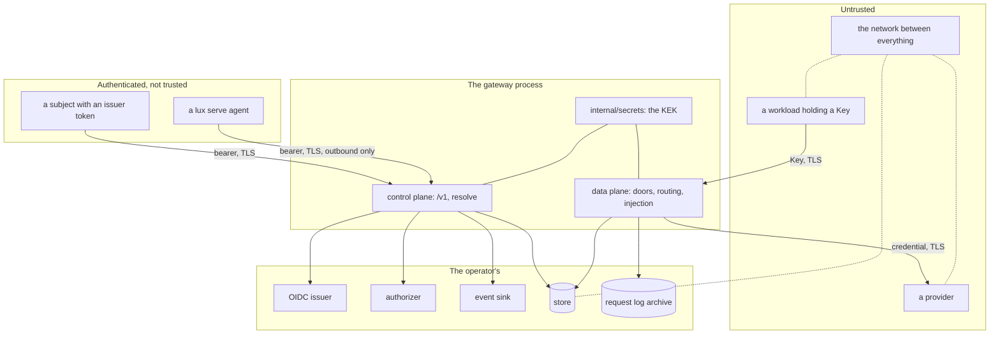

# Security and threat model

## Overview

A gateway that holds every provider credential an installation owns,
mints the credential every workload holds, and sees every prompt on its
way past is worth attacking from several directions at once. This spec
names the assets, the actors, and the boundaries between them, and then
answers each threat with the mechanism that answers it, the spec that
owns that mechanism, and the test that proves it. `SECURITY.md` points
here, so a reviewer checks the design rather than taking the properties
on faith.

The rule this spec holds itself to: a row without a test is a claim, not
a control. Every row below names a test, and one criterion reads this
file and fails when a named test is not in the tree.

## Current state

Nothing is built. The controls descend from the hosted gateway this
design is extracted from, minus the ones that belonged to its identity,
tenancy, and billing surfaces, plus the ones this design adds because
it must be safe in an installation nobody at Latere operates: envelope
encryption with a rotation path ([[005-providers]]), the plane boundary
that makes a Key useless on the control plane ([[006-identity]]), and a
record type that cannot carry content ([[009-usage-and-metering]]).

## Design

### Assets

| Asset | Lives | Worth |
|---|---|---|
| provider credentials | sealed in the store, opened in one replica's memory for one outbound request | every model call an installation can pay for |
| Key values | nowhere: the store keeps SHA-256 of each, the caller keeps the value | the models a Key names, up to its limits |
| desired state | the store, or a directory in file mode | what the gateway serves and to whom |
| usage records and aggregates | the archive and the store | who called what, when, and what it cost |
| the authorizer token | the process environment | the ability to impersonate the gateway to the operator's authorizer |
| the events secret | the process environment | the ability to forge an audit event at the operator's sink |
| the key encryption keys | the process environment, `LUX_SECRETS_KEK` | every sealed credential |
| the forward secret | the process environment, `LUX_TUNNEL_FORWARD_SECRET` | reaching a tunnelled runtime from inside the cluster network |

### Actors

| Actor | Holds | Wants |
|---|---|---|
| a caller with a Key | one Key value | models the Key does not name, spend past its limits, another Key's usage, the provider credential behind the model it calls |
| a caller with an issuer token | a bearer a listed issuer signed | another subject's objects, a credential value, a ceiling past what the authorizer granted |
| a platform | the authorizer, the sink, its own issuer | nothing adversarial; it is the reason the boundaries are where they are |
| a provider | whatever the gateway sends it | the caller's identity, a second request the gateway did not intend, a response the gateway relays unexamined |
| a network position | the wire | a Key, a token, a credential, a forged event |
| a malicious workload holding a Key | a valid Key and the doors | the control plane, another Key's models, the gateway's own address as an upstream, unbounded cost |
| a compromised replica | the KEK, the store connection, one request's plaintext credentials | every credential, every Key hash, desired state |
| an operator | everything in the process and the store | nothing; an operator is trusted and the boundary below says how far |

### Trust boundaries

Four boundaries carry the weight. Between a workload and the data
plane, the only credential is a Key and the only decision is from
desired state. Between a subject and the control plane, the only
credential is an issuer token and the only decision is the
authorizer's. Between the gateway and a provider, the credential is the
Provider's own and the destination is that Provider's `baseURL` and no
other host. Between the gateway and the operator's endpoints,
unavailability is a refusal on the control plane and is invisible on
the data plane.

### Threats and the answers

| Threat | How the design answers it | Owner | Test |
|---|---|---|---|
| A subject changes a Provider's `baseURL` to a host it controls and collects the credential | `provider.update` is an authorizer decision with the old object in the `resource`; the new `baseURL` is held to the upstream host rule again at resolve; the credential is injected only toward the current `baseURL` and nowhere else; a host change emits `provider.updated` with the changed path, so a sink sees it | [[003-manifest-contract]], [[005-providers]], [[006-identity]] | `TestBaseURLChangeIsAuthorizedAndAudited` |
| A Key is used on the control plane to read or change desired state | a `/v1` bearer must be a JWS a listed issuer signed; a value beginning with `lux_` is not one and is `unauthenticated` | [[006-identity]] | `TestPlanesRefuseEachOthersCredential` |
| An issuer token is used on a door, so a person's credential ends up in a workload | a door credential that does not begin with `lux_` is `unauthenticated`, whatever it is | [[004-request-path]], [[006-identity]] | `TestDoorsTakeKeysOnly` |
| A Provider `baseURL` names a service inside the cluster, making the gateway an SSRF primitive | the upstream host rule refuses a single label, a loopback, link-local, or private address, `.local`, and `.internal` at resolve, and the client refuses a resolved private address at dial; both are off unless `LUX_UPSTREAM_ALLOW_PRIVATE` is set | [[003-manifest-contract]], [[005-providers]] | `TestUpstreamHostRule`, `TestPrivateAddressRefusedAtDial` |
| A Provider names the gateway's own URL, so a request loops until something breaks | a `baseURL` whose host is `Options.PublicURL`'s is `invalid_field`, in both modes, private upstreams allowed or not | [[003-manifest-contract]] | `TestUpstreamHostRule` |
| Prompts or completions reach a log, a metric, a span, an event, or a usage record | `metering.Record` is scalars and one string map with no `any` member; no body, header value, or credential is ever a log argument; no identity is a span attribute; a label value is from a closed set or an object's name | [[009-usage-and-metering]], [[012-request-log-and-events]], [[019-observability]] | `TestRecordCarriesNoContent`, `TestEventsCarryNoSecrets`, `TestTelemetryCarriesNoSecrets` |
| A Key value is guessed | 240 bits from a cryptographically secure source; a negative cache bounded to `LUX_KEY_CACHE` keeps a flood off the store; `LUX_UNAUTHENTICATED_REQUESTS_PER_MINUTE` bounds the flood per client address on both planes | [[007-keys-and-limits]], [[011-api]] | `TestKeyValueShape`, `TestNegativeCache`, `TestRateLimits` |
| A Key value leaks and is used by someone else | `POST /v1/keys/{id}/rotate` replaces the value with no grace period; `spec.disabled` refuses at once; `ttl` bounds the window; the spend limit and the Budget bound the loss in money; every refusal and every success is a record with the Key's prefix | [[007-keys-and-limits]], [[011-api]] | `TestRotateReplacesTheValue`, `TestKeyStates`, `TestSpendWindow` |
| A hash lookup leaks the stored value through timing | the gateway compares nothing: it hashes the presented value with SHA-256 and asks the store for that hash, and the store answers from an index. There is no comparison to time, and an index probe with a 240-bit input leaks nothing an attacker can walk | [[007-keys-and-limits]], [[010-state]] | `TestKeyLookupComparesNothing` |
| A replica is compromised | the blast radius is stated rather than denied: the KEK in that process's memory, the credentials it opened for requests in flight, the store connection, and the Key hashes, which are not values. It does not hold a Key value, a person's password, or a token it could mint. Recovery is `luxd rewrap` under a new KEK and a rotation of every Provider credential, which the deploy documentation names as the incident step | [[005-providers]], [[010-state]], [[017-release-and-installation]] | `TestRewrapUnderANewKEK` |
| The authorizer is down or slow, and a caller hopes that means allow | every non-200, unparseable body, body without `allow`, TLS failure, refused connection, and timeout is `authorizer_unavailable`, 503, and never an allow; there is no retry; availability is not a readiness check, so the data plane keeps serving | [[006-identity]] | `TestAuthorizerUnavailability`, `TestDataPlaneServesWhileAuthorizerIsDown` |
| A caller acts on an object before anyone decided it may | every item route is read, authorize, act: the object is loaded by id or name, the authorizer's `resource` is built from what was loaded, the decision is asked, and only then does the handler act; a missing object is `not_found` and a deny on the request's own action is `forbidden` | [[006-identity]], [[011-api]] | `TestRouteTableActions` |
| A subject probes for objects it may not see by naming them in a manifest | a `Lookup` deny on `model.use`, `budget.draw`, or a target's `provider.read` is `not_found` with the field's path, identical to a missing object | [[003-manifest-contract]], [[006-identity]] | `TestLookupDenyIsNotFound` |
| A provider returns a body meant to attack the caller or the gateway | a translated body is decoded to the intermediate representation and re-encoded, so nothing the upstream wrote reaches the caller verbatim; a passthrough body is relayed as opaque bytes with the upstream's own content type and is never parsed as markup by the gateway; no route on either plane ever serves HTML, and an upstream error body is the developer detail, truncated to 1 KiB, and never the caller's body | [[004-request-path]] | `TestUpstreamBodyIsDetailOnly`, `TestNoHTMLIsEverServed` |
| A request is smuggled past the gateway by a second set of framing headers | `Connection`, `Keep-Alive`, `Proxy-Connection`, `Transfer-Encoding`, `TE`, `Trailer`, `Upgrade`, and every header `Connection` names are removed in both directions; `Host` is the base URL's; `Content-Length` is set by the gateway when it holds the whole body and omitted when it streams | [[004-request-path]] | `TestHopByHopHeadersAreRemovedBothWays` |
| A caller learns another caller's network location from a provider, or a provider learns a caller's | every `X-Forwarded-*` and `Forwarded` header from the caller is dropped and the gateway adds none; the record carries no caller address; no span carries one | [[004-request-path]], [[009-usage-and-metering]], [[019-observability]] | `TestNoForwardedHeaders`, `TestSpansCarryNoIdentity` |
| A caller exhausts the gateway with size or volume | `LUX_MAX_BODY_BYTES` on a door and `LUX_MAX_MANIFEST_BYTES` on `/v1`, each refused before the body is read further; the YAML decoder's 1 MiB alias and 64 level nesting limits; a 64 KiB annotation cap; per-Key rate windows; per-subject and per-address rate limits; `LUX_UPSTREAM_TIMEOUT` and `Provider.spec.timeout`; `spec.concurrency` per Provider per replica | [[003-manifest-contract]], [[004-request-path]], [[007-keys-and-limits]], [[011-api]] | `TestBodyLimit`, `TestYAMLLimits`, `TestRequestBucket`, `TestRateLimits`, `TestConcurrencyLimitsInFlight` |
| A caller spends more than an operator agreed to | a hard Budget and a Key spend limit refuse before any bytes reach a provider, from the store's counter plus the replica's own delta; the overshoot is bounded by a stated formula rather than assumed to be zero; an unpriced Model under either is `model_unpriced` unless `allowUnpriced` is set | [[007-keys-and-limits]], [[009-usage-and-metering]] | `TestOvershootBound`, `TestUnpricedModelRefusedUnderABudget` |
| A forged event is delivered to the operator's sink | `Lux-Signature` is `t=<unix seconds>,v1=<hex HMAC-SHA256 of "<t>.<body>">` under `LUX_EVENTS_SECRET` over the exact bytes; a sink refuses a `t` more than five minutes from its own clock and compares in constant time, which the stub sink demonstrates | [[012-request-log-and-events]] | `TestSignature` |
| A credential is readable in the store, a backup, or a dump | AES-256-GCM under a per-credential data key, the data key wrapped under a KEK held only in the environment, with the provider id and the credential version as additional data so a row copied onto another Provider fails to open; the store has no method that returns a plaintext and does not import the sealing package | [[005-providers]], [[010-state]] | `TestCredentialRowsAreSealed`, `TestStoreCannotDecrypt` |
| A KEK leaks and every credential must be re-wrapped | `LUX_SECRETS_KEK` is a list, so the new key and the old are live together; `luxd rewrap` re-wraps every data key without touching a value ciphertext and is idempotent; `luxd serve` refuses to start when a stored credential opens under no listed key | [[005-providers]] | `TestRewrapUnderANewKEK`, `TestStartupRequiresAWorkingKEK` |
| A credential is written to disk in the clear by the gateway | the gateway writes no local state; a credential is decoded into a field the JSON and YAML encoders skip, so no object carrying one can be serialized at all; in file mode a Provider names `credential.valueFrom.env` and the value is read from the environment and held in memory, never written | [[003-manifest-contract]], [[005-providers]], [[010-state]] | `TestCredentialValueNeverEncodes`, `TestFileModeValuesFromEnvironment` |
| A directory of manifests is edited to widen what a gateway serves | in file mode every write under `/v1/{kind}s` is `read_only` and `/v1` is on the internal listener only; a file that fails to resolve at start is a start-up failure and nothing is served; a `SIGHUP` that fails leaves the previous snapshot serving | [[010-state]], [[011-api]] | `TestFileModeRefusesWrites`, `TestFileModeStartupNamesTheFailingFile` |
| A tunnel becomes a path from the internet into the operator's network | the gateway dials nothing on the agent's machine: the agent dials its own `--upstream`; the carrier carries one proxied request and one response and no other route; a session is bound to the subject that opened it and to that token's lifetime; `/internal/tunnel/{id}` is on the internal listener and needs `LUX_TUNNEL_FORWARD_SECRET` | [[013-tunnelled-runtimes]] | `TestTunnelCarriesNoCredential`, `TestForwardRouteNeedsTheSecret` |
| An unauthorized machine attaches itself as a Provider | `provider.tunnel` is an authorizer decision with `tunnel: true` in the `resource`; under the owner policy a subject may attach a Provider it owns and may not declare one with a credential | [[006-identity]], [[013-tunnelled-runtimes]] | `TestTunnelOwnerPolicyException` |
| A browser page is tricked into calling the API with an ambient credential | no `Access-Control-*` header is written on either plane and `OPTIONS` is `not_found`, so a browser cannot make a cross-origin call at all; neither credential is one a page should hold | [[011-api]] | `TestNoCORS` |
| A manifest claims a name the gateway reserves | labels and annotations under `lux.latere.ai/` are `reserved_prefix`; a reserved header in `headers` is the same; a caller's `Lux-Request-Id` is ignored and replaced on both planes | [[003-manifest-contract]], [[011-api]] | `TestExclusiveMissingAndDuplicates`, `TestRequestIdOnEveryResponse` |
| A released image or binary is not what this repository built | multi-arch images and archives are signed with cosign keyless against the workflow identity, with an SPDX bill of materials and a build provenance attestation per image, so `gh attestation verify` answers for the image about to run; the module graph is checked for known vulnerabilities on every push; the `depcheck` allow list makes a new dependency a reviewed row | [[002-repository-scaffold]], [[017-release-and-installation]] | the `release-verify` job, the `vuln` gate, the `depcheck` gate |

### The gateway process itself

The release ships the process hardened, and [[017-release-and-installation]]
carries the manifests that do it.

| Property | Value | Why |
|---|---|---|
| base image | `gcr.io/distroless/static-debian12:nonroot` with the CA roots and nothing else | `luxd` forks no binary of its own, so there is no shell to reach and no package manager to run |
| user | `nonroot:nonroot`, `runAsNonRoot: true` | |
| root file system | `readOnlyRootFilesystem: true` | the gateway writes no local state, so nothing needs a writable path and a write is a bug rather than a feature |
| capabilities | `drop: ["ALL"]` | it binds two ports above 1024 and needs none |
| privilege escalation | `allowPrivilegeEscalation: false` | |
| seccomp | `RuntimeDefault` | |
| service account token | not mounted | `luxd` calls no Kubernetes API |
| network policy | egress to the providers, the issuers, the authorizer, the sink, the archive, and the store; ingress from the ingress controller and from other replicas on the internal listener | the destinations are the ones the configuration names |

### What Lux does not protect against

- A compromised provider. Whatever an upstream does with a prompt it
  was sent is outside the gateway, and a translated response is
  re-encoded rather than trusted only in its shape.
- A caller that legitimately holds a Key exfiltrating model output.
  A Key exists to call models; what the caller does with an answer is
  the caller's, and no gateway can tell a useful answer from a stolen
  one.
- An operator with store access, an operator who can read the process
  environment, or an operator who can attach a debugger. The KEK, the
  authorizer token, and the events secret are the operator's, and an
  operator who is the adversary has already won.
- The security of the issuer, the authorizer, or the sink. Each is an
  endpoint the operator writes and operates; the gateway fails closed
  when one is unavailable and trusts what a reachable one says.
- Traffic analysis. An observer who can see the gateway's egress learns
  which providers an installation uses and how often, because TLS hides
  the bodies and not the destinations.
- Kernel and hypervisor isolation of whatever runs beside the gateway.
  A gateway is a network service, not a sandbox; running untrusted code
  is [Cella](https://github.com/latere-ai/cella)'s problem, not this
  one's.

## Not in this spec

The mechanisms themselves, each owned by the spec its row names; the
deploy manifests that carry the hardening fields and the release
attestations ([[017-release-and-installation]]); the vulnerability
reporting address and the response times (`SECURITY.md`).

## Acceptance criteria

| Criterion | Test that proves it | State |
|---|---|---|
| Every row of the threat table names a test that exists in the tree, and every spec it cites carries that test in its own criteria | `TestThreatModelControlsHaveTests`, reading this file and the tree | not built |
| A canary provider credential appears in no response body, event, log line, metric, span, or request log record across the e2e tier, and reaches a stub provider only in that Provider's own header | [[005-providers]]'s `TestProviderCredentialNeverLeavesTheGateway` | not built |
| A canary Key value appears in no read, list, event, record, log line, metric, or span, and a value written to a log argument is truncated to twelve characters | [[007-keys-and-limits]]'s `TestKeyValueNeverAppearsInLogs`, [[019-observability]]'s `TestLogRedactsKeyValues` | not built |
| A canary prompt and completion appear in no record, event, archived object, log line, metric, or span | [[009-usage-and-metering]]'s `TestRecordCarriesNoContent`, [[019-observability]]'s `TestTelemetryCarriesNoSecrets` | not built |
| A Key on `/v1` and an issuer token on a door are each `unauthenticated`, on every route and every door | [[006-identity]]'s `TestPlanesRefuseEachOthersCredential`, [[004-request-path]]'s `TestDoorsTakeKeysOnly` | not built |
| Changing a Provider's `baseURL` to another host is authorized, re-validated against the host rule, and emits `provider.updated` naming the path; the credential is sent to the new host only after the change is stored | `TestBaseURLChangeIsAuthorizedAndAudited` | not built |
| The key lookup path contains no comparison of a presented value against a stored one, and the store answers a hash by index | `TestKeyLookupComparesNothing`, reading the call graph from the door to the store | not built |
| No route on either plane returns a body whose content type is `text/html`, for any code, any door, and any upstream body | `TestNoHTMLIsEverServed`, table-driven over every code and every door | not built |
| Every hop-by-hop header, and every header named by `Connection`, is removed from the request toward the provider and from the response toward the caller | `TestHopByHopHeadersAreRemovedBothWays` | not built |
| With the authorizer refusing, timing out, and answering a body without `allow`, every control plane request is refused and every data plane request with a valid Key is served | [[006-identity]]'s `TestAuthorizerUnavailability`, `TestDataPlaneServesWhileAuthorizerIsDown` | not built |
| An object a subject may not see is `not_found` whether it exists or not, through every reference a manifest can name | [[006-identity]]'s `TestLookupDenyIsNotFound` | not built |
| The rendered Deployment carries every property in the hardening table, and the container runs as a non-root user with a read-only root file system | [[017-release-and-installation]]'s `TestBaseIsConfined` | not built |
| `SECURITY.md`'s stated properties each appear as a row in the threat table with a test | `TestSecurityDocumentMatchesTheModel` | not built |
