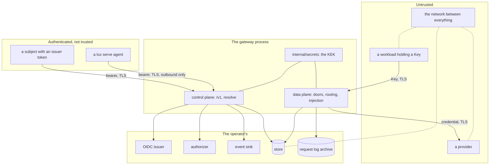

# Security and threat model

## Overview

A gateway that holds every provider credential an installation owns,
mints the credential every workload holds, and sees every prompt on its
way past is worth attacking from several directions at once. This spec
names the assets, the actors, and the boundaries between them, and then
answers each threat with the mechanism that answers it, the spec that
owns that mechanism, and the test that proves it. `SECURITY.md` points
here, so a reviewer checks the design rather than taking the properties
on faith.

The rule this spec holds itself to: a row without a test is a claim, not
a control. Every row below names a test, and a criterion reads this file
against the tree and fails twice over: when a row names a test the tree
does not hold without saying which spec owes it, and when a row still
says a test is missing after that test lands.

## Current state

Most of the data plane is built. The kinds and their validation
([[003-manifest-contract]]), the doors and the pipeline
([[004-request-path]]), the sealed credential and the pinned upstream
client ([[005-providers]]), the verifier, the authorizer, and the owner
policy ([[006-identity]]), the Key value, its cache, and the limits
([[007-keys-and-limits]]), routing and the circuit
([[008-routing-and-models]]), and the store contract with its memory
and file modes ([[010-state]]) are in the tree with their tests. The
control plane is not: `/v1` ([[011-api]]), the events and the request
log ([[012-request-log-and-events]]), the usage record
([[009-usage-and-metering]]), the telemetry ([[019-observability]]),
the tunnel ([[013-tunnelled-runtimes]]), the stubs and the tiers
([[015-test-stubs-and-tiers]]), and the release
([[017-release-and-installation]]) are dispatched or validated. So the
threat table below is read twice: once for the rows the tree already
proves, and once for the rows that name the spec that owes the test.

## Design

### Assets

| Asset | Lives | Worth |
|---|---|---|
| provider credentials | sealed in the store, opened in one replica's memory for one outbound request | every model call an installation can pay for |
| Key values | nowhere: the store keeps SHA-256 of each, the caller keeps the value | the models a Key names, up to its limits |
| desired state | the store, or a directory in file mode | what the gateway serves and to whom |
| usage records and aggregates | the archive and the store | who called what, when, and what it cost |
| the authorizer token | the process environment | the ability to impersonate the gateway to the operator's authorizer |
| the events secret | the process environment | the ability to forge an audit event at the operator's sink |
| the key encryption keys | the process environment, `LUX_SECRETS_KEK` | every sealed credential |
| the forward secret | the process environment, `LUX_TUNNEL_FORWARD_SECRET` | reaching a tunnelled runtime from inside the cluster network |

### Actors

| Actor | Holds | Wants |
|---|---|---|
| a caller with a Key | one Key value | models the Key does not name, spend past its limits, another Key's usage, the provider credential behind the model it calls |
| a caller with an issuer token | a bearer a listed issuer signed | another subject's objects, a credential value, a ceiling past what the authorizer granted |
| a platform | the authorizer, the sink, its own issuer | nothing adversarial; it is the reason the boundaries are where they are |
| a provider | whatever the gateway sends it | the caller's identity, a second request the gateway did not intend, a response the gateway relays unexamined |
| a network position | the wire | a Key, a token, a credential, a forged event |
| a malicious workload holding a Key | a valid Key and the doors | the control plane, another Key's models, the gateway's own address as an upstream, unbounded cost |
| a compromised replica | the KEK, the store connection, one request's plaintext credentials | every credential, every Key hash, desired state |
| a compromised sandbox holding a placeholder | a per-sandbox placeholder the egress gateway substitutes ([[020-building-a-plane]]) | the Key behind the placeholder, the provider credential behind that |
| a malicious authorizer or event sink | every verified claim of every caller, and every mutation | a credential value, a Key value, prompt content, a ceiling the schema does not admit |
| an operator | everything in the process and the store | nothing; an operator is trusted and the boundary below says how far |

### Trust boundaries

Four boundaries carry the weight. Between a workload and the data
plane, the only credential is a Key and the only decision is from
desired state. Between a subject and the control plane, the only
credential is an issuer token and the only decision is the
authorizer's. Between the gateway and a provider, the credential is the
Provider's own and the destination is that Provider's `baseURL` and no
other host. Between the gateway and the operator's endpoints,
unavailability is a refusal on the control plane and is invisible on
the data plane.

### Threats and the answers

| Threat | How the design answers it | Owner | Test | State |
|---|---|---|---|---|
| A subject changes a Provider's `baseURL` to a host it controls and collects the credential | `provider.update` is an authorizer decision with the old object in the `resource`; the new `baseURL` is held to the upstream host rule again at resolve; the credential is injected only toward the current `baseURL` and nowhere else, which the client's host pin enforces on every hop; a host change emits `provider.updated` with the changed path, so a sink sees it | [[003-manifest-contract]], [[005-providers]], [[006-identity]], [[011-api]], [[012-request-log-and-events]] | `TestUpstreamHostRule`, `TestHostPin`, `TestBaseURLChangeIsAuthorizedAndAudited` (not built, [[011-api]], [[012-request-log-and-events]]) | not built, 011, 012 |
| A Key is used on the control plane to read or change desired state | a `/v1` bearer must be a JWS a listed issuer signed; a value beginning with `lux_` is not one and is `unauthenticated` | [[006-identity]] | `TestPlanesRefuseEachOthersCredential` | built |
| An issuer token is used on a door, so a person's credential ends up in a workload | a door authenticates by hash alone: it hashes whatever credential it was presented and asks the store, and a value that hashes to no stored Key is `unauthenticated`, whatever the value looks like. No door verifies a signature, reads a claim, or dials an issuer, so a token is a Key only where an operator deliberately registered that exact string as a Key's `spec.value` ([[007-keys-and-limits]]), which is an operator's act on the control plane and not a caller's | [[004-request-path]], [[006-identity]], [[007-keys-and-limits]] | `TestDoorsTakeKeysOnly`, `TestSuppliedValueOpensTheDoor` | built |
| A platform key registered as a Key's `spec.value` is a long-lived credential the gateway never expires | the gateway does not treat it as a token and reads no `exp` from it, so the bounds are the Key's own and are the same as any Key's: `spec.ttl` or `expiresAt`, `spec.disabled`, the spend limit, the Budget, `POST /v1/keys/{id}/rotate`, which replaces the hash with a minted `lux_` value and stops the supplied one, and the platform's own `DELETE`. `spec.value` is write-once, refused on an update, and returned by no read, list, event, record, or log line, so registering a credential does not publish it; `status.prefix` of a supplied value is `sup_` and eight hex characters of its hash, never its own first bytes | [[007-keys-and-limits]], [[011-api]] | `TestSuppliedKeyValue`, `TestSuppliedValuePrefix`, `TestRotateReplacesTheValue` (not built, [[011-api]]) | not built, 011 |
| A Provider `baseURL` names a service inside the cluster, making the gateway an SSRF primitive | the upstream host rule refuses a single label, a loopback, link-local, or private address, `.local`, and `.internal` at resolve, and the client refuses a resolved private address at dial; both are off unless `LUX_UPSTREAM_ALLOW_PRIVATE` is set | [[003-manifest-contract]], [[005-providers]] | `TestUpstreamHostRule`, `TestPrivateAddressRefusedAtDial` | built |
| A Provider names the gateway's own URL, so a request loops until something breaks | a `baseURL` whose host is `Options.PublicURL`'s is `invalid_field`, in both modes, private upstreams allowed or not | [[003-manifest-contract]] | `TestUpstreamHostRule` | built |
| Prompts or completions reach a log, a metric, a span, an event, or a usage record | the record the pipeline hands the Recorder is scalars, enumerations, and two string maps with no `any` member, and [[009-usage-and-metering]]'s `metering.Record` is that with the cost added; no body, header value, or credential is ever a log argument; no identity is a span attribute; a label value is from a closed set or an object's name | [[004-request-path]], [[009-usage-and-metering]], [[012-request-log-and-events]], [[019-observability]] | `TestRecordFields`, `TestRecordCarriesNoContent`, `TestEventsCarryNoSecrets` (not built, [[012-request-log-and-events]]), `TestTelemetryCarriesNoSecrets` (not built, [[019-observability]]) | not built, 012, 019 |
| A Key value is guessed | 240 bits from a cryptographically secure source; a negative cache bounded to `LUX_KEY_CACHE` keeps a flood off the store; `LUX_UNAUTHENTICATED_REQUESTS_PER_MINUTE` bounds the flood per client address on both planes | [[007-keys-and-limits]], [[011-api]] | `TestKeyValueShape`, `TestNegativeCache`, `TestRateLimits` | built |
| A Key value leaks and is used by someone else | `POST /v1/keys/{id}/rotate` replaces the value with no grace period; `spec.disabled` refuses at once; `ttl` bounds the window; the spend limit and the Budget bound the loss in money; every refusal and every success is a record with the Key's prefix | [[007-keys-and-limits]], [[011-api]] | `TestKeyStates`, `TestSpendWindow`, `TestRotateReplacesTheValue` (not built, [[011-api]]) | not built, 011 |
| A hash lookup leaks the stored value through timing | the gateway compares nothing: it hashes the presented value with SHA-256 and asks the store for that hash, and the store answers from an index. There is no comparison to time, and an index probe with a 240-bit input leaks nothing an attacker can walk | [[007-keys-and-limits]], [[010-state]] | `TestStoreConformance`, `TestKeyLookupComparesNothing` | built |
| A replica is compromised | the blast radius is stated rather than denied: the KEK in that process's memory, the credentials it opened for requests in flight, the store connection, and the Key hashes, which are not values. It does not hold a Key value, a person's password, or a token it could mint. Recovery is `luxd rewrap` under a new KEK and a rotation of every Provider credential, which the deploy documentation names as the incident step | [[005-providers]], [[010-state]], [[017-release-and-installation]] | `TestRewrapUnderANewKEK` | built |
| The authorizer is down or slow, and a caller hopes that means allow | every non-200, unparseable body, body without `allow`, TLS failure, refused connection, and timeout is `authorizer_unavailable`, 503, and never an allow; the one retry is the connection that failed before a response line arrived, never a non-200, a parse failure, or a timeout after the request was sent, so a slow endpoint is not multiplied; availability is not a readiness check, so the data plane keeps serving | [[006-identity]] | `TestAuthorizerUnavailability`, `TestDataPlaneServesWhileAuthorizerIsDown` | built |
| A caller acts on an object before anyone decided it may | every item route is read, authorize, act: the object is loaded by id or name, the authorizer's `resource` is built from what was loaded, the decision is asked, and only then does the handler act; a missing object is `not_found` and a deny on the request's own action is `forbidden` | [[006-identity]], [[011-api]] | `TestActionsAndKinds`, `TestRouteTableActions` | built |
| A subject probes for objects it may not see by naming them in a manifest | a `Lookup` deny on `model.use`, `budget.draw`, or a target's `provider.read` is `not_found` with the field's path, identical to a missing object | [[003-manifest-contract]], [[006-identity]] | `TestLookupDenyIsNotFound` | built |
| A provider returns a body meant to attack the caller or the gateway | a translated body is decoded to the intermediate representation and re-encoded, so nothing the upstream wrote reaches the caller verbatim; a passthrough body is relayed as opaque bytes with the upstream's own content type and is never parsed as markup by the gateway; no route on either plane ever serves HTML, a `text/html` content type is relayed as `application/octet-stream`, every response carries `X-Content-Type-Options: nosniff`, and an upstream error body is the developer detail, truncated to 1 KiB, and never the caller's body | [[004-request-path]] | `TestUpstreamBodyIsDetailOnly`, `TestUpstreamBodyCap`, `TestNoHTMLIsEverServed` | built |
| A caller writes a header of its own onto the outbound request through the body it sends | `llmdialect`'s intermediate representation has no header member, so nothing a caller put in a body can become one. The outbound set is the caller's headers with the removal list of [[004-request-path]] applied — the hop-by-hop set, every `Lux-*`, every `X-Forwarded-*` and `Forwarded`, and every caller credential header — and then the Provider's declared `headers` and the injected credential, which wins over a static header of the same name. A `Provider.spec.headers` name that is `credential.header`, `Host`, `Content-Length`, or a hop-by-hop header is `reserved_prefix` at resolve, and the map is at most 16 entries of at most 4096 bytes, so neither a caller nor a Provider can rewrite the framing of the request it is sent | [[003-manifest-contract]], [[004-request-path]], [[005-providers]] | `TestSameDialectSameBytes`, `TestCallerCredentialsNeverForwarded`, `TestProviderHeadersAndCredentialSchemes`, `TestCredentialHeaderWins`, `TestExclusiveMissingAndDuplicates` | built |
| A caller forges a log line or an event by putting control characters in a name, a label, or a model string | every log line is `slog` in JSON, so a value is an escaped JSON string and never a line of its own, and the field names are the closed set of [[019-observability]]; no caller string is ever a field name; an event body is JSON the sink reads as JSON and the signature covers the exact bytes | [[012-request-log-and-events]], [[019-observability]] | `TestLogFieldsAreTheTable` (not built, [[019-observability]]), `TestSignature` (not built, [[012-request-log-and-events]]) | not built, 012, 019 |
| A request is smuggled past the gateway by a second set of framing headers | `Connection`, `Keep-Alive`, `Proxy-Connection`, `Transfer-Encoding`, `TE`, `Trailer`, `Upgrade`, and every header `Connection` names are removed in both directions, in the one list [[004-request-path]] holds; `Host` is the base URL's and never the caller's; `Content-Length` is set when the gateway holds the whole body and omitted, with chunked encoding, when it streams; the caller's `Authorization`, `x-api-key`, `x-goog-api-key`, `Proxy-Authorization`, `Cookie`, and query parameter `key` are removed before forwarding. Both directions hold the whole rule, the response direction since 2026-09-14, when the headers the upstream's own `Connection` names joined the fixed set | [[004-request-path]] | `TestSameDialectSameBytes`, `TestCallerCredentialsNeverForwarded`, `TestNoHTMLIsEverServed`, `TestHopByHopHeadersAreRemovedBothWays` | built |
| A caller learns another caller's network location from a provider, or a provider learns a caller's | every `X-Forwarded-*` and `Forwarded` header from the caller is dropped and the gateway adds none; the record carries no caller address; no span carries one | [[004-request-path]], [[009-usage-and-metering]], [[019-observability]] | `TestNoForwardedHeaders`, `TestRecordFields`, `TestSpansCarryNoIdentity` (not built, [[019-observability]]) | not built, 019 |
| A caller exhausts the gateway with size or volume | `LUX_MAX_BODY_BYTES` on a door and `LUX_MAX_MANIFEST_BYTES` on `/v1`, each refused before the body is read further; the YAML decoder's 1 MiB alias and 64 level nesting limits; a 64 KiB annotation cap; per-Key rate windows; per-subject and per-address rate limits; `LUX_UPSTREAM_TIMEOUT` and `Provider.spec.timeout`; `spec.concurrency` per Provider per replica | [[003-manifest-contract]], [[004-request-path]], [[007-keys-and-limits]], [[011-api]] | `TestBodyLimit`, `TestYAMLLimits`, `TestRequestBucket`, `TestConcurrencyLimitsInFlight`, `TestRateLimits` | built |
| A caller spends more than an operator agreed to | a hard Budget and a Key spend limit refuse before any bytes reach a provider, from the store's counter plus the replica's own delta; the overshoot is bounded by a stated formula rather than assumed to be zero; an unpriced Model under either is `model_unpriced` unless `allowUnpriced` is set | [[007-keys-and-limits]], [[009-usage-and-metering]] | `TestOvershootBound`, `TestUnpricedRule`, `TestUnpricedModelRefusedUnderABudget` | built |
| A forged event is delivered to the operator's sink | `Lux-Signature` is `t=<unix seconds>,v1=<hex HMAC-SHA256 of "<t>.<body>">` under `LUX_EVENTS_SECRET` over the exact bytes; a sink refuses a `t` more than five minutes from its own clock and compares in constant time, which the stub sink demonstrates | [[012-request-log-and-events]] | `TestSignature` (not built, [[012-request-log-and-events]]) | not built, 012 |
| A credential is readable in the store, a backup, or a dump | AES-256-GCM under a per-credential data key, the data key wrapped under a KEK held only in the environment, with the provider id and the credential version as additional data so a row copied onto another Provider fails to open; the store has no method that returns a plaintext and does not import the sealing package | [[005-providers]], [[010-state]] | `TestCredentialRowsAreSealed`, `TestSealedAdditionalData`, `TestStoreCannotDecrypt` | built |
| A KEK leaks and every credential must be re-wrapped | `LUX_SECRETS_KEK` is a list, so the new key and the old are live together; `luxd rewrap` re-wraps every data key without touching a value ciphertext and is idempotent; `luxd serve` refuses to start when a stored credential opens under no listed key | [[005-providers]] | `TestRewrapUnderANewKEK`, `TestStartupRequiresAWorkingKEK` | built |
| A credential is written to disk in the clear by the gateway | the gateway writes no local state; a credential is decoded into a field the JSON and YAML encoders skip, so no object carrying one can be serialized at all; in file mode a Provider names `credential.valueFrom.env` and the value is read from the environment and held in memory, never written | [[003-manifest-contract]], [[005-providers]], [[010-state]] | `TestCredentialValueNeverEncodes`, `TestWriteOnlyValuesNeverEncode`, `TestFileModeValuesFromEnvironment` | built |
| A directory of manifests is edited to widen what a gateway serves | in file mode every write under `/v1/{kind}s` is `read_only` and `/v1` is on the internal listener only; a file that fails to resolve at start is a start-up failure and nothing is served; a `SIGHUP` that fails leaves the previous snapshot serving | [[010-state]], [[011-api]] | `TestFileModeRefusesWrites`, `TestFileModeStartupNamesTheFailingFile` | built |
| A tunnel becomes a path from the internet into the operator's network | the gateway dials nothing on the agent's machine: the agent dials its own `--upstream`; the carrier carries one proxied request and one response and no other route; a session is bound to the subject that opened it and to that token's lifetime; `/internal/tunnel/{id}` is on the internal listener and needs `LUX_TUNNEL_FORWARD_SECRET` | [[013-tunnelled-runtimes]] | `TestTunnelCarriesNoCredential`, `TestForwardRouteNeedsTheSecret` | built |
| An unauthorized machine attaches itself as a Provider | `provider.tunnel` is an authorizer decision with `tunnel: true` in the `resource`; under the owner policy a subject may attach a Provider it owns and may not declare one with a credential | [[006-identity]], [[013-tunnelled-runtimes]] | `TestTunnelOwnerPolicyException` | built |
| A browser page is tricked into calling the API with an ambient credential | no `Access-Control-*` header is written on either plane and `OPTIONS` is `not_found`, so a browser cannot make a cross-origin call at all; neither credential is one a page should hold | [[011-api]] | `TestNoCORS` | built |
| A manifest claims a name the gateway reserves | labels and annotations under `lux.latere.ai/` are `reserved_prefix`; a reserved header in `headers` is the same; a caller's `Lux-Request-Id` is ignored and replaced on both planes | [[003-manifest-contract]], [[011-api]] | `TestExclusiveMissingAndDuplicates`, `TestRequestIDOnEveryResponse` | built |
| The request log archive becomes a corpus of prompts | an archived object is newline-delimited records of the one struct [[009-usage-and-metering]] defines, which has no body, header, prompt, or completion member and no `any` member that could hold one, so the canary test is over the same type the gateway writes; the bucket, its encryption, and its retention are the operator's, named by `LUX_S3_*` and by nothing this project ships | [[009-usage-and-metering]], [[012-request-log-and-events]] | `TestArchiveCarriesNoContent` (not built, [[012-request-log-and-events]]), `TestRecordCarriesNoContent` | not built, 012 |
| A fresh installation with no authorizer is taken over by whoever presents a token first | with `LUX_AUTHORIZER_URL` unset the owner policy decides, and only a subject listed in `LUX_ADMIN_SUBJECTS` may create, update, or delete a `Provider` or a `Model`; with the list empty no subject may, so an installation with no bootstrap declares no upstream and holds no credential to steal. Every other subject may create a Key or a Budget it owns and read its own, which is a policy with tests and not an allow-all. With an authorizer set the variable is read and unused, so a bootstrap cannot outlive the endpoint that replaced it | [[006-identity]] | `TestOwnerPolicy`, `TestAdminSubjectsIgnoredUnderAnAuthorizer` | built |
| The store connection is read on the wire, or a backup of it is taken | a credential is sealed before it reaches the store and opens only under a `LUX_SECRETS_KEK` the store never sees, so the wire and the backup carry ciphertext; a Key row carries a hash and not a value; desired state and the counters are readable, which is what the operator's own transport security on `LUX_DB_URL` and the egress policy in the hardening table below are for | [[005-providers]], [[010-state]] | `TestCredentialRowsAreSealed`, `TestStoreCannotDecrypt` | built |
| A sandbox running untrusted code reads the credential it calls a model with | it holds neither: the platform applies a Key for the run, hands the value to the sandbox's egress gateway, and puts a per-sandbox placeholder in the sandbox, so reading the sandbox's environment, file system, and memory yields a placeholder and the Key is substituted outside it; the Key's `ttl`, its Budget, and its `models` bound what one run can do even if the egress gateway is the thing that leaks | [[007-keys-and-limits]], [[020-building-a-plane]] | `TestSandboxCompositionEndToEnd` (not built, [[020-building-a-plane]]) | not built, 020 |
| The authorizer or the sink is the adversary | the authorizer is told the verified claims, the action, and the resource, and never a Key value, a credential, a request body, or a response body, so a hostile endpoint learns who called and not what they said; it can widen only within the schema's own ceilings, because its `limits` reach `Resolve` as `Limits` and cap rather than replace what a manifest may ask; it cannot mint or read a Key value, which only the API's own mint does. The sink receives the signed event bodies of [[012-request-log-and-events]], which carry no secret and no content. Beyond that, an endpoint the operator wrote is the operator's, as the list below says | [[006-identity]], [[012-request-log-and-events]] | `TestAuthorizerRequestShapes`, `TestAuthorizerTokenStaysOnItsEndpoint`, `TestAuthorizerLimitsReachTheirConsumers`, `TestEventsCarryNoSecrets` (not built, [[012-request-log-and-events]]) | not built, 012 |
| A released image or binary is not what this repository built | multi-arch images and archives are signed with cosign keyless against the workflow identity, with an SPDX bill of materials and a build provenance attestation per image, so `gh attestation verify` answers for the image about to run; the module graph is checked for known vulnerabilities on every push; the `depcheck` allow list makes a new dependency a reviewed row | [[002-repository-scaffold]], [[017-release-and-installation]] | the `vuln` gate and the `depcheck` gate; the `release-verify` job (not built, [[017-release-and-installation]]) | not built, 017 |

A row's State is `built` when every test it names is in the tree. A test
that is not there yet carries, in parentheses after its name, the spec
that owes it, and the row's State repeats those numbers. So a row fails
two ways: when it names a test the tree does not hold without saying who
owes it, and when it still marks a test as owed after that test lands.

### What `SECURITY.md` promises

`SECURITY.md` is what a reader finds first, so every property it states
is a row of the table above and not a separate claim. The left column is
the sentence in that document, word for word; the right column is the
Threat cell of the row that answers it.

| Property `SECURITY.md` states | The threat it answers |
|---|---|
| A Key never works on the control plane, and an issuer token never opens a door | A Key is used on the control plane to read or change desired state |
| A provider credential never leaves the gateway: it is sealed in the store, opened in memory for one request, and sent only toward that Provider's own base URL | A credential is readable in the store, a backup, or a dump |
| A decision the authorizer cannot give is a refusal, never an allow | The authorizer is down or slow, and a caller hopes that means allow |
| An object a subject may not see is not found, whether it exists or not | A subject probes for objects it may not see by naming them in a manifest |
| No prompt, completion, credential, or Key value reaches a usage record, an event, a log line, a metric, or a span | Prompts or completions reach a log, a metric, a span, an event, or a usage record |
| No route on either plane serves HTML, and no page in a browser can call either plane cross-origin | A browser page is tricked into calling the API with an ambient credential |
| A Provider base URL that names a private address, a single label, or the gateway itself is refused at resolve and again at dial | A Provider `baseURL` names a service inside the cluster, making the gateway an SSRF primitive |
| An installation with no authorizer and no listed administrator declares no upstream, so a fresh one holds no credential to take | A fresh installation with no authorizer is taken over by whoever presents a token first |

### The gateway process itself

The release ships the process hardened, and [[017-release-and-installation]]
carries the manifests that do it.

| Property | Value | Why |
|---|---|---|
| base image | `gcr.io/distroless/static-debian12:nonroot` with the CA roots and nothing else | `luxd` forks no binary of its own, so there is no shell to reach and no package manager to run |
| user | `nonroot:nonroot`, `runAsNonRoot: true` | |
| root file system | `readOnlyRootFilesystem: true` | the gateway writes no local state, so nothing needs a writable path and a write is a bug rather than a feature |
| capabilities | `drop: ["ALL"]` | it binds two ports above 1024 and needs none |
| privilege escalation | `allowPrivilegeEscalation: false` | |
| seccomp | `RuntimeDefault` | |
| service account token | not mounted | `luxd` calls no Kubernetes API |
| network policy | egress to the providers, the issuers, the authorizer, the sink, the archive, and the store; ingress from the ingress controller and from other replicas on the internal listener | the destinations are the ones the configuration names |

### What Lux does not protect against

- A compromised provider. Whatever an upstream does with a prompt it
  was sent is outside the gateway, and a translated response is
  re-encoded rather than trusted only in its shape.
- A caller that legitimately holds a Key exfiltrating model output.
  A Key exists to call models; what the caller does with an answer is
  the caller's, and no gateway can tell a useful answer from a stolen
  one.
- An operator with store access, an operator who can read the process
  environment, or an operator who can attach a debugger. The KEK, the
  authorizer token, and the events secret are the operator's, and an
  operator who is the adversary has already won.
- The security of the issuer, the authorizer, or the sink. Each is an
  endpoint the operator writes and operates; the gateway fails closed
  when one is unavailable and trusts what a reachable one says.
- Traffic analysis. An observer who can see the gateway's egress learns
  which providers an installation uses and how often, because TLS hides
  the bodies and not the destinations.
- Kernel and hypervisor isolation of whatever runs beside the gateway.
  A gateway is a network service, not a sandbox; running untrusted code
  is [Cella](https://github.com/latere-ai/cella)'s problem, not this
  one's.

### Design changes

**2026-09-14.** The threat table was read against the tree, row by row,
and changed where the tree disagreed with it.

- The table gains a **State** column, and a test name the tree does not
  hold carries the spec that owes it. `TestThreatTableIsGrounded` reads
  both and fails when a row claims a control nobody proves, and when a
  row still marks a test as owed after that test lands. This replaces
  the earlier plan of one criterion reading the file: the criterion is
  the same, but the marking has to be in the row for the test to know
  which absences are expected.
- Three rows named a test that never existed under that name. The
  door's half of the plane boundary is [[004-request-path]]'s
  `TestSuppliedValueOpensTheDoor`, not `TestSuppliedTokenIsAKeyAtTheDoor`;
  `Lux-Request-Id` is `TestRequestIDOnEveryResponse`; and the unpriced
  refusal passes today as [[007-keys-and-limits]]'s `TestUnpricedRule`,
  with `TestUnpricedModelRefusedUnderABudget` still owed by
  [[009-usage-and-metering]].
- The outbound header row said the set is built and not copied. It is
  not: [[004-request-path]] clones the caller's headers and applies a
  removal list, then adds the Provider's declared headers and the
  credential. The control against a caller writing its own header
  through a body is that the intermediate representation has no header
  member, which is what the row now says.
- The smuggling row claims the hop-by-hop set is removed in both
  directions. The request direction removes the fixed set and every
  header the caller's `Connection` names; the response direction
  removed the fixed set only until 2026-09-14, when the headers the
  upstream's own `Connection` names joined it and
  `TestHopByHopHeadersAreRemovedBothWays` landed in `gateway`.
- `TestBaseURLChangeIsAuthorizedAndAudited` is named by this spec and
  by no other; it carries the specs that owe it, so the name is a
  request rather than a claim. `TestHopByHopHeadersAreRemovedBothWays`
  and `TestKeyLookupComparesNothing`, named the same way, landed the
  same day in `gateway` and `internal/serve`.
- `SECURITY.md` states its properties as a list, and each is a row of
  the promises table above with the threat it answers. The property
  about one usage record per request left the document, because the
  record is [[009-usage-and-metering]]'s and is not built.

## Not in this spec

The mechanisms themselves, each owned by the spec its row names; the
deploy manifests that carry the hardening fields and the release
attestations ([[017-release-and-installation]]); the vulnerability
reporting address and the response times (`SECURITY.md`).

## Acceptance criteria

| Criterion | Test that proves it | State |
|---|---|---|
| Every row of the threat table names a test, every test a row names without an owner is a `func Test…` of the tree, every test a row marks `not built` is not, and the row's State agrees with both | `TestThreatTableIsGrounded`, `internal/arch`, one sub-test per row, reading this file and every `_test.go` of the tree | passing |
| Every property `SECURITY.md` states is a row of the promises table, word for word, whose threat is a row of the threat table, and the document states no property that table does not answer | `TestSecurityDocumentMatchesTheModel`, `internal/arch`, reading both files | passing |
| No Go file outside `internal/secrets` imports `crypto/aes` or `crypto/cipher`, so one package holds the envelope, its mode, and its additional data | `TestSealingIsOnePackage`, `internal/arch`, over every `.go` of the tree | passing |
| Every `http.Client` built outside a test sets a `Transport`, and no file outside a test reaches `http.DefaultClient` or `http.DefaultTransport`, so no outbound call escapes the host pin, the private-address refusal, the TLS floor, and the instrumentation | `TestEveryHTTPClientIsPinned`, `internal/arch`, parsing every `.go` of the tree | passing |
| A canary provider credential reaches a stub provider only in that Provider's own header, appears in the encoding of no stored object, and is `[redacted]` in the excerpt a failed probe leaves in `status.health` | [[005-providers]]'s `TestProviderCredentialNeverLeavesTheGateway` | passing at the unit tier; the sweep over an e2e run is not built, 015 |
| A canary Key value appears in no read, list, event, record, log line, metric, or span, and a value written to a log argument is truncated to twelve characters | [[007-keys-and-limits]]'s `TestKeyValueNeverAppearsInLogs`, [[019-observability]]'s `TestLogRedactsKeyValues` | not built, 011, 015, 019 |
| A canary prompt and completion appear in no record, event, archived object, log line, metric, or span | [[009-usage-and-metering]]'s `TestRecordCarriesNoContent`, [[019-observability]]'s `TestTelemetryCarriesNoSecrets` | not built, 009, 019 |
| A Key on `/v1` and an issuer token on a door are each `unauthenticated`, on every route and every door | [[006-identity]]'s `TestPlanesRefuseEachOthersCredential`, [[004-request-path]]'s `TestDoorsTakeKeysOnly` | passing |
| Changing a Provider's `baseURL` to another host is authorized, re-validated against the host rule, and emits `provider.updated` naming the path; the credential is sent to the new host only after the change is stored | `TestBaseURLChangeIsAuthorizedAndAudited`; the host rule and the pin are [[003-manifest-contract]]'s `TestUpstreamHostRule` and [[005-providers]]'s `TestHostPin` | not built, 011, 012 |
| The key lookup path contains no comparison of a presented value against a stored one, and the store answers a hash by index | `TestKeyLookupComparesNothing`, reading the call graph from the door to the store; the index half is [[010-state]]'s `TestStoreConformance` | passing |
| No route on either plane returns a body whose content type is `text/html`: an upstream `text/html` body reaches the caller as `application/octet-stream`, streamed or whole, and every door response carries `X-Content-Type-Options: nosniff` | [[004-request-path]]'s `TestNoHTMLIsEverServed` | passing |
| Every hop-by-hop header, and every header named by `Connection`, is removed from the request toward the provider and from the response toward the caller | `TestHopByHopHeadersAreRemovedBothWays`; the request direction is [[004-request-path]]'s `TestSameDialectSameBytes` | passing |
| With the authorizer refusing, timing out, and answering a body without `allow`, every control plane request is refused and every data plane request with a valid Key is served | [[006-identity]]'s `TestAuthorizerUnavailability`, [[004-request-path]]'s `TestDataPlaneServesWhileAuthorizerIsDown` | passing |
| An object a subject may not see is `not_found` whether it exists or not, through every reference a manifest can name | [[006-identity]]'s `TestLookupDenyIsNotFound` | passing |
| The rendered Deployment carries every property in the hardening table, and the container runs as a non-root user with a read-only root file system | [[017-release-and-installation]]'s `TestBaseIsConfined` | not built, 017 |
| A Key created with a JWT as `spec.value` opens a door by hash, is refused on `/v1`, is returned by no read, list, event, record, or log line, and stops working at rotate, expiry, disable, and delete | [[007-keys-and-limits]]'s `TestSuppliedKeyValue` and `TestKeyStates`, [[004-request-path]]'s `TestSuppliedValueOpensTheDoor` | passing at the door, the store, and the cache; rotate and delete are not built, 011 |
| No header on an outbound request came from the caller's body or query, and the headers the caller's own request contributes are the ones the removal list of [[004-request-path]] leaves | [[004-request-path]]'s `TestSameDialectSameBytes`, `TestCallerCredentialsNeverForwarded`, and `TestProviderHeadersAndCredentialSchemes` | passing |
| A name, label value, and model string carrying newlines, ANSI escapes, and JSON control characters produce one escaped log line and one valid event body each, and add no field | `TestLogFieldsAreTheTable` with [[019-observability]]'s field tables | not built, 012, 019 |
| With `LUX_AUTHORIZER_URL` unset and `LUX_ADMIN_SUBJECTS` empty, no subject can apply a `Provider` or a `Model`; with an authorizer set the variable changes no decision | [[006-identity]]'s `TestOwnerPolicy` and `TestAdminSubjectsIgnoredUnderAnAuthorizer` | passing |

The four criteria this spec owns pass, and so does every criterion whose
mechanism is in the tree. What keeps the spec at `testing` is the
criteria whose test belongs to a spec that is not built:
[[009-usage-and-metering]] owes the record canary,
[[011-api]] owes the rotate, route, and rate limit halves and the
`TestKeyValueNeverAppearsInLogs` paths,
[[012-request-log-and-events]] owes the event signature and the archive,
[[013-tunnelled-runtimes]] owes the tunnel rows,
[[015-test-stubs-and-tiers]] owes the e2e sweep of the canaries,
[[017-release-and-installation]] owes the hardened Deployment,
[[019-observability]] owes the log and span canaries, and
[[020-building-a-plane]] owes the sandbox composition. Two tests owed by
specs that were already complete landed as cross-spec fixes the same
day: [[004-request-path]]'s `TestHopByHopHeadersAreRemovedBothWays`,
with the response-direction fix it needed, and
[[007-keys-and-limits]]'s `TestKeyLookupComparesNothing`.
