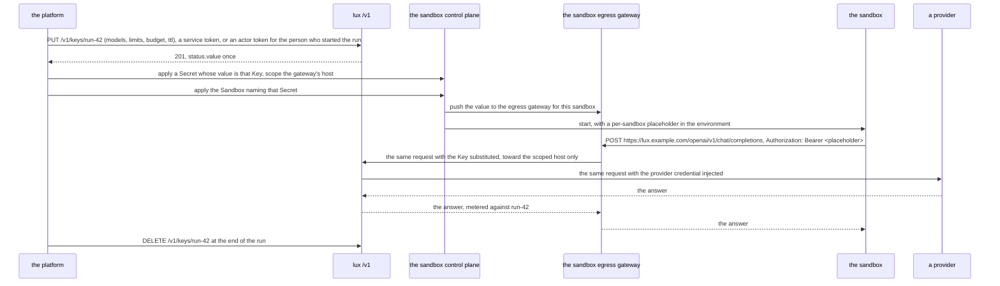

# Building a plane

## Overview

A platform that sells model access with accounts, plans, a console, and
its own catalog builds on Lux in one of two ways, or both in sequence:
run `luxd` and write the webhooks, or import `manifest`, `gateway`, and
`metering` into its own binary with its own identity and store. This
spec is the guide for that platform, and it fixes what the gateway
promises one and what it does not. A platform that follows it is one
consumer among any.

It also answers the question a platform asks once and then builds on:
how a sandbox running untrusted code calls a model without holding a
credential. The answer composes two gateways and needs no mechanism in
either that is not already there.

## Current state

Built on 2026-09-14: `docs/plane.md` is the document, `examples/plane`
is a platform front over the three root packages that carries the
conformance suite, and `examples/authorizer` is the endpoint the
document prints, held to `latere.ai/x/pkg/authz/conformance` and run
beside `luxd` in the integration tier. The departures from the design
below are listed under "What the build changed".

## Design

### The two doors

| Door | The platform runs | The platform writes | It gets |
|---|---|---|---|
| webhooks | `luxd` as a service | an authorizer, an event sink, and an OIDC issuer it already has | the whole gateway, upgraded by image tag; its own logic in its own service in any language |
| packages | its own binary importing `manifest`, `gateway`, `metering` | a server around them, its own identity, its own store | the contract and the data plane in-process, with no HTTP hop and its own API shape |

Both reach one `manifest.Resolve` and one `gateway.Handler`, so a
manifest means the same thing on either and a request is answered the
same way ([[001-architecture]], invariant 1). A platform that starts
with the webhooks and later splits into its own binary is not
rewriting: the packages are what `luxd` is made of.

### Where each platform concern goes

| Concern | Door: webhooks | Door: packages |
|---|---|---|
| accounts, organizations, teams | claims in the issuer's token, read by the authorizer; the gateway reads none of them | the platform's middleware before `Resolve` sets `Options.Actor` |
| roles and permissions | the authorizer's `allow` per action ([[006-identity]]) | the platform's own check before it calls `Resolve` |
| plans and quotas | the authorizer's `limits`, which cap what a Key may ask for, plus `Budget` objects the platform applies; a Key that names no limit under a cap is refused, so the platform's console or client fills the limits in | `Options.Limits` and the same Budgets |
| a shared catalogue | `Provider` and `Model` objects the platform declares as an administrator; callers see them through `provider.read` and `model.use` | the same objects through the store the platform constructs |
| per-tenant models | `model.use` per selector at a Key's resolve, plus label selectors on the Models; a tenant's Key names only what its authorizer allows. One name resolves to one Model for the installation, a tenant's own Provider's models carry that Provider's name as their first segment, and a platform that wants one bare name to mean a different Model per tenant answers that in its own front, never in the gateway | `Options.Lookup` answers `Models` for the tenant |
| funded credits | a `Budget` per grant, `hard` chosen by whether an overspend is refused or invoiced, plus the platform's own ledger fed by the event sink and `GET /v1/usage` | the same Budgets and `metering.Fold` over the records |
| a console | its backend holds the session and calls `/v1` with an actor token minted for the signed-in person, the audience `LUX_OIDC_AUDIENCE`, so the object's `owner` is the person ([[006-identity]]); the gateway never sees a cookie | reads the platform's own API |
| unattended provisioning | a service token from the platform's own issuer client, whose `sub` is the service account and becomes the `owner`; the person, when there is one, goes in a label under the platform's own prefix | the platform's own service identity in `Options.Actor` |
| one developer credential | a Key created with `spec.value` set to the platform's own credential, or with `spec.valueSHA256` where the platform's store kept the hash alone, under the Models and the Budget the platform attaches ([[007-keys-and-limits]]); the gateway matches it by hash and decodes nothing; revoking it is `DELETE /v1/keys/{id}` here beside whatever the platform's issuer does | the same Key through the store it constructs |
| billing | the request log archive for the line items and `GET /v1/usage` for the totals ([[009-usage-and-metering]]) | the platform's own `Recorder` |
| audit | the signed event sink at `LUX_EVENTS_URL` ([[012-request-log-and-events]]) | the platform's own sink |
| multi-region | one `luxd` per region behind the platform's router, each with its own store or a shared one | one `Handler` per region |
| a local runtime a user attaches | `provider.tunnel` allowed for that subject, and the user runs `lux serve` ([[013-tunnelled-runtimes]]) | the same |

Every row on the left is an endpoint the platform writes or an object
it applies. There is no row that needs a fork, which is the property
this table exists to make checkable.

### The minimal authorizer

Twenty lines is enough to run an installation where every subject owns
what it applied and administrators declare the catalogue, which is what
the built-in owner policy does ([[006-identity]]) and what a platform
replaces first. An administrator is under no ceiling, because a ceiling
refuses a Key that names no limit at all and the catalogue's own Keys
are declared without one. The payload is 006's exactly; a Go authorizer may
decode it into `authz.Request` from `latere.ai/x/pkg/authz`, and one in
any language reads the fields below. The program names the vocabulary
it decides by through `latere.ai/x/lux/authorizer` rather than through a
string literal, so a reader who copies it runs `go get latere.ai/x/lux`
first ([[022-authorizer-vocabulary-package]]). The endpoint answers from its
bearer and its own state alone: it needs no session and calls neither
the gateway nor the issuer while deciding ([[006-identity]]).

```go
// POST from luxd; the request and response shapes are 006's.
type req struct {
	Subject  string         `json:"subject"`
	Claims   map[string]any `json:"claims"`
	Action   string         `json:"action"`
	Resource map[string]any `json:"resource"`
}
type resp struct {
	Allow  bool           `json:"allow"`
	Reason string         `json:"reason,omitempty"`
	Limits map[string]any `json:"limits,omitempty"`
	Filter map[string]any `json:"filter,omitempty"`
}

// probeID is the reserved id every authorizer denies, so luxd check can
// tell an endpoint that reads the request from one that does not. It is
// the contract's own value rather than a copy of it.
const probeID = authz.ProbeID

var spendCap = map[string]string{"free": "5", "team": "50"}

// The kind an action acts on is authorizer.Kind's answer, so the
// catalogue's two kinds are named once and an action outside the
// vocabulary is refused before any rule reads it.
func decide(r req) resp {
	plan, _ := r.Claims["plan"].(string)
	switch kind := authorizer.Kind(r.Action); {
	case r.Resource["id"] == probeID:
		return resp{Allow: false, Reason: "the probe id is reserved"}
	case kind == "":
		return resp{Reason: "no action of the gateway's vocabulary"}
	case kind == "Provider", kind == "Model":
		switch {
		case r.Action == authorizer.ActionModelUse || strings.HasSuffix(r.Action, ".read") || strings.HasSuffix(r.Action, ".list"):
			return resp{Allow: true} // the catalogue is the platform's and is offered to every user
		case plan == "admin":
			return resp{Allow: true}
		}
		return resp{Reason: "the catalogue is declared by the platform"}
	case r.Resource["owner"] != nil && r.Resource["owner"] != r.Subject:
		return resp{Allow: false, Reason: "not yours"}
	case plan == "admin":
		return resp{Allow: true, Filter: map[string]any{"owners": []string{r.Subject}}}
	default:
		return resp{Allow: true,
			Limits: map[string]any{"max_key_spend": spendCap[plan], "max_key_ttl": "720h", "max_keys": 100},
			Filter: map[string]any{"owners": []string{r.Subject}}}
	}
}
```

Four properties to keep when it grows. A refusal on a reference,
`model.use`, `budget.draw`, or a target's `provider.read`, reads to the
caller as `not_found` rather than `forbidden`, so a manifest cannot
probe for objects another tenant owns ([[006-identity]]); the endpoint
answers or does not, and anything that is not a parseable decision is
`authorizer_unavailable` and never an allow; `limits` is a cap on
what a Key may ask for rather than a grant, so raising a plan raises
the ceiling and changes no existing object; and the probe id is denied
before any other rule, whatever the subject. A platform whose
authorizer and `/v1` caller are one process keeps the two paths off
each other's locks: the gateway waits on the authorizer inside the very
request the platform is waiting on, and a lock shared between them is
a five second stall ending in `authorizer_unavailable`.

### Giving a sandbox model access

A platform that runs untrusted code in a sandbox and wants that code to
call a model has a problem with one obvious wrong answer: put a
credential in the sandbox. Composing a sandbox control plane such as
[Cella](https://github.com/latere-ai/cella) with Lux avoids it without
either side learning anything about the other.



The sandbox holds a placeholder and never a credential. The egress
gateway substitutes the Key toward the host the Secret scopes and
leaves it verbatim and inert anywhere else. Lux injects the provider
credential toward that Provider's `baseURL` and nowhere else
([[001-architecture]], invariant 2). Two gateways, two substitutions,
and neither credential is ever inside the sandbox: reading the
sandbox's environment, its file system, and its memory yields a
placeholder and a string that is a placeholder somewhere else.

What the platform spends at the end of the run is `DELETE /v1/keys/run-42`,
after which the value is refused within `LUX_KEY_CACHE` on every
replica ([[007-keys-and-limits]]), and the usage stays readable by the
Key's id through `GET /v1/usage`, which is the ledger line for that
run.

The composition needs no token exchange, no delegation claim, and no
signing key shared between the two planes, because each hop carries one
credential kind that the next hop verifies on its own terms:

| Hop | Credential | Verified by |
|---|---|---|
| platform to Lux `/v1`, unattended | a service token from the platform's issuer, `client_credentials`, `aud` the gateway's audience; the Key's `owner` is the service account | Lux, against the issuers it lists ([[006-identity]]) |
| platform to Lux `/v1`, for a signed-in person | an actor token the platform's issuer mints for that person, `aud` the gateway's audience; the Key's `owner` is the person | the same |
| platform to the sandbox control plane | that plane's own credential | that plane |
| sandbox to its egress gateway | a placeholder scoped to one sandbox | the egress gateway |
| egress gateway to a Lux door | the Key | Lux, by the hash of its value ([[007-keys-and-limits]]) |
| Lux to a provider | the Provider's credential | the provider |

A platform that gives its developers one credential for everything
adds two hops for the same string, and they do not change the rule:

| Hop | Credential | Verified by |
|---|---|---|
| developer to the platform's own control plane | the platform's credential, a token its issuer signed | the platform, as a token, with its issuer's revocation list |
| developer to a Lux door | the same string, registered by the platform as a Key's `spec.value` ([[007-keys-and-limits]]) | Lux, by the hash of its bytes; it decodes nothing, reads no expiry inside it, and fetches no revocation list ([[001-architecture]], invariant 3) |

The consequences are the platform's to carry, and this spec names them
so its `docs/plane.md` does. The Key's `expiresAt` is the only expiry
the door knows, so a credential without one inside it still expires
here when the platform sets `ttl`. Revoking the credential is two
writes in two systems, the issuer's revocation and `DELETE /v1/keys/{id}`
here, and the platform orders them, deletes the Key first because the
door is where the string spends money, and retries a failed `DELETE`
until it answers `204` or `not_found`; the door stops serving within
`LUX_KEY_CACHE` of the delete and never before. The Key's handle is the
supplied value's prefix rule of [[007-keys-and-limits]], because a
token's first characters are the same for every token.

A design with token exchange would have to make one of these hops carry
a credential minted for another, which means one plane signing for the
other and a key both hold. Here no plane verifies a credential it did
not accept in the first place, the gateway included, which accepted the
supplied value as a Key through `/v1` before any door saw it, so a
compromise on one hop stops at the next.

### The conformance command

A platform that runs its own front is serving the contract or is not,
and the answer is a command rather than a review:

```sh
LUX_TEST_URL=https://api.example.com LUX_TEST_TOKEN=$(platform-token) \
  go test latere.ai/x/lux/test/conformance -run TestContract -v
```

`TestContract` is [[018-conformance-suite]]'s, importable as a package,
and runs against whatever `LUX_TEST_URL` names with a token the server
accepts in `LUX_TEST_TOKEN`: `luxd` on loopback, a release image in a
cluster, or a platform's own binary built from the packages; a
platform that imports the package calls `Run` with a `Config` whose
`Token` mints through its own issuer. A platform that passes it serves the same manifest contract,
the same doors, the same error table, and the same usage surface as
`luxd` does.

### Promises and non-promises

To a platform, the gateway promises:

- the manifest contract's evolution rules, so a manifest a platform's
  users write today is accepted by every later `v1beta1` build and
  resolves to the same object ([[003-manifest-contract]]);
- the compatibility of `manifest`, `gateway`, and `metering`: additive
  within a module major, with a break named in the CHANGELOG
  ([[001-architecture]], [[017-release-and-installation]]);
- that the conformance suite passes against `luxd` on every release, so
  the suite is a bar the reference implementation actually clears
  ([[017-release-and-installation]]);
- that a platform passing the suite against its own front serves the
  same contract.

It promises nothing about `internal/`, which is the gateway's own and
changes without notice; nor about the stub binaries of
[[015-test-stubs-and-tiers]], which exist for tests and for `make run`
and are not a runtime; nor about the deploy manifests beyond the
archive a release publishes.

### The document

`docs/plane.md` is this spec in the user register: the two doors, the
concerns table, the minimal authorizer, the sandbox composition, and
the conformance command, written for a platform engineer rather than
for a contributor to this repository. Its sections are this design's
headings, its concerns and its credential hops are these tables' rows,
and its Go block is `examples/authorizer/main.go` word for word, all
of which `TestPlaneDocIsCurrent` holds.

### What the build changed

Each row is a departure from the design above, with the reason.

| Where | The design said | The build does | Why |
|---|---|---|---|
| the minimal authorizer | one ceiling table with an `admin` row | `spendCap` has `free` and `team`, and an administrator is granted no `limits` at all | a ceiling refuses a Key that names no limit ([[003-manifest-contract]]), so an installation's own Keys, the conformance suite's among them, cannot be applied under one |
| the minimal authorizer | the twenty lines of `decide` | that, plus the `POST` handler and the listener of `examples/authorizer`, which is the program the document prints | a block a reader copies has to compile and run, and the contract's own suite refuses an endpoint that does not check its bearer |
| the example plane | a server that passes `TestContract` | `examples/plane`, which the suite runs 42 cases against; the thirteen that read a stub provider's record skip by name, as they do against any front without `LUX_TEST_STUBS_URL` | two drifts between [[015-test-stubs-and-tiers]]'s stub and [[018-conformance-suite]]'s reader keep a run with that document red for reasons no front can answer: the stub writes its record under `header` and the suite reads `headers`, and its `events-<n>` stream carries a finish chunk the suite's frame count does not expect |
| the acceptance tests | `TestSandboxCompositionEndToEnd`, `TestPlatformCredentialAsKey`, and the rest | the same tests under the tier's prefix, `TestE2E…` | [[015-test-stubs-and-tiers]]'s rule is that every test in a file tagged `integration` begins with `TestE2E`, and `TestEveryTestIsInATier` holds it |
| the run's ledger | the delete refuses on every replica | the integration tier proves one replica within `LUX_KEY_CACHE`; the multi-replica half is [[010-state]]'s postgres tier | `TestPostgresTwoReplicas` proves it: replica b caches the Key, a deletes it, and b refuses within seconds through the journal tail |

## Not in this spec

Any platform's own migration plan; the authorizer's payload and the
owner policy it replaces ([[006-identity]]); the supplied value's
rules, its prefix, and its write-once field ([[007-keys-and-limits]]);
the packages' interfaces
([[004-request-path]], [[009-usage-and-metering]]); the suite itself
and its variables ([[018-conformance-suite]]); the sandbox control
plane's own design, which is that project's.

## Acceptance criteria

| Criterion | Test that proves it | State |
|---|---|---|
| The authorizer in `docs/plane.md`, compiled and run beside `luxd`, denies the probe id and passes the conformance suite's `identity` and `manifest` groups | `TestPlaneDocAuthorizerConforms` over the program the document prints, and `TestE2EPlaneDocAuthorizerConforms`, which runs it as `luxd`'s `LUX_AUTHORIZER_URL` and carries the whole suite | passing; the endpoint also passes `latere.ai/x/pkg/authz/conformance` under the twenty-four actions |
| A server built from `manifest`, `gateway`, and `metering` in `examples/plane/`, with its own identity and store, passes `TestContract` | `TestExamplePlaneConforms` | passing over `conformance.Run`: 42 cases green, the thirteen that read a stub's record skipped by name |
| Every row of the concerns table names a mechanism that exists in the tree: an action, a manifest field, a variable, a package symbol, or a route | `TestConcernsTableIsGrounded`, reading this file against the specs and the tree | passing, `internal/arch` |
| A Key applied by a service token, carried as a sandbox secret, and substituted by an egress gateway reaches a door and is metered, and the Key value appears in no byte of the sandbox's environment, file system, or output | `TestE2ESandboxComposition` in the e2e tier | passing; the workload is the `lux` command in a directory of its own, holding a placeholder |
| A Key applied with a service token is owned by the service account and one applied with an actor token by the person, and `GET /v1/usage?by=owner` attributes each Key's requests to its owner | `TestE2EOwnerFollowsTheToken` | passing |
| A Key created with a stub issuer's token as `spec.value` opens a door by that string with the stub issuer receiving no call, expires at the Key's `expiresAt` while the token has none, and is `unauthenticated` within `LUX_KEY_CACHE` of `DELETE /v1/keys/{id}` | `TestE2EPlatformCredentialAsKey` in the e2e tier | passing; the supplied value is a token whose own `exp` has passed, so what the door honours can only be the Key |
| Deleting the Key at the end of a run refuses the next request within `LUX_KEY_CACHE` on every replica while its usage stays readable by id | `TestE2ERunKeyDeletionLeavesTheLedger` | passing for one replica in the integration tier and across two replicas in [[010-state]]'s `TestPostgresTwoReplicas` |
| Every hop in the two credential tables carries the credential kind named and no other; the gateway verifies a supplied value by hash and never as a token, and no plane verifies a token another plane minted | `TestE2EOneCredentialKindPerHop`, over the e2e capture | passing; the authorizer hop is read through a recorder in front of the stub, which records the envelope and not the bearer |
| `docs/plane.md` carries every section this spec names and its command block runs green against `make run` | `TestPlaneDocIsCurrent`, `TestE2EPlaneDocCommand` | passing: the sections, the tables, and the Go block in `internal/arch`; the command itself run by the tier against `make run` |


## Outcome

Built on 2026-09-14 on a branch and merged: `docs/plane.md` for a
platform team, `examples/authorizer` as the endpoint the page prints,
`examples/plane` over the three root packages, two `internal/arch`
guards, and six integration-tier tests. It is proven by the whole gate
and by coverage of 91.5% for `examples/plane` and 93.0% for
`examples/authorizer`.

What was built: the two-doors and concerns sections and their tables,
held to the tree by `TestConcernsTableIsGrounded`; the minimal
authorizer, printed whole in the document and run both in process
against `latere.ai/x/pkg/authz/conformance` and beside `luxd` as its
`LUX_AUTHORIZER_URL`; `examples/plane`, a platform front over
`manifest`, `gateway`, and `metering` with its own identity and store
that carries `TestContract`'s forty-two non-stub cases; and the sandbox
composition, owner-follows-the-token, platform-credential-as-Key,
one-credential-kind-per-hop, and run-ledger cases in the e2e tier, the
last proven across replicas by [[010-state]]'s postgres tier. The
authorizer reaches the vocabulary through `latere.ai/x/lux/authorizer`
([[022-authorizer-vocabulary-package]]).
