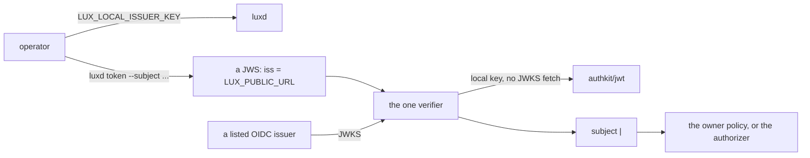

# Running the core on your own

## Overview

### Scope

Three things a person who runs this core for themselves needs and does
not have: a control plane credential without standing up an OpenID
Connect issuer first, provider credentials from the environment in server
mode, and a priced catalog to start from. With them, `docs/install.md`
walks from a checkout to a first completion with one secret set, and CI
walks it on every push.

It ends when a person with a checkout and one provider API key reaches a
model through a door, having run no issuer, applied no manifest by hand,
and priced no model themselves.

### Problem

The first wall is identity. The control plane needs at least one issuer
unless `LUX_MANIFEST_DIR` selects the file mode
(`internal/config/identity.go:30-32`), and the install document says so in
the user's own words: an OpenID Connect issuer whose tokens carry the
audience `lux`, a token from it, and the subject that token renders to
(`docs/install.md:28-47`). That is correct for a company with a login and
a wall for everybody else. The one issuer-free path in the tree today is
`make run`, which starts the stub issuer of
[[015-test-stubs-and-tiers]] (`Makefile:136-142`), and a stub is a test
image that is never part of an installation
([[001-architecture]], [[015-test-stubs-and-tiers]]).

The second wall is the first credential. A provider API key reaches the
core through a manifest: in the file mode from
`spec.credential.valueFrom.env`
(`internal/store/filemode/load.go:226-231`), and in server mode through
`PUT /v1/providers` with a bearer, which needs the token the first wall
withholds. The file mode is not the way out: its control plane is
read-only for callers (`internal/store/filemode/readonly.go:14-25`), every
object is owned by the fixed subject `file|manifest-dir`
(`internal/store/filemode/store.go:23`), and a Key must take its value
from a variable (`internal/store/filemode/load.go:249-259`), so nothing
can be created, rotated or budgeted while the server runs.

The third wall is the catalog. `deploy/examples/` is four Providers, four
Models, a Budget and a Key, all pointed at the stubs, and no Model in the
tree carries `spec.pricing`. A person who wires their own OpenAI key gets
a gateway that meters tokens and prices nothing, so
[[009-usage-and-metering]]'s cost is zero and [[007-keys-and-limits]]'s
spend windows and Budgets do not bind. The priced catalog exists, 105
Model manifests, and it lives in the tree of the deployment that
dispatched this spec, which that deployment is retiring.

## Current state

| Fact | Where |
|---|---|
| The control plane requires an issuer unless the file mode is selected | `internal/config/identity.go:30-32` |
| The install document requires an issuer, a token and a subject before anything | `docs/install.md:28-47` |
| `authkit/jwt` verifies a local issuer against a key the caller holds, with no discovery and no JWKS fetch | `pkg@v0.77.1/authkit/jwt/jwt.go:162-170`, `:443-465` |
| More than one local key is supported, which is what a rotation needs | `pkg@v0.77.1/authkit/jwt/jwt.go:459-465` |
| `luxd` has three roles: `serve`, `check`, `rewrap` | `cmd/luxd/main.go:73-77` |
| The `lux` command mints no credential and carries no signing code | [[014-agent-client]], `specs/014-agent-client.md:75-79` |
| The file mode reads a Provider credential from `spec.credential.valueFrom.env` | `internal/store/filemode/load.go:226-231` |
| The file mode's control plane is read-only for callers | `internal/store/filemode/readonly.go:14-25` |
| The file mode owns every object as `file|manifest-dir` | `internal/store/filemode/store.go:23` |
| `deploy/examples/` names the stubs and prices nothing | `deploy/examples/` |
| The priced catalog is 105 Models over seven providers | the dispatching deployment's manifest tree, one file per Model |
| Every one of the 105 carries one label keyed under that deployment's own domain | the same files, line 6 of each |
| The install document's blocks are run in order by CI on every push | `.github/workflows/verify.yml:162-181`, `tools/docs/run-blocks.sh` |

## Options

### Option 1: the first control plane credential

| | Shape | For | Against |
|---|---|---|---|
| A | A static bearer, `LUX_ADMIN_TOKEN`, compared in constant time | One variable, no crypto, nothing to expire | It is a second authentication scheme on a plane that has exactly one, so every refusal reason, every `Caller` field and every authorizer envelope grows a case that exists for the first ten minutes of an installation's life. It never expires, so a leak is permanent, and it renders no `<iss>\|<sub>` subject, so the owner policy and every owner field need a special value |
| B | A local signing key the operator holds, and `luxd token` to mint against it | Nothing about the request path changes: the token is a JWS with `iss`, `sub`, `aud`, `exp`, verified by the one verifier, rendering the same `<iss>\|<sub>` subject, decided by the same owner policy. It expires. `authkit/jwt` supports it already and needs no new code in `pkg` | The operator holds a private key, which is a secret with a rotation story |
| C | Keep requiring an issuer | No new surface at all | It is the wall. A person evaluating the core has to stand up Keycloak or Dex first, which is more work than everything else in the install document put together |

**Recommendation: B.** The deciding property is that B adds no case to the
request path. A token from the local issuer is a token: the verifier, the
subject rendering, the owner policy, the authorizer envelope and every
audit field see exactly what they see for a company login, so nothing in
the core has to know the installation is small. A static bearer would put
a second shape into every one of those.

### Option 2: where the first manifests come from

| | Shape | For | Against |
|---|---|---|---|
| A | The file mode, `LUX_MANIFEST_DIR` | It exists and already reads credentials from the environment | The control plane is read-only while it runs, so no Key can be created, rotated or fenced, no Budget adjusted, and every object is owned by a fixed subject. It is the right mode for a declarative deployment and the wrong one for a first installation, which is exactly the moment a person wants to create a Key |
| B | `LUX_BOOTSTRAP_DIR`, a directory applied once into the store at start | The control plane stays writable afterwards, credentials come from the environment the same way, and the manifests are the same documents `lux apply` would send. The rule it needs is one an exporter of the dispatching deployment already runs against this core's own `/v1`: read every object by name first and apply only what is missing or differs | A second path into the store beside `/v1`, which has to make the same decisions about validation, ownership and events |
| C | `lux apply -f` after the server is up | No server code at all | It needs a token first, so it is the first wall again, and it cannot be one command in an install document |

**Recommendation: B.** A and C each fail on one fact: A takes away the
control plane the person is about to use, and C needs the credential the
installation does not have yet. B is the only shape where the first
manifests and the first Key are both possible.

### Option 3: where the example catalog lives

| | Shape | For | Against |
|---|---|---|---|
| A | `deploy/catalog/` | It sits beside `deploy/examples/` and `deploy/base/`, and the deploy archive already carries that tree to an operator ([017-release-and-installation](.archive/017-release-and-installation.md)) | `deploy/` reads as Kubernetes, and these are not cluster objects |
| B | `examples/catalog/` | `examples/` exists and holds an authorizer example | `deploy/examples/` also exists and holds manifests, so two directories would hold example manifests under different roots |
| C | A release asset, downloaded on demand | The tree stays small | A catalog nobody can read in the repository is a catalog nobody reviews, and the decode-and-resolve test would have nothing to run against |

**Recommendation: A.** The deciding constraint is the deploy archive:
`deploy/` is what an operator unpacks and edits first, the catalog is
what they edit second, and B would split example manifests across two
roots for a naming preference.

## Design

### The local issuer



#### The variable

`LUX_LOCAL_ISSUER_KEY`, unset by default. Set, it is a PEM encoded PKCS#8
private key, an ECDSA key on P-256 or an RSA key, so it is one string a
Secret, a file or an environment variable carries. Unset, the feature is
entirely off: no local issuer is configured on the verifier and
`luxd token` refuses with a usage error naming the variable.

The issuer's name is `LUX_PUBLIC_URL` and there is no variable for it.
The server is the issuer, and its name is the address it answers at,
which is what a sibling core in the same family does for the tokens it
mints. Two consequences:

- A subject renders as `<LUX_PUBLIC_URL>|<sub>`, the same shape
  [[006-identity]] fixes for every other subject, so `LUX_ADMIN_SUBJECTS`,
  owner fields, event subjects and the authorizer envelope need no case
  for it.
- `LUX_OIDC_ISSUERS` may not contain `LUX_PUBLIC_URL` while
  `LUX_LOCAL_ISSUER_KEY` is set. That is a new rule at load, and it is
  what makes the reserved subject prefix the family's identity contract
  asks of a core that mints its own tokens unnecessary here:
  no listed issuer can produce a subject that collides, because no listed
  issuer may carry the name.

#### What it relaxes

Two refusals stand between an operator with a local key and a running
server, and both are the first wall stated as code.

| Where | Today | With a local key |
|---|---|---|
| `internal/config/identity.go:30-32` | `LUX_OIDC_ISSUERS` unset is a problem unless `LUX_MANIFEST_DIR` selects the file mode | the problem fires only when the issuer list is empty, no local key is set, and no manifest directory is named. The sentence names all three ways out |
| `internal/auth/verifier.go:111-115` | `NewVerifier` returns "no issuer to verify against" for an empty issuer list | it accepts an empty issuer list when a local issuer is configured, and refuses only when both are empty. One validator per listed issuer is built as it is today, and the local key is one more verification path beside them |

Neither relaxation widens what a token has to prove. A token from the
local issuer is checked against the local key alone, and a token from a
listed issuer takes the JWKS path unchanged
(`pkg@v0.77.1/authkit/jwt/jwt.go:162-170`), so an installation that sets
both runs both and a token is verified by exactly one of them, selected
by its own `iss`.

Weighed against a key generated at start and persisted in the store: the
store is up only in server mode with a database or the memory store, so a
generated key would be unavailable to `luxd token` run as a second
process, would be lost on a memory-store restart, and would have to be
sealed under `LUX_SECRETS_KEK`, which is the credential custody path of
[[005-providers]] carrying something that is not a provider credential.
An operator-held PEM works in every mode, is one line in a Secret, and is
rotated by editing one value.

#### `luxd token`

The fourth role of the server binary, beside `serve`, `check` and
`rewrap` (`cmd/luxd/main.go:73-77`), with its own dependency allow list as
the other three have ([[002-repository-scaffold]]).

```
luxd token [--subject <sub>] [--audience <aud>] [--ttl <duration>]
```

| Flag | Default | Rule |
|---|---|---|
| `--subject` | the `sub` half of the single entry of `LUX_ADMIN_SUBJECTS` whose issuer half is `LUX_PUBLIC_URL` | With no such entry, or more than one, the flag is required |
| `--audience` | the primary of `LUX_OIDC_AUDIENCE` ([[034-serving-behind-a-shared-origin]]) | Any listed audience is accepted |
| `--ttl` | `1h` | Above zero and at most `24h`, so a minted token is never a standing credential |

It prints the token on stdout and nothing else, so `LUX_TOKEN=$(luxd
token)` is one line of an install document. It reads the configuration
and it writes nothing: no store, no journal, no event, so it is safe
against a serving installation, which is the same promise `luxd check`
makes ([017-release-and-installation](.archive/017-release-and-installation.md)).

It does not belong in the `lux` command. That binary is a person's
process with a deliberately small build list, no identity library and no
key handling ([[014-agent-client]]), and the signing key lives with the
server, not with the client.

#### Security

| Question | Answer |
|---|---|
| Where the key lives | In whatever the operator's platform already protects: a Kubernetes Secret mounted as a variable, or a file of mode 0600 read into the environment. Never in a manifest, never in the repository |
| What it can do | Mint a token for any subject with any listed audience, bounded by the TTL rule. It is therefore equivalent to the strongest credential the installation has, which is why it is off by default and why the TTL is capped |
| Rotation | `Config.LocalKeys` holds more than one key, selected by the token's `kid` (`pkg@v0.77.1/authkit/jwt/jwt.go:459-465`). `LUX_LOCAL_ISSUER_KEYS` is a comma list of further PEMs that verify but do not sign, so the new key signs while tokens from the old one expire, and the old entry is dropped after the longest TTL |
| Not for a deployment with an issuer | An installation that already runs an OpenID Connect issuer sets `LUX_OIDC_ISSUERS` and never a local key, and its own overlay is where that is held ([[034-serving-behind-a-shared-origin]], "What an installation adds"). A server that can mint its own admin token puts a subject outside the issuer that governs it, where nothing can revoke it, so the two are set together only by an operator who is deliberately both |
| What `luxd check` says | One row, `local issuer`: `ok` with the key's algorithm and key id when one is set and parses, `fail` when the value is set and is not a usable private key, and the row is absent when the variable is unset. Never `warn`, because a key that does not parse is a server that cannot mint and an operator who thinks it can |

### Bootstrap manifests

`LUX_BOOTSTRAP_DIR`, unset by default, read in server mode alone. Set
together with `LUX_MANIFEST_DIR` it is a configuration problem naming both
variables: the file mode's desired state is a directory already, and two
directories claiming the same state is a contradiction, not a
composition.

#### What it does

At start, before the listeners open, `luxd` reads every `*.yaml` and
`*.yml` under the directory, in path order, and applies each document to
the store with the same steps a manifest takes today:

1. `Decode` and validate the document ([[003-manifest-contract]]), the
   same call the file mode and `PUT /v1/{kind}s/{name}` both make.
2. Resolve a credential: `spec.credential.valueFrom.env` on a Provider
   and `spec.valueFrom.env` on a Key, read from the process environment,
   which is the rule `internal/store/filemode/load.go:226-231` and
   `:249-259` already state. An `OPENAI_API_KEY` in the environment is
   therefore a working Provider credential with no secret in any file.
3. `Resolve` against the store, so a Model naming an absent Provider is
   refused here for the same reason it is refused on `/v1`.
4. Write, in kind order: Providers, then Budgets, then Models, then Keys,
   so every reference resolves against something already written.

Bootstrap writes to the store, not to its own HTTP surface. No authorizer
is asked, because there is no caller to decide about: this is the
operator's own desired state, the same standing the file mode's directory
has. The owner of every object is the first entry of
`LUX_ADMIN_SUBJECTS`, which is therefore required when
`LUX_BOOTSTRAP_DIR` is set; with no admin subject there is nobody the
objects could belong to and the owner policy would lock the installation
out of its own catalog.

#### Idempotence

Every object is read by name first, and the rule is Option 2's:

| Kind | Present in the store | Action |
|---|---|---|
| Provider, Model, Budget | the stored spec equals the document's | nothing, counted as unchanged |
| Provider, Model, Budget | the stored spec differs | applied, counted as updated, one event with reason `bootstrap` |
| Key | present | nothing, whatever the document says. A Key's value is write-once ([[007-keys-and-limits]]), so a second apply of the same value is `immutable_field` at `spec.valueSHA256`, and an apply of a different one would silently rotate a credential somebody is using |
| any | absent | created, counted as created, one event with reason `bootstrap` |

A restart therefore changes nothing, and an edit to one file changes one
object. A refusal is a start-up failure naming the file, the object and
the code, because a gateway that starts without the Provider it was told
to hold answers `not_found` to every request, and an operator reading a
log line after a successful start is the worse failure.

#### What reports it

- One line per outcome on stdout at start, in the shape the file mode's
  start-up lines take, and one summary line: created, updated, unchanged.
- One row in `luxd check`, `bootstrap`: `ok` with the counts when the
  directory decodes and resolves, `fail` naming the first file that does
  not. The row is absent when the variable is unset. `check` resolves and
  does not write, so it is the dry run of the apply.

### The example catalog

`deploy/catalog/`, the 105 priced Model manifests of
the dispatching deployment's manifest tree, with the Providers they name, as the example catalog a self-hoster starts from.

| Provider | Models |
|---|---|
| openai | 30 |
| gemini | 22 |
| anthropic | 21 |
| zhipu | 17 |
| moonshot | 8 |
| xai | 4 |
| openrouter | 3 |

Seven Providers, not four: `deploy/catalog/providers/` ships one per
name, each with `spec.baseURL` and `spec.credential.valueFrom.env` naming
the conventional variable for that vendor, so an operator sets the one or
two they hold and deletes the rest. The dialect of each is
[[005-providers]]'s, `openai` for the OpenAI-compatible endpoints,
`anthropic` and `gemini` for their own.

Two edits are made in the move.

- Every one of the 105 files carries
  one label keyed under the dispatching deployment's own domain, which is
  a fact about that deployment's plane and not about this core. It is
  dropped. It is also a coordinate of one company in a tree that carries
  none: invariant 8 of [[001-architecture]] is held by
  `TestNoLatereCoordinatesInReleasedArtifacts`, which admits this core's
  own API group as a manifest prefix and no other domain anywhere, so 105
  files would fail the tree's own rules as they stand.
- `spec.fallback: never` and the single-target shape are kept as they
  are. The catalog is a rate card, not a routing policy, and a person who
  wants fallback writes it ([[008-routing-and-models]]).

The prices are a snapshot with a date, stated in `deploy/catalog/README.md`
and in `docs/install.md`. Keeping them current is the installation's job
and not the core's: the dispatching deployment refreshed OpenRouter's
prices from a snapshot on a scheduled job, and that job stays with the
deployment. The core ships a catalog, reads
`spec.pricing` ([[009-usage-and-metering]]) and fetches nothing, which is
invariant 9 of [[001-architecture]] unchanged.

### `docs/install.md`

The document gains a first part and keeps its second.

| Part | Walks | Runs in |
|---|---|---|
| 1, from a checkout to a first completion | `git clone`, one provider key in the environment, `make build`, `luxd serve` with `LUX_BOOTSTRAP_DIR=deploy/catalog` and a local issuer key, `luxd token`, `lux keys create`, one `curl` through the OpenAI door | the `install` job and the `install-release` job, both |
| 2, a cluster from a release | the prerequisites, the bootstrap Secrets, `kubectl apply -k`, `luxd check`, the first Provider and Model, the first Key, one `curl` | both, unchanged |

`tools/docs/run-blocks.sh` runs every `sh` block of a document as one
script in order, so the two parts run one after the other in one shell.
Part 1 starts `luxd` in the background and stops it at the end of the
part, so part 2 starts against nothing of part 1.

Part 1 bootstraps a directory the walk writes rather than
`deploy/catalog/` itself. The catalog's Providers name real vendor
endpoints, `https://api.openai.com/v1` and its siblings, and CI holds no
vendor credential, so a walk that bootstrapped the catalog would either
need a secret in the pipeline or reach a vendor with a stub key and take
a 401. The walk writes two documents into `$PWD/bootstrap/`, both shown
in full in the document because they are what a reader edits: one
Provider whose `spec.baseURL` is `LUX_INSTALL_UPSTREAM` and whose
credential is `valueFrom.env: OPENAI_API_KEY`, and one Model copied from
`deploy/catalog/` for `LUX_INSTALL_MODEL`. One sentence after the
completion says that `LUX_BOOTSTRAP_DIR=deploy/catalog` loads the whole
priced catalog once the Providers it names are in place, and
`TestBootstrapLoadsTheCatalog` is what proves that, not the walk.

Part 1 reads one new input and reuses three the document already defines:

| Variable | Default | Means |
|---|---|---|
| `LUX_INSTALL_BIN` | `out/luxd` | the binary part 1 runs: the one `make build` wrote in the `install` job, the one the release archive unpacked in `install-release` |
| `LUX_INSTALL_UPSTREAM` | `https://api.openai.com/v1` | the Provider's base URL, already an input of part 2 |
| `LUX_INSTALL_UPSTREAM_KEY` | none, required | the Provider's credential, exported as `OPENAI_API_KEY`, already an input of part 2 |
| `LUX_INSTALL_MODEL` | `gpt-4o-mini` | the upstream model, already an input of part 2 |

`tools/docs/stubs-local.sh` writes the last three for CI from a stub
provider it starts as a local process, the way
`tools/docs/stubs-in-cluster.sh` writes them from a Pod for part 2. Both
jobs run it before the walk, so part 1 is hermetic in CI and reaches
OpenAI for a reader who exports their own key. No conditional appears in
any block: a reader and the pipeline run the same bytes with different
inputs, which is the rule the document has followed since
[017-release-and-installation](.archive/017-release-and-installation.md).

`docs/quickstart.md` is unchanged and keeps its `docker compose` path
over the published images.

### The amendments the other specs need

Dated 2026-09-22, landing with the implementation:

- [[002-repository-scaffold]]'s configuration table gains
  `LUX_LOCAL_ISSUER_KEY`, `LUX_LOCAL_ISSUER_KEYS` and
  `LUX_BOOTSTRAP_DIR`, each with its default and its owner.
- [[006-identity]] gains the local issuer as a verification mode: what it
  is, that `iss` is `LUX_PUBLIC_URL`, that a listed issuer may not carry
  that name, and that it is off unless a key is set.
- [017-release-and-installation](.archive/017-release-and-installation.md)'s
  `luxd check` table gains the `local issuer` and `bootstrap` rows, and
  its `docs/install.md` section gains part 1 and its two inputs.

## Not in this spec

- The audience list, the base path and the production overlay, which are
  [[034-serving-behind-a-shared-origin]].
- Any change to the file mode, which keeps its read-only control plane
  and its fixed owner.
- A price refresh of any kind. The catalog is a dated snapshot and the
  job that updates one is the installation's.
- Tokens minted for anything but a control plane caller. The core's
  workload credential is a Key ([[007-keys-and-limits]]) and this spec
  adds no second one.
- Any control plane, surface or scheduled job of a particular
  deployment.

## Acceptance criteria

| # | Criterion | How it is checked |
|---|---|---|
| 1 | `luxd serve` starts with `LUX_LOCAL_ISSUER_KEY` set, `LUX_OIDC_ISSUERS` unset and no manifest directory, and answers `GET /v1/self` for a token it minted | `TestLocalIssuerAloneStartsTheServer` in `cmd/luxd`; it fails on today's tree at `internal/config/identity.go:31-32` and again at `internal/auth/verifier.go:111-115` |
| 2 | With both a local key and a listed issuer, a token from either is accepted and each is verified by its own path | `TestLocalIssuerBesideAListedIssuer` in `internal/auth` |
| 3 | With `LUX_LOCAL_ISSUER_KEY` set, a token signed by that key with `iss` equal to `LUX_PUBLIC_URL` and a listed audience is accepted on `/v1`, and the caller's subject renders `<LUX_PUBLIC_URL>\|<sub>` | `TestLocalIssuerTokenIsAccepted` in `internal/auth` |
| 4 | With the variable unset, a token naming `LUX_PUBLIC_URL` as its issuer is `unauthenticated`, and no local issuer is configured on the verifier | `TestLocalIssuerIsOffByDefault` in `internal/auth` |
| 5 | `LUX_OIDC_ISSUERS` containing `LUX_PUBLIC_URL` while a local key is set is a configuration problem naming both variables; a key that is not a usable PKCS#8 private key is a problem naming the variable | `TestLocalIssuerRules` in `internal/config` |
| 6 | `luxd token` prints one token the running server accepts; its subject, audience and TTL follow the flags; a TTL above the cap, a missing subject and an unset key are usage errors with exit code 2 | `TestTokenCommand` in `cmd/luxd`, table driven, with `TestTokenCommandRoundTrip` minting and then calling `/v1/self` |
| 7 | `luxd token` writes nothing: no store row, no journal entry, no event | `TestTokenCommandIsReadOnly` in `cmd/luxd`, in the shape of `TestCheckIsReadOnly` |
| 8 | A rotation verifies: a token signed by the previous key still verifies while it is listed in `LUX_LOCAL_ISSUER_KEYS`, and stops when it is dropped | `TestLocalIssuerRotation` in `internal/auth` |
| 9 | The production overlay names no local issuer key in any container, as a value or a `secretKeyRef` | `TestTheProdOverlayPublishesTheDoors` in `cmd/luxd`, the assertion this spec adds |
| 10 | `LUX_BOOTSTRAP_DIR` applies every manifest of a directory at start, resolving a Provider credential and a Key value from the environment, in kind order, and the control plane is writable afterwards | `TestBootstrapAppliesTheDirectory` in `cmd/luxd` |
| 11 | A second start over the same directory creates nothing and updates nothing; an edited Model is updated and nothing else is; an existing Key is left as it is | `TestBootstrapIsIdempotent` in `internal/bootstrap` |
| 12 | A document that fails to decode, to resolve, or whose credential variable is unset stops start-up with a message naming the file, the object and the code | `TestBootstrapRefusalNamesTheFile` in `cmd/luxd` |
| 13 | `LUX_BOOTSTRAP_DIR` with `LUX_MANIFEST_DIR`, and `LUX_BOOTSTRAP_DIR` with no `LUX_ADMIN_SUBJECTS`, are configuration problems naming the variables | `TestBootstrapRules` in `internal/config` |
| 14 | Every file of `deploy/catalog/` decodes, validates and resolves against the Providers the catalog ships, and every Model carries `spec.pricing` with a currency, a `per` and an input and output rate | `TestCatalogResolves` in `manifest`, walking the directory |
| 15 | No file of `deploy/catalog/` carries a label keyed under any domain but this core's own API group, and none names a coordinate of one company | `TestCatalogCarriesNoCompanyValue` in `manifest`, and `TestNoLatereCoordinatesInReleasedArtifacts` in `internal/arch` over the added files |
| 16 | `deploy/catalog/` bootstraps into a running server and a Model of it answers through a door against a stub provider | `TestBootstrapLoadsTheCatalog` in `cmd/luxd` |
| 17 | Part 1 of `docs/install.md` runs from a checkout with no issuer and reaches a completion through the OpenAI door | the `install` job of `.github/workflows/verify.yml` running `tools/docs/run-blocks.sh`, on every push |
| 18 | Part 1 runs the same blocks against the released binary | the `install-release` job of `.github/workflows/release.yml` with `LUX_INSTALL_BIN` naming the unpacked archive |
| 19 | `luxd check` reports the `local issuer` and `bootstrap` rows when their variables are set, and omits them when they are not | `TestCheckCommand` in `cmd/luxd`, widened |
| 20 | `docs/configuration.md` and `.env.example` carry the three new variables with their defaults | `TestConfigurationReferenceIsCurrent` in `internal/config` |
