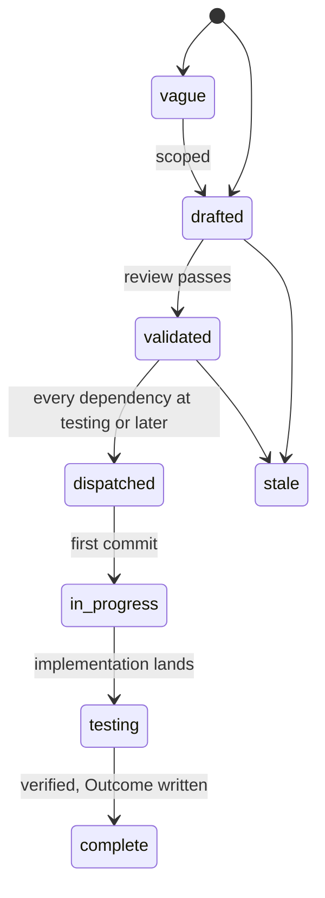
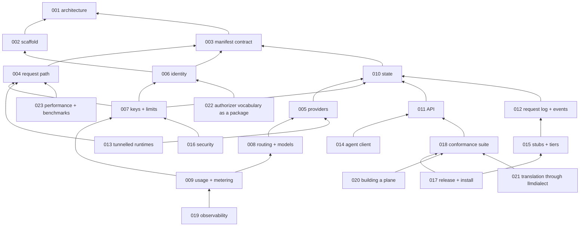

# Specs

Design specs for Lux, an open source LLM gateway: a declarative
contract for model access in four kinds, one address that serves every
provider's API, credential custody, metering, identity from any OIDC
issuer, and permission from an endpoint the operator writes. One spec
covers one component. Each states the problem, the design with enough
precision to build from, and acceptance criteria that are testable
statements. Spec 001 fixes the architecture every other spec assumes;
read it first. Spec 003 is the contract a caller codes against, spec
004 is what happens to a request, and spec 018 is the suite that
proves a server serves both. Spec 002 is the configuration reference:
every `LUX_*` variable is in its table, owned by it or listed with its
owner.

- [029-reference-mutation-context](.archive/029-reference-mutation-context.md) — complete. Bind reference checks and rotation to sanitized desired state.

- [030-key-credential-admission](.archive/030-key-credential-admission.md) — complete. Admit registered Key credentials without exposing their verifier.

- [031-durable-key-fences](.archive/031-durable-key-fences.md) — complete. Close Key names to delayed credential writes.

## Layout

Flat files `specs/NNN-name.md` in one number space with `track: core`
in the frontmatter. Numbers are stable identifiers and are never
reused. Open specs sit here and are the work queue. A terminal spec
moves to `specs/.archive/` keeping its number so `depends_on` paths
keep resolving.

## Lifecycle

`in_progress` is written `in-progress` in the frontmatter. A spec at
`testing` moves to `complete` when every acceptance criterion has a
passing test in the tree and the Outcome records every divergence. The
dispatch gate is on the dependencies' state: a validated spec is
dispatched when every spec in its `depends_on` is at `testing` or
later.

## Index

| # | Spec | Effort | Status | Builds on |
|---|---|---|---|---|
| [001](001-architecture.md) | Architecture: two planes, the kinds, the packages, extension points, invariants | medium | complete | - |
| [002](002-repository-scaffold.md) | Repository scaffold: module, binary, configuration, quality gate, images, workflows | small | complete | 001 |
| [003](003-manifest-contract.md) | Manifest contract: the four kinds, decoding, validation, defaulting, resolve | large | complete | 001 |
| [004](004-request-path.md) | Request path: the dialect doors, route classes, the pipeline, translation, streaming, the data plane errors | large | complete | 001, 003 |
| [005](005-providers.md) | Providers: dialects, credential custody, discovery, health, the upstream client | medium | complete | 001, 003, 010 |
| [006](006-identity.md) | Identity: OIDC issuers, subjects, the authorizer webhook, the owner policy | medium | complete | 001, 002, 003 |
| [007](007-keys-and-limits.md) | Keys and limits: the value, verification, the cache, states, rate windows, spend windows, budgets | medium | complete | 003, 004, 006, 010 |
| [008](008-routing-and-models.md) | Routing and models: targets, weights, priorities, fallback, retries, the circuit per target | medium | complete | 003, 005 |
| [009](009-usage-and-metering.md) | Usage and metering: the record, cost, windows, the usage API, the multi-replica rule | medium | complete | 003, 007, 008, 010 |
| [010](010-state.md) | State: desired and observed, the store contract, memory, Postgres, the file mode | large | complete | 003 |
| [011](011-api.md) | API: the /v1 kinds, addressing and concurrency, the error table, OpenAPI | large | complete | 003, 004, 006, 007, 010 |
| [012](012-request-log-and-events.md) | Request log and events: one signed event per mutation to the operator's sink, one record per request to an archive | small | complete | 006, 009, 010 |
| [013](013-tunnelled-runtimes.md) | Tunnelled runtimes: a local model server attached as a Provider through an outbound tunnel | medium | complete | 004, 005 |
| [014](014-agent-client.md) | Agent client: the lux command and the skill | medium | complete | 003, 011 |
| [015](015-test-stubs-and-tiers.md) | Test stubs and tiers: the stub providers, issuer, authorizer, and sink, make run, the tiers, CI jobs | medium | complete | 002, 005, 006, 012 |
| [016](016-security-and-threat-model.md) | Security and threat model: what Lux protects, against whom, and how | medium | complete | 001, 004, 006, 007 |
| [017](.archive/017-release-and-installation.md) | Release and installation: images, binaries, attestations, deploy manifests, luxd check, upgrades | medium | complete | 002, 015, 018 |
| [018](018-conformance-suite.md) | Conformance suite: the contract, the doors, and the API as executable tests, against any server | large | complete | 003, 004, 011 |
| [019](019-observability.md) | Observability: metrics, traces, logs, alerts | small | complete | 002, 004, 009 |
| [020](020-building-a-plane.md) | Building a plane: how a platform composes the packages and the webhooks, and gives a sandbox model access | small | complete | 001, 004, 006, 018 |
| [021](021-translation-through-llmdialect.md) | Translation through llmdialect: the codec glue leaves the gateway for an importable bridge | medium | complete | 004, 018 |
| [022](022-authorizer-vocabulary-package.md) | The authorizer vocabulary as a package: the actions, resource shapes, and limits an authorizer is written against | small | complete | 001, 003, 006 |
| [023](023-performance-and-benchmarks.md) | Performance and benchmarks: the gateway's own overhead, in process against a stub upstream | small | complete | 004 |
| [024](.archive/024-pooled-database-connections.md) | Pooled serving connections with direct schema migrations | small | complete | 010 |
| [025](.archive/025-mutation-authorization.md) | Proposed mutation admission and explicit owner assignment | medium | complete | 006, 011, 022 |

| [026](.archive/026-object-scoped-discovery.md) | Object-scoped model discovery and list authorization | medium | complete | 006, 011, 025 |

| [027](.archive/027-disabled-key-provisioning.md) | Provision disabled keys before model access is assigned | small | complete | 003, 007 |

| [028](.archive/028-public-tunnel-agent.md) | Public tunnel client for platform CLIs | small | complete | 013, 014 |

## Dependency graph

Arrows point from a spec to the specs it builds on. The picture is the
transitive reduction of the `depends_on` edges: an arrow is drawn only
where no other path already carries it. The Builds on column above
carries each spec's literal `depends_on`.

## Build order

| Phase | Specs | Lands |
|---|---|---|
| 1 | 002, 003 | the scaffold; the four kinds, `Decode`, `Resolve`, the golden corpus |
| 2 | 010 (memory store and file mode), 006, 005 | a gateway that reads manifests from a directory, verifies issuers, holds a credential encrypted, and discovers models |
| 3 | 004, 008, 007, 009 | the doors: a request through any door reaches a provider, is routed, limited, metered |
| 4 | 011, 012, 015 | the `/v1` API over the four kinds, events and the request log, the stubs and `make run` |
| 5 | 018, 014, 019, 016 | the conformance suite, the `lux` command, metrics and traces, the threat model checked against the tree |
| 6 | 010 (Postgres), 017, 020, 013 | durable state across replicas, the first release, the plane document, local runtimes through the tunnel |
| 7 | 021 | the translation layer as an import: the gateway's codec glue replaced by `latere.ai/x/pkg/llmdialect/bridge`, with the doors answering the same bytes |
| 8 | 022 | the authorizer vocabulary as an import: the actions, the resource shapes, and the `limits` names a platform's authorizer is written against |
| 9 | 023 | the benchmarks and the performance document: the gateway's own overhead, measured in process against a stub upstream |

Phases run in order; specs inside a phase may run in parallel where
their `depends_on` allows.

## Conventions

- Frontmatter: `title`, `status`, `track`, `depends_on`, `affects`,
  `effort`, `created`, `updated`, `author`. Every field is required and
  the gate checks them.
- Sections: `Overview`, `Current state`, `Design`, `Not in this spec`,
  `Acceptance criteria`; `Outcome` once complete.
- Cross-references are `[[NNN-name]]` wikilinks; the gate resolves
  them.
- Each name (a manifest field, an error code, a variable, a metric, an
  event, a route) is defined by exactly one spec; another spec that
  uses it links the owner.
- Acceptance criteria are one-sentence testable statements that name
  the behaviour, the fixture, the threshold, and the test that proves
  them.
- Diagrams are Mermaid. Tables carry exact values.
- Wording is for a reader outside Latere. `provider` is the word for
  an upstream; `backend` and `vendor` are not used.
